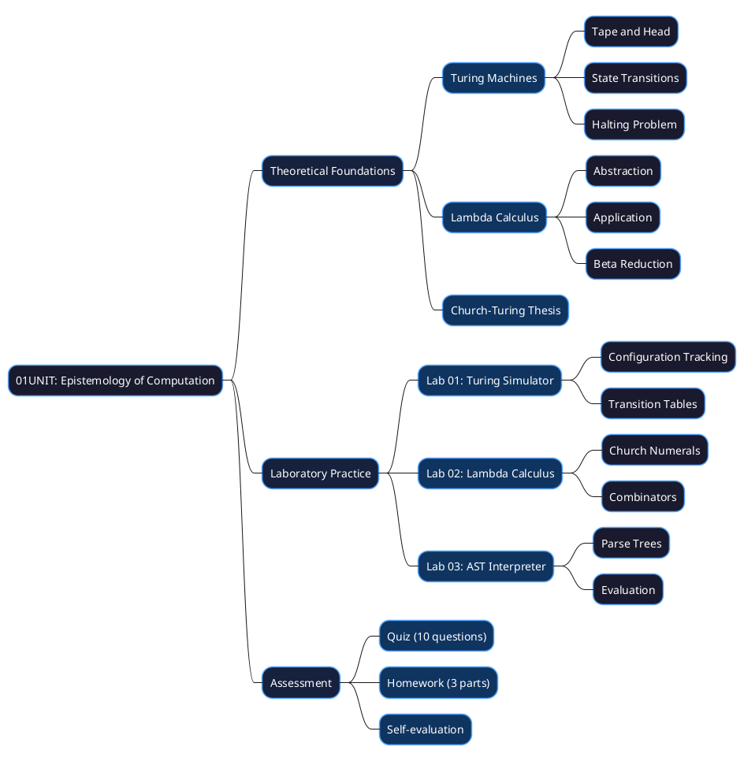
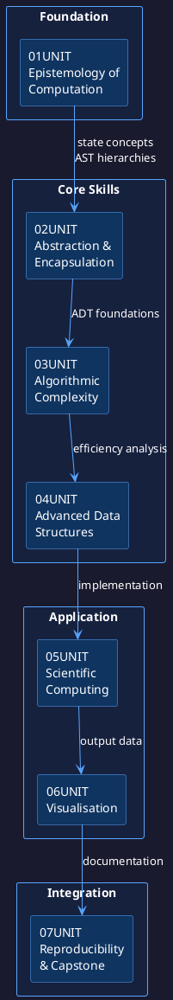
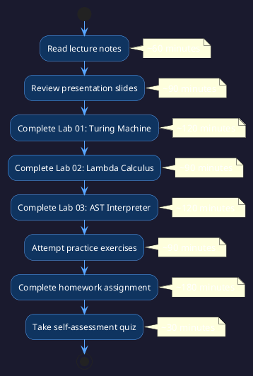

# 01UNIT: The Epistemology of Computation

## The Art of Computational Thinking for Researchers

> **UNIT 01 of 7** | **Bloom Level**: Remember / Understand | **Est. Time**: 11 hours

---

## 📊 UNIT Architecture

The following diagram illustrates the conceptual structure and pedagogical organisation of this foundational unit:



---

## 🎯 Learning Objectives

This unit establishes measurable competencies aligned with Bloom's taxonomy. Upon completion, participants shall demonstrate the following capabilities:

| # | Objective | Bloom Level | Lab Coverage | Assessment |
|---|-----------|-------------|--------------|------------|
| 1 | Define computability and enumerate the formal components of a Turing machine (tape, head, state register, transition function) | [Remember] | Lab 01, §1-2 | Quiz Q1-4 |
| 2 | Articulate the relationship between Turing machines, lambda calculus and modern programming language semantics | [Understand] | Lab 02, §1-3 | Quiz Q5-7, Homework P1 |
| 3 | Implement a functional Turing machine simulator and minimal AST-based expression interpreter | [Apply] | Lab 01, Lab 03 | Homework P2-3 |

---

## 🔗 Prerequisites and Progression

The following diagram situates this unit within the broader curriculum architecture:



### Prerequisite Knowledge

Participants require foundational Python competency encompassing:

- Variable binding and scope semantics
- Function definition and invocation patterns
- Class-based object construction
- Command-line interface familiarity

No prior exposure to formal computation theory is presumed; this unit constructs such foundations ab initio.

### Subsequent Preparation

Concepts introduced herein directly scaffold subsequent units:

- **02UNIT (Abstraction & Encapsulation)**: The state-transition model of Turing machines foreshadows the State design pattern; AST hierarchies prefigure composite object structures
- **03UNIT (Algorithmic Complexity)**: Complexity analysis of Turing machine computations establishes asymptotic reasoning

---

## 📐 Mathematical Foundations

### Formal Definition of a Turing Machine

A Turing machine constitutes a 7-tuple $M = (Q, \Sigma, \Gamma, \delta, q_0, q_{accept}, q_{reject})$ where:

| Symbol | Definition |
|--------|------------|
| $Q$ | Finite set of states |
| $\Sigma$ | Input alphabet (excluding blank symbol) |
| $\Gamma$ | Tape alphabet ($\Sigma \subseteq \Gamma$, includes blank $\sqcup$) |
| $\delta$ | Transition function: $Q \times \Gamma \rightarrow Q \times \Gamma \times \{L, R\}$ |
| $q_0$ | Initial state ($q_0 \in Q$) |
| $q_{accept}$ | Accepting halt state |
| $q_{reject}$ | Rejecting halt state ($q_{accept} \neq q_{reject}$) |

### Configuration and Computation

A configuration captures the instantaneous description of a computation: the tape contents, head position and current state. The configuration transition relation $\vdash$ describes single-step evolution:

$$C_1 \vdash C_2 \iff \text{configuration } C_2 \text{ follows from } C_1 \text{ via one application of } \delta$$

A computation constitutes a sequence $C_0 \vdash C_1 \vdash \cdots \vdash C_n$ where $C_0$ represents the initial configuration and $C_n$ a halting configuration (state in $\{q_{accept}, q_{reject}\}$).

### The Church-Turing Thesis

The Church-Turing thesis posits that any function computable by an effective procedure—any algorithm in the intuitive sense—is computable by a Turing machine. Formally:

$$\text{Effectively computable} \equiv \text{Turing-computable}$$

This thesis, while unprovable mathematically (it equates an informal notion with a formal one), has withstood decades of scrutiny. Every proposed alternative model of computation—lambda calculus, recursive functions, register machines, cellular automata—has proven equivalent in computational power.

### Lambda Calculus Syntax

Lambda calculus expressions follow the grammar:

$$e ::= x \mid \lambda x.e \mid e_1 \, e_2$$

where $x$ denotes variables, $\lambda x.e$ represents abstraction (function definition) and $e_1 \, e_2$ signifies application (function invocation).

The fundamental reduction rule—beta reduction—specifies substitution semantics:

$$(\lambda x.e_1) \, e_2 \rightarrow_\beta e_1[x := e_2]$$

---

## 📚 Learning Path

The recommended progression through this unit's materials follows this structured sequence:



---

## ⏱️ Time Allocation

| Activity | Duration | Cumulative |
|----------|----------|------------|
| Lecture notes study | 60 min | 1h |
| Presentation review | 90 min | 2h 30m |
| Lab 01: Turing Machine | 120 min | 4h 30m |
| Lab 02: Lambda Calculus | 90 min | 6h |
| Lab 03: AST Interpreter | 120 min | 8h |
| Practice exercises | 90 min | 9h 30m |
| Homework completion | 180 min | 12h 30m |
| Self-assessment | 30 min | 13h |

**Total estimated time**: approximately 13 hours of engaged study.

---

## 📁 UNIT Structure

```
01UNIT/
├── 📄 README.md              ← You are here
├── 📚 theory/
│   ├── 01UNIT_slides.html    ← 45 slides, ~90 min
│   ├── lecture_notes.md      ← 2,500 words
│   └── learning_objectives.md
├── 🔬 lab/
│   ├── lab_01_01_turing_machine.py    ← 1,170 lines
│   ├── lab_01_02_lambda_calculus.py   ← 650 lines
│   ├── lab_01_03_ast_interpreter.py   ← 580 lines
│   └── solutions/
├── ✏️ exercises/
│   ├── homework.md
│   └── practice/             ← 9 exercises (3×easy, 3×medium, 3×hard)
├── 📊 assets/
│   ├── diagrams/             ← 3 PlantUML, 5 SVG
│   └── animations/
│       └── 01UNIT_turing_visualiser.html
├── 🧪 tests/                 ← pytest suite, 85%+ coverage target
└── Makefile
```

---

## 💻 Key Algorithms

### Turing Machine Simulation (Pseudocode)

```pseudocode
ALGORITHM SimulateTuringMachine(M, w)
    INPUT: Turing machine M = (Q, Σ, Γ, δ, q₀, q_accept, q_reject)
           Input string w ∈ Σ*
    OUTPUT: ACCEPT or REJECT
    
    tape ← InitialiseTape(w)
    head ← 0
    state ← q₀
    
    WHILE state ∉ {q_accept, q_reject} DO
        symbol ← tape[head]
        (next_state, write_symbol, direction) ← δ(state, symbol)
        
        tape[head] ← write_symbol
        state ← next_state
        
        IF direction = L THEN
            head ← head - 1
        ELSE IF direction = R THEN
            head ← head + 1
        END IF
    END WHILE
    
    IF state = q_accept THEN
        RETURN ACCEPT
    ELSE
        RETURN REJECT
    END IF
END ALGORITHM
```

### Python Implementation

```python
from dataclasses import dataclass
from enum import Enum, auto
from typing import Iterator

class Direction(Enum):
    """Movement direction of the Turing machine head."""
    LEFT = auto()
    RIGHT = auto()
    STAY = auto()

@dataclass(frozen=True)
class Transition:
    """
    Transition function output for a Turing machine.
    
    Represents δ(q, a) = (q', b, D) where q' is the next state,
    b is the symbol to write, and D is the movement direction.
    """
    next_state: str
    write_symbol: str
    direction: Direction

def simulate(
    transitions: dict[tuple[str, str], Transition],
    initial_state: str,
    input_string: str,
    blank: str = "□",
    max_steps: int = 10_000
) -> Iterator[tuple[dict[int, str], int, str]]:
    """
    Yield configurations during Turing machine execution.
    
    Complexity:
        Time: O(max_steps) iterations maximum.
        Space: O(|tape|) for tape representation.
    """
    tape = {i: c for i, c in enumerate(input_string)}
    head, state, steps = 0, initial_state, 0
    
    while steps < max_steps:
        yield dict(tape), head, state
        
        if state in {"accept", "reject"}:
            return
        
        symbol = tape.get(head, blank)
        key = (state, symbol)
        
        if key not in transitions:
            return
        
        trans = transitions[key]
        tape[head] = trans.write_symbol
        state = trans.next_state
        
        match trans.direction:
            case Direction.LEFT:
                head -= 1
            case Direction.RIGHT:
                head += 1
        
        steps += 1
```

---

## 🚀 Quick Start

```bash
# 1. Navigate to UNIT directory
cd 01UNIT

# 2. Verify environment
make check

# 3. Run labs with demonstration mode
python -m lab.lab_01_01_turing_machine --demo

# 4. Execute test suite
make test

# 5. View presentation
open theory/01UNIT_slides.html
```

---

## ✅ Progress Checklist

| Component | Status | Notes |
|-----------|--------|-------|
| Lecture slides reviewed | ⬜ | ~90 min |
| Lecture notes studied | ⬜ | ~60 min |
| Lab 01 completed | ⬜ | Turing machine simulator |
| Lab 02 completed | ⬜ | Lambda calculus basics |
| Lab 03 completed | ⬜ | AST interpreter |
| Easy exercises (3) | ⬜ | ~30 min |
| Medium exercises (3) | ⬜ | ~45 min |
| Hard exercises (3) | ⬜ | ~60 min |
| Quiz passed (≥70%) | ⬜ | 10 questions |
| Self-assessment done | ⬜ | Reflection |

---

## 📖 Research Applications

The foundational concepts presented in this unit find direct application across diverse research domains:

| Domain | Application | Connection to Unit Content |
|--------|-------------|---------------------------|
| **Bioinformatics** | Finite automata for DNA sequence pattern matching; regular expression engines for motif discovery | State-transition models; formal language recognition |
| **Computational Linguistics** | Parser construction for natural language processing; grammar induction | AST construction; recursive descent interpretation |
| **Physics** | Cellular automata for physical simulation; discrete dynamical systems | Turing machine state evolution; computational universality |
| **Neuroscience** | Computational models of neural circuits; McCulloch-Pitts neurons | Threshold logic; state machines as neural models |

---

## 📚 Key Concepts Summary

| Concept | Definition | Significance |
|---------|------------|--------------|
| **Computability** | A function is computable if there exists an algorithm to calculate it | Distinguishes solvable from unsolvable problems |
| **Turing Machine** | Abstract mathematical model comprising tape, head and finite control | Universal model of computation |
| **Church-Turing Thesis** | Effective computability equals Turing-computability | Theoretical foundation for computer science |
| **Lambda Calculus** | Formal system for function definition and application | Theoretical basis for functional programming |
| **Abstract Syntax Tree** | Hierarchical representation of program structure | Enables semantic analysis and interpretation |
| **Interpreter** | Program that directly executes source code representations | Bridges syntax and semantics |

---

## 📜 Licence and Terms of Use

╔═══════════════════════════════════════════════════════════════════════════════╗
║                           RESTRICTIVE LICENCE                                  ║
║                              Version 3.1.0                                     ║
║                             January 2025                                       ║
╠═══════════════════════════════════════════════════════════════════════════════╣
║                                                                               ║
║   © 2025 Antonio Clim. All rights reserved.                                   ║
║                                                                               ║
║   PERMITTED:                                                                  ║
║   ✓ Personal use for self-study                                               ║
║   ✓ Viewing and running code for personal educational purposes                ║
║   ✓ Local modifications for personal experimentation                          ║
║                                                                               ║
║   PROHIBITED (without prior written consent):                                 ║
║   ✗ Publishing materials (online or offline)                                  ║
║   ✗ Use in formal teaching activities                                         ║
║   ✗ Teaching or presenting materials to third parties                         ║
║   ✗ Redistribution in any form                                                ║
║   ✗ Creating derivative works for public use                                  ║
║   ✗ Commercial use of any kind                                                ║
║                                                                               ║
║   For requests regarding educational use or publication,                      ║
║   please contact the author to obtain written consent.                        ║
║                                                                               ║
╚═══════════════════════════════════════════════════════════════════════════════╝

### Terms and Conditions

1. **Intellectual Property**: All materials, including but not limited to code,
   documentation, presentations and exercises, are the intellectual property of
   Antonio Clim.

2. **No Warranty**: Materials are provided "as is" without warranty of any kind,
   express or implied.

3. **Limitation of Liability**: The author shall not be liable for any damages
   arising from the use of these materials.

4. **Governing Law**: These terms are governed by the laws of Romania.

5. **Contact**: For permissions and enquiries, contact the author through
   official academic channels.

### Technology Stack

This project uses the following technologies:

| Technology | Version | Purpose |
|------------|---------|---------|
| Python | 3.12+ | Primary programming language |
| NumPy | ≥1.24 | Numerical computing |
| Pandas | ≥2.0 | Data manipulation |
| Matplotlib | ≥3.7 | Static visualisation |
| SciPy | ≥1.11 | Scientific computing |
| pytest | ≥7.0 | Testing framework |
| pytest-cov | ≥4.0 | Coverage reporting |
| ruff | ≥0.1 | Linting and formatting |
| mypy | ≥1.0 | Type checking |
| Docker | 24+ | Containerisation |
| reveal.js | 5.0 | Presentation framework |
| PlantUML | 1.2024+ | Diagram generation |
| D3.js | 7.8+ | Interactive visualisations |

---

*THE ART OF COMPUTATIONAL THINKING FOR RESEARCHERS — 01UNIT*
