# 01UNIT: The Epistemology of Computation

## The Art of Computational Thinking for Researchers

> **UNIT 01 of 7** | **Bloom Level**: Remember / Understand / Apply | **Est. Time**: 13 hours

---

## 1. UNIT Synopsis

### 1.1 Abstract

This unit establishes the theoretical and practical foundations of computability, a fundamental concept that underpins every algorithm, simulation and data analysis performed in modern research. Through systematic examination of Turing machines, lambda calculus and abstract syntax trees, participants develop proficiency in formal reasoning about computation, enabling rigorous analysis of algorithmic processes across scientific domains.

The treatment progresses from Hilbert's foundational crisis through Turing's mechanisation of computation to contemporary interpreter construction, employing a synthesis of formal methods and executable Python implementations. Laboratory exercises instantiate theoretical constructs in working code, whilst assessments verify attainment of specified learning outcomes across cognitive domains.

**Keywords**: computability, Turing machines, lambda calculus, Church-Turing thesis, abstract syntax trees, interpreters

**Estimated Duration**: 13 hours (theory: 2.5h, laboratory: 5.5h, exercises: 2.5h, assessment: 2.5h)

**Difficulty Level**: ★★☆☆☆ (2/5 — foundational)

### 1.2 Position in Curriculum

This unit occupies position 01 of 7 in the curriculum sequence. As the inaugural unit, it receives no conceptual prerequisites beyond basic Python competency and furnishes foundational material essential for all subsequent units.

| Dependency Type | Source | Concepts Required |
|-----------------|--------|-------------------|
| External prerequisite | Python basics | Variable binding, function definition, class construction |
| Soft prerequisite | None | — |
| Corequisite | None | — |

### 1.3 Pedagogical Rationale

The instructional design follows constructivist principles, scaffolding knowledge acquisition through progressive complexity. The sequence initiates at the Remember stratum (defining formal components) and culminates in Apply activities (implementing simulators and interpreters).

**Instructional Strategies Employed:**

1. **Worked Examples**: Demonstrated solutions with explicit reasoning traces for Turing machine execution and beta reduction
2. **Cognitive Apprenticeship**: Expert problem decomposition made visible through step-by-step algorithm development
3. **Deliberate Practice**: Targeted exercises addressing specific subskills from state transition design to AST construction
4. **Metacognitive Prompts**: Self-explanation opportunities embedded in laboratory exercises
5. **Transfer Tasks**: Application to bioinformatics, linguistics and physics contexts

---

## 2. Visual Overview

### 2.1 Conceptual Architecture

The following diagram depicts the hierarchical organisation of concepts addressed in this unit, illustrating taxonomic relationships and dependency structures.

```plantuml
@startmindmap
<style>
mindmapDiagram {
  node {
    BackgroundColor #1a1a2e
    FontColor white
    LineColor #58a6ff
  }
  :depth(1) {
    BackgroundColor #16213e
  }
  :depth(2) {
    BackgroundColor #0f3460
  }
}
</style>
* 01UNIT: Epistemology of Computation
** Theoretical Foundations
*** Turing Machines
**** Tape, Head, States
**** Transition Function δ
**** Configuration Sequences
**** Halting Problem
*** Lambda Calculus
**** Variables
**** Abstraction (λx.e)
**** Application (e₁ e₂)
**** Beta Reduction
*** Church-Turing Thesis
**** Equivalence Proofs
**** Computational Universality
** Practical Implementation
*** Lab 01: TM Simulator
**** Configuration Tracking
**** Transition Tables
**** Visualisation
*** Lab 02: Lambda Calculus
**** Church Numerals
**** Combinators (S, K, I)
**** Reduction Strategies
*** Lab 03: AST Interpreter
**** Lexical Analysis
**** Parse Trees
**** Environment Model
**** Recursive Evaluation
** Assessment Framework
*** Quiz (10 questions)
*** Homework (3 parts)
*** Self-evaluation
@endmindmap
```



### 2.2 UNIT Dependencies Graph

Formal specification of prerequisite relationships and knowledge transfer pathways between curriculum units.


### 2.3 Learning Pathway

```plantuml
@startuml
skinparam backgroundColor #1a1a2e
skinparam defaultFontColor white
skinparam activityBackgroundColor #0f3460
skinparam activityBorderColor #58a6ff
skinparam arrowColor #58a6ff

|Preparation|
start
:Verify Python environment;
:Review prerequisites;

|Theory|
:Read lecture notes §1-4;
note right: ~40 minutes
:View slides 1-18;
:Complete inline quiz 1;
:Read lecture notes §5-8;
note right: ~40 minutes
:View slides 19-36;
:Complete inline quiz 2;

|Laboratory|
:Complete Lab 01: Turing Machine;
note right
  ~120 minutes
  Focus: state transitions
end note
:Review Lab 01 solution;
:Complete Lab 02: Lambda Calculus;
note right
  ~90 minutes
  Focus: beta reduction
end note
:Complete Lab 03: AST Interpreter;
note right
  ~120 minutes
  Focus: recursive evaluation
end note

|Practice|
:Easy exercises (3);
:Medium exercises (3);
if (Confident?) then (yes)
  :Hard exercises (3);
else (no)
  :Review theory;
  :Retry medium exercises;
endif

|Assessment|
:Complete quiz (10 questions);
:Self-assessment reflection;
if (Score ≥ 70%) then (pass)
  :Proceed to 02UNIT;
  stop
else (retry)
  :Review weak areas;
  :Retake quiz;
endif
@enduml
```



---

## 3. Learning Objectives

### 3.1 Cognitive Objectives

Upon successful completion of this unit, participants will demonstrate the ability to:

| ID | Level | Verb | Objective Statement | Assessment |
|----|-------|------|---------------------|------------|
| LO1 | Remember | Define | Define computability and enumerate the formal components of a Turing machine (tape, head, state register, transition function) | Quiz Q1-4 |
| LO2 | Understand | Explain | Explain the relationship between Turing machines, lambda calculus and modern programming language semantics | Quiz Q5-7 |
| LO3 | Apply | Implement | Implement a functional Turing machine simulator with configuration tracking | Lab 01 |
| LO4 | Apply | Implement | Implement Church numeral encoding and beta reduction | Lab 02 |
| LO5 | Apply | Implement | Implement a minimal AST-based expression interpreter with environment handling | Lab 03 |
| LO6 | Analyse | Compare | Compare the computational expressiveness of different formal models | Homework P1 |

### 3.2 Skill Objectives

**Technical Skills:**

| Skill | Proficiency Level | Evidence |
|-------|-------------------|----------|
| State machine design | Competent | Lab 01 completion, transition table construction |
| Functional abstraction | Competent | Lab 02 completion, combinator application |
| Recursive tree traversal | Proficient | Lab 03 completion, all evaluation cases handled |

**Transferable Skills:**

- **Analytical Reasoning**: Decompose computational processes into formal state transitions
- **Technical Communication**: Document algorithms with precision following established notation
- **Abstract Thinking**: Reason about computation independent of specific implementation

### 3.3 Objectives-Assessment Alignment

```plantuml
@startuml
skinparam backgroundColor #1a1a2e
skinparam defaultFontColor white
skinparam objectBackgroundColor #0f3460
skinparam objectBorderColor #58a6ff

object "LO1: Define" as lo1
object "LO2: Explain" as lo2
object "LO3: Implement TM" as lo3
object "LO4: Implement λ" as lo4
object "LO5: Implement AST" as lo5
object "LO6: Compare" as lo6

object "Quiz Q1-Q4" as q1
object "Quiz Q5-Q7" as q2
object "Lab 01" as lab1
object "Lab 02" as lab2
object "Lab 03" as lab3
object "Homework" as hw

lo1 --> q1
lo2 --> q2
lo3 --> lab1
lo4 --> lab2
lo5 --> lab3
lo6 --> hw
@enduml
```



---

## 4. Theoretical Foundations

### 4.1 Historical Context

The concepts addressed in this unit trace their origins to the foundational crisis in mathematics of the early twentieth century. David Hilbert's programme (1900) sought to establish mathematics on an unshakeable axiomatic foundation, demanding three properties: completeness, consistency and decidability.

**Historical Timeline:**

| Year | Contributor | Contribution |
|------|-------------|--------------|
| 1900 | David Hilbert | Formulated the Entscheidungsproblem |
| 1931 | Kurt Gödel | Proved incompleteness theorems |
| 1936 | Alonzo Church | Developed lambda calculus |
| 1936 | Alan Turing | Defined Turing machines, proved undecidability |
| 1937 | Turing | Demonstrated TM-λ equivalence |

The evolution from Hilbert's optimism to the sobering recognition of fundamental limits reflects a profound shift in mathematical understanding—computation has boundaries that no amount of cleverness can transcend.

### 4.2 Core Concepts

#### 4.2.1 The Turing Machine

**Definition 4.1** (Turing Machine). A Turing machine is a 7-tuple $M = (Q, \Sigma, \Gamma, \delta, q_0, q_{accept}, q_{reject})$ where:

- $Q$ is a finite, non-empty set of states
- $\Sigma$ is the input alphabet (not containing blank symbol $\sqcup$)
- $\Gamma$ is the tape alphabet with $\Sigma \subset \Gamma$ and $\sqcup \in \Gamma$
- $\delta: Q \times \Gamma \rightarrow Q \times \Gamma \times \{L, R\}$ is the transition function
- $q_0 \in Q$ is the initial state
- $q_{accept} \in Q$ is the accepting halt state
- $q_{reject} \in Q$ is the rejecting halt state with $q_{accept} \neq q_{reject}$

**Intuition**: A Turing machine models a human calculator with unlimited paper (the tape), a pencil (the head) and a finite set of mental states governing behaviour.

#### 4.2.2 Configuration and Computation

**Definition 4.2** (Configuration). A configuration of a Turing machine $M$ is a triple $(u, q, v)$ where $u \in \Gamma^*$ represents tape contents to the left of the head, $q \in Q$ is the current state, and $v \in \Gamma^+$ represents tape contents from the head position rightward.

The configuration transition relation $\vdash$ describes single-step evolution:

$$C_1 \vdash C_2 \iff C_2 \text{ follows from } C_1 \text{ via one application of } \delta$$

#### 4.2.3 Lambda Calculus

**Definition 4.3** (Lambda Term). The set $\Lambda$ of lambda terms is defined inductively:

1. If $x$ is a variable, then $x \in \Lambda$
2. If $x$ is a variable and $M \in \Lambda$, then $(\lambda x.M) \in \Lambda$ (abstraction)
3. If $M, N \in \Lambda$, then $(M \, N) \in \Lambda$ (application)

**Theorem 4.1** (Church-Turing). A function $f: \mathbb{N} \rightarrow \mathbb{N}$ is Turing-computable if and only if it is lambda-definable.

### 4.3 Mathematical Framework

**Notation Reference:**

| Symbol | Meaning | Example |
|--------|---------|---------|
| $\delta(q, a)$ | Transition function | $\delta(q_1, 0) = (q_2, 1, R)$ |
| $\vdash$ | Configuration transition | $C_1 \vdash C_2$ |
| $\vdash^*$ | Reflexive-transitive closure | $C_0 \vdash^* C_n$ |
| $\lambda x.M$ | Lambda abstraction | $\lambda x.x$ (identity) |
| $\rightarrow_\beta$ | Beta reduction | $(\lambda x.M)N \rightarrow_\beta M[x := N]$ |

---

## 5. Algorithmic Content

### 5.1 Algorithm Catalogue

| Algorithm | Problem | Time Complexity | Space Complexity |
|-----------|---------|-----------------|------------------|
| TM Simulation | Execute transition function | $O(s)$ per step | $O(t)$ tape length |
| Beta Reduction | Lambda term normalisation | Potentially unbounded | $O(n)$ term size |
| AST Evaluation | Expression interpretation | $O(n)$ nodes | $O(d)$ recursion depth |

### 5.2 Turing Machine Simulation Pseudocode

```
ALGORITHM SimulateTuringMachine(M, w)
━━━━━━━━━━━━━━━━━━━━━━━━━━━━━━━━━━━━━━━━━━━━━━━━━━━━━━━━━━━━━━━━━━━━━━━━━━
INPUT:  M = (Q, Σ, Γ, δ, q₀, q_accept, q_reject) — Turing machine
        w ∈ Σ* — input string
OUTPUT: ACCEPT, REJECT, or configuration sequence
━━━━━━━━━━━━━━━━━━━━━━━━━━━━━━━━━━━━━━━━━━━━━━━━━━━━━━━━━━━━━━━━━━━━━━━━━━

1   tape ← InitialiseTape(w)                    ▷ Load input
2   head ← 0                                     ▷ Position at start
3   state ← q₀                                   ▷ Initial state
4   
5   WHILE state ∉ {q_accept, q_reject} DO
6   │   symbol ← tape[head]
7   │   (next_state, write, direction) ← δ(state, symbol)
8   │   
9   │   tape[head] ← write
10  │   state ← next_state
11  │   
12  │   IF direction = L THEN
13  │   │   head ← head - 1
14  │   ELSE
15  │   │   head ← head + 1
16  │   END IF
17  END WHILE
18  
19  RETURN state = q_accept ? ACCEPT : REJECT

━━━━━━━━━━━━━━━━━━━━━━━━━━━━━━━━━━━━━━━━━━━━━━━━━━━━━━━━━━━━━━━━━━━━━━━━━━
COMPLEXITY: Time O(steps × |δ|), Space O(|tape|)
━━━━━━━━━━━━━━━━━━━━━━━━━━━━━━━━━━━━━━━━━━━━━━━━━━━━━━━━━━━━━━━━━━━━━━━━━━
```

### 5.3 Python Implementation Pattern

```python
from dataclasses import dataclass
from enum import Enum, auto
from typing import Iterator

class Direction(Enum):
    """Movement direction of the Turing machine head."""
    LEFT = auto()
    RIGHT = auto()

@dataclass(frozen=True)
class Transition:
    """
    Represents δ(q, a) = (q', b, D) output.
    
    Complexity: O(1) for all operations (immutable value type).
    """
    next_state: str
    write_symbol: str
    direction: Direction

def simulate(
    transitions: dict[tuple[str, str], Transition],
    initial_state: str,
    input_string: str,
    *,
    blank: str = "□",
    max_steps: int = 10_000
) -> Iterator[tuple[dict[int, str], int, str]]:
    """
    Yield configurations during Turing machine execution.
    
    Args:
        transitions: Mapping from (state, symbol) to Transition.
        initial_state: Starting state identifier.
        input_string: Initial tape contents.
        blank: Blank symbol for uninitialised cells.
        max_steps: Maximum iterations before forced halt.
    
    Yields:
        Tuple of (tape_dict, head_position, current_state).
    
    Complexity:
        Time: O(max_steps) iterations maximum.
        Space: O(|tape|) for tape representation.
    """
    tape = {i: c for i, c in enumerate(input_string)}
    head, state = 0, initial_state
    
    for _ in range(max_steps):
        yield dict(tape), head, state
        
        if state in {"accept", "reject"}:
            return
        
        symbol = tape.get(head, blank)
        trans = transitions.get((state, symbol))
        
        if trans is None:
            return
        
        tape[head] = trans.write_symbol
        state = trans.next_state
        head += 1 if trans.direction == Direction.RIGHT else -1
```

---

## 6. Practical Applications

### 6.1 Research Domain Examples

| Domain | Problem | Technique from Unit | Reference |
|--------|---------|---------------------|-----------|
| Bioinformatics | DNA sequence pattern matching | Finite automata (simplified TM) | Durbin et al. (1998) |
| Computational Linguistics | Natural language parsing | AST construction, recursive descent | Jurafsky & Martin (2023) |
| Physics | Cellular automata simulation | State transition systems | Wolfram (2002) |
| Neuroscience | Neural circuit modelling | McCulloch-Pitts threshold logic | McCulloch & Pitts (1943) |

### 6.2 Case Study: DNA Motif Detection

**Context**: Identifying transcription factor binding sites requires searching genomic sequences for specific patterns, potentially with mismatches.

**Challenge**: Scanning billions of base pairs efficiently whilst allowing for sequence variation.

**Solution**: Finite automata (deterministic variants of Turing machines with no tape modification) encode the pattern and process input in linear time.

**Results**: Tools such as BLAST and FASTA employ automata-based algorithms to achieve orders-of-magnitude speedups over naive search.

---

## 7. Laboratory Guide

### 7.1 Lab Overview

| Lab | Title | Duration | Primary Objective | Difficulty |
|-----|-------|----------|-------------------|------------|
| 01 | Turing Machine Simulator | 120 min | LO3: Implement TM simulation | ★★★☆☆ |
| 02 | Lambda Calculus | 90 min | LO4: Implement beta reduction | ★★★☆☆ |
| 03 | AST Interpreter | 120 min | LO5: Implement evaluation | ★★★★☆ |

### 7.2 Lab 01: Turing Machine Simulator

**Synopsis**: This laboratory instantiates the theoretical framework in executable Python code, focusing on state transition mechanics and configuration tracking.

**Key Files**:
- `lab/lab_01_01_turing_machine.py` — Main laboratory module (1,171 lines)
- `lab/solutions/lab_01_01_solutions.py` — Reference implementation

**Visual Reference**: See `assets/diagrams/turing_machine_architecture.svg` for component diagram.

### 7.3 Lab 02: Lambda Calculus

**Synopsis**: Implementation of Church encodings and reduction strategies, connecting abstract mathematical notation to executable functions.

**Key Files**:
- `lab/lab_01_02_lambda_calculus.py` — Main laboratory module (1,067 lines)
- `lab/solutions/lab_01_02_solutions.py` — Reference implementation

**Visual Reference**: See `assets/diagrams/lambda_reduction.svg` for beta reduction steps.

### 7.4 Lab 03: AST Interpreter

**Synopsis**: Construction of a minimal expression language interpreter demonstrating lexical scoping and recursive evaluation.

**Key Files**:
- `lab/lab_01_03_ast_interpreter.py` — Main laboratory module (1,336 lines)
- `lab/solutions/lab_01_03_solutions.py` — Reference implementation

**Visual Reference**: See `assets/diagrams/ast_structure.svg` for tree structure.

---

### 7.5 Laboratory Integration Points


---

## 8. Technical Reference

### 8.1 Key Data Structures

| Structure | Purpose | Module |
|-----------|---------|--------|
| `Configuration` | TM instantaneous description | lab_01_01 |
| `Transition` | δ function output | lab_01_01 |
| `LambdaTerm` | AST node for λ-calculus | lab_01_02 |
| `ASTNode` | Expression tree node | lab_01_03 |
| `Environment` | Variable binding map | lab_01_03 |

### 8.2 Error Handling Patterns

```python
class UndefinedTransitionError(Exception):
    """Raised when δ(q, a) is undefined."""

class UnboundVariableError(Exception):
    """Raised when variable lookup fails in environment."""

class EvaluationError(Exception):
    """Raised when AST evaluation encounters invalid state."""
```

---

## 9. Visual Assets Catalogue

### 9.1 Diagrams Index

| File | Type | Description |
|------|------|-------------|
| `assets/diagrams/turing_machine_architecture.svg` | SVG | TM component diagram |
| `assets/diagrams/turing_machine_architecture.puml` | PlantUML | Source for above |
| `assets/diagrams/ast_structure.svg` | SVG | Expression tree hierarchy |
| `assets/diagrams/ast_tree_structure.puml` | PlantUML | Source for above |
| `assets/diagrams/church_turing_thesis.svg` | SVG | Equivalence visualisation |
| `assets/diagrams/lambda_reduction.svg` | SVG | Beta reduction steps |
| `assets/diagrams/lambda_calculus_syntax.svg` | SVG | Grammar diagram |
| `assets/diagrams/computation_paradigms.puml` | PlantUML | Historical timeline |

### 9.2 Interactive Demos

| File | Description |
|------|-------------|
| `assets/animations/01UNIT_turing_visualiser.html` | Interactive TM execution visualiser |

---

## 10. Directory Structure

```
01UNIT/
├── 📄 README.md              ← You are here
├── 📚 theory/
│   ├── 01UNIT_slides.html    ← 36 slides, ~90 min
│   ├── lecture_notes.md      ← ~2,500 words
│   └── learning_objectives.md
├── 🔬 lab/
│   ├── __init__.py
│   ├── lab_01_01_turing_machine.py   ← 1,171 lines
│   ├── lab_01_02_lambda_calculus.py  ← 1,067 lines
│   ├── lab_01_03_ast_interpreter.py  ← 1,336 lines
│   └── solutions/
│       ├── lab_01_01_solutions.py
│       ├── lab_01_02_solutions.py
│       └── lab_01_03_solutions.py
├── ✏️ exercises/
│   ├── homework.md
│   ├── practice/             ← 9 exercises (easy/medium/hard)
│   └── solutions/
├── 📊 assessments/
│   ├── quiz.md               ← 10 questions
│   ├── rubric.md
│   └── self_check.md
├── 📖 resources/
│   ├── cheatsheet.md
│   ├── further_reading.md
│   ├── glossary.md
│   └── datasets/
├── 🎨 assets/
│   ├── diagrams/             ← 3 PlantUML, 5 SVG
│   ├── animations/           ← Interactive HTML
│   └── images/
├── 🧪 tests/
│   ├── conftest.py
│   ├── test_lab_01_01.py
│   ├── test_lab_01_02.py
│   └── test_lab_01_03.py
└── Makefile
```

---

## 11. Quick Start

```bash
# 1. Navigate to UNIT directory
cd 01UNIT

# 2. Verify environment
make check

# 3. Run labs with demonstration mode
python -m lab.lab_01_01_turing_machine --demo

# 4. Execute test suite
make test

# 5. View presentation
open theory/01UNIT_slides.html
```

---

## 12. Progress Checklist

| Component | Status | Duration |
|-----------|--------|----------|
| Lecture notes studied | ⬜ | ~60 min |
| Presentation reviewed | ⬜ | ~90 min |
| Lab 01 completed | ⬜ | ~120 min |
| Lab 02 completed | ⬜ | ~90 min |
| Lab 03 completed | ⬜ | ~120 min |
| Easy exercises (3) | ⬜ | ~30 min |
| Medium exercises (3) | ⬜ | ~45 min |
| Hard exercises (3) | ⬜ | ~60 min |
| Quiz passed (≥70%) | ⬜ | ~30 min |
| Self-assessment done | ⬜ | ~15 min |

**Total estimated time**: 13 hours of engaged study.

---

## 13. Troubleshooting

### 13.1 Common Issues

| Issue | Cause | Resolution |
|-------|-------|------------|
| `ModuleNotFoundError` | Package not installed | `pip install -r requirements.txt` |
| TM loops forever | Missing halt state transition | Check δ completeness |
| Beta reduction diverges | Non-terminating term | Use normal order reduction |
| AST evaluation fails | Unbound variable | Check environment bindings |

### 13.2 Getting Help

1. Review the relevant section in `theory/lecture_notes.md`
2. Consult the glossary in `resources/glossary.md`
3. Examine solution files in `lab/solutions/`
4. Run tests with verbose output: `make test VERBOSE=1`

---

## 14. Further Reading

### 14.1 Primary Sources

1. Turing, A. M. (1936). On Computable Numbers, with an Application to the Entscheidungsproblem. *Proceedings of the London Mathematical Society*, 42(2), 230-265.
2. Church, A. (1936). An Unsolvable Problem of Elementary Number Theory. *American Journal of Mathematics*, 58(2), 345-363.

### 14.2 Textbooks

1. Sipser, M. (2012). *Introduction to the Theory of Computation* (3rd ed.). Cengage Learning.
2. Abelson, H., & Sussman, G. J. (1996). *Structure and Interpretation of Computer Programs* (2nd ed.). MIT Press.
3. Pierce, B. C. (2002). *Types and Programming Languages*. MIT Press.

---

## 15. Glossary (Selected Terms)

| Term | Definition |
|------|------------|
| **Computability** | A function is computable if there exists an algorithm to calculate it |
| **Turing Machine** | Abstract model comprising tape, head and finite control |
| **Church-Turing Thesis** | Effective computability equals Turing-computability |
| **Lambda Calculus** | Formal system for function definition and application |
| **Abstract Syntax Tree** | Hierarchical representation of program structure |
| **Beta Reduction** | The fundamental evaluation rule: $(\lambda x.M)N \rightarrow M[x:=N]$ |
| **Configuration** | Complete instantaneous description of a computation |
| **Halting Problem** | The undecidable problem of determining if M halts on w |

See `resources/glossary.md` for complete terminology.

---

## 📜 Licence and Terms of Use

<div align="center">

<table>
<tr>
<td>

<div align="center">
<h3>🔒 RESTRICTIVE LICENCE</h3>
<p><strong>Version 4.1.0 — January 2025</strong></p>
</div>

---

**© 2025 Antonio Clim. All rights reserved.**

<table>
<tr>
<th>✅ PERMITTED</th>
<th>❌ PROHIBITED</th>
</tr>
<tr>
<td>

- Personal use for self-study
- Viewing and running code for personal educational purposes
- Local modifications for personal experimentation

</td>
<td>

- Publishing materials (online or offline)
- Use in formal teaching activities
- Teaching or presenting to third parties
- Redistribution in any form
- Creating derivative works for public use
- Commercial use of any kind

</td>
</tr>
</table>

---

<p><em>For requests regarding educational use or publication,<br>
please contact the author to obtain written consent.</em></p>

</td>
</tr>
</table>

</div>

### Terms and Conditions

1. **Intellectual Property**: All materials, including but not limited to code, documentation, presentations and exercises, are the intellectual property of Antonio Clim.

2. **No Warranty**: Materials are provided "as is" without warranty of any kind, express or implied.

3. **Limitation of Liability**: The author shall not be liable for any damages arising from the use of these materials.

4. **Governing Law**: These terms are governed by the laws of Romania.

5. **Contact**: For permissions and enquiries, contact the author through official academic channels.

### Technology Stack

| Technology | Version | Purpose |
|------------|---------|---------|
| Python | 3.12+ | Primary programming language |
| NumPy | ≥1.24 | Numerical computing |
| Pandas | ≥2.0 | Data manipulation |
| Matplotlib | ≥3.7 | Static visualisation |
| SciPy | ≥1.11 | Scientific computing |
| pytest | ≥7.0 | Testing framework |
| pytest-cov | ≥4.0 | Coverage reporting |
| ruff | ≥0.1 | Linting and formatting |
| mypy | ≥1.0 | Type checking |
| Docker | 24+ | Containerisation |
| reveal.js | 5.0 | Presentation framework |
| PlantUML | 1.2024+ | Diagram generation |
| D3.js | 7.8+ | Interactive visualisations |

---

*THE ART OF COMPUTATIONAL THINKING FOR RESEARCHERS — 01UNIT*
