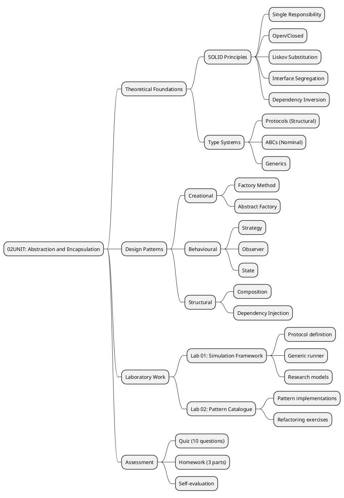
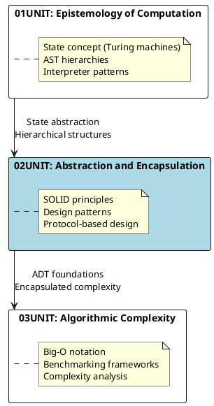
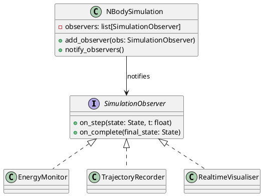

# 02UNIT: Abstraction and Encapsulation

## The Art of Computational Thinking for Researchers

> **UNIT 02 of 7** | **Bloom Level**: Understand/Apply | **Est. Time**: 6 hours

---

## 📊 UNIT Architecture



---

## 🎯 Learning Objectives

This unit establishes the theoretical and practical foundations of object-oriented design as applied to research software development. Upon completion, participants will possess the conceptual apparatus and implementation skills necessary to construct modular, extensible and testable simulation frameworks.

| # | Objective | Bloom Level | Lab Coverage | Assessment |
|---|-----------|-------------|--------------|------------|
| 1 | Articulate the five SOLID principles and evaluate their applicability to scientific computing contexts | [Understand] | Lab 01 §1-2, Lab 02 §1 | Quiz Q1-Q4 |
| 2 | Implement Strategy, Observer and Factory patterns within simulation frameworks | [Apply] | Lab 01 §3-5, Lab 02 §2-4 | Homework P1-P2 |
| 3 | Refactor procedural research code into well-structured object-oriented designs preserving correctness | [Analyse] | Lab 02 §5-6 | Homework P3 |

---

## 🔗 Prerequisites and Continuity



The transition from 01UNIT to 02UNIT represents a shift from understanding *what* computation means to understanding *how* computational systems should be organised. The state concept introduced through Turing machine formalism provides the foundation for the State pattern; the hierarchical AST structures presage the Composite pattern and inheritance hierarchies examined herein.

**Required Prior Knowledge:**
- Completion of 01UNIT (state transitions, AST interpreters)
- Python proficiency including type hints, dataclasses and basic inheritance
- Familiarity with NumPy array operations
- Understanding of basic polymorphism concepts

---

## 📐 Theoretical Foundations

### The SOLID Principles in Research Computing

The SOLID principles, articulated by Robert C. Martin, provide axiomatic guidance for constructing maintainable object-oriented systems. Their application within research software contexts merits careful consideration, as the demands of scientific computing present unique challenges.

#### Single Responsibility Principle

A class should possess precisely one reason to change. In simulation code, this principle mandates separation between:

$$\text{Simulation} = \text{Model} \oplus \text{Numerics} \oplus \text{Visualisation} \oplus \text{Persistence}$$

where $\oplus$ denotes orthogonal composition. When epidemic dynamics, numerical integration and plotting cohabit a single class, modifications to visualisation logic necessitate changes to the same module implementing the SIR differential equations—a coupling that induces fragility.

#### Open/Closed Principle

Software entities should be open for extension but closed for modification. The Protocol mechanism in Python provides the implementation vehicle:

```python
class Simulable(Protocol[StateT]):
    """Structural interface for simulable systems."""
    def state(self) -> StateT: ...
    def step(self, dt: float) -> None: ...
    def is_done(self) -> bool: ...
```

New simulation models conform to this interface without requiring modifications to the generic `SimulationRunner`.

### Type-Theoretic Underpinnings

Python's type system supports both structural (Protocol-based) and nominal (ABC-based) subtyping. The distinction carries significant design implications:

| Aspect | Structural (Protocol) | Nominal (ABC) |
|--------|----------------------|---------------|
| Conformance | Implicit (duck typing) | Explicit (inheritance) |
| Retroactive | Possible | Impossible |
| Documentation | Weaker | Stronger |
| Runtime checking | Limited | `isinstance()` support |

For research software integrating third-party libraries, structural typing often proves more practical, as it permits protocol conformance without modifying external code.

---

## 🔬 Research Applications

Design patterns find natural application across scientific domains:

### Epidemiology: Strategy Pattern for Transmission Models

The SIR model's transmission dynamics can vary:
- Frequency-dependent: $\beta SI/N$
- Density-dependent: $\beta SI$
- Saturating: $\beta SI / (1 + \alpha I)$

The Strategy pattern encapsulates these alternatives:

```python
class TransmissionStrategy(Protocol):
    def transmission_rate(
        self, S: float, I: float, N: float, beta: float
    ) -> float: ...
```

### Physics: Observer Pattern for Simulation Monitoring

N-body simulations benefit from decoupled observation:



### Economics: Factory Pattern for Agent Generation

Market simulations require diverse agent populations. The Factory pattern centralises agent creation:

```python
class AgentFactory(ABC):
    @abstractmethod
    def create_agent(self, params: AgentParams) -> MarketAgent: ...

class RiskAverseAgentFactory(AgentFactory): ...
class MomentumTraderFactory(AgentFactory): ...
```

---

## 📁 UNIT Structure

```
02UNIT/
├── 📄 README.md                    ← You are here
│
├── 📚 theory/
│   ├── 02UNIT_slides.html          ← 48 slides (~100 min)
│   ├── lecture_notes.md            ← 2,200 words
│   └── learning_objectives.md      ← Measurable outcomes
│
├── 🔬 lab/
│   ├── __init__.py                 ← Package initialisation
│   ├── lab_02_01_simulation_framework.py  ← 931 lines
│   ├── lab_02_02_design_patterns.py       ← 1,140 lines
│   └── solutions/
│
├── ✏️ exercises/
│   ├── homework.md                 ← Graded assignment
│   └── practice/                   ← 9 exercises (3 easy, 3 medium, 3 hard)
│       ├── easy_01_protocol.py
│       ├── easy_02_dataclass.py
│       ├── easy_03_generics.py
│       ├── medium_01_strategy.py
│       ├── medium_02_observer.py
│       ├── medium_03_factory.py
│       ├── hard_01_di_container.py
│       ├── hard_02_state_machine.py
│       └── hard_03_event_sourcing.py
│
├── 📊 assessments/
│   ├── quiz.md                     ← 10 questions
│   ├── rubric.md                   ← Grading criteria
│   └── self_check.md               ← Self-evaluation
│
├── 📖 resources/
│   ├── cheatsheet.md               ← A4 quick reference
│   ├── further_reading.md          ← 12 annotated sources
│   ├── glossary.md                 ← 45 terms
│   └── datasets/
│
├── 🎨 assets/
│   ├── diagrams/
│   │   ├── simulation_framework_uml.puml
│   │   ├── strategy_pattern.puml
│   │   ├── observer_pattern.puml
│   │   ├── solid_principles.puml
│   │   ├── strategy_pattern.svg
│   │   ├── observer_pattern.svg
│   │   ├── factory_pattern.svg
│   │   ├── solid_principles.svg
│   │   ├── composition_vs_inheritance.svg
│   │   └── dependency_injection.svg
│   ├── animations/
│   │   └── 02UNIT_pattern_visualiser.html
│   └── images/
│
├── 🧪 tests/
│   ├── __init__.py
│   ├── conftest.py
│   ├── test_lab_02_01.py
│   └── test_lab_02_02.py
│
└── Makefile
```

---

## 🚀 Quick Start

```bash
# 1. Navigate to UNIT directory
cd 02UNIT

# 2. Verify environment
make check

# 3. Run primary lab with demonstration mode
python -m lab.lab_02_01_simulation_framework --demo

# 4. Run secondary lab
python -m lab.lab_02_02_design_patterns --demo

# 5. Execute test suite
make test

# 6. Validate UNIT structure
python ../scripts/validate_unit.py 02
```

---

## ✅ Progress Checklist

| Component | Status | Estimated Duration | Notes |
|-----------|--------|-------------------|-------|
| Lecture slides reviewed | ⬜ | 100 min | 48 slides with speaker notes |
| Lecture notes studied | ⬜ | 45 min | 2,200 words |
| Lab 01 completed | ⬜ | 90 min | Simulation framework |
| Lab 02 completed | ⬜ | 60 min | Design patterns |
| Easy exercises (3) | ⬜ | 30 min | Protocol, dataclass, generics |
| Medium exercises (3) | ⬜ | 60 min | Strategy, Observer, Factory |
| Hard exercises (3) | ⬜ | 120 min | DI container, State machine, Event sourcing |
| Quiz passed (≥70%) | ⬜ | 15 min | 10 questions |
| Self-assessment completed | ⬜ | 15 min | Reflection and evaluation |

**Total Estimated Time: 6 hours**

---

## 🔄 UNIT Connections

```plantuml
@startuml
skinparam backgroundColor transparent
left to right direction
skinparam packageStyle rectangle

package "Foundation" {
  [01UNIT: Epistemology] as U1
}

package "Core Skills" {
  [02UNIT: Abstraction] as U2 #LightBlue
  [03UNIT: Complexity] as U3
  [04UNIT: Data Structures] as U4
}

package "Application" {
  [05UNIT: Scientific Computing] as U5
  [06UNIT: Visualisation] as U6
}

package "Integration" {
  [07UNIT: Reproducibility] as U7
}

U1 --> U2 : state concepts\nAST hierarchies
U2 --> U3 : ADT foundations\nencapsulated types
U3 --> U4 : complexity bounds\nalgorithm selection
U4 --> U5 : efficient structures\nscalable design
U5 --> U6 : simulation output\ndata pipelines
U6 --> U7 : documentation\nreproducible workflows
@enduml
```



The concepts introduced in 02UNIT pervade subsequent units:
- **03UNIT** employs abstract data types designed here for complexity analysis
- **04UNIT** applies Factory patterns for graph construction
- **05UNIT** uses Strategy patterns for ODE solver selection
- **06UNIT** applies Observer patterns for visualisation pipelines
- **07UNIT** requires well-structured code for reproducibility

---

## 💻 Key Algorithms and Patterns

### Strategy Pattern (Pseudocode)

```pseudocode
ALGORITHM StrategyPattern
    INPUT: Context with interchangeable algorithm
    OUTPUT: Result computed via selected strategy

    INTERFACE Strategy
        METHOD execute(data) → result
    END INTERFACE

    CLASS Context
        ATTRIBUTE strategy: Strategy
        
        METHOD set_strategy(s: Strategy)
            strategy ← s
        END METHOD
        
        METHOD perform_operation(data)
            RETURN strategy.execute(data)
        END METHOD
    END CLASS
    
    // Usage
    context ← new Context()
    context.set_strategy(ConcreteStrategyA())
    result_a ← context.perform_operation(data)
    
    context.set_strategy(ConcreteStrategyB())
    result_b ← context.perform_operation(data)
END ALGORITHM
```

### Observer Pattern Implementation

```python
from typing import Protocol, TypeVar
from dataclasses import dataclass, field

T = TypeVar('T')

class Observer(Protocol[T]):
    """Protocol for observers in publish-subscribe systems."""
    def update(self, subject: 'Subject[T]', event: T) -> None: ...

@dataclass
class Subject[T]:
    """Observable subject maintaining observer registry."""
    _observers: list[Observer[T]] = field(default_factory=list)
    
    def attach(self, observer: Observer[T]) -> None:
        """Register observer for notifications."""
        if observer not in self._observers:
            self._observers.append(observer)
    
    def detach(self, observer: Observer[T]) -> None:
        """Remove observer from registry."""
        self._observers.remove(observer)
    
    def notify(self, event: T) -> None:
        """Broadcast event to all registered observers."""
        for observer in self._observers:
            observer.update(self, event)
```

---

## 📚 Further Exploration

The theoretical framework presented herein draws upon established literature in software engineering and programming language theory. For deeper engagement:

- **Gang of Four**: Gamma et al., *Design Patterns: Elements of Reusable Object-Oriented Software* (1994)—the canonical reference establishing pattern vocabulary
- **Martin**: *Clean Architecture* (2017)—contemporary treatment of SOLID principles with practical guidance
- **Protocol-Oriented Programming**: Apple's WWDC presentations on structural typing in Swift, applicable concepts transferable to Python

---

## 📜 Licence and Terms of Use

╔═══════════════════════════════════════════════════════════════════════════════╗
║                           RESTRICTIVE LICENCE                                  ║
║                              Version 3.1.0                                     ║
║                             January 2025                                       ║
╠═══════════════════════════════════════════════════════════════════════════════╣
║                                                                               ║
║   © 2025 Antonio Clim. All rights reserved.                                   ║
║                                                                               ║
║   PERMITTED:                                                                  ║
║   ✓ Personal use for self-study                                               ║
║   ✓ Viewing and running code for personal educational purposes                ║
║   ✓ Local modifications for personal experimentation                          ║
║                                                                               ║
║   PROHIBITED (without prior written consent):                                 ║
║   ✗ Publishing materials (online or offline)                                  ║
║   ✗ Use in formal teaching activities                                         ║
║   ✗ Teaching or presenting materials to third parties                         ║
║   ✗ Redistribution in any form                                                ║
║   ✗ Creating derivative works for public use                                  ║
║   ✗ Commercial use of any kind                                                ║
║                                                                               ║
║   For requests regarding educational use or publication,                      ║
║   please contact the author to obtain written consent.                        ║
║                                                                               ║
╚═══════════════════════════════════════════════════════════════════════════════╝

### Terms and Conditions

1. **Intellectual Property**: All materials, including but not limited to code,
   documentation, presentations and exercises, are the intellectual property of
   Antonio Clim.

2. **No Warranty**: Materials are provided "as is" without warranty of any kind,
   express or implied.

3. **Limitation of Liability**: The author shall not be liable for any damages
   arising from the use of these materials.

4. **Governing Law**: These terms are governed by the laws of Romania.

5. **Contact**: For permissions and enquiries, contact the author through
   official academic channels.

### Technology Stack

This project uses the following technologies:

| Technology | Version | Purpose |
|------------|---------|---------|
| Python | 3.12+ | Primary programming language |
| NumPy | ≥1.24 | Numerical computing |
| Pandas | ≥2.0 | Data manipulation |
| Matplotlib | ≥3.7 | Static visualisation |
| SciPy | ≥1.11 | Scientific computing |
| pytest | ≥7.0 | Testing framework |
| pytest-cov | ≥4.0 | Coverage reporting |
| ruff | ≥0.1 | Linting and formatting |
| mypy | ≥1.0 | Type checking |
| Docker | 24+ | Containerisation |
| reveal.js | 5.0 | Presentation framework |
| PlantUML | 1.2024+ | Diagram generation |
| D3.js | 7.8+ | Interactive visualisations |
