# 02UNIT: Abstraction and Encapsulation
## The Art of Computational Thinking for Researchers

> **UNIT 02 of 7** | **Bloom Level**: Understand/Apply | **Est. Time**: 8 hours

---

## 1. UNIT Synopsis

### 1.1 Abstract

This UNIT establishes the theoretical and practical foundations of object-oriented design principles and behavioural patterns, cornerstone concepts in computational thinking that underpin maintainable, extensible research software. Through systematic examination of abstraction mechanisms, encapsulation strategies and polymorphic dispatch, participants develop proficiency in architectural reasoning, enabling rigorous construction of simulation frameworks and domain models.

The treatment progresses from foundational type-theoretic concepts through SOLID design principles to Gang of Four behavioural patterns, employing a synthesis of formal interface specifications and empirical software construction. Laboratory exercises instantiate theoretical constructs in executable Python implementations featuring Protocol-based structural subtyping, whilst assessments verify attainment of specified learning outcomes across cognitive domains.

**Keywords**: abstraction, encapsulation, SOLID principles, design patterns, type systems, protocols, dependency injection, composition

**Estimated Duration**: 8 hours (theory: 2.5h, laboratory: 3h, exercises: 2.5h)

**Difficulty Level**: ★★★☆☆ (3/5)

### 1.2 Position in Curriculum


This UNIT occupies position 02 of 7 in the curriculum sequence. It receives conceptual prerequisites from 01UNIT (state concepts from Turing machines, AST hierarchies) and furnishes foundational material essential for 03UNIT (abstract data types enabling complexity analysis).

| Dependency Type | Source | Concepts Required |
|-----------------|--------|-------------------|
| Hard prerequisite | 01UNIT | State representation, tree structures, interpreter patterns |
| Soft prerequisite | None | — |
| Corequisite | None | — |

### 1.3 Pedagogical Rationale

The instructional design follows constructivist principles, scaffolding knowledge acquisition through progressive complexity. The sequence adheres to taxonomic progression, initiating at the Understanding stratum and culminating in Application and Analysis activities.

**Instructional Strategies Employed:**

1. **Worked Examples**: Demonstrated pattern implementations with explicit reasoning traces
2. **Cognitive Apprenticeship**: Expert refactoring decisions made visible through before/after comparisons
3. **Deliberate Practice**: Targeted exercises addressing specific pattern applications
4. **Metacognitive Prompts**: Self-explanation opportunities during code review exercises
5. **Transfer Tasks**: Application to novel research simulation contexts

---

## 2. Visual Overview

### 2.1 Conceptual Architecture

The following diagram depicts the hierarchical organisation of concepts addressed in this UNIT, illustrating taxonomic relationships and dependency structures.


### 2.2 UNIT Dependencies Graph

Formal specification of prerequisite relationships and knowledge transfer pathways between curriculum units.


### 2.3 Learning Pathway

Sequential activity diagram specifying the recommended traversal of UNIT materials for optimal knowledge construction.

```plantuml
@startuml
!theme plain
skinparam backgroundColor #1a1a2e
skinparam defaultFontColor #eaeaea
skinparam ActivityBackgroundColor #2d2d44
skinparam ActivityBorderColor #4a9eff

|Preparation|
start
:Review 01UNIT state concepts;
:Verify environment setup;

|Theory|
:Read learning objectives;
:Study lecture notes §1-3;
:View slides 1-20;
:Complete inline quiz 1;
:Study lecture notes §4-6;
:View slides 21-40;
:Complete inline quiz 2;

|Laboratory|
:Complete Lab 01: Simulation Framework;
note right
  ~45 minutes
  Focus: OOP fundamentals
end note
:Review Lab 01 solution;
:Complete Lab 02: Design Patterns;
note right
  ~30 minutes
  Focus: Pattern catalogue
end note

|Practice|
:Easy exercises (3);
:Medium exercises (3);
if (Confident?) then (yes)
  :Hard exercises (3);
else (no)
  :Review theory;
  :Retry medium exercises;
endif

|Assessment|
:Complete quiz (10 questions);
:Self-assessment reflection;
if (Score ≥ 70%) then (pass)
  :Proceed to 03UNIT;
  stop
else (retry)
  :Review weak areas;
  :Retake quiz;
endif
@enduml
```



---

## 3. Learning Objectives

### 3.1 Cognitive Objectives

Upon successful completion of this UNIT, participants will demonstrate the ability to:

| ID | Level | Verb | Objective Statement | Assessment |
|----|-------|------|---------------------|------------|
| LO1 | Understand | Explain | Explain core OOP principles (abstraction, encapsulation, polymorphism) and their research applications | Quiz Q1-4 |
| LO2 | Apply | Implement | Implement Strategy, Observer and Factory patterns in simulation contexts | Lab 01, Lab 02 |
| LO3 | Analyse | Refactor | Refactor procedural code into well-structured OOP design using SOLID principles | Homework P1 |
| LO4 | Apply | Design | Design protocol-based interfaces enabling polymorphic dispatch | Lab 02, Homework P2 |
| LO5 | Evaluate | Justify | Justify pattern selection for given problem specifications | Homework P3 |
| LO6 | Create | Synthesise | Synthesise novel solutions integrating multiple patterns | Homework Bonus |

### 3.2 Skill Objectives (Measurable Outcomes)

**Technical Skills:**

| Skill | Proficiency Level | Evidence |
|-------|-------------------|----------|
| Protocol-based interface design | Competent | Lab 01 completion, test coverage ≥80% |
| Behavioural pattern implementation | Proficient | Lab 02 completion, all edge cases handled |
| Dependency injection architecture | Advanced | Homework bonus problem solved |

**Transferable Skills:**

- **Architectural Reasoning**: Decompose complex systems into cohesive, loosely-coupled components
- **Technical Communication**: Document design decisions with precision and clarity
- **Critical Evaluation**: Assess design alternatives against maintainability and extensibility criteria

### 3.3 Affective Objectives

- Appreciate the elegance of well-factored object-oriented designs
- Value separation of concerns in research software architecture
- Develop intellectual curiosity regarding advanced architectural patterns

### 3.4 Objectives-Assessment Alignment Matrix


---

## 4. Theoretical Foundations

### 4.1 Historical Context

The concepts addressed in this UNIT trace their origins to the structured programming revolution of the 1960s-70s. Dahl and Nygaard's Simula 67 established the foundational framework upon which contemporary object-oriented understanding rests, introducing classes, objects and inheritance as first-class language constructs.

**Historical Timeline:**

| Year | Contributor | Contribution |
|------|-------------|--------------|
| 1967 | Dahl, Nygaard | Simula 67: First OO language with classes and inheritance |
| 1972 | Parnas | Information hiding principle formalised |
| 1988 | Meyer | Design by Contract, Open-Closed Principle |
| 1994 | Gamma et al. | Design Patterns: Elements of Reusable OO Software |
| 2000 | Martin | SOLID principles consolidated |

The evolution from procedural decomposition to object-oriented design reflects broader shifts in software engineering, particularly the recognition that data and behaviour constitute inseparable abstractions in complex systems.

### 4.2 Core Concepts

#### 4.2.1 Abstraction

**Definition 4.1** (Abstraction). Let $\mathcal{I}$ denote an interface specification. An abstraction is a mapping $\alpha: \mathcal{C} \to \mathcal{I}$ from concrete implementations $\mathcal{C}$ to interface contracts $\mathcal{I}$, satisfying:

1. **Completeness**: $\forall m \in \mathcal{I}: \exists c \in \mathcal{C}: \alpha(c) \supseteq m$
2. **Minimality**: The interface exposes only operations essential to clients

**Intuition**: Abstraction separates "what" from "how"—clients depend on interfaces specifying operations without knowledge of implementation details.

$$
\text{Abstraction} = \frac{\text{Essential Behaviour}}{\text{Implementation Details}}
$$

#### 4.2.2 Encapsulation

**Definition 4.2** (Encapsulation). Given a class $C$ with state $S$ and methods $M$, encapsulation enforces:

$$
\forall s \in S: \text{access}(s) \subseteq M_{\text{internal}}
$$

where $M_{\text{internal}} \subseteq M$ denotes methods with privileged access rights.

**Invariant Preservation**: Encapsulation guarantees class invariants cannot be violated by external actors:

$$
\text{Inv}(o) \land \text{Public}(m) \land o.m() \implies \text{Inv}(o')
$$

### 4.3 Mathematical Framework

**SOLID Principles — Formal Characterisation:**

| Principle | Formal Statement |
|-----------|-----------------|
| **S**ingle Responsibility | $\forall C: |\text{Reasons}(C)| = 1$ |
| **O**pen-Closed | $\text{Extend}(C) \land \neg\text{Modify}(C)$ |
| **L**iskov Substitution | $S <: T \implies \forall P: P(T) \to P(S)$ |
| **I**nterface Segregation | $\forall I: |I| \leq k$ where $k$ is contextually minimal |
| **D**ependency Inversion | $\text{High} \to \text{Abstraction} \leftarrow \text{Low}$ |

### 4.4 Formal Definitions

**Definition 4.3** (Liskov Substitution Principle). Let $S$ be a subtype of $T$. Then objects of type $T$ may be replaced with objects of type $S$ without altering any desirable properties of the programme:

$$
\phi(x: T) \text{ holds} \implies \phi(y: S) \text{ holds}, \quad \forall y: S <: T
$$

**Theorem 4.1** (Behavioural Subtyping). A subtype $S$ of $T$ satisfies LSP if and only if:

1. **Precondition Rule**: $\text{Pre}_T(m) \implies \text{Pre}_S(m)$ (contravariance)
2. **Postcondition Rule**: $\text{Post}_S(m) \implies \text{Post}_T(m)$ (covariance)
3. **Invariant Rule**: $\text{Inv}_S \implies \text{Inv}_T$

### 4.5 Pattern Formalisation

**Strategy Pattern** — Behavioural encapsulation of algorithmic variation:

$$
\text{Context} \xrightarrow{\text{delegates}} \text{Strategy} \xrightarrow{\text{implements}} \text{ConcreteStrategy}_i
$$

**Observer Pattern** — One-to-many dependency with automatic notification:

$$
\text{Subject.notify()} = \bigcup_{o \in \text{Observers}} o.\text{update}()
$$

---

## 5. Algorithmic Content

### 5.1 Algorithm Catalogue

This UNIT introduces the following pattern-based algorithms:

| Pattern | Problem Domain | Complexity (Dispatch) | Space Overhead |
|---------|---------------|----------------------|----------------|
| Strategy | Algorithm selection | $O(1)$ | $O(n)$ strategies |
| Observer | Event propagation | $O(k)$ observers | $O(k)$ references |
| Factory | Object creation | $O(1)$ | $O(1)$ |
| State | FSM transitions | $O(1)$ | $O(s)$ states |

### 5.2 Complexity Analysis

#### Observer Pattern — Notification Complexity

**Notification Cost:**

$$
T(\text{notify}) = \sum_{i=1}^{k} T(\text{update}_i)
$$

where $k = |\text{Observers}|$. For homogeneous observers with $O(1)$ update:

$$
T(\text{notify}) = O(k)
$$

**Registration/Deregistration:**

- Hash-based observer set: $O(1)$ amortised
- List-based observer collection: $O(n)$ for removal

### 5.3 Pseudocode Specifications

#### Algorithm: STRATEGY PATTERN DISPATCH

```
ALGORITHM StrategyDispatch(context, data)
━━━━━━━━━━━━━━━━━━━━━━━━━━━━━━━━━━━━━━━━━━━━━━━━━━━━━━━━━━━━━━━━━━━━━━━
INPUT:  context — Object holding strategy reference
        data    — Input data for algorithm execution
OUTPUT: result  — Computed result from selected strategy
━━━━━━━━━━━━━━━━━━━━━━━━━━━━━━━━━━━━━━━━━━━━━━━━━━━━━━━━━━━━━━━━━━━━━━━

PRECONDITIONS:
    • context.strategy ≠ NULL
    • data satisfies strategy input contract

POSTCONDITIONS:
    • result satisfies strategy output contract
    • context state unchanged

━━━━━━━━━━━━━━━━━━━━━━━━━━━━━━━━━━━━━━━━━━━━━━━━━━━━━━━━━━━━━━━━━━━━━━━

1   strategy ← context.get_strategy()          ▷ Retrieve current strategy
2   
3   IF strategy = NULL THEN
4   │   RAISE ConfigurationError
5   END IF
6   
7   result ← strategy.execute(data)            ▷ Delegate to concrete implementation
8   
9   RETURN result

━━━━━━━━━━━━━━━━━━━━━━━━━━━━━━━━━━━━━━━━━━━━━━━━━━━━━━━━━━━━━━━━━━━━━━━
COMPLEXITY: Time O(T_strategy), Space O(1) dispatch overhead
━━━━━━━━━━━━━━━━━━━━━━━━━━━━━━━━━━━━━━━━━━━━━━━━━━━━━━━━━━━━━━━━━━━━━━━
```

#### Algorithm: OBSERVER NOTIFICATION

```
ALGORITHM NotifyObservers(subject, event)
━━━━━━━━━━━━━━━━━━━━━━━━━━━━━━━━━━━━━━━━━━━━━━━━━━━━━━━━━━━━━━━━━━━━━━━
INPUT:  subject — Observable entity with registered observers
        event   — Event data to propagate
OUTPUT: None (side effects on observers)
━━━━━━━━━━━━━━━━━━━━━━━━━━━━━━━━━━━━━━━━━━━━━━━━━━━━━━━━━━━━━━━━━━━━━━━

1   observers ← subject.get_observers()        ▷ Snapshot observer list
2   
3   FOR EACH observer IN observers DO          ▷ O(k) iterations
4   │   TRY
5   │   │   observer.update(event)             ▷ Invoke handler
6   │   CATCH Exception AS e
7   │   │   LOG_ERROR(observer, e)             ▷ Isolation: failures don't cascade
8   │   END TRY
9   END FOR

━━━━━━━━━━━━━━━━━━━━━━━━━━━━━━━━━━━━━━━━━━━━━━━━━━━━━━━━━━━━━━━━━━━━━━━
COMPLEXITY: Time O(k × T_update), Space O(1)
INVARIANT:  Observer list unchanged during iteration (snapshot)
━━━━━━━━━━━━━━━━━━━━━━━━━━━━━━━━━━━━━━━━━━━━━━━━━━━━━━━━━━━━━━━━━━━━━━━
```

#### Algorithm: FACTORY METHOD CREATION

```
ALGORITHM FactoryCreate(factory, product_type, params)
━━━━━━━━━━━━━━━━━━━━━━━━━━━━━━━━━━━━━━━━━━━━━━━━━━━━━━━━━━━━━━━━━━━━━━━
INPUT:  factory      — Factory instance with registered creators
        product_type — Type identifier for desired product
        params       — Construction parameters
OUTPUT: product      — Newly instantiated product object
━━━━━━━━━━━━━━━━━━━━━━━━━━━━━━━━━━━━━━━━━━━━━━━━━━━━━━━━━━━━━━━━━━━━━━━

1   IF product_type NOT IN factory.registry THEN
2   │   RAISE UnknownProductError(product_type)
3   END IF
4   
5   creator ← factory.registry[product_type]   ▷ O(1) lookup
6   product ← creator(params)                   ▷ Invoke registered constructor
7   
8   RETURN product

━━━━━━━━━━━━━━━━━━━━━━━━━━━━━━━━━━━━━━━━━━━━━━━━━━━━━━━━━━━━━━━━━━━━━━━
COMPLEXITY: Time O(T_constructor), Space O(1) factory overhead
━━━━━━━━━━━━━━━━━━━━━━━━━━━━━━━━━━━━━━━━━━━━━━━━━━━━━━━━━━━━━━━━━━━━━━━
```

### 5.4 Implementation Notes

**Critical Implementation Considerations:**

1. **Thread Safety**: Observer notification may require synchronisation in concurrent contexts; consider copy-on-write semantics for observer collections.

2. **Memory Management**: Strategy and State patterns may introduce reference cycles; weak references mitigate potential memory leaks.

3. **Type Safety**: Python's Protocol-based structural subtyping enables static verification of pattern contracts via mypy.

---

## 6. Practical Applications

### 6.1 Research Domain Examples

| Domain | Problem | Pattern Applied | Reference |
|--------|---------|-----------------|-----------|
| Epidemiology | Transmission model variants | Strategy | Keeling & Rohani (2008) |
| Physics | N-body visualisation | Observer | Press et al. (2007) |
| Economics | Agent type instantiation | Factory | Tesfatsion & Judd (2006) |
| Ecology | Population state transitions | State | Grimm & Railsback (2005) |

### 6.2 Case Study: SIR Epidemic Simulation

**Context**: Epidemiological models require flexibility in transmission dynamics whilst maintaining consistent simulation infrastructure.

**Challenge**: Supporting multiple transmission models (frequency-dependent, density-dependent, network-based) without code duplication.

**Solution**: Strategy pattern encapsulates transmission algorithms behind a common interface:

```python
class TransmissionStrategy(Protocol):
    """Contract for transmission rate computation."""
    
    def compute_rate(
        self,
        susceptible: int,
        infected: int,
        population: int,
        params: dict[str, float]
    ) -> float:
        """Compute instantaneous transmission rate."""
        ...
```

**Results**: Three transmission variants implemented with zero modification to simulation core; 40% reduction in code duplication.

### 6.3 Case Study: Real-Time Visualisation Pipeline

**Context**: Long-running simulations benefit from live progress visualisation without tight coupling to specific rendering frameworks.

**Challenge**: Decouple simulation logic from visualisation concerns to enable headless execution and multiple simultaneous displays.

**Solution**: Observer pattern enables publish-subscribe architecture:

```python
class SimulationSubject:
    """Observable simulation emitting state updates."""
    
    def __init__(self) -> None:
        self._observers: set[SimulationObserver] = set()
    
    def notify(self, state: SimulationState) -> None:
        for observer in self._observers:
            observer.on_state_change(state)
```

**Results**: Matplotlib, terminal and web dashboard observers operate simultaneously; simulation runs 15% faster in headless mode.

---

## 7. Laboratory Guide

### 7.1 Lab Overview

| Lab | Title | Duration | Primary Objective | Difficulty |
|-----|-------|----------|-------------------|------------|
| 01 | Simulation Framework | 45 min | LO2: Implement OOP simulation | ★★★☆☆ |
| 02 | Design Patterns Catalogue | 30 min | LO2, LO4: Pattern implementation | ★★★★☆ |

### 7.2 Lab 01: Simulation Framework

**Synopsis**: This laboratory instantiates the theoretical framework from §4 in executable Python code, focusing on Protocol-based abstraction and Strategy pattern application.

**Key Components:**
- `Entity` protocol defining simulation participants
- `World` class managing entity collections
- `Scheduler` strategy for update ordering

**File**: `lab/lab_02_01_simulation_framework.py` (928 lines)

### 7.3 Lab 02: Design Patterns Catalogue

**Synopsis**: Comprehensive implementation of Observer, Factory and State patterns with research-oriented examples.

**Key Components:**
- Generic `Observable[T]` base class
- Type-safe `Factory[P, T]` with registration
- State machine framework with transition guards

**File**: `lab/lab_02_02_design_patterns.py` (1140 lines)

### 7.4 Integration Points

Laboratory exercises connect through:
- Lab 01 entities serve as Observer subscribers in Lab 02
- Factory pattern creates entities for Lab 01 simulations
- State pattern models entity lifecycle transitions

---

## 8. Exercise Framework

### 8.1 Difficulty Progression

```
Easy (★☆☆☆☆)        → Direct application of single concept
    ↓
Medium (★★★☆☆)      → Combination of 2-3 concepts
    ↓
Hard (★★★★★)        → Novel synthesis, optimisation required
```

### 8.2 Exercise-Objective Mapping

| Exercise | Objectives | Concepts | Estimated Time |
|----------|------------|----------|----------------|
| easy_01_protocol | LO1, LO4 | Protocols | 10 min |
| easy_02_dataclass | LO1 | Dataclasses, encapsulation | 10 min |
| easy_03_generics | LO1, LO4 | TypeVar, Generic | 15 min |
| medium_01_strategy | LO2 | Strategy pattern | 20 min |
| medium_02_observer | LO2 | Observer pattern | 20 min |
| medium_03_factory | LO2 | Factory pattern | 25 min |
| hard_01_di_container | LO5, LO6 | Dependency injection | 30 min |
| hard_02_state_machine | LO5, LO6 | State pattern, FSM | 35 min |
| hard_03_event_sourcing | LO6 | Event sourcing, CQRS | 40 min |

### 8.3 Self-Assessment Criteria

- **Competent**: Easy exercises completed without hints
- **Proficient**: Medium exercises completed; can explain pattern trade-offs
- **Expert**: Hard exercises completed; can design novel pattern combinations

---

## 9. Technical Reference

### 9.1 API Documentation Summary

| Module | Primary Classes | Purpose |
|--------|-----------------|---------|
| `lab_02_01` | `Entity`, `World`, `Scheduler` | Simulation infrastructure |
| `lab_02_02` | `Observable`, `Factory`, `StateMachine` | Pattern implementations |

### 9.2 Data Structures

**SimulationState**: Immutable snapshot of simulation at time $t$

```python
@dataclass(frozen=True)
class SimulationState:
    tick: int
    entities: tuple[Entity, ...]
    metrics: dict[str, float]
```

### 9.3 Key Functions/Classes

| Symbol | Type | Description |
|--------|------|-------------|
| `Protocol` | typing | Structural subtyping base |
| `Observable[T]` | Generic class | Publisher with typed events |
| `Factory[P, T]` | Generic class | Parameterised object creation |

### 9.4 Error Handling Patterns

- **Registration Errors**: `DuplicateRegistrationError` on factory conflicts
- **State Errors**: `InvalidTransitionError` on illegal state changes
- **Dependency Errors**: `CircularDependencyError` in DI containers

---

## 10. Visual Assets Catalogue

### 10.1 Diagrams Index

| Filename | Type | Description |
|----------|------|-------------|
| `strategy_pattern.puml` | PlantUML | Strategy pattern class diagram |
| `observer_pattern.puml` | PlantUML | Observer pattern sequence |
| `solid_principles.puml` | PlantUML | SOLID visual guide |
| `simulation_framework_uml.puml` | PlantUML | Lab 01 architecture |
| `strategy_pattern.svg` | SVG | Rendered strategy diagram |
| `observer_pattern.svg` | SVG | Rendered observer diagram |
| `solid_principles.svg` | SVG | Rendered SOLID diagram |
| `composition_vs_inheritance.svg` | SVG | Comparison visualisation |
| `dependency_injection.svg` | SVG | IoC container architecture |
| `factory_pattern.svg` | SVG | Factory method structure |

### 10.2 Animations Index

| Filename | Description |
|----------|-------------|
| `02UNIT_pattern_visualiser.html` | Interactive pattern comparison tool |

### 10.3 Interactive Demos

The pattern visualiser (`assets/animations/02UNIT_pattern_visualiser.html`) provides:
- Side-by-side pattern structure comparison
- Interactive class diagram manipulation
- Code generation preview for selected patterns

---

## 11. Assessment Framework

### 11.1 Formative Assessment

- **Inline Quizzes**: 3 quizzes embedded in slides (5 questions each)
- **Lab Checkpoints**: Verification points within each laboratory
- **Peer Review**: Code review exercises for pattern recognition

### 11.2 Summative Assessment

| Component | Weight | Passing Threshold |
|-----------|--------|-------------------|
| Quiz (10 questions) | 20% | 70% |
| Lab completion | 30% | Both labs complete |
| Homework | 40% | Parts 1-2 complete |
| Bonus | 10% | Part 3 complete |

### 11.3 Rubric Summary

| Criterion | Excellent (90-100%) | Proficient (70-89%) | Developing (50-69%) |
|-----------|---------------------|---------------------|---------------------|
| Pattern Implementation | Correct, elegant, extensible | Correct, some minor issues | Partially correct |
| Code Quality | Typed, documented, tested | Typed, documented | Minimal documentation |
| Design Justification | Comprehensive rationale | Adequate reasoning | Limited explanation |

---

## 12. Connections and Context

### 12.1 Prerequisites Deep Dive

**From 01UNIT:**
- **State Representation**: Turing machine state informs encapsulated object state
- **AST Hierarchies**: Composite pattern for expression trees prefigures OOP composition

### 12.2 Forward References

**To 03UNIT:**
- Abstract data types formalise interface contracts introduced here
- Complexity analysis requires well-defined operation contracts

**To 05UNIT:**
- Monte Carlo simulations employ Strategy for sampling algorithms
- Agent-based models utilise Factory for population initialisation

### 12.3 Cross-UNIT Concept Map


### 12.4 Research Frontiers

- **Protocol-Oriented Programming**: Swift's influence on Python typing
- **Effect Systems**: Algebraic effects as alternative to OOP patterns
- **Dependent Types**: Stronger interface contracts via Idris/Agda

---

## 13. Quick Start Guide

### 13.1 Environment Setup

```bash
# Verify Python version (3.12+ required)
python --version

# Create virtual environment
python -m venv .venv
source .venv/bin/activate  # Linux/macOS
# .venv\Scripts\activate   # Windows

# Install dependencies
pip install -r requirements.txt
```

### 13.2 Verification Commands

```bash
# Run all tests
make test

# Type checking
make typecheck

# Lint
make lint

# Full validation
make check
```

### 13.3 First Steps

1. Read `theory/learning_objectives.md`
2. View slides: `python -m http.server` then open `02UNIT_slides.html`
3. Complete Lab 01: `python lab/lab_02_01_simulation_framework.py --demo`

---

## 14. Directory Structure

### 14.1 Visual Tree

```
02UNIT/
├── 📄 README.md              ← You are here
├── 📚 theory/
│   ├── 02UNIT_slides.html    ← 40+ slides, ~90 min
│   ├── lecture_notes.md      ← 2,500+ words
│   └── learning_objectives.md
├── 🔬 lab/
│   ├── lab_02_01_simulation_framework.py  ← 928 lines
│   ├── lab_02_02_design_patterns.py       ← 1140 lines
│   └── solutions/
├── ✏️ exercises/
│   ├── homework.md
│   ├── practice/             ← 9 exercises
│   └── solutions/            ← Reference implementations
├── 📊 assets/
│   ├── diagrams/             ← 4 PlantUML, 6 SVG
│   └── animations/           ← Pattern visualiser
├── 📝 assessments/
│   ├── quiz.md
│   ├── rubric.md
│   └── self_check.md
├── 📖 resources/
│   ├── cheatsheet.md
│   ├── further_reading.md
│   └── glossary.md
└── 🧪 tests/                 ← 80%+ coverage
```

### 14.2 File Descriptions

| File | Purpose | Lines/Words |
|------|---------|-------------|
| `README.md` | UNIT overview and navigation | 2,800+ words |
| `02UNIT_slides.html` | reveal.js presentation | 40+ slides |
| `lecture_notes.md` | Detailed theoretical content | 2,500+ words |
| `lab_02_01_*.py` | Primary laboratory | 928 lines |
| `lab_02_02_*.py` | Secondary laboratory | 1,140 lines |
| `homework.md` | Graded assignment | 1,500+ words |

---

## 15. Progress Tracking

### 15.1 Completion Checklist

| Component | Status | Notes |
|-----------|--------|-------|
| Lecture slides viewed | ⬜ | ~90 min |
| Lecture notes read | ⬜ | ~45 min |
| Lab 01 completed | ⬜ | ~45 min |
| Lab 02 completed | ⬜ | ~30 min |
| Easy exercises (3) | ⬜ | ~30 min |
| Medium exercises (3) | ⬜ | ~45 min |
| Hard exercises (3) | ⬜ | ~105 min |
| Quiz passed (≥70%) | ⬜ | 10 questions |
| Self-assessment done | ⬜ | Reflection |

### 15.2 Time Estimates

| Activity | Minimum | Recommended |
|----------|---------|-------------|
| Theory | 1.5h | 2.5h |
| Laboratories | 1.25h | 2h |
| Exercises | 2h | 3h |
| Assessment | 0.5h | 1h |
| **Total** | **5.25h** | **8.5h** |

### 15.3 Milestone Markers

- **Milestone 1**: Lab 01 complete, easy exercises done
- **Milestone 2**: Lab 02 complete, medium exercises done
- **Milestone 3**: All hard exercises complete, quiz passed

---

## 16. Troubleshooting

### 16.1 Common Issues

| Issue | Cause | Resolution |
|-------|-------|------------|
| `ImportError: Protocol` | Python < 3.8 | Upgrade to Python 3.12+ |
| Type errors in mypy | Missing stubs | `pip install types-*` |
| Tests fail | Missing dependencies | `pip install -r requirements.txt` |

### 16.2 FAQ

**Q: When should I use Protocol vs ABC?**
A: Prefer Protocol for structural subtyping (external code compliance); use ABC when you need implementation inheritance or runtime checks via `isinstance()`.

**Q: Strategy vs State pattern — what's the difference?**
A: Strategy encapsulates interchangeable algorithms chosen by the client; State encapsulates state-dependent behaviour where transitions occur internally.

### 16.3 Getting Help

1. Review lecture notes section on the relevant pattern
2. Check `resources/glossary.md` for term definitions
3. Examine solution files for reference implementations
4. Consult `resources/further_reading.md` for external resources

---

## 17. Further Reading

### 17.1 Primary Sources

- **Gamma, E., Helm, R., Johnson, R., & Vlissides, J.** (1994). *Design Patterns: Elements of Reusable Object-Oriented Software*. Addison-Wesley. [The "Gang of Four" book]
- **Martin, R. C.** (2000). Design Principles and Design Patterns. ObjectMentor. [SOLID principles]
- **Meyer, B.** (1988). *Object-Oriented Software Construction*. Prentice Hall. [Design by Contract]

### 17.2 Textbooks

- **Fowler, M.** (2002). *Patterns of Enterprise Application Architecture*. Addison-Wesley.
- **Freeman, E., & Robson, E.** (2020). *Head First Design Patterns* (2nd ed.). O'Reilly.
- **Lott, S. F.** (2019). *Mastering Object-Oriented Python* (2nd ed.). Packt.

### 17.3 Research Papers

- **Parnas, D. L.** (1972). On the criteria to be used in decomposing systems into modules. *Communications of the ACM*, 15(12), 1053-1058.
- **Liskov, B., & Wing, J. M.** (1994). A behavioral notion of subtyping. *ACM TOPLAS*, 16(6), 1811-1841.
- **Wadler, P.** (1998). The Expression Problem. [Discusses limitations of OOP patterns]

### 17.4 Online Resources

- **Python typing documentation**: https://docs.python.org/3/library/typing.html
- **Real Python — OOP**: https://realpython.com/python3-object-oriented-programming/
- **Refactoring Guru — Design Patterns**: https://refactoring.guru/design-patterns
- **PEP 544 — Protocols**: https://peps.python.org/pep-0544/

### 17.5 Tools and Libraries

- **mypy**: Static type checker for Python
- **pyright**: Microsoft's type checker (faster, stricter)
- **attrs/dataclasses**: Boilerplate reduction for value objects

---

## 18. Glossary

| Term | Definition |
|------|------------|
| **Abstraction** | Separation of interface from implementation; clients depend on contracts, not concrete details |
| **Encapsulation** | Bundling data with methods operating on it; restricting direct state access |
| **Polymorphism** | Ability to treat objects of different types through a common interface |
| **Protocol** | Structural typing construct; types satisfy a Protocol if they implement required methods |
| **SOLID** | Five design principles: Single Responsibility, Open-Closed, Liskov Substitution, Interface Segregation, Dependency Inversion |
| **Strategy Pattern** | Behavioural pattern encapsulating interchangeable algorithms |
| **Observer Pattern** | Behavioural pattern defining one-to-many notification dependency |
| **Factory Pattern** | Creational pattern delegating object instantiation to subclasses or functions |
| **State Pattern** | Behavioural pattern where object behaviour changes based on internal state |
| **Dependency Injection** | Technique supplying dependencies from external sources rather than internal construction |
| **Composition** | Building complex objects by combining simpler ones; favoured over inheritance |
| **Invariant** | Condition that remains true throughout object lifetime |

---

## 19. Licence and Terms of Use

╔═══════════════════════════════════════════════════════════════════════════════╗
║                           RESTRICTIVE LICENCE                                  ║
║                              Version 3.2.0                                     ║
║                             January 2025                                       ║
╠═══════════════════════════════════════════════════════════════════════════════╣
║                                                                               ║
║   © 2025 Antonio Clim. All rights reserved.                                   ║
║                                                                               ║
║   PERMITTED:                                                                  ║
║   ✓ Personal use for self-study                                               ║
║   ✓ Viewing and running code for personal educational purposes                ║
║   ✓ Local modifications for personal experimentation                          ║
║                                                                               ║
║   PROHIBITED (without prior written consent):                                 ║
║   ✗ Publishing materials (online or offline)                                  ║
║   ✗ Use in formal teaching activities                                         ║
║   ✗ Teaching or presenting materials to third parties                         ║
║   ✗ Redistribution in any form                                                ║
║   ✗ Creating derivative works for public use                                  ║
║   ✗ Commercial use of any kind                                                ║
║                                                                               ║
║   For requests regarding educational use or publication,                      ║
║   please contact the author to obtain written consent.                        ║
║                                                                               ║
╚═══════════════════════════════════════════════════════════════════════════════╝

### Terms and Conditions

1. **Intellectual Property**: All materials, including but not limited to code,
   documentation, presentations and exercises, are the intellectual property of
   Antonio Clim.

2. **No Warranty**: Materials are provided "as is" without warranty of any kind,
   express or implied.

3. **Limitation of Liability**: The author shall not be liable for any damages
   arising from the use of these materials.

4. **Governing Law**: These terms are governed by the laws of Romania.

5. **Contact**: For permissions and enquiries, contact the author through
   official academic channels.

### Technology Stack

This project uses the following technologies:

| Technology | Version | Purpose |
|------------|---------|---------|
| Python | 3.12+ | Primary programming language |
| NumPy | ≥1.24 | Numerical computing |
| Pandas | ≥2.0 | Data manipulation |
| Matplotlib | ≥3.7 | Static visualisation |
| SciPy | ≥1.11 | Scientific computing |
| pytest | ≥7.0 | Testing framework |
| mypy | ≥1.0 | Static type checking |
| ruff | ≥0.1 | Linting and formatting |
| Docker | 24+ | Containerisation |
| reveal.js | 5.0 | Presentation framework |
| PlantUML | 1.2024+ | Diagram generation |

---

*Last updated: January 2025 | Version 3.2.0*
