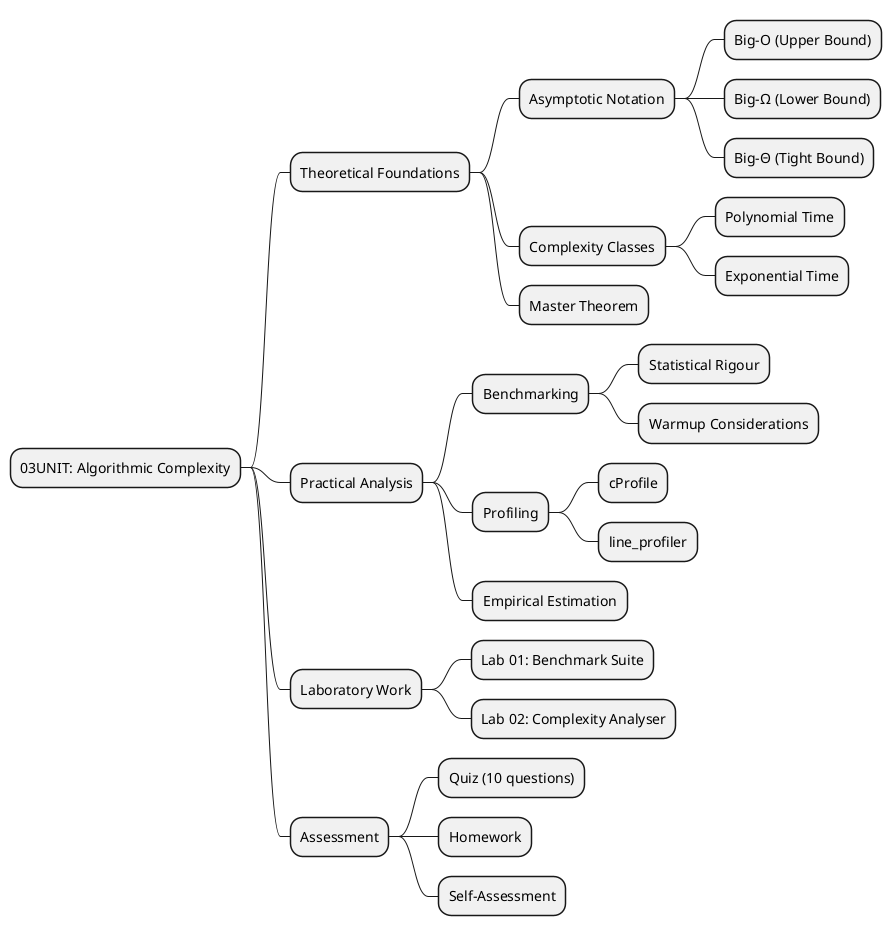
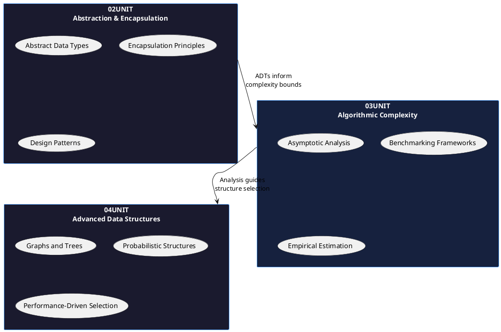
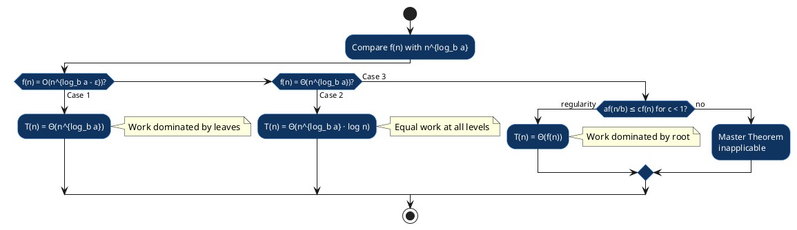
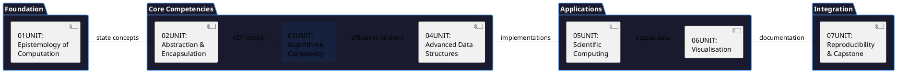

# 03UNIT: Algorithmic Complexity

## The Art of Computational Thinking for Researchers

> **UNIT 03 of 7** | **Bloom Level**: Apply/Analyse | **Est. Time**: 4 hours

---

## 📊 UNIT Architecture



---

## 🔗 Prerequisites and Dependencies

This unit presupposes familiarity with abstract data type design and encapsulation principles established in 02UNIT. The progression from structural abstraction to performance analysis represents a natural pedagogical arc: having learned to construct well-organised software artefacts, researchers must now evaluate their computational efficiency.



**Technical Prerequisites:**
- Python 3.12+ with type annotation proficiency
- Familiarity with logarithmic and exponential functions
- Understanding of statistical measures (mean, median, standard deviation)

---

## 🎯 Learning Objectives

Upon completion of this unit, participants shall demonstrate the following competencies:

| # | Objective | Bloom Level | Lab Coverage | Assessment |
|---|-----------|-------------|--------------|------------|
| 1 | Explain asymptotic notation (O, Ω, Θ) and classify algorithms according to complexity bounds | Understand | Lab 01 §1-2 | Quiz Q1-4 |
| 2 | Implement a benchmarking framework incorporating statistical analysis and warmup protocols | Apply | Lab 01 §3-5 | Homework P1 |
| 3 | Estimate algorithmic complexity through empirical measurement and log-log regression | Analyse | Lab 02 §1-4 | Homework P2 |

---

## 📐 Mathematical Foundations

### Asymptotic Notation

The formal apparatus for characterising algorithmic growth rates comprises three principal asymptotic bounds. Let $f: \mathbb{N} \to \mathbb{R}^+$ and $g: \mathbb{N} \to \mathbb{R}^+$ be functions mapping input size to resource consumption.

**Definition (Big-O — Upper Bound):**

$$f(n) = O(g(n)) \iff \exists\, c > 0,\, n_0 \in \mathbb{N} : f(n) \leq c \cdot g(n),\, \forall n \geq n_0$$

This notation captures the notion that $f$ grows no faster than $g$ asymptotically. The constants $c$ and $n_0$ permit abstraction from machine-dependent factors and small-input behaviour.

**Definition (Big-Ω — Lower Bound):**

$$f(n) = \Omega(g(n)) \iff \exists\, c > 0,\, n_0 \in \mathbb{N} : f(n) \geq c \cdot g(n),\, \forall n \geq n_0$$

**Definition (Big-Θ — Tight Bound):**

$$f(n) = \Theta(g(n)) \iff f(n) = O(g(n)) \land f(n) = \Omega(g(n))$$

### Master Theorem

For recurrence relations of the form $T(n) = aT(n/b) + f(n)$ where $a \geq 1$, $b > 1$, the Master Theorem provides closed-form solutions:



| Case | Condition | Result | Intuition |
|------|-----------|--------|-----------|
| 1 | $f(n) = O(n^{\log_b a - \epsilon})$ | $T(n) = \Theta(n^{\log_b a})$ | Leaf-dominated |
| 2 | $f(n) = \Theta(n^{\log_b a})$ | $T(n) = \Theta(n^{\log_b a} \log n)$ | Balanced |
| 3 | $f(n) = \Omega(n^{\log_b a + \epsilon})$ | $T(n) = \Theta(f(n))$ | Root-dominated |

### Empirical Complexity Estimation

For algorithms exhibiting polynomial growth, the power-law relationship $T(n) = c \cdot n^k$ enables empirical complexity estimation. Applying logarithms:

$$\log T(n) = \log c + k \cdot \log n$$

In log-log space, this becomes a linear equation where the slope $k$ represents the complexity exponent. Linear regression on $(\log n_i, \log T_i)$ pairs yields the estimated complexity class:

- $k \approx 1.0 \Rightarrow O(n)$
- $k \approx 2.0 \Rightarrow O(n^2)$
- $k \approx 1.0$–$1.5$ with sublinear residuals $\Rightarrow O(n \log n)$

---

## 🔬 Research Applications

The theoretical apparatus of complexity analysis finds immediate application across computational research domains:

| Domain | Application | Complexity Consideration |
|--------|-------------|-------------------------|
| Bioinformatics | Sequence alignment (Smith-Waterman vs BLAST) | $O(mn)$ vs heuristic $O(n)$ with sensitivity trade-offs |
| Network Science | Community detection (Louvain algorithm) | $O(n \log n)$ permits analysis of billion-node graphs |
| Machine Learning | Gradient descent convergence | Complexity bounds determine scalability to large datasets |
| Computational Physics | N-body simulation | $O(n^2)$ pairwise vs $O(n \log n)$ Barnes-Hut tree |

The selection of appropriate algorithms depends critically upon understanding these complexity bounds. A $O(n^2)$ alignment algorithm applied to genomic sequences of length $10^9$ would require approximately $10^{18}$ operations—computationally infeasible with current hardware.

---

## 📁 UNIT Structure

```
03UNIT/
├── 📄 README.md                        ← You are here
├── 📚 theory/
│   ├── 03UNIT_slides.html              ← 45+ slides, ~90 min
│   ├── lecture_notes.md                ← 2,500+ words
│   └── learning_objectives.md
├── 🔬 lab/
│   ├── __init__.py
│   ├── lab_03_01_benchmark_suite.py    ← 580+ lines
│   ├── lab_03_02_complexity_analyser.py ← 420+ lines
│   └── solutions/
│       ├── lab_03_01_solution.py
│       └── lab_03_02_solution.py
├── ✏️ exercises/
│   ├── homework.md                     ← Graded assignment
│   ├── practice/                       ← 9 exercises (3 easy, 3 medium, 3 hard)
│   │   ├── easy_01_timing.py
│   │   ├── easy_02_list_operations.py
│   │   ├── easy_03_loop_analysis.py
│   │   ├── medium_01_sorting_benchmark.py
│   │   ├── medium_02_recursion_analysis.py
│   │   ├── medium_03_space_complexity.py
│   │   ├── hard_01_amortised_analysis.py
│   │   ├── hard_02_cache_effects.py
│   │   └── hard_03_complexity_proof.py
│   └── solutions/
├── 📊 assessments/
│   ├── quiz.md                         ← 10 questions
│   ├── rubric.md                       ← Grading criteria
│   └── self_check.md                   ← Self-assessment
├── 📖 resources/
│   ├── cheatsheet.md                   ← A4 reference
│   ├── further_reading.md              ← 10+ resources
│   ├── glossary.md                     ← Terminology
│   └── datasets/
│       └── benchmark_data.csv
├── 🎨 assets/
│   ├── diagrams/
│   │   ├── complexity_hierarchy.puml
│   │   ├── benchmark_architecture.puml
│   │   ├── master_theorem.puml
│   │   ├── complexity_classes.svg
│   │   ├── benchmark_architecture.svg
│   │   └── memory_hierarchy.svg
│   ├── animations/
│   │   └── 03UNIT_sorting_visualiser.html
│   └── images/
├── 🧪 tests/
│   ├── __init__.py
│   ├── conftest.py
│   ├── test_lab_03_01.py
│   └── test_lab_03_02.py
├── scripts/
│   └── validate_unit.py
└── Makefile
```

---

## 💻 Key Algorithms

### Binary Search (Pseudocode)

```pseudocode
ALGORITHM BinarySearch(A[0..n-1], key)
    INPUT: Sorted array A, search key
    OUTPUT: Index of key if found; -1 otherwise
    
    left ← 0
    right ← n - 1
    
    WHILE left ≤ right DO
        mid ← ⌊(left + right) / 2⌋
        
        IF A[mid] = key THEN
            RETURN mid
        ELSE IF A[mid] < key THEN
            left ← mid + 1
        ELSE
            right ← mid - 1
        END IF
    END WHILE
    
    RETURN -1
END ALGORITHM
```

**Complexity Analysis:**

- **Time:** $O(\log n)$ — interval halves each iteration
- **Space:** $O(1)$ — constant auxiliary storage

### Python Implementation

```python
from typing import Sequence, TypeVar

T = TypeVar('T')

def binary_search(arr: Sequence[T], key: T) -> int:
    """
    Locate target within sorted sequence via iterative interval bisection.
    
    Requires the input sequence to satisfy the total ordering invariant.
    
    Args:
        arr: Monotonically non-decreasing sequence with random access.
        key: Element to locate; must be comparable with sequence elements.
    
    Returns:
        Index of key if present; -1 otherwise.
    
    Complexity:
        Time: O(log n) comparisons.
        Space: O(1) auxiliary.
    """
    left, right = 0, len(arr) - 1
    
    while left <= right:
        mid = (left + right) // 2
        if arr[mid] == key:
            return mid
        elif arr[mid] < key:
            left = mid + 1
        else:
            right = mid - 1
    
    return -1
```

---

## 🚀 Quick Start

```bash
# 1. Navigate to UNIT directory
cd 03UNIT

# 2. Verify environment and dependencies
make check

# 3. Run laboratory with demonstration mode
python -m lab.lab_03_01_benchmark_suite --demo

# 4. Execute complexity analyser
python -m lab.lab_03_02_complexity_analyser --demo

# 5. Run test suite
make test

# 6. Validate UNIT structure
python scripts/validate_unit.py 03
```

---

## ✅ Progress Checklist

| Component | Status | Estimated Duration |
|-----------|--------|-------------------|
| Lecture slides viewed | ⬜ | ~90 min |
| Lecture notes read | ⬜ | ~30 min |
| Lab 01: Benchmark Suite | ⬜ | ~45 min |
| Lab 02: Complexity Analyser | ⬜ | ~30 min |
| Easy exercises (3) | ⬜ | ~30 min |
| Medium exercises (3) | ⬜ | ~45 min |
| Hard exercises (3) | ⬜ | ~60 min |
| Quiz completed (≥70%) | ⬜ | ~15 min |
| Self-assessment | ⬜ | ~15 min |

---

## 🔄 UNIT Connections



---

## 📊 Complexity Comparison

The following diagram illustrates the growth rates of common complexity classes:


For input size $n = 10^6$:
- $O(1)$: 1 operation
- $O(\log n)$: ~20 operations
- $O(n)$: $10^6$ operations
- $O(n \log n)$: ~$2 \times 10^7$ operations
- $O(n^2)$: $10^{12}$ operations (~11.5 days at $10^9$ ops/sec)
- $O(2^n)$: computationally infeasible

---

## 📜 Licence and Terms of Use

╔═══════════════════════════════════════════════════════════════════════════════╗
║                           RESTRICTIVE LICENCE                                  ║
║                              Version 3.1.0                                     ║
║                             January 2025                                       ║
╠═══════════════════════════════════════════════════════════════════════════════╣
║                                                                               ║
║   © 2025 Antonio Clim. All rights reserved.                                   ║
║                                                                               ║
║   PERMITTED:                                                                  ║
║   ✓ Personal use for self-study                                               ║
║   ✓ Viewing and running code for personal educational purposes                ║
║   ✓ Local modifications for personal experimentation                          ║
║                                                                               ║
║   PROHIBITED (without prior written consent):                                 ║
║   ✗ Publishing materials (online or offline)                                  ║
║   ✗ Use in formal teaching activities                                         ║
║   ✗ Teaching or presenting materials to third parties                         ║
║   ✗ Redistribution in any form                                                ║
║   ✗ Creating derivative works for public use                                  ║
║   ✗ Commercial use of any kind                                                ║
║                                                                               ║
║   For requests regarding educational use or publication,                      ║
║   please contact the author to obtain written consent.                        ║
║                                                                               ║
╚═══════════════════════════════════════════════════════════════════════════════╝

### Terms and Conditions

1. **Intellectual Property**: All materials, including but not limited to code,
   documentation, presentations and exercises, are the intellectual property of
   Antonio Clim.

2. **No Warranty**: Materials are provided "as is" without warranty of any kind,
   express or implied.

3. **Limitation of Liability**: The author shall not be liable for any damages
   arising from the use of these materials.

4. **Governing Law**: These terms are governed by the laws of Romania.

5. **Contact**: For permissions and enquiries, contact the author through
   official academic channels.

### Technology Stack

| Technology | Version | Purpose |
|------------|---------|---------|
| Python | 3.12+ | Primary programming language |
| NumPy | ≥1.24 | Numerical computing |
| Pandas | ≥2.0 | Data manipulation |
| Matplotlib | ≥3.7 | Static visualisation |
| SciPy | ≥1.11 | Scientific computing |
| pytest | ≥7.0 | Testing framework |
| pytest-cov | ≥4.0 | Coverage reporting |
| ruff | ≥0.1 | Linting and formatting |
| mypy | ≥1.0 | Type checking |
| Docker | 24+ | Containerisation |
| reveal.js | 5.0 | Presentation framework |
| PlantUML | 1.2024+ | Diagram generation |
| D3.js | 7.8+ | Interactive visualisations |

---

*THE ART OF COMPUTATIONAL THINKING FOR RESEARCHERS*
*03UNIT — Algorithmic Complexity*
