# 03UNIT: Algorithmic Complexity

## The Art of Computational Thinking for Researchers

> **UNIT 03 of 7** | **Bloom Level**: Apply/Analyse | **Est. Time**: 4 hours

---

## 1. UNIT Synopsis

### 1.1 Abstract

This unit establishes the theoretical apparatus for rigorous algorithmic analysis—a cornerstone competency for computational researchers across disciplines. The treatment encompasses asymptotic notation, recurrence relations, amortised analysis and empirical complexity estimation, progressing from formal mathematical foundations through practical profiling techniques to evidence-based algorithm selection.

Participants engage with the fundamental question underpinning computational tractability: how does resource consumption (time, space) scale with input magnitude? The asymptotic framework introduced by Bachmann (1894) and refined by Landau provides the vocabulary; the Master Theorem furnishes closed-form solutions for divide-and-conquer recurrences; empirical profiling grounds theoretical predictions in measurable reality.

Laboratory exercises instantiate these concepts through a thorough benchmarking framework supporting statistical analysis, warmup protocols and log-log regression for complexity estimation. The synthesis of theoretical rigour and empirical validation equips researchers to make informed algorithm selections grounded in both asymptotic bounds and practical performance characteristics.

**Keywords**: asymptotic analysis, Big-O notation, complexity classes, benchmarking, profiling, Master Theorem, amortised analysis

**Estimated Duration**: 4 hours (theory: 2h, laboratory: 1.5h, exercises: 0.5h)

**Difficulty Level**: ★★★☆☆ (3/5)

### 1.2 Position in Curriculum


This unit occupies position 3 of 7 in the curriculum sequence. It receives conceptual prerequisites from 02UNIT (Abstract Data Types, Encapsulation) and furnishes foundational material essential for 04UNIT (Advanced Data Structures—performance-driven selection) and subsequent units requiring algorithmic efficiency awareness.

| Dependency Type | Source | Concepts Required |
|-----------------|--------|-------------------|
| Hard prerequisite | 02UNIT | Abstract data types, object-oriented design |
| Soft prerequisite | 01UNIT | Computational models, state transitions |
| Corequisite | None | — |

### 1.3 Pedagogical Rationale

The instructional design follows constructivist principles, scaffolding knowledge acquisition through progressive complexity. The sequence adheres to cognitive progression from comprehension through application to analysis:

**Instructional Strategies Employed:**

1. **Formal Definitions**: Mathematical precision grounds intuition in rigour
2. **Worked Examples**: Demonstrated complexity derivations with explicit reasoning
3. **Empirical Validation**: Profiling confirms (or challenges) theoretical predictions
4. **Transfer Tasks**: Application to research-relevant domains (bioinformatics, network science)
5. **Metacognitive Prompts**: Self-assessment encourages reflection on understanding

---

## 2. Visual Overview

### 2.1 Conceptual Architecture

```plantuml
@startmindmap
* 03UNIT: Algorithmic Complexity
** Theoretical Foundations
*** Asymptotic Notation
**** Big-O (Upper Bound)
**** Big-Ω (Lower Bound)
**** Big-Θ (Tight Bound)
**** Little-o, Little-ω
*** Complexity Classes
**** Polynomial: P
**** Non-deterministic: NP
**** Exponential: EXP
*** Analysis Techniques
**** Sum Rule
**** Product Rule
**** Recurrence Relations
** Master Theorem
*** Case 1: Leaf-dominated
*** Case 2: Balanced
*** Case 3: Root-dominated
** Practical Profiling
*** Timing Mechanisms
**** time.perf_counter()
**** timeit module
*** Profiling Tools
**** cProfile
**** line_profiler
*** Statistical Rigour
**** Warmup protocols
**** Multiple runs
**** Confidence intervals
** Empirical Estimation
*** Log-Log Regression
*** Model Fitting
*** Residual Analysis
** Laboratory Work
*** Lab 01: Benchmark Suite
*** Lab 02: Complexity Analyser
** Assessment
*** Quiz (10 questions)
*** Homework (100 points)
*** Self-Assessment
@endmindmap
```



### 2.2 UNIT Dependencies Graph


### 2.3 Learning Pathway

```mermaid
flowchart TD
    A[Review 02UNIT Concepts] --> B[Read Learning Objectives]
    B --> C[Study Lecture Notes §1-3]
    C --> D[View Slides 1-20]
    D --> E{Inline Quiz 1}
    E -->|Pass| F[Study Lecture Notes §4-6]
    E -->|Review| C
    F --> G[View Slides 21-45]
    G --> H{Inline Quiz 2}
    H -->|Pass| I[Complete Lab 01]
    H -->|Review| F
    I --> J[Complete Lab 02]
    J --> K[Easy Exercises x3]
    K --> L[Medium Exercises x3]
    L --> M{Confidence Check}
    M -->|Ready| N[Hard Exercises x3]
    M -->|Need Review| O[Revisit Theory]
    O --> K
    N --> P[Take Quiz]
    P --> Q{Score ≥70%?}
    Q -->|Yes| R[Self-Assessment]
    Q -->|No| S[Review Weak Areas]
    S --> P
    R --> T[Proceed to 04UNIT]
```



---

## 3. Learning Objectives

### 3.1 Cognitive Objectives

Upon successful completion of this unit, participants shall demonstrate the following competencies:

| ID | Level | Verb | Objective Statement | Assessment |
|----|-------|------|---------------------|------------|
| LO1 | Understand | Explain | Explain asymptotic notation (O, Ω, Θ) and classify algorithms according to complexity bounds | Quiz Q1-4 |
| LO2 | Apply | Implement | Implement a benchmarking framework incorporating statistical analysis and warmup protocols | Lab 01, Homework P1 |
| LO3 | Analyse | Estimate | Estimate algorithmic complexity through empirical measurement and log-log regression | Lab 02, Homework P2 |
| LO4 | Analyse | Compare | Compare the time-space trade-offs of alternative algorithmic approaches | Homework P3 |
| LO5 | Evaluate | Select | Select appropriate algorithms based on complexity analysis and practical constraints | Quiz Q8-10 |

### 3.2 Skill Objectives (Measurable Outcomes)

**Technical Skills:**

| Skill | Proficiency Level | Evidence |
|-------|-------------------|----------|
| Asymptotic analysis | Competent | Quiz score ≥70%, correct complexity classification |
| Benchmarking implementation | Proficient | Lab 01 completion, statistical validity |
| Empirical estimation | Proficient | Lab 02 completion, accurate exponent estimation |
| Profile interpretation | Competent | Identify bottlenecks from cProfile output |

**Transferable Skills:**

- **Analytical Reasoning**: Decompose algorithms into constituent operations for complexity analysis
- **Statistical Thinking**: Apply appropriate statistical measures to empirical timing data
- **Critical Evaluation**: Assess algorithmic solutions against multiple criteria (time, space, simplicity)

### 3.3 Objectives-Assessment Alignment Matrix


---

## 4. Theoretical Foundations

### 4.1 Historical Context

The formal study of computational complexity emerged from foundational work in the mid-twentieth century. The trajectory from abstract computability to quantitative resource analysis reflects the maturation of computer science as a discipline.

| Year | Contributor | Contribution |
|------|-------------|--------------|
| 1894 | Paul Bachmann | Introduced Big-O notation in *Die Analytische Zahlentheorie* |
| 1909 | Edmund Landau | Systematised asymptotic notation in number theory |
| 1936 | Alan Turing | Established computability foundations (Turing machines) |
| 1965 | Hartmanis & Stearns | Introduced computational complexity classes |
| 1971 | Stephen Cook | Formalised NP-completeness (Cook's Theorem) |

The evolution from Bachmann's original notation—intended for number-theoretic asymptotic analysis—to its adoption in algorithm analysis reflects broader recognition that growth rate characterisation transcends specific domains. Hartmanis and Stearns' seminal paper established that time complexity could be meaningfully defined and compared across algorithms, initiating the field of computational complexity theory.

### 4.2 Core Concepts

#### 4.2.1 Asymptotic Notation

The asymptotic family comprises three principal notations, each capturing a distinct relationship between functions.

**Definition 4.1** (Big-O Notation). Let $f, g: \mathbb{N} \to \mathbb{R}^+$ be functions. We write $f(n) = O(g(n))$ if and only if:

$$\exists\, c > 0,\, n_0 \in \mathbb{N} : f(n) \leq c \cdot g(n) \quad \forall n \geq n_0$$

**Intuition**: Big-O provides an asymptotic upper bound. The function $f$ grows no faster than $g$, ignoring constant factors and small-input behaviour.

**Definition 4.2** (Big-Ω Notation). We write $f(n) = \Omega(g(n))$ if and only if:

$$\exists\, c > 0,\, n_0 \in \mathbb{N} : f(n) \geq c \cdot g(n) \quad \forall n \geq n_0$$

**Definition 4.3** (Big-Θ Notation). We write $f(n) = \Theta(g(n))$ if and only if:

$$f(n) = O(g(n)) \land f(n) = \Omega(g(n))$$

**Example 4.1**: Consider $f(n) = 3n^2 + 2n + 1$. We claim $f(n) = O(n^2)$.

*Proof*: For $n \geq 1$, observe that $3n^2 + 2n + 1 \leq 3n^2 + 2n^2 + n^2 = 6n^2$. Taking $c = 6$ and $n_0 = 1$ satisfies the definition. ∎

#### 4.2.2 Complexity Classes

Complexity classes partition computational problems by resource requirements:

| Class | Characterisation | Example Problems |
|-------|------------------|------------------|
| $O(1)$ | Constant time | Array access, hash lookup |
| $O(\log n)$ | Logarithmic | Binary search, balanced BST operations |
| $O(n)$ | Linear | Linear scan, single-pass algorithms |
| $O(n \log n)$ | Linearithmic | Merge sort, heap sort |
| $O(n^2)$ | Quadratic | Bubble sort, all-pairs comparison |
| $O(2^n)$ | Exponential | Subset enumeration, brute-force TSP |

### 4.3 Mathematical Framework

#### Analysis Techniques

**Sum Rule**: For sequential operations:

$$O(f(n)) + O(g(n)) = O(\max(f(n), g(n)))$$

**Product Rule**: For nested operations:

$$O(f(n)) \times O(g(n)) = O(f(n) \times g(n))$$

#### The Master Theorem

**Theorem 4.1** (Master Theorem). For recurrences of the form:

$$T(n) = aT\left(\frac{n}{b}\right) + f(n)$$

where $a \geq 1$, $b > 1$, and $f(n)$ is asymptotically positive, the solution is:

| Case | Condition | Result |
|------|-----------|--------|
| 1 | $f(n) = O(n^{\log_b a - \epsilon})$ for some $\epsilon > 0$ | $T(n) = \Theta(n^{\log_b a})$ |
| 2 | $f(n) = \Theta(n^{\log_b a})$ | $T(n) = \Theta(n^{\log_b a} \log n)$ |
| 3 | $f(n) = \Omega(n^{\log_b a + \epsilon})$ and $af(n/b) \leq cf(n)$ for $c < 1$ | $T(n) = \Theta(f(n))$ |

**Example 4.2** (Merge Sort): The recurrence $T(n) = 2T(n/2) + \Theta(n)$ has $a = 2$, $b = 2$, yielding $n^{\log_2 2} = n$. Since $f(n) = \Theta(n) = \Theta(n^{\log_b a})$, Case 2 applies: $T(n) = \Theta(n \log n)$.

### 4.4 Master Theorem Decision Flow


### 4.5 Empirical Complexity Estimation

For algorithms exhibiting polynomial growth $T(n) = c \cdot n^k$, logarithmic transformation yields:

$$\log T(n) = \log c + k \cdot \log n$$

In log-log space, this relationship becomes linear with slope $k$. Linear regression on $(\log n_i, \log T_i)$ pairs estimates the complexity exponent:

$$\hat{k} = \frac{\sum_{i}(\log n_i - \overline{\log n})(\log T_i - \overline{\log T})}{\sum_{i}(\log n_i - \overline{\log n})^2}$$

---

## 5. Algorithmic Content

### 5.1 Algorithm Catalogue

| Algorithm | Problem | Time Complexity | Space Complexity | Stability |
|-----------|---------|-----------------|------------------|-----------|
| Binary Search | Sorted lookup | $O(\log n)$ | $O(1)$ | N/A |
| Merge Sort | Comparison sort | $\Theta(n \log n)$ | $O(n)$ | Stable |
| Quick Sort | Comparison sort | $O(n \log n)$ avg, $O(n^2)$ worst | $O(\log n)$ | Unstable |
| Heap Sort | Comparison sort | $\Theta(n \log n)$ | $O(1)$ | Unstable |
| Timsort | Adaptive sort | $O(n \log n)$ worst, $O(n)$ best | $O(n)$ | Stable |

### 5.2 Pseudocode: Binary Search

```
ALGORITHM BinarySearch(A[0..n-1], key)
━━━━━━━━━━━━━━━━━━━━━━━━━━━━━━━━━━━━━━━━━━━━━━━━━━━━━━━━━━━━━━━━━━━━━━━━━━
INPUT:  A — sorted array of n comparable elements
        key — element to locate
OUTPUT: Index of key if found; -1 otherwise
━━━━━━━━━━━━━━━━━━━━━━━━━━━━━━━━━━━━━━━━━━━━━━━━━━━━━━━━━━━━━━━━━━━━━━━━━━

PRECONDITIONS:
    • A is sorted in non-decreasing order
    • Elements of A are comparable with key

POSTCONDITIONS:
    • Returns i such that A[i] = key, or -1 if key ∉ A

━━━━━━━━━━━━━━━━━━━━━━━━━━━━━━━━━━━━━━━━━━━━━━━━━━━━━━━━━━━━━━━━━━━━━━━━━━

1   left ← 0
2   right ← n - 1
3   
4   WHILE left ≤ right DO
5   │   mid ← ⌊(left + right) / 2⌋
6   │   
7   │   IF A[mid] = key THEN
8   │   │   RETURN mid
9   │   ELSE IF A[mid] < key THEN
10  │   │   left ← mid + 1
11  │   ELSE
12  │   │   right ← mid - 1
13  │   END IF
14  END WHILE
15  
16  RETURN -1

━━━━━━━━━━━━━━━━━━━━━━━━━━━━━━━━━━━━━━━━━━━━━━━━━━━━━━━━━━━━━━━━━━━━━━━━━━
COMPLEXITY: Time O(log n), Space O(1)
INVARIANT:  If key ∈ A, then key ∈ A[left..right]
━━━━━━━━━━━━━━━━━━━━━━━━━━━━━━━━━━━━━━━━━━━━━━━━━━━━━━━━━━━━━━━━━━━━━━━━━━
```

### 5.3 Python Implementation

```python
from typing import Sequence, TypeVar

T = TypeVar('T')

def binary_search(arr: Sequence[T], key: T) -> int:
    """
    Locate target within sorted sequence via iterative interval bisection.
    
    Implements the classical binary search algorithm, reducing the search
    space by half at each iteration through comparison with the median
    element. Requires the input sequence to satisfy the total ordering
    invariant; behaviour is undefined otherwise.
    
    Args:
        arr: Monotonically non-decreasing sequence supporting random access.
        key: Element to locate; must be comparable with sequence elements.
    
    Returns:
        Index of key if present; -1 otherwise.
    
    Complexity:
        Time: O(log n) comparisons in worst case.
        Space: O(1) auxiliary.
    
    Example:
        >>> binary_search([1, 3, 5, 7, 9], 5)
        2
        >>> binary_search([1, 3, 5, 7, 9], 4)
        -1
    """
    left, right = 0, len(arr) - 1
    
    while left <= right:
        mid = (left + right) // 2
        if arr[mid] == key:
            return mid
        elif arr[mid] < key:
            left = mid + 1
        else:
            right = mid - 1
    
    return -1
```

---

## 6. Practical Applications

### 6.1 Research Domain Examples

| Domain | Application | Complexity Consideration |
|--------|-------------|-------------------------|
| Bioinformatics | Sequence alignment (Smith-Waterman vs BLAST) | $O(mn)$ optimal vs $O(n)$ heuristic with sensitivity trade-offs |
| Network Science | Community detection (Louvain algorithm) | $O(n \log n)$ permits analysis of billion-node graphs |
| Machine Learning | Gradient descent convergence | Complexity bounds determine scalability to large datasets |
| Computational Physics | N-body simulation | $O(n^2)$ pairwise vs $O(n \log n)$ Barnes-Hut tree |

### 6.2 Case Study: Genomic Sequence Search

**Context**: A bioinformatician must search for motifs within a genome containing $10^9$ base pairs.

**Challenge**: Naïve string matching ($O(nm)$ where $m$ is pattern length) would require $\sim 10^{12}$ operations for reasonable pattern lengths.

**Solution**: The Boyer-Moore algorithm, with $O(n/m)$ best-case complexity, enables sublinear search by skipping sections of the text. For genomic applications, suffix arrays ($O(m \log n)$ search after $O(n)$ construction) or FM-indices ($O(m)$ search after $O(n)$ construction) provide even greater efficiency.

**Results**: Search time reduced from hours to seconds for typical query patterns.

**Lessons**: Algorithm selection based on complexity analysis transforms computationally infeasible problems into tractable ones.

---

## 7. Laboratory Guide

### 7.1 Lab Overview

| Lab | Title | Duration | Primary Objective | Difficulty |
|-----|-------|----------|-------------------|------------|
| 01 | Benchmark Suite | 45 min | LO2: Implement benchmarking framework | ★★★☆☆ |
| 02 | Complexity Analyser | 30 min | LO3: Estimate complexity empirically | ★★★★☆ |

### 7.2 Lab 01: Benchmark Suite

**Synopsis**: This laboratory instantiates the theoretical framework from Section 4 in executable Python code, focusing on statistically rigorous performance measurement.

**Key Components:**
- `Timer` context manager for precise measurements
- `BenchmarkResult` dataclass for statistical aggregation
- `BenchmarkSuite` class orchestrating multiple algorithms
- Log-log regression for complexity estimation

**Learning Trajectory**: Theory §4.4 → Lab §1-3 (timing) → Lab §4 (statistics) → Lab §5 (integration)

### 7.3 Lab 02: Complexity Analyser

**Synopsis**: Building upon Lab 01's timing infrastructure, this laboratory implements automated complexity classification through empirical measurement and model fitting.

**Key Components:**
- Multiple growth models (linear, quadratic, logarithmic, linearithmic)
- Least-squares curve fitting
- Residual analysis for model selection
- Confidence interval estimation

---

## 8. Exercise Framework

### 8.1 Difficulty Progression

```
Easy (★☆☆☆☆)        → Direct application of single concept
    ↓                   (timing, basic analysis)
Medium (★★★☆☆)      → Combination of 2-3 concepts
    ↓                   (sorting comparison, recursion)
Hard (★★★★★)        → Novel synthesis, optimisation required
                        (amortised analysis, cache effects)
```

### 8.2 Exercise-Objective Mapping

| Exercise | Objectives | Concepts | Estimated Time |
|----------|------------|----------|----------------|
| easy_01_timing | LO2 | perf_counter, basic timing | 10 min |
| easy_02_list_operations | LO1 | List complexity analysis | 10 min |
| easy_03_loop_analysis | LO1, LO3 | Nested loop complexity | 15 min |
| medium_01_sorting_benchmark | LO2, LO3 | Algorithm comparison | 20 min |
| medium_02_recursion_analysis | LO1, LO3 | Recurrence relations | 20 min |
| medium_03_space_complexity | LO1, LO4 | Space trade-offs | 25 min |
| hard_01_amortised_analysis | LO3, LO4 | Dynamic arrays | 30 min |
| hard_02_cache_effects | LO4, LO5 | Memory hierarchy | 35 min |
| hard_03_complexity_proof | LO1, LO5 | Formal proofs | 40 min |

---

## 9. Technical Reference

### 9.1 Key Functions and Classes

| Component | Module | Purpose |
|-----------|--------|---------|
| `Timer` | lab_03_01 | Context manager for precise timing |
| `BenchmarkResult` | lab_03_01 | Statistical aggregation of measurements |
| `BenchmarkSuite` | lab_03_01 | Orchestrate multi-algorithm comparisons |
| `ComplexityEstimator` | lab_03_02 | Empirical complexity classification |
| `LogLogRegressor` | lab_03_02 | Linear regression in log-log space |

### 9.2 Error Handling Patterns

```python
class BenchmarkError(Exception):
    """Base exception for benchmarking errors."""
    pass

class InsufficientDataError(BenchmarkError):
    """Raised when insufficient data points for regression."""
    pass

class TimingPrecisionError(BenchmarkError):
    """Raised when timing precision is insufficient."""
    pass
```

---

## 10. Visual Assets Catalogue

### 10.1 Diagrams Index

| Diagram | Type | Location | Purpose |
|---------|------|----------|---------|
| complexity_hierarchy.puml | PlantUML | assets/diagrams/ | Complexity class relationships |
| benchmark_architecture.puml | PlantUML | assets/diagrams/ | Framework component diagram |
| master_theorem.puml | PlantUML | assets/diagrams/ | Decision tree for Master Theorem |
| complexity_classes.svg | SVG | assets/diagrams/ | Growth rate comparison chart |
| benchmark_architecture.svg | SVG | assets/diagrams/ | Rendered framework diagram |
| memory_hierarchy.svg | SVG | assets/diagrams/ | Cache/memory latency visualisation |

### 10.2 Interactive Demos

| Demo | Location | Description |
|------|----------|-------------|
| 03UNIT_sorting_visualiser.html | assets/animations/ | Interactive sorting with timing metrics |

---

## 11. Assessment Framework

### 11.1 Formative Assessment

- Inline quizzes within lecture slides (2 quizzes, 5 questions each)
- Self-check exercises with immediate feedback
- Lab completion with automated verification

### 11.2 Summative Assessment

- **Quiz**: 10 questions (6 multiple choice, 4 short answer), 15 minutes
- **Homework**: 3 parts + bonus, 100 points total, ~3 hours
- **Pass threshold**: Quiz ≥70%, Homework ≥60%

---

## 12. Connections and Context

### 12.1 Prerequisites Deep Dive

From **02UNIT** (Abstraction and Encapsulation):
- Abstract data types inform interface design for benchmarking classes
- Strategy pattern enables pluggable algorithm comparison
- Encapsulation principles guide timer implementation

### 12.2 Forward References

Concepts from this unit prepare for:
- **04UNIT**: Complexity analysis guides data structure selection (hash tables vs trees)
- **05UNIT**: Performance profiling essential for scientific computing optimisation
- **07UNIT**: Benchmarking contributes to reproducibility standards

### 12.3 Cross-UNIT Concept Map


---

## 13. Quick Start Guide

### 13.1 Environment Setup

```bash
# Verify Python version (requires 3.12+)
python3 --version

# Install dependencies
pip install numpy scipy matplotlib pytest pytest-cov

# Optional: Install Numba for JIT compilation demos
pip install numba
```

### 13.2 Verification Commands

```bash
# Navigate to UNIT directory
cd 03UNIT

# Verify environment and dependencies
make check

# Run laboratory with demonstration mode
python -m lab.lab_03_01_benchmark_suite --demo

# Execute complexity analyser
python -m lab.lab_03_02_complexity_analyser --demo

# Run test suite
make test

# Validate UNIT structure
python scripts/validate_unit.py 03
```

### 13.3 First Steps

1. Read `theory/learning_objectives.md` (5 min)
2. Review `theory/lecture_notes.md` sections 1-3 (20 min)
3. Open `theory/03UNIT_slides.html` in browser (45 min)
4. Complete Lab 01 exercises in `lab/lab_03_01_benchmark_suite.py` (45 min)

---

## 14. Directory Structure

```
03UNIT/
├── 📄 README.md                        ← You are here
├── 📄 CHANGELOG.md                     ← Version history
├── 📄 Makefile                         ← Build automation
│
├── 📚 theory/
│   ├── 03UNIT_slides.html              ← 45+ slides, ~90 min
│   ├── lecture_notes.md                ← 2,500+ words
│   └── learning_objectives.md          ← Measurable objectives
│
├── 🔬 lab/
│   ├── __init__.py                     ← Package initialisation
│   ├── lab_03_01_benchmark_suite.py    ← 580+ lines, benchmarking framework
│   ├── lab_03_02_complexity_analyser.py ← 420+ lines, empirical estimation
│   └── solutions/
│       ├── lab_03_01_solution.py
│       └── lab_03_02_solution.py
│
├── ✏️ exercises/
│   ├── homework.md                     ← Graded assignment (100 pts)
│   ├── practice/                       ← 9 exercises (3 easy, 3 medium, 3 hard)
│   │   ├── easy_01_timing.py
│   │   ├── easy_02_list_operations.py
│   │   ├── easy_03_loop_analysis.py
│   │   ├── medium_01_sorting_benchmark.py
│   │   ├── medium_02_recursion_analysis.py
│   │   ├── medium_03_space_complexity.py
│   │   ├── hard_01_amortised_analysis.py
│   │   ├── hard_02_cache_effects.py
│   │   └── hard_03_complexity_proof.py
│   └── solutions/
│       └── *.py
│
├── 📊 assessments/
│   ├── quiz.md                         ← 10 questions
│   ├── rubric.md                       ← Grading criteria
│   └── self_check.md                   ← Self-assessment
│
├── 📖 resources/
│   ├── cheatsheet.md                   ← A4 quick reference
│   ├── further_reading.md              ← 15+ annotated resources
│   ├── glossary.md                     ← 25+ term definitions
│   └── datasets/
│       └── benchmark_data.csv          ← Sample timing data
│
├── 🎨 assets/
│   ├── diagrams/
│   │   ├── complexity_hierarchy.puml
│   │   ├── benchmark_architecture.puml
│   │   ├── master_theorem.puml
│   │   ├── complexity_classes.svg
│   │   ├── benchmark_architecture.svg
│   │   └── memory_hierarchy.svg
│   ├── animations/
│   │   └── 03UNIT_sorting_visualiser.html
│   └── images/
│
├── 🧪 tests/
│   ├── __init__.py
│   ├── conftest.py                     ← Shared fixtures
│   ├── test_lab_03_01.py               ← Benchmark suite tests
│   └── test_lab_03_02.py               ← Complexity analyser tests
│
└── 📜 scripts/
    └── validate_unit.py                ← Structure validation
```

---

## 15. Progress Checklist

| Component | Status | Estimated Duration |
|-----------|--------|-------------------|
| Learning objectives reviewed | ⬜ | 5 min |
| Lecture notes read (§1-3) | ⬜ | 20 min |
| Lecture slides viewed (1-20) | ⬜ | 30 min |
| Inline quiz 1 passed | ⬜ | 5 min |
| Lecture notes read (§4-6) | ⬜ | 20 min |
| Lecture slides viewed (21-45) | ⬜ | 30 min |
| Inline quiz 2 passed | ⬜ | 5 min |
| Lab 01: Benchmark Suite | ⬜ | 45 min |
| Lab 02: Complexity Analyser | ⬜ | 30 min |
| Easy exercises (3) | ⬜ | 30 min |
| Medium exercises (3) | ⬜ | 45 min |
| Hard exercises (3) | ⬜ | 60 min |
| Quiz completed (≥70%) | ⬜ | 15 min |
| Self-assessment reflection | ⬜ | 15 min |

**Total Estimated Time**: ~5.5 hours

---

## 16. Troubleshooting

### 16.1 Common Issues

| Issue | Cause | Solution |
|-------|-------|----------|
| `ModuleNotFoundError: numpy` | Missing dependency | `pip install numpy` |
| Inconsistent timing results | System load, GC | Use warmup runs, disable GC during measurement |
| Log-log regression yields negative slope | Insufficient data range | Increase input size range (10× minimum) |
| `MemoryError` on large inputs | Insufficient RAM | Reduce maximum input size or use generators |

### 16.2 Frequently Asked Questions

**Q: Why does my empirically measured complexity differ from theory?**
A: Constant factors, cache effects and JIT compilation can significantly affect practical performance. Theory provides asymptotic bounds; practice involves real hardware.

**Q: How many runs should I average for reliable measurements?**
A: Minimum 10 runs; 30+ for high-precision results. Report median and interquartile range rather than mean.

**Q: Why is my O(n log n) algorithm measuring as O(n)?**
A: Input sizes may be too small for the logarithmic factor to dominate. Increase n by 10-100×.

### 16.3 Getting Help

1. Review lecture notes sections relevant to your question
2. Check glossary for unfamiliar terminology
3. Consult further reading resources
4. Contact course instructor through official academic channels

---

## 17. Further Reading

### 17.1 Foundational Texts

- Cormen, T. H., Leiserson, C. E., Rivest, R. L., & Stein, C. (2022). *Introduction to Algorithms* (4th ed.). MIT Press. — Chapters 2-4 cover asymptotic notation and divide-and-conquer analysis.

- Sedgewick, R., & Wayne, K. (2011). *Algorithms* (4th ed.). Addison-Wesley. — Accessible treatment with Java implementations.

- Knuth, D. E. (1997). *The Art of Computer Programming, Vol. 1: Fundamental Algorithms* (3rd ed.). Addison-Wesley. — Thorough mathematical treatment.

### 17.2 Research Papers

- Hartmanis, J., & Stearns, R. E. (1965). On the computational complexity of algorithms. *Transactions of the American Mathematical Society*, 117, 285-306. — Foundational paper establishing complexity classes.

- Cook, S. A. (1971). The complexity of theorem-proving procedures. *Proceedings of the Third Annual ACM Symposium on Theory of Computing*, 151-158. — Introduced NP-completeness.

### 17.3 Practical Resources

- Gorelick, M., & Ozsvald, I. (2020). *High Performance Python* (2nd ed.). O'Reilly Media. — Python-specific profiling and optimisation techniques.

- Drepper, U. (2007). *What Every Programmer Should Know About Memory*. — Essential reading on memory hierarchy effects.

---

## 18. Glossary

**Amortised Analysis**: Technique for analysing average operation cost over a sequence, accounting for occasional expensive operations balanced by many cheap ones.

**Asymptotic Notation**: Mathematical notation (O, Ω, Θ) characterising function growth rates as input approaches infinity.

**Big-O Notation**: Upper bound on growth rate; f(n) = O(g(n)) means f grows no faster than g asymptotically.

**Big-Ω Notation**: Lower bound on growth rate; f(n) = Ω(g(n)) means f grows at least as fast as g asymptotically.

**Big-Θ Notation**: Tight bound; f(n) = Θ(g(n)) means f and g grow at the same rate asymptotically.

**Complexity Class**: Set of problems requiring similar computational resources (e.g., P, NP, PSPACE).

**Log-Log Plot**: Graph with logarithmic scales on both axes; power-law relationships appear linear.

**Master Theorem**: Closed-form solution for divide-and-conquer recurrences of the form T(n) = aT(n/b) + f(n).

**Profiling**: Empirical measurement of program execution to identify performance bottlenecks.

**Recurrence Relation**: Equation defining a function in terms of its values at smaller inputs.

**Warmup**: Initial executions discarded from measurements to account for JIT compilation and cache warming.

---

## 📜 Licence and Terms of Use

╔═══════════════════════════════════════════════════════════════════════════════╗
║                           RESTRICTIVE LICENCE                                  ║
║                              Version 3.2.0                                     ║
║                             January 2025                                       ║
╠═══════════════════════════════════════════════════════════════════════════════╣
║                                                                               ║
║   © 2025 Antonio Clim. All rights reserved.                                   ║
║                                                                               ║
║   PERMITTED:                                                                  ║
║   ✓ Personal use for self-study                                               ║
║   ✓ Viewing and running code for personal educational purposes                ║
║   ✓ Local modifications for personal experimentation                          ║
║                                                                               ║
║   PROHIBITED (without prior written consent):                                 ║
║   ✗ Publishing materials (online or offline)                                  ║
║   ✗ Use in formal teaching activities                                         ║
║   ✗ Teaching or presenting materials to third parties                         ║
║   ✗ Redistribution in any form                                                ║
║   ✗ Creating derivative works for public use                                  ║
║   ✗ Commercial use of any kind                                                ║
║                                                                               ║
║   For requests regarding educational use or publication,                      ║
║   please contact the author to obtain written consent.                        ║
║                                                                               ║
╚═══════════════════════════════════════════════════════════════════════════════╝

### Terms and Conditions

1. **Intellectual Property**: All materials, including but not limited to code,
   documentation, presentations and exercises, are the intellectual property of
   Antonio Clim.

2. **No Warranty**: Materials are provided "as is" without warranty of any kind,
   express or implied.

3. **Limitation of Liability**: The author shall not be liable for any damages
   arising from the use of these materials.

4. **Governing Law**: These terms are governed by the laws of Romania.

5. **Contact**: For permissions and enquiries, contact the author through
   official academic channels.

### Technology Stack

| Technology | Version | Purpose |
|------------|---------|---------|
| Python | 3.12+ | Primary programming language |
| NumPy | ≥1.24 | Numerical computing |
| Pandas | ≥2.0 | Data manipulation |
| Matplotlib | ≥3.7 | Static visualisation |
| SciPy | ≥1.11 | Scientific computing |
| pytest | ≥7.0 | Testing framework |
| pytest-cov | ≥4.0 | Coverage reporting |
| ruff | ≥0.1 | Linting and formatting |
| mypy | ≥1.0 | Type checking |
| Docker | 24+ | Containerisation |
| reveal.js | 5.0 | Presentation framework |
| PlantUML | 1.2024+ | Diagram generation |
| D3.js | 7.8+ | Interactive visualisations |

---

*THE ART OF COMPUTATIONAL THINKING FOR RESEARCHERS*
*03UNIT — Algorithmic Complexity*
