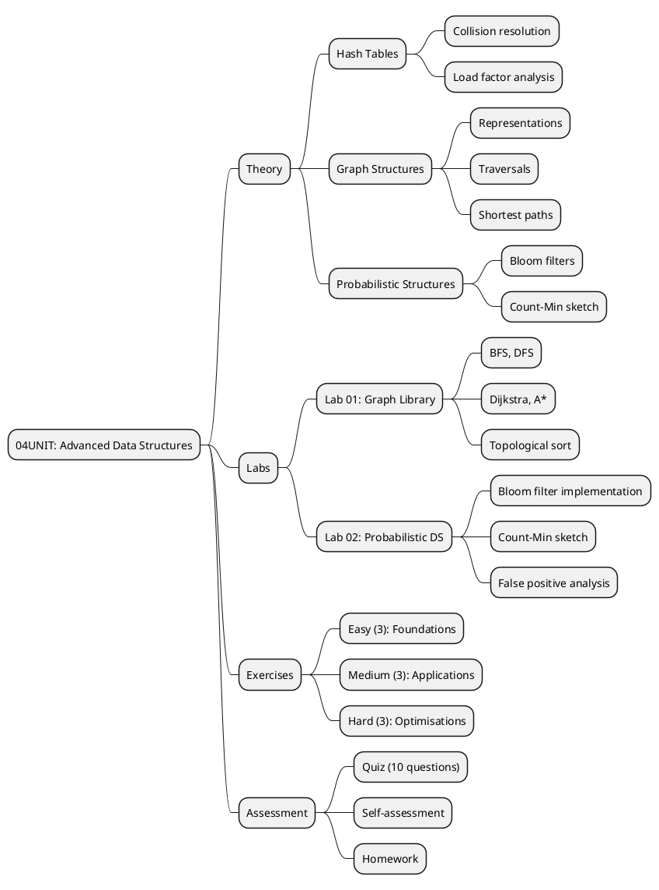
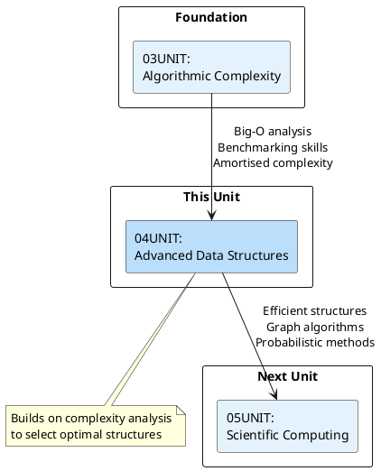
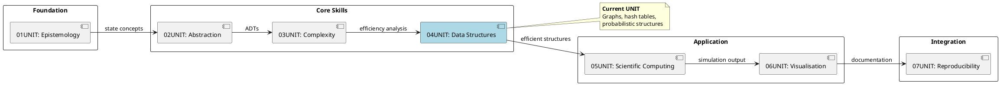

# 04UNIT: Advanced Data Structures

## The Art of Computational Thinking for Researchers

> **UNIT 04 of 7** | **Bloom Level**: Analyse/Evaluate | **Est. Time**: 10 hours

---

## 📊 UNIT Architecture



---

## 🎯 Learning Objectives

Upon completion of this unit, participants will demonstrate the following competencies:

| # | Objective | Bloom Level | Lab Coverage | Assessment |
|---|-----------|-------------|--------------|------------|
| 1 | Implement graph data structures with common traversal and shortest-path algorithms | [Apply] | Lab 01, §1-4 | Quiz Q1-4, Homework P1 |
| 2 | Select appropriate data structures based on computational requirements and memory constraints | [Analyse] | Labs 01-02 | Quiz Q5-7, Self-check |
| 3 | Evaluate trade-offs between probabilistic and deterministic structures in terms of space, time and accuracy | [Evaluate] | Lab 02, §3-4 | Quiz Q8-10, Homework P2 |

---

## 🔗 Prerequisites and Connections



### Builds Upon (03UNIT)

The complexity analysis foundations from 03UNIT enable reasoned selection among
data structures. Understanding Big-O notation permits direct comparison of hash
table O(1) lookup against tree-based O(log n) operations. Amortised analysis,
introduced for dynamic arrays, reappears in hash table resizing. The benchmarking
framework developed previously facilitates empirical validation of theoretical
complexity bounds.

### Prepares For (05UNIT)

Graph structures introduced here underpin agent-based modelling in 05UNIT, where
agents navigate network topologies. Efficient data structures enable large-scale
Monte Carlo simulations by reducing per-iteration overhead. Probabilistic methods
such as Bloom filters connect conceptually to variance reduction techniques in
numerical integration.

---

## 📐 Mathematical Foundations

### Hash Table Analysis

The expected number of probes for successful search in a hash table with open
addressing and load factor α satisfies:

$$
E[\text{probes}] \approx \frac{1}{2}\left(1 + \frac{1}{1-\alpha}\right)
$$

For chaining, the expected chain length equals α, yielding O(1 + α) lookup.

### Bloom Filter False Positive Rate

Given a Bloom filter with m bits, k hash functions and n inserted elements,
the probability of a false positive is approximately:

$$
P(\text{false positive}) \approx \left(1 - e^{-kn/m}\right)^k
$$

The optimal number of hash functions minimises this probability:

$$
k_{\text{opt}} = \frac{m}{n} \ln 2
$$

### Graph Complexity Summary

| Algorithm | Time Complexity | Space Complexity | Notes |
|-----------|-----------------|------------------|-------|
| BFS | O(V + E) | O(V) | Queue-based, level-order |
| DFS | O(V + E) | O(V) | Stack-based, depth-first |
| Dijkstra | O((V + E) log V) | O(V) | Non-negative weights |
| A* | O(E) | O(V) | Admissible heuristic required |
| Topological Sort | O(V + E) | O(V) | DAG only |

---

## 💻 Key Algorithms

### Dijkstra's Algorithm (Pseudocode)

```pseudocode
ALGORITHM Dijkstra(G, source)
    INPUT: Weighted graph G = (V, E), source vertex s
    OUTPUT: Distance array dist[], predecessor array pred[]
    
    FOR EACH vertex v IN V DO
        dist[v] ← ∞
        pred[v] ← NIL
    END FOR
    
    dist[source] ← 0
    Q ← priority queue containing all vertices
    
    WHILE Q is not empty DO
        u ← EXTRACT-MIN(Q)
        
        FOR EACH neighbour v of u DO
            alt ← dist[u] + weight(u, v)
            IF alt < dist[v] THEN
                dist[v] ← alt
                pred[v] ← u
                DECREASE-KEY(Q, v, alt)
            END IF
        END FOR
    END WHILE
    
    RETURN dist, pred
END ALGORITHM
```

### Python Implementation

```python
def dijkstra(
    graph: Graph[N, float],
    source: N
) -> tuple[dict[N, float], dict[N, N | None]]:
    """
    Compute single-source shortest paths via Dijkstra's algorithm.
    
    Implements priority queue optimisation using a binary heap.
    Requires non-negative edge weights; behaviour undefined otherwise.
    
    Args:
        graph: Weighted graph with non-negative edge weights.
        source: Starting vertex for path computation.
    
    Returns:
        Tuple of (distances, predecessors) dictionaries.
    
    Complexity:
        Time: O((V + E) log V) with binary heap.
        Space: O(V) for distance and predecessor arrays.
    """
    dist: dict[N, float] = {v: math.inf for v in graph.nodes}
    pred: dict[N, N | None] = {v: None for v in graph.nodes}
    dist[source] = 0.0
    
    pq: list[tuple[float, N]] = [(0.0, source)]
    visited: set[N] = set()
    
    while pq:
        d, u = heapq.heappop(pq)
        if u in visited:
            continue
        visited.add(u)
        
        for edge in graph.neighbours(u):
            v, w = edge.target, edge.weight
            if dist[u] + w < dist[v]:
                dist[v] = dist[u] + w
                pred[v] = u
                heapq.heappush(pq, (dist[v], v))
    
    return dist, pred
```

---

## 📁 UNIT Structure

```
04UNIT/
├── 📄 README.md                    ← You are here
├── 📄 Makefile                     ← Build automation
│
├── 📚 theory/
│   ├── 04UNIT_slides.html          ← 45 slides, ~90 min
│   ├── lecture_notes.md            ← 2,000+ words
│   └── learning_objectives.md      ← Measurable outcomes
│
├── 🔬 lab/
│   ├── __init__.py
│   ├── lab_04_01_graph_library.py  ← 1,078 lines
│   ├── lab_04_02_probabilistic_ds.py ← 561 lines
│   └── solutions/
│       ├── lab_04_01_solution.py
│       └── lab_04_02_solution.py
│
├── ✏️ exercises/
│   ├── homework.md                 ← Main assignment
│   ├── practice/                   ← 9 exercises
│   │   ├── easy_01_graph_construction.py
│   │   ├── easy_02_hash_set.py
│   │   ├── easy_03_bfs.py
│   │   ├── medium_01_cycle_detection.py
│   │   ├── medium_02_topological_sort.py
│   │   ├── medium_03_binary_heap.py
│   │   ├── hard_01_dijkstra.py
│   │   ├── hard_02_a_star.py
│   │   └── hard_03_count_min_sketch.py
│   └── solutions/
│
├── 📝 assessments/
│   ├── quiz.md                     ← 10 questions
│   ├── rubric.md                   ← Grading criteria
│   └── self_check.md               ← Self-assessment
│
├── 📖 resources/
│   ├── cheatsheet.md               ← One-page reference
│   ├── further_reading.md          ← 10+ resources
│   ├── glossary.md                 ← Terminology
│   └── datasets/                   ← Sample data
│
├── 🎨 assets/
│   ├── diagrams/                   ← 3 PlantUML, 3 SVG
│   │   ├── graph_representations.puml
│   │   ├── bfs_dfs_comparison.puml
│   │   ├── bloom_filter_architecture.puml
│   │   ├── graph_representations.svg
│   │   ├── bfs_vs_dfs.svg
│   │   └── count_min_sketch.svg
│   ├── animations/
│   │   ├── 04UNIT_graph_traversal.html
│   │   └── 04UNIT_graph_visualiser.html
│   └── images/
│       └── 04UNIT_badge.svg
│
└── 🧪 tests/
    ├── __init__.py
    ├── conftest.py                 ← Fixtures
    ├── test_lab_04_01.py           ← Graph tests
    └── test_lab_04_02.py           ← Probabilistic tests
```

---

## 🚀 Quick Start

```bash
# 1. Navigate to UNIT directory
cd 04UNIT

# 2. Verify environment
make check

# 3. Install dependencies
pip install networkx matplotlib numpy mmh3 pytest pytest-cov --break-system-packages

# 4. Run labs with demo mode
python -m lab.lab_04_01_graph_library --demo
python -m lab.lab_04_02_probabilistic_ds --demo

# 5. Execute tests with coverage
make test

# 6. Validate structure
python ../scripts/validate_unit.py 04
```

---

## ✅ Progress Checklist

| Component | Status | Estimated Duration |
|-----------|--------|-------------------|
| Lecture slides reviewed | ⬜ | ~90 min |
| Lecture notes read | ⬜ | ~45 min |
| Lab 01: Graph Library completed | ⬜ | ~120 min |
| Lab 02: Probabilistic DS completed | ⬜ | ~90 min |
| Easy exercises (3) completed | ⬜ | ~45 min |
| Medium exercises (3) completed | ⬜ | ~60 min |
| Hard exercises (3) completed | ⬜ | ~90 min |
| Quiz passed (≥70%) | ⬜ | ~20 min |
| Self-assessment completed | ⬜ | ~15 min |
| Homework submitted | ⬜ | ~180 min |

**Total Estimated Time**: ~10 hours

---

## 🔄 UNIT Connections



---

## 📊 Research Applications

| Domain | Application | Relevant Structure |
|--------|-------------|-------------------|
| **Social Networks** | Community detection, influence propagation | Graphs (BFS/DFS) |
| **Bioinformatics** | Protein interaction networks, sequence assembly | Directed graphs |
| **Big Data** | Approximate membership testing | Bloom filters |
| **Databases** | Query optimisation, cache validation | Hash tables |
| **Network Routing** | Shortest path computation | Dijkstra, A* |
| **Stream Processing** | Frequency estimation | Count-Min sketch |
| **Build Systems** | Dependency resolution | Topological sort |
| **Recommendation** | Similarity computation | Min-hash, LSH |

---

## 📈 Complexity Quick Reference

```plantuml
@startuml
skinparam backgroundColor transparent

title Data Structure Operation Complexity

|= Structure |= Insert |= Delete |= Search |= Space |
| Hash Table (avg) | O(1) | O(1) | O(1) | O(n) |
| Hash Table (worst) | O(n) | O(n) | O(n) | O(n) |
| Binary Heap | O(log n) | O(log n) | O(n) | O(n) |
| BST (balanced) | O(log n) | O(log n) | O(log n) | O(n) |
| Bloom Filter | O(k) | — | O(k) | O(m) |
| Count-Min | O(k) | — | O(k) | O(w×d) |

legend right
  k = number of hash functions
  m = bit array size
  w = width, d = depth
endlegend
@enduml
```

---

## 🧮 Key Formulae

### Bloom Filter Sizing

For desired false positive rate p with n elements:

$$
m = -\frac{n \ln p}{(\ln 2)^2}
$$

$$
k = \frac{m}{n} \ln 2 = -\log_2 p
$$

### Count-Min Sketch Error Bounds

With width w and depth d, for any item with true count c:

$$
\hat{c} \leq c + \frac{N}{w}
$$

with probability at least $1 - e^{-d}$, where N is total stream size.

### Amortised Hash Table Analysis

For a hash table doubling on resize, the amortised cost of n insertions:

$$
\text{Total cost} = n + \sum_{i=0}^{\lfloor \log_2 n \rfloor} 2^i = n + 2n - 1 = O(n)
$$

Amortised cost per insertion: O(1).

---

## 📚 Contents Overview

### Theory (`theory/`)

| File | Description |
|------|-------------|
| [04UNIT_slides.html](theory/04UNIT_slides.html) | Interactive reveal.js presentation (45+ slides) |
| [lecture_notes.md](theory/lecture_notes.md) | Detailed lecture notes (2,000+ words) |
| [learning_objectives.md](theory/learning_objectives.md) | Measurable learning outcomes |

### Laboratory (`lab/`)

| File | Lines | Description |
|------|-------|-------------|
| [lab_04_01_graph_library.py](lab/lab_04_01_graph_library.py) | 1,078 | Graph implementation and algorithms |
| [lab_04_02_probabilistic_ds.py](lab/lab_04_02_probabilistic_ds.py) | 561 | Bloom filters, Count-Min sketch |

### Exercises (`exercises/`)

| Difficulty | Files | Topics |
|------------|-------|--------|
| Easy | 3 | Graph construction, hash sets, BFS |
| Medium | 3 | Cycle detection, topological sort, heaps |
| Hard | 3 | Dijkstra, A*, Count-Min sketch |

### Resources (`resources/`)

| File | Description |
|------|-------------|
| [cheatsheet.md](resources/cheatsheet.md) | One-page A4 reference |
| [further_reading.md](resources/further_reading.md) | 10+ academic resources |
| [glossary.md](resources/glossary.md) | UNIT terminology |

---

## 📜 Licence and Terms of Use

╔═══════════════════════════════════════════════════════════════════════════════╗
║                           RESTRICTIVE LICENCE                                  ║
║                              Version 3.1.0                                     ║
║                             January 2025                                       ║
╠═══════════════════════════════════════════════════════════════════════════════╣
║                                                                               ║
║   © 2025 Antonio Clim. All rights reserved.                                   ║
║                                                                               ║
║   PERMITTED:                                                                  ║
║   ✓ Personal use for self-study                                               ║
║   ✓ Viewing and running code for personal educational purposes                ║
║   ✓ Local modifications for personal experimentation                          ║
║                                                                               ║
║   PROHIBITED (without prior written consent):                                 ║
║   ✗ Publishing materials (online or offline)                                  ║
║   ✗ Use in formal teaching activities                                         ║
║   ✗ Teaching or presenting materials to third parties                         ║
║   ✗ Redistribution in any form                                                ║
║   ✗ Creating derivative works for public use                                  ║
║   ✗ Commercial use of any kind                                                ║
║                                                                               ║
║   For requests regarding educational use or publication,                      ║
║   please contact the author to obtain written consent.                        ║
║                                                                               ║
╚═══════════════════════════════════════════════════════════════════════════════╝

### Terms and Conditions

1. **Intellectual Property**: All materials, including but not limited to code,
   documentation, presentations and exercises, are the intellectual property of
   Antonio Clim.

2. **No Warranty**: Materials are provided "as is" without warranty of any kind,
   express or implied.

3. **Limitation of Liability**: The author shall not be liable for any damages
   arising from the use of these materials.

4. **Governing Law**: These terms are governed by the laws of Romania.

5. **Contact**: For permissions and enquiries, contact the author through
   official academic channels.

### Technology Stack

| Technology | Version | Purpose |
|------------|---------|---------|
| Python | 3.12+ | Primary programming language |
| NumPy | ≥1.24 | Numerical computing |
| Pandas | ≥2.0 | Data manipulation |
| Matplotlib | ≥3.7 | Static visualisation |
| SciPy | ≥1.11 | Scientific computing |
| NetworkX | ≥3.0 | Graph algorithms |
| mmh3 | ≥4.0 | MurmurHash3 for Bloom filters |
| pytest | ≥7.0 | Testing framework |
| pytest-cov | ≥4.0 | Coverage reporting |
| ruff | ≥0.1 | Linting and formatting |
| mypy | ≥1.0 | Type checking |
| Docker | 24+ | Containerisation |
| reveal.js | 5.0 | Presentation framework |
| D3.js | 7.8+ | Interactive visualisations |
| PlantUML | 1.2024+ | Diagram generation |

---
