# 04UNIT: Advanced Data Structures

## The Art of Computational Thinking for Researchers

> **UNIT 04 of 7** | **Bloom Level**: Analyse/Evaluate | **Est. Time**: 10 hours

---

## 1. UNIT Synopsis

### 1.1 Abstract

This UNIT establishes the theoretical and practical foundations of advanced data structures—graphs, hash tables, trees and probabilistic structures—that form the computational substrate upon which scalable research software is constructed. Through systematic examination of representation choices, algorithmic complexity and space-time trade-offs, participants develop proficiency in selecting and implementing structures appropriate to specific computational requirements.

The treatment progresses from fundamental hash table mechanics through graph representations and traversal algorithms to probabilistic data structures that sacrifice exactness for dramatic efficiency gains. Laboratory exercises instantiate theoretical constructs in executable Python implementations, whilst assessments verify attainment of specified learning outcomes across cognitive domains spanning application through evaluation.

**Keywords**: graphs, hash tables, Bloom filters, Count-Min sketch, probabilistic data structures, graph traversal, shortest paths, topological ordering

**Estimated Duration**: 10 hours (theory: 2.5h, laboratory: 3.5h, exercises: 4h)

**Difficulty Level**: ★★★★☆ (4/5)

### 1.2 Position in Curriculum


This UNIT occupies position 04 of 7 in the curriculum sequence. It receives conceptual prerequisites from 03UNIT (Algorithmic Complexity) and furnishes foundational material essential for 05UNIT (Scientific Computing).

| Dependency Type | Source | Concepts Required |
|-----------------|--------|-------------------|
| Hard prerequisite | 03UNIT | Big-O analysis, amortised complexity, benchmarking |
| Soft prerequisite | 02UNIT | Abstract data types, encapsulation principles |
| Corequisite | None | — |

### 1.3 Pedagogical Rationale

The instructional design follows constructivist principles, scaffolding knowledge acquisition through progressive complexity. The sequence adheres to Bloom's revised taxonomy, initiating at the Application stratum and culminating in Evaluation activities. This positioning reflects the expectation that participants possess prior familiarity with complexity analysis, enabling immediate engagement with implementation and analysis tasks.

**Instructional Strategies Employed:**

1. **Worked Examples**: Graph algorithms demonstrated with explicit state transitions
2. **Cognitive Apprenticeship**: Trade-off analysis made visible through comparative benchmarks
3. **Deliberate Practice**: Targeted exercises addressing specific algorithmic subskills
4. **Metacognitive Prompts**: Self-assessment questions requiring justification of design choices
5. **Transfer Tasks**: Application to novel research contexts including social network analysis and bioinformatics

---

## 2. Visual Overview

### 2.1 Conceptual Architecture

The following diagram depicts the hierarchical organisation of concepts addressed in this UNIT, illustrating taxonomic relationships and dependency structures.


### 2.2 UNIT Dependencies Graph

Formal specification of prerequisite relationships and knowledge transfer pathways between curriculum units.


### 2.3 Learning Pathway

Sequential activity diagram specifying the recommended traversal of UNIT materials for optimal knowledge construction.

```plantuml
@startuml
!theme plain
skinparam backgroundColor #1a1a2e
skinparam defaultFontColor #eaeaea
skinparam ActivityBackgroundColor #2d2d44
skinparam ActivityBorderColor #4a9eff

|Preparation|
start
:Review 03UNIT complexity concepts;
:Verify environment setup;
:Install dependencies (networkx, mmh3);

|Theory|
:Read learning objectives;
:Study lecture notes §1-2 (Hash Tables);
:View slides 1-15;
:Complete inline quiz 1;
:Study lecture notes §3 (Graphs);
:View slides 16-35;
:Complete inline quiz 2;
:Study lecture notes §4 (Probabilistic);
:View slides 36-45;
:Complete inline quiz 3;

|Laboratory|
:Complete Lab 01: Graph Library;
note right
  ~120 minutes
  Focus: BFS, DFS,
  Dijkstra, A*,
  Topological Sort
end note
:Review Lab 01 solution;
:Complete Lab 02: Probabilistic DS;
note right
  ~90 minutes
  Focus: Bloom filters,
  Count-Min sketch
end note

|Practice|
:Easy exercises (3);
:Medium exercises (3);
if (Confident?) then (yes)
  :Hard exercises (3);
else (no)
  :Review theory;
  :Retry medium exercises;
endif

|Assessment|
:Complete quiz (10 questions);
:Self-assessment reflection;
if (Score >= 70%) then (pass)
  :Complete homework;
  :Proceed to 05UNIT;
  stop
else (retry)
  :Review weak areas;
  :Retake quiz;
endif
@enduml
```



---

## 3. Learning Objectives

### 3.1 Cognitive Objectives

Upon successful completion of this UNIT, participants will demonstrate the ability to:

| ID | Level | Verb | Objective Statement | Assessment |
|----|-------|------|---------------------|------------|
| LO1 | Apply | Implement | Implement graph data structures with adjacency list representation and common traversal algorithms | Lab 01, Quiz Q1-4 |
| LO2 | Analyse | Select | Select appropriate data structures based on computational requirements, memory constraints and access patterns | Quiz Q5-7, Self-check |
| LO3 | Evaluate | Compare | Evaluate trade-offs between probabilistic and deterministic structures in terms of space, time and accuracy guarantees | Lab 02, Homework P2 |
| LO4 | Apply | Compute | Compute shortest paths using Dijkstra's algorithm and A* search with admissible heuristics | Lab 01, Quiz Q3-4 |
| LO5 | Analyse | Estimate | Estimate false positive rates for Bloom filters and error bounds for Count-Min sketches | Lab 02, Quiz Q8-10 |

### 3.2 Skill Objectives (Measurable Outcomes)

**Technical Skills:**

| Skill | Proficiency Level | Evidence |
|-------|-------------------|----------|
| Graph implementation | Competent | Lab 01 completion, test coverage ≥80% |
| Algorithm selection | Proficient | Homework justifications accepted |
| Probabilistic analysis | Advanced | Correct derivation of false positive rates |

**Transferable Skills:**

- **Analytical Reasoning**: Decompose graph problems into tractable algorithmic subproblems
- **Technical Communication**: Document algorithmic choices with complexity justifications
- **Critical Evaluation**: Assess data structure fitness against multiple criteria simultaneously

### 3.3 Affective Objectives

- Appreciate the elegance of probabilistic methods that trade exactness for efficiency
- Value rigorous complexity analysis as the foundation for informed engineering decisions
- Develop intellectual curiosity regarding emerging approximate data structures

### 3.4 Objectives-Assessment Alignment Matrix


---

## 4. Theoretical Foundations

### 4.1 Historical Context

Graph theory traces its origins to Leonhard Euler's 1736 analysis of the Königsberg bridge problem, establishing the impossibility of traversing each bridge exactly once. This foundational work inaugurated the study of vertices and edges as abstract mathematical objects independent of geometric embedding.

Hash tables emerged from the work of Hans Peter Luhn at IBM in 1953, who devised the chaining collision resolution scheme. The subsequent development of open addressing by Peterson (1957) and the analysis of expected performance by Knuth (1963) established the theoretical foundations upon which modern implementations rest.

Probabilistic data structures represent a more recent development, with Burton Bloom's 1970 filter providing space-efficient set membership testing at the cost of false positives. The Count-Min sketch, introduced by Cormode and Muthukrishnan in 2005, extends probabilistic methods to frequency estimation in data streams.

| Year | Contributor | Contribution |
|------|-------------|--------------|
| 1736 | Euler | Graph theory foundations (Königsberg bridges) |
| 1953 | Luhn | Hash table chaining |
| 1957 | Peterson | Open addressing |
| 1959 | Dijkstra | Single-source shortest paths algorithm |
| 1968 | Hart, Nilsson, Raphael | A* search algorithm |
| 1970 | Bloom | Bloom filter for set membership |
| 2005 | Cormode, Muthukrishnan | Count-Min sketch for frequency estimation |

### 4.2 Core Concepts

#### 4.2.1 Graph Representation

**Definition 4.1** (Graph). A graph $G = (V, E)$ consists of a finite set $V$ of vertices and a set $E \subseteq V \times V$ of edges. A graph is directed if $(u, v) \in E$ does not imply $(v, u) \in E$; otherwise it is undirected.

**Definition 4.2** (Weighted Graph). A weighted graph augments $G$ with a weight function $w: E \rightarrow \mathbb{R}$, assigning numerical costs to edges.

**Intuition**: Graphs model pairwise relationships—social connections, road networks, dependency structures. The choice between directed and undirected representations reflects whether the relationship is symmetric.

#### 4.2.2 Hash Table Mechanics

**Definition 4.3** (Hash Function). A hash function $h: U \rightarrow \{0, 1, \ldots, m-1\}$ maps keys from universe $U$ to indices in a table of size $m$.

**Definition 4.4** (Load Factor). The load factor $\alpha = n/m$ is the ratio of stored elements $n$ to table size $m$.

#### 4.2.3 Probabilistic Set Membership

**Definition 4.5** (Bloom Filter). A Bloom filter is a bit array of $m$ bits, initially all zero, supporting insertion and membership queries via $k$ independent hash functions $h_1, \ldots, h_k$.

### 4.3 Mathematical Framework

**Asymptotic Notation:**

| Notation | Name | Definition |
|----------|------|------------|
| $O(f(n))$ | Big-O | $\exists c, n_0: T(n) \leq c \cdot f(n), \forall n \geq n_0$ |
| $\Omega(f(n))$ | Big-Omega | $\exists c, n_0: T(n) \geq c \cdot f(n), \forall n \geq n_0$ |
| $\Theta(f(n))$ | Big-Theta | $T(n) = O(f(n)) \land T(n) = \Omega(f(n))$ |

**Graph Notation:**

| Symbol | Meaning |
|--------|---------|
| $V$ | Vertex set |
| $E$ | Edge set |
| $\|V\|$ or $n$ | Number of vertices |
| $\|E\|$ or $m$ | Number of edges |
| $\text{deg}(v)$ | Degree of vertex $v$ |
| $\delta(G)$ | Minimum degree |
| $\Delta(G)$ | Maximum degree |

### 4.4 Formal Definitions and Theorems

**Theorem 4.1** (Bloom Filter False Positive Rate). For a Bloom filter with $m$ bits, $k$ hash functions and $n$ inserted elements, the probability of a false positive is:

$$
P(\text{false positive}) = \left(1 - \left(1 - \frac{1}{m}\right)^{kn}\right)^k \approx \left(1 - e^{-kn/m}\right)^k
$$

*Proof Sketch*. After inserting $n$ elements, each bit remains zero with probability $(1 - 1/m)^{kn}$. A false positive occurs when all $k$ hash functions map a non-member to set bits, which happens with probability $(1 - (1-1/m)^{kn})^k$. The approximation follows from $(1 - 1/m)^m \approx e^{-1}$ for large $m$. ∎

**Corollary 4.1** (Optimal Hash Function Count). The false positive rate is minimised when:

$$
k_{\text{opt}} = \frac{m}{n} \ln 2 \approx 0.693 \frac{m}{n}
$$

**Theorem 4.2** (Dijkstra Correctness). Given a weighted graph $G = (V, E, w)$ with non-negative edge weights and source vertex $s$, Dijkstra's algorithm correctly computes single-source shortest paths.

*Proof Sketch*. The proof proceeds by induction on the number of vertices removed from the priority queue. The invariant maintained is that for any vertex $u$ removed from the queue, $\text{dist}[u]$ equals the shortest path distance from $s$ to $u$. Non-negativity of edge weights ensures that once a vertex is processed, no shorter path can be discovered. ∎

### 4.5 Complexity Results

**Proposition 4.1** (Hash Table Expected Performance). For a hash table with chaining and load factor $\alpha$, the expected time for successful search is $\Theta(1 + \alpha/2)$, and for unsuccessful search is $\Theta(1 + \alpha)$.

**Proposition 4.2** (Graph Algorithm Complexities). For a graph with $|V| = n$ vertices and $|E| = m$ edges:

| Algorithm | Time | Space | Constraint |
|-----------|------|-------|------------|
| BFS | $O(n + m)$ | $O(n)$ | Unweighted |
| DFS | $O(n + m)$ | $O(n)$ | — |
| Dijkstra (binary heap) | $O((n + m) \log n)$ | $O(n)$ | Non-negative weights |
| Dijkstra (Fibonacci heap) | $O(m + n \log n)$ | $O(n)$ | Non-negative weights |
| A* | $O(m)$ to $O(b^d)$ | $O(b^d)$ | Admissible heuristic |
| Topological Sort | $O(n + m)$ | $O(n)$ | DAG only |

---

## 5. Algorithmic Content

### 5.1 Algorithm Catalogue

| Algorithm | Problem | Time Complexity | Space Complexity |
|-----------|---------|-----------------|-----------------|
| BFS | Level-order traversal, shortest path (unweighted) | $O(V + E)$ | $O(V)$ |
| DFS | Connectivity, cycle detection, topological sort | $O(V + E)$ | $O(V)$ |
| Dijkstra | Single-source shortest path (non-negative) | $O((V+E) \log V)$ | $O(V)$ |
| A* | Heuristic shortest path | $O(E)$ best case | $O(V)$ |
| Topological Sort | Dependency ordering | $O(V + E)$ | $O(V)$ |
| Bloom Insert | Set membership (insert) | $O(k)$ | — |
| Bloom Query | Set membership (query) | $O(k)$ | — |

### 5.2 Pseudocode Specifications

#### Algorithm: Dijkstra's Single-Source Shortest Paths

```
ALGORITHM Dijkstra(G, source)
━━━━━━━━━━━━━━━━━━━━━━━━━━━━━━━━━━━━━━━━━━━━━━━━━━━━━━━━━━━━━━━━━━━━━━━━━━
INPUT:  G = (V, E, w) — weighted graph with non-negative weights
        source ∈ V — starting vertex
OUTPUT: dist — distance array, pred — predecessor array
━━━━━━━━━━━━━━━━━━━━━━━━━━━━━━━━━━━━━━━━━━━━━━━━━━━━━━━━━━━━━━━━━━━━━━━━━━

PRECONDITIONS:
    • ∀(u,v) ∈ E: w(u,v) ≥ 0
    • source ∈ V

POSTCONDITIONS:
    • dist[v] = shortest path distance from source to v
    • Following pred pointers reconstructs shortest path

━━━━━━━━━━━━━━━━━━━━━━━━━━━━━━━━━━━━━━━━━━━━━━━━━━━━━━━━━━━━━━━━━━━━━━━━━━

1   FOR EACH v ∈ V DO                          ▷ Initialisation
2   │   dist[v] ← ∞
3   │   pred[v] ← NIL
4   END FOR
5   
6   dist[source] ← 0
7   Q ← PRIORITY-QUEUE(V, dist)                ▷ Min-heap by distance
8   
9   WHILE Q ≠ ∅ DO                             ▷ Main loop
10  │   u ← EXTRACT-MIN(Q)
11  │   
12  │   FOR EACH (u, v) ∈ E DO                 ▷ Relaxation
13  │   │   alt ← dist[u] + w(u, v)
14  │   │   IF alt < dist[v] THEN
15  │   │   │   dist[v] ← alt
16  │   │   │   pred[v] ← u
17  │   │   │   DECREASE-KEY(Q, v, alt)
18  │   │   END IF
19  │   END FOR
20  END WHILE
21  
22  RETURN dist, pred

━━━━━━━━━━━━━━━━━━━━━━━━━━━━━━━━━━━━━━━━━━━━━━━━━━━━━━━━━━━━━━━━━━━━━━━━━━
COMPLEXITY: Time O((V + E) log V), Space O(V)
INVARIANT:  For any v removed from Q, dist[v] is the true shortest distance
━━━━━━━━━━━━━━━━━━━━━━━━━━━━━━━━━━━━━━━━━━━━━━━━━━━━━━━━━━━━━━━━━━━━━━━━━━
```

#### Algorithm: Bloom Filter Operations

```
ALGORITHM BloomInsert(B, k, item)
━━━━━━━━━━━━━━━━━━━━━━━━━━━━━━━━━━━━━━━━━━━━━━━━━━━━━━━━━━━━━━━━━━━━━━━━━━
INPUT:  B[0..m-1] — bit array
        k — number of hash functions
        item — element to insert
OUTPUT: Modified bit array B
━━━━━━━━━━━━━━━━━━━━━━━━━━━━━━━━━━━━━━━━━━━━━━━━━━━━━━━━━━━━━━━━━━━━━━━━━━

1   FOR i ← 1 TO k DO
2   │   index ← h_i(item) MOD m
3   │   B[index] ← 1
4   END FOR

━━━━━━━━━━━━━━━━━━━━━━━━━━━━━━━━━━━━━━━━━━━━━━━━━━━━━━━━━━━━━━━━━━━━━━━━━━

ALGORITHM BloomQuery(B, k, item) → Boolean
━━━━━━━━━━━━━━━━━━━━━━━━━━━━━━━━━━━━━━━━━━━━━━━━━━━━━━━━━━━━━━━━━━━━━━━━━━

1   FOR i ← 1 TO k DO
2   │   index ← h_i(item) MOD m
3   │   IF B[index] = 0 THEN
4   │   │   RETURN FALSE                       ▷ Definitely not present
5   │   END IF
6   END FOR
7   RETURN TRUE                                ▷ Possibly present

━━━━━━━━━━━━━━━━━━━━━━━━━━━━━━━━━━━━━━━━━━━━━━━━━━━━━━━━━━━━━━━━━━━━━━━━━━
COMPLEXITY: Time O(k), Space O(1) per operation
━━━━━━━━━━━━━━━━━━━━━━━━━━━━━━━━━━━━━━━━━━━━━━━━━━━━━━━━━━━━━━━━━━━━━━━━━━
```

### 5.3 Python Implementation Pattern

```python
def dijkstra(
    graph: Graph[N, float],
    source: N
) -> tuple[dict[N, float], dict[N, N | None]]:
    """
    Compute single-source shortest paths via Dijkstra's algorithm.
    
    Implements priority queue optimisation using a binary heap. The algorithm
    maintains the invariant that vertices extracted from the queue have their
    final shortest-path distances computed. Requires non-negative edge weights;
    behaviour undefined otherwise.
    
    Args:
        graph: Weighted graph with non-negative edge weights.
        source: Starting vertex for path computation.
    
    Returns:
        Tuple of (distances, predecessors) dictionaries enabling both
        distance queries and path reconstruction.
    
    Complexity:
        Time: O((V + E) log V) with binary heap.
        Space: O(V) for distance and predecessor arrays.
    
    Raises:
        ValueError: If source not in graph.
        RuntimeError: If negative edge weight encountered.
    
    Example:
        >>> g = Graph()
        >>> g.add_edge("A", "B", 4)
        >>> g.add_edge("B", "C", 3)
        >>> dist, pred = dijkstra(g, "A")
        >>> dist["C"]
        7
    
    Note:
        For graphs with negative edges, use Bellman-Ford instead.
        For dense graphs, consider matrix-based Floyd-Warshall.
    """
    dist: dict[N, float] = {v: math.inf for v in graph.nodes}
    pred: dict[N, N | None] = {v: None for v in graph.nodes}
    dist[source] = 0.0
    
    pq: list[tuple[float, N]] = [(0.0, source)]
    visited: set[N] = set()
    
    while pq:
        d, u = heapq.heappop(pq)
        if u in visited:
            continue
        visited.add(u)
        
        for edge in graph.neighbours(u):
            v, w = edge.target, edge.weight
            if w < 0:
                raise RuntimeError(f"Negative edge weight: {u} -> {v}")
            if dist[u] + w < dist[v]:
                dist[v] = dist[u] + w
                pred[v] = u
                heapq.heappush(pq, (dist[v], v))
    
    return dist, pred
```

---

## 6. Practical Applications

### 6.1 Research Domain Examples

| Domain | Problem | Technique from UNIT | Reference |
|--------|---------|---------------------|-----------|
| Social Networks | Community detection, influence propagation | Graph traversal (BFS/DFS) | Girvan & Newman (2002) |
| Bioinformatics | Protein interaction networks | Directed graphs, connectivity | Barabási & Oltvai (2004) |
| Big Data | Approximate set membership | Bloom filters | Bloom (1970) |
| Databases | Cache invalidation | Hash tables | — |
| Navigation | Route planning | Dijkstra, A* | Hart et al. (1968) |
| Stream Processing | Frequency estimation | Count-Min sketch | Cormode & Muthukrishnan (2005) |
| Build Systems | Dependency resolution | Topological sort | — |

### 6.2 Case Study: Social Network Community Detection

**Context**: Given a social network with millions of users, identify tightly-connected communities for targeted content delivery.

**Challenge**: Graph traversal at scale requires efficient representation and algorithm selection.

**Solution**: BFS-based level-set expansion from seed users, combined with Bloom filters for visited-set membership testing, reduces memory footprint by 80% compared to hash-set approaches.

```python
def community_expansion(
    graph: Graph[int, float],
    seed: int,
    max_hops: int = 3
) -> set[int]:
    """
    Expand community from seed user via bounded BFS.
    
    Uses Bloom filter for visited tracking to reduce memory usage
    in large-scale social networks.
    """
    visited = BloomFilter(expected_items=100_000, fp_rate=0.01)
    community: set[int] = {seed}
    frontier: deque[tuple[int, int]] = deque([(seed, 0)])
    visited.add(seed)
    
    while frontier:
        user, depth = frontier.popleft()
        if depth >= max_hops:
            continue
        
        for neighbour in graph.neighbours(user):
            if neighbour.target not in visited:
                visited.add(neighbour.target)
                community.add(neighbour.target)
                frontier.append((neighbour.target, depth + 1))
    
    return community
```

**Results**: Processing 10M-edge social graph in under 30 seconds with 256MB memory budget.

### 6.3 Case Study: Real-Time Stream Frequency Estimation

**Context**: Monitor trending hashtags in a social media stream processing 100,000 posts per second.

**Challenge**: Exact counting requires unbounded memory; top-k identification needs frequency estimates.

**Solution**: Count-Min sketch provides frequency estimates with bounded error, enabling top-k extraction with configurable accuracy.

---

## 7. Laboratory Guide

### 7.1 Lab Overview

| Lab | Title | Duration | Primary Objective | Difficulty |
|-----|-------|----------|-------------------|------------|
| 01 | Graph Library | 120 min | LO1, LO4: Implement graphs and shortest paths | ★★★☆☆ |
| 02 | Probabilistic DS | 90 min | LO3, LO5: Implement Bloom filters, Count-Min | ★★★★☆ |

### 7.2 Lab 01: Graph Library

**Synopsis**: This laboratory instantiates graph-theoretic concepts in executable Python code, progressing from basic adjacency list representation through traversal algorithms to shortest-path computation. The implementation emphasises type safety, algorithmic correctness and empirical validation against reference implementations.

**Learning Trajectory**:


**Key Files**:
- `lab/lab_04_01_graph_library.py` — Main laboratory module (1,077 lines)
- `lab/solutions/lab_04_01_solution.py` — Reference implementation

**Sections**:
1. Core Data Structures: Edge, Graph classes
2. Traversal Algorithms: BFS, DFS implementations
3. Shortest Paths: Dijkstra with binary heap
4. Advanced: A* search, topological ordering
5. Validation: Comparison with NetworkX

### 7.3 Lab 02: Probabilistic Data Structures

**Synopsis**: This laboratory explores probabilistic data structures that sacrifice exactness for dramatic efficiency gains. Participants implement Bloom filters and Count-Min sketches, analyse false positive rates empirically and theoretically, and apply these structures to realistic research scenarios.

**Key Files**:
- `lab/lab_04_02_probabilistic_ds.py` — Main laboratory module (561 lines)
- `lab/solutions/lab_04_02_solution.py` — Reference implementation

**Sections**:
1. Hash Functions: MurmurHash3 usage
2. Bloom Filters: Implementation and analysis
3. Count-Min Sketch: Stream frequency estimation
4. Applications: Cache membership, frequency tracking

### 7.4 Integration Points

Lab 01 and Lab 02 connect through hash function usage—both graph hashing for visited sets and Bloom filter hashing employ similar techniques. The exercises progressively combine concepts, culminating in hard exercises that integrate graph algorithms with probabilistic structures.

---

## 8. Exercise Framework

### 8.1 Difficulty Progression

```
Easy (★☆☆☆☆)        → Direct application of single concept
    ↓                  - Graph construction
    ↓                  - Hash set basics
    ↓                  - BFS implementation
    ↓
Medium (★★★☆☆)      → Combination of 2-3 concepts
    ↓                  - Cycle detection
    ↓                  - Topological sort
    ↓                  - Binary heap
    ↓
Hard (★★★★★)        → Novel synthesis, optimisation required
                       - Dijkstra optimisation
                       - A* with heuristics
                       - Count-Min sketch
```

### 8.2 Exercise-Objective Mapping

| Exercise | Objectives | Concepts | Time |
|----------|------------|----------|------|
| easy_01_graph_construction | LO1 | Adjacency list | 15 min |
| easy_02_hash_set | LO2 | Hash tables | 15 min |
| easy_03_bfs | LO1, LO4 | BFS traversal | 15 min |
| medium_01_cycle_detection | LO1, LO2 | DFS, visited sets | 20 min |
| medium_02_topological_sort | LO1, LO2 | DAGs, ordering | 20 min |
| medium_03_binary_heap | LO2, LO4 | Heaps, priority queues | 25 min |
| hard_01_dijkstra | LO4, LO2 | Shortest paths | 30 min |
| hard_02_a_star | LO4, LO3 | Heuristic search | 35 min |
| hard_03_count_min_sketch | LO3, LO5 | Probabilistic DS | 40 min |

### 8.3 Self-Assessment Criteria

After completing exercises, evaluate your understanding:

- Can you explain why Dijkstra requires non-negative weights?
- Can you derive the optimal number of hash functions for a Bloom filter?
- Can you identify when A* degenerates to Dijkstra?
- Can you bound the error of a Count-Min sketch query?

---

## 9. Technical Reference

### 9.1 API Documentation Summary

**Graph Class**:
- `add_node(node: N) -> None` — Add vertex
- `add_edge(source: N, target: N, weight: W = 1) -> None` — Add edge
- `neighbours(node: N) -> Iterator[Edge[N, W]]` — Adjacent edges
- `nodes() -> Iterator[N]` — All vertices
- `edges() -> Iterator[Edge[N, W]]` — All edges

**Bloom Filter**:
- `add(item: T) -> None` — Insert element
- `__contains__(item: T) -> bool` — Membership query
- `false_positive_rate() -> float` — Estimated FP rate

**Count-Min Sketch**:
- `add(item: T, count: int = 1) -> None` — Increment count
- `estimate(item: T) -> int` — Estimated frequency

### 9.2 Data Structures

```python
@dataclass(frozen=True)
class Edge(Generic[N, W]):
    source: N
    target: N
    weight: W = 1

class Graph(Generic[N, W]):
    _adjacency: dict[N, list[Edge[N, W]]]
    _directed: bool
```

### 9.3 Error Handling Patterns

```python
# Validate non-negative weights
if weight < 0:
    raise ValueError(f"Negative weight not permitted: {weight}")

# Validate vertex existence
if node not in self._adjacency:
    raise KeyError(f"Node not found: {node}")

# Validate DAG for topological sort
if self.has_cycle():
    raise ValueError("Topological sort requires acyclic graph")
```

---

## 10. Visual Assets Catalogue

### 10.1 Diagrams Index

| File | Type | Description |
|------|------|-------------|
| `graph_representations.puml` | PlantUML | Adjacency list vs matrix comparison |
| `bfs_dfs_comparison.puml` | PlantUML | Traversal state diagrams |
| `bloom_filter_architecture.puml` | PlantUML | Hash function distribution |
| `graph_representations.svg` | SVG | Rendered graph representations |
| `bfs_vs_dfs.svg` | SVG | Traversal visualisation |
| `count_min_sketch.svg` | SVG | Sketch structure |
| `dijkstra_step_by_step.svg` | SVG | Algorithm animation frames |
| `false_positive_rates.svg` | SVG | Bloom filter probability curves |

### 10.2 Animations Index

| File | Framework | Description |
|------|-----------|-------------|
| `04UNIT_graph_visualiser.html` | D3.js | Force-directed graph visualisation |
| `04UNIT_graph_traversal.html` | D3.js | BFS/DFS step-through animation |

### 10.3 Interactive Demos

The main interactive demonstration (`04UNIT_graph_visualiser.html`) provides:
- Dynamic node/edge addition
- Algorithm visualisation (BFS, DFS, Dijkstra)
- Adjacency matrix view toggle
- Export to DOT format

---

## 11. Assessment Framework

### 11.1 Formative Assessment

- **Inline Quizzes**: 3 quizzes embedded in slides (5 questions each)
- **Lab Checkpoints**: Verification points within each lab
- **Self-Check Questions**: Reflective questions in `self_check.md`

### 11.2 Summative Assessment

- **Quiz**: 10 questions (60% of assessment)
- **Homework**: 3 parts + bonus (40% of assessment)

### 11.3 Rubric Summary

| Criterion | Excellent (90-100%) | Proficient (70-89%) | Developing (50-69%) |
|-----------|---------------------|---------------------|---------------------|
| Correctness | All algorithms correct | Minor edge case issues | Core logic correct |
| Complexity | Optimal bounds achieved | Within factor of optimal | Correct big-O class |
| Code Quality | Exemplary style, docs | Good style, adequate docs | Functional, minimal docs |
| Analysis | Rigorous justification | Sound reasoning | Basic understanding |

---

## 12. Connections and Context

### 12.1 Prerequisites Deep Dive

**From 03UNIT (Algorithmic Complexity)**:
- Big-O notation enables comparison of data structure operations
- Amortised analysis applies directly to hash table resizing
- Benchmarking skills enable empirical complexity validation

### 12.2 Forward References

**To 05UNIT (Scientific Computing)**:
- Graph structures model agent interaction networks
- Efficient data structures enable large-scale Monte Carlo simulations
- Probabilistic methods connect to variance reduction techniques

### 12.3 Cross-UNIT Concept Map


### 12.4 Research Frontiers

Contemporary research extends the structures covered in this UNIT:

- **Cuckoo Filters**: Improved Bloom filters supporting deletion (Fan et al., 2014)
- **HyperLogLog**: Cardinality estimation with logarithmic space (Flajolet et al., 2007)
- **Learned Index Structures**: Machine learning for index optimisation (Kraska et al., 2018)
- **Graph Neural Networks**: Deep learning on graph-structured data (Kipf & Welling, 2017)

---

## 13. Quick Start Guide

### 13.1 Environment Setup

```bash
# Verify Python version
python3 --version  # Requires 3.12+

# Install dependencies
pip install networkx matplotlib numpy mmh3 pytest pytest-cov --break-system-packages
```

### 13.2 Verification Commands

```bash
# Navigate to UNIT directory
cd 04UNIT

# Verify environment
make check

# Run labs with demo mode
python -m lab.lab_04_01_graph_library --demo
python -m lab.lab_04_02_probabilistic_ds --demo

# Execute tests with coverage
make test

# Validate structure
python ../scripts/validate_unit.py 04
```

### 13.3 First Steps

1. Read `theory/learning_objectives.md` (5 minutes)
2. Skim `theory/lecture_notes.md` sections 1-2 (15 minutes)
3. Open `theory/04UNIT_slides.html` in browser
4. Run `python -m lab.lab_04_01_graph_library --demo`

---

## 14. Directory Structure

### 14.1 Visual Tree

```
04UNIT/
├── 📄 README.md                    ← You are here (master document)
├── 📄 CHANGELOG.md                 ← Version history
├── 📄 Makefile                     ← Build automation
│
├── 📚 theory/
│   ├── 04UNIT_slides.html          ← 45+ slides, ~90 min
│   ├── lecture_notes.md            ← 2,500+ words
│   └── learning_objectives.md      ← Measurable outcomes
│
├── 🔬 lab/
│   ├── __init__.py                 ← Package initialisation
│   ├── lab_04_01_graph_library.py  ← 1,077 lines, graphs
│   ├── lab_04_02_probabilistic_ds.py ← 561 lines, probabilistic
│   └── solutions/
│       ├── lab_04_01_solution.py
│       └── lab_04_02_solution.py
│
├── ✏️ exercises/
│   ├── homework.md                 ← Main assignment
│   ├── practice/                   ← 9 exercises
│   │   ├── easy_01_graph_construction.py
│   │   ├── easy_02_hash_set.py
│   │   ├── easy_03_bfs.py
│   │   ├── medium_01_cycle_detection.py
│   │   ├── medium_02_topological_sort.py
│   │   ├── medium_03_binary_heap.py
│   │   ├── hard_01_dijkstra.py
│   │   ├── hard_02_a_star.py
│   │   └── hard_03_count_min_sketch.py
│   └── solutions/
│
├── 📝 assessments/
│   ├── quiz.md                     ← 10 questions
│   ├── rubric.md                   ← Grading criteria
│   └── self_check.md               ← Self-assessment
│
├── 📖 resources/
│   ├── cheatsheet.md               ← One-page A4 reference
│   ├── further_reading.md          ← 15+ academic resources
│   ├── glossary.md                 ← UNIT terminology (20+ terms)
│   └── datasets/
│       ├── social_network.csv
│       ├── task_dependencies.json
│       ├── transport_network.json
│       ├── pathfinding_mazes.json
│       └── word_frequencies.csv
│
├── 🎨 assets/
│   ├── diagrams/
│   │   ├── graph_representations.puml
│   │   ├── bfs_dfs_comparison.puml
│   │   ├── bloom_filter_architecture.puml
│   │   ├── graph_representations.svg
│   │   ├── bfs_vs_dfs.svg
│   │   ├── count_min_sketch.svg
│   │   ├── dijkstra_step_by_step.svg
│   │   └── false_positive_rates.svg
│   └── animations/
│       ├── 04UNIT_graph_visualiser.html
│       └── 04UNIT_graph_traversal.html
│
└── 🧪 tests/
    ├── __init__.py
    ├── conftest.py                 ← Shared fixtures
    ├── test_lab_04_01.py           ← Graph library tests
    └── test_lab_04_02.py           ← Probabilistic DS tests
```

### 14.2 File Descriptions

| Path | Purpose | Size |
|------|---------|------|
| `README.md` | Master document with full UNIT specification | ~3,500 words |
| `theory/lecture_notes.md` | Detailed theoretical exposition | ~2,500 words |
| `lab/lab_04_01_graph_library.py` | Graph implementation and algorithms | 1,077 lines |
| `lab/lab_04_02_probabilistic_ds.py` | Bloom filters, Count-Min sketch | 561 lines |
| `exercises/homework.md` | Graded assignment | 3 parts + bonus |
| `resources/glossary.md` | Terminology definitions | 20+ terms |

---

## 15. Progress Tracking

### 15.1 Completion Checklist

| Component | Status | Estimated Duration |
|-----------|--------|-------------------|
| Learning objectives reviewed | ⬜ | 5 min |
| Lecture notes read (§1-2: Hash Tables) | ⬜ | 30 min |
| Lecture notes read (§3: Graphs) | ⬜ | 30 min |
| Lecture notes read (§4: Probabilistic) | ⬜ | 30 min |
| Slides viewed (1-45) | ⬜ | 90 min |
| Lab 01: Graph Library completed | ⬜ | 120 min |
| Lab 02: Probabilistic DS completed | ⬜ | 90 min |
| Easy exercises (3) completed | ⬜ | 45 min |
| Medium exercises (3) completed | ⬜ | 60 min |
| Hard exercises (3) completed | ⬜ | 105 min |
| Quiz passed (≥70%) | ⬜ | 20 min |
| Self-assessment completed | ⬜ | 15 min |
| Homework submitted | ⬜ | 180 min |

### 15.2 Time Estimates

**Total Estimated Time**: ~10 hours

| Phase | Hours |
|-------|-------|
| Theory | 2.5 |
| Laboratory | 3.5 |
| Exercises | 3.5 |
| Assessment | 0.5 |

### 15.3 Milestone Markers

- ✅ **Milestone 1**: Complete theory phase (slides + notes)
- ✅ **Milestone 2**: Complete Lab 01 with passing tests
- ✅ **Milestone 3**: Complete Lab 02 with passing tests
- ✅ **Milestone 4**: Complete all practice exercises
- ✅ **Milestone 5**: Pass quiz with ≥70%
- ✅ **Milestone 6**: Submit homework

---

## 16. Troubleshooting

### 16.1 Common Issues

| Issue | Cause | Solution |
|-------|-------|----------|
| `ModuleNotFoundError: mmh3` | Missing dependency | `pip install mmh3 --break-system-packages` |
| `RecursionError` in DFS | Deep graph, stack limit | Use iterative DFS or `sys.setrecursionlimit()` |
| Dijkstra returns ∞ | Unreachable vertex | Check graph connectivity |
| High false positive rate | Undersized Bloom filter | Increase `m` or decrease `n` |
| `TypeError` in hash | Unhashable type | Ensure nodes are hashable (frozen dataclass) |

### 16.2 FAQ

**Q: Why does Dijkstra fail with negative weights?**
A: The greedy extraction of minimum-distance vertices assumes no shorter path can be found later. Negative edges violate this invariant.

**Q: Can Bloom filters support deletion?**
A: Standard Bloom filters cannot—clearing a bit may affect multiple elements. Counting Bloom filters or Cuckoo filters support deletion.

**Q: When should I use A* over Dijkstra?**
A: When an admissible heuristic is available (e.g., Euclidean distance for pathfinding). A* explores fewer nodes when the heuristic is informative.

### 16.3 Getting Help

1. Review the relevant section in `lecture_notes.md`
2. Check the `resources/glossary.md` for term definitions
3. Examine the solution files in `solutions/` directories
4. Consult `resources/further_reading.md` for deeper treatment

---

## 17. Further Reading

### 17.1 Primary Sources

- **Bloom, B. H.** (1970). Space/time trade-offs in hash coding with allowable errors. *Communications of the ACM*, 13(7), 422-426.
- **Cormode, G., & Muthukrishnan, S.** (2005). An improved data stream summary: the count-min sketch and its applications. *Journal of Algorithms*, 55(1), 58-75.
- **Dijkstra, E. W.** (1959). A note on two problems in connexion with graphs. *Numerische Mathematik*, 1(1), 269-271.

### 17.2 Textbooks

- **Cormen, T. H., Leiserson, C. E., Rivest, R. L., & Stein, C.** (2009). *Introduction to Algorithms* (3rd ed.). MIT Press. Chapters 11 (Hash Tables), 22-24 (Graphs).
- **Skiena, S. S.** (2020). *The Algorithm Design Manual* (3rd ed.). Springer. Chapters 5-6.
- **Sedgewick, R., & Wayne, K.** (2011). *Algorithms* (4th ed.). Addison-Wesley.

### 17.3 Research Papers

- **Fan, B., Andersen, D. G., Kaminsky, M., & Mitzenmacher, M.** (2014). Cuckoo filter: Practically better than Bloom. *CoNEXT '14*.
- **Flajolet, P., Fusy, É., Gandouet, O., & Meunier, F.** (2007). HyperLogLog: the analysis of a near-optimal cardinality estimation algorithm. *AOFA '07*.

### 17.4 Online Resources

- **NetworkX Documentation**: https://networkx.org/documentation/
- **Visualgo Graph Visualisations**: https://visualgo.net/en/graphds
- **Bloom Filter Calculator**: https://hur.st/bloomfilter/

---

## 18. Glossary

### Adjacency List
A graph representation storing, for each vertex, a list of its neighbours. Space-efficient for sparse graphs: $O(V + E)$.

### Adjacency Matrix
A graph representation using a $V \times V$ matrix where entry $(i,j)$ indicates edge presence/weight. Space: $O(V^2)$.

### Admissible Heuristic
A heuristic function $h(n)$ that never overestimates the true cost to reach the goal. Required for A* optimality.

### Amortised Analysis
A technique for averaging worst-case costs over sequences of operations, applicable to hash table resizing.

### Bloom Filter
A probabilistic data structure for set membership testing, allowing false positives but no false negatives.

### BFS (Breadth-First Search)
A graph traversal algorithm exploring vertices in order of distance from the source, using a queue.

### Chaining
A hash table collision resolution strategy storing colliding elements in linked lists at each bucket.

### Count-Min Sketch
A probabilistic data structure for frequency estimation in data streams, using multiple hash functions.

### DFS (Depth-First Search)
A graph traversal algorithm exploring as deep as possible before backtracking, using a stack or recursion.

### Dijkstra's Algorithm
A greedy algorithm for single-source shortest paths in graphs with non-negative edge weights.

### False Positive
An erroneous positive membership result (element reported present when absent). Bloom filters permit false positives.

### Hash Function
A function mapping keys to indices in a hash table, ideally with uniform distribution.

### Heap Property
The invariant that each node in a binary heap is smaller (min-heap) or larger (max-heap) than its children.

### Load Factor
The ratio $\alpha = n/m$ of stored elements to table capacity in a hash table.

### Open Addressing
A hash table collision resolution strategy seeking alternative slots through probing sequences.

### Priority Queue
An abstract data type supporting insert and extract-min operations, typically implemented with heaps.

### Topological Sort
A linear ordering of vertices in a DAG such that for every edge $(u,v)$, $u$ appears before $v$.

### Weighted Graph
A graph with numerical costs (weights) assigned to edges.

---

## 📜 Licence and Terms of Use

╔═══════════════════════════════════════════════════════════════════════════════╗
║                           RESTRICTIVE LICENCE                                  ║
║                              Version 3.2.0                                     ║
║                             January 2025                                       ║
╠═══════════════════════════════════════════════════════════════════════════════╣
║                                                                               ║
║   © 2025 Antonio Clim. All rights reserved.                                   ║
║                                                                               ║
║   PERMITTED:                                                                  ║
║   ✓ Personal use for self-study                                               ║
║   ✓ Viewing and running code for personal educational purposes                ║
║   ✓ Local modifications for personal experimentation                          ║
║                                                                               ║
║   PROHIBITED (without prior written consent):                                 ║
║   ✗ Publishing materials (online or offline)                                  ║
║   ✗ Use in formal teaching activities                                         ║
║   ✗ Teaching or presenting materials to third parties                         ║
║   ✗ Redistribution in any form                                                ║
║   ✗ Creating derivative works for public use                                  ║
║   ✗ Commercial use of any kind                                                ║
║                                                                               ║
║   For requests regarding educational use or publication,                      ║
║   please contact the author to obtain written consent.                        ║
║                                                                               ║
╚═══════════════════════════════════════════════════════════════════════════════╝

### Terms and Conditions

1. **Intellectual Property**: All materials, including but not limited to code,
   documentation, presentations and exercises, are the intellectual property of
   Antonio Clim.

2. **No Warranty**: Materials are provided "as is" without warranty of any kind,
   express or implied.

3. **Limitation of Liability**: The author shall not be liable for any damages
   arising from the use of these materials.

4. **Governing Law**: These terms are governed by the laws of Romania.

5. **Contact**: For permissions and enquiries, contact the author through
   official academic channels.

### Technology Stack

| Technology | Version | Purpose |
|------------|---------|---------|
| Python | 3.12+ | Primary programming language |
| NumPy | ≥1.24 | Numerical computing |
| Pandas | ≥2.0 | Data manipulation |
| Matplotlib | ≥3.7 | Static visualisation |
| SciPy | ≥1.11 | Scientific computing |
| NetworkX | ≥3.0 | Graph algorithms (validation) |
| mmh3 | ≥4.0 | MurmurHash3 for Bloom filters |
| pytest | ≥7.0 | Testing framework |
| pytest-cov | ≥4.0 | Coverage reporting |
| ruff | ≥0.1 | Linting and formatting |
| mypy | ≥1.0 | Type checking |
| Docker | 24+ | Containerisation |
| reveal.js | 5.0 | Presentation framework |
| D3.js | 7.8+ | Interactive visualisations |
| PlantUML | 1.2024+ | Diagram generation |

---
