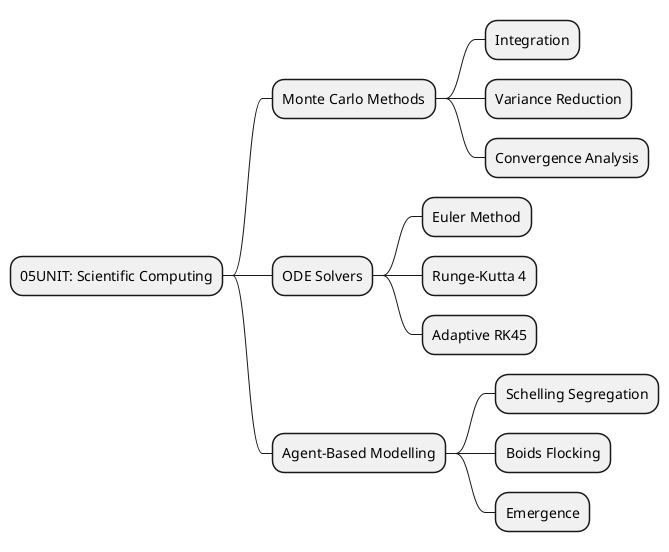
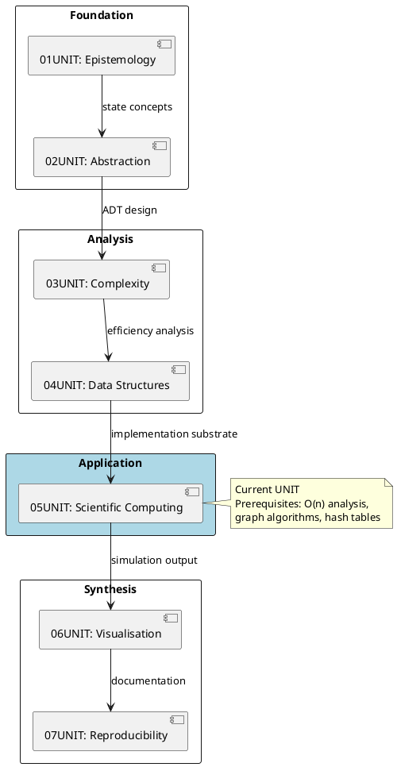
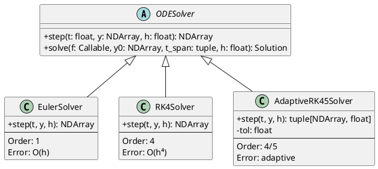
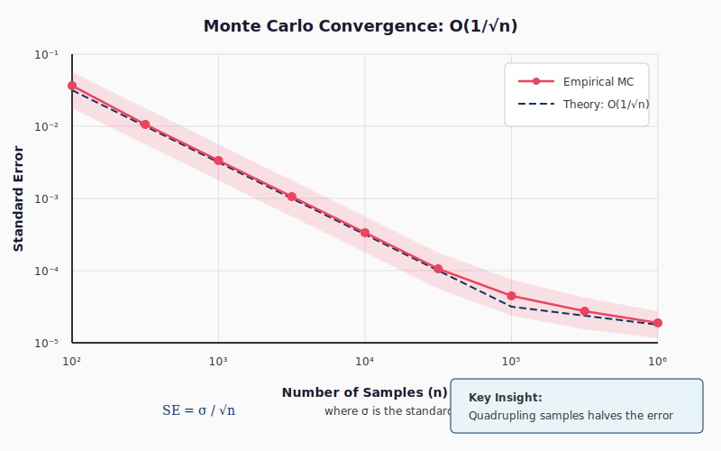
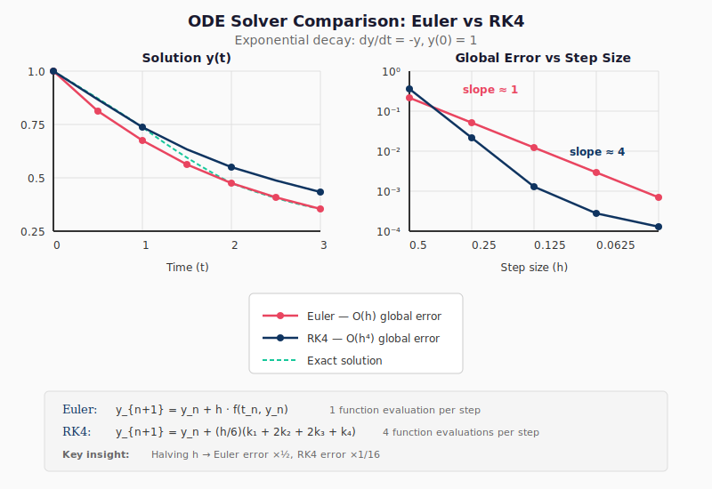
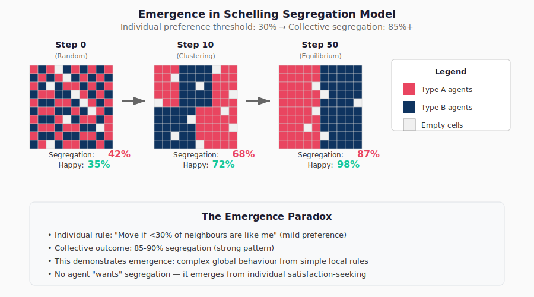
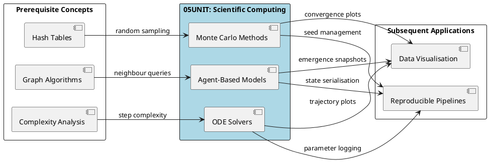

# 05UNIT: Scientific Computing

## The Art of Computational Thinking for Researchers

> **UNIT 05 of 7** | **Bloom Level**: Apply/Create | **Est. Time**: 7 hours

---

## 📊 UNIT Architecture



---

## 🎯 Learning Objectives

This unit addresses the computational apparatus required for numerical simulation—a domain where analytical mathematics yields to algorithmic approximation. The learning objectives, mapped to assessment instruments, follow:

| # | Objective | Bloom Level | Lab Coverage | Assessment |
|---|-----------|-------------|--------------|------------|
| 1 | Implement Monte Carlo integration with variance reduction | [Apply] | Lab 01, §1-4 | Quiz Q1-4, Homework P1 |
| 2 | Solve ODEs using Euler, RK4 and adaptive methods | [Apply] | Lab 02, §1-5 | Quiz Q5-7, Homework P2 |
| 3 | Design agent-based models exhibiting emergent behaviour | [Create] | Lab 03, §1-6 | Quiz Q8-10, Homework P3 |

---

## 🔗 Prerequisites and Progression



Before commencing this unit, verify completion of:

- [x] 04UNIT: Advanced Data Structures (graphs, probabilistic structures)
- [x] Algorithmic complexity analysis (Big-O notation, amortised bounds)
- [x] Python fluency (NumPy array operations, class hierarchies)
- [x] Mathematical prerequisites (calculus: derivatives, definite integrals)

---

## 📐 Mathematical Foundations

### Monte Carlo Integration

The Monte Carlo estimator for the definite integral $I = \int_a^b f(x) \, dx$ approximates the expected value through random sampling:

$$\hat{I}_n = \frac{b-a}{n} \sum_{i=1}^{n} f(X_i), \quad X_i \sim \text{Uniform}(a, b)$$

The **strong law of large numbers** guarantees convergence: $\hat{I}_n \xrightarrow{a.s.} I$ as $n \to \infty$.

The **central limit theorem** characterises the convergence rate:

$$\sqrt{n}(\hat{I}_n - I) \xrightarrow{d} \mathcal{N}(0, \sigma^2)$$

where $\sigma^2 = \text{Var}[f(X)] \cdot (b-a)^2$. The standard error thus decreases as $O(n^{-1/2})$—independent of dimension.

### Variance Reduction Techniques

| Technique | Variance Factor | Computational Overhead |
|-----------|-----------------|------------------------|
| Naive MC | $\sigma^2/n$ | Baseline |
| Antithetic variates | $\frac{\sigma^2}{2n}(1 + \rho)$ | 2× function evaluations |
| Stratified sampling | $\leq \sigma^2/n$ | Partitioning cost |
| Importance sampling | $\sigma_g^2/n$ | Requires proposal $g(x)$ |

### ODE Numerical Methods

For the initial value problem $\frac{dy}{dt} = f(t, y)$, $y(t_0) = y_0$:

**Euler Method** (first-order):
$$y_{n+1} = y_n + h \cdot f(t_n, y_n)$$

Local truncation error: $O(h^2)$. Global error: $O(h)$.

**Runge-Kutta 4** (fourth-order):
$$y_{n+1} = y_n + \frac{h}{6}(k_1 + 2k_2 + 2k_3 + k_4)$$

where:
- $k_1 = f(t_n, y_n)$
- $k_2 = f(t_n + h/2, y_n + hk_1/2)$
- $k_3 = f(t_n + h/2, y_n + hk_2/2)$
- $k_4 = f(t_n + h, y_n + hk_3)$

Local truncation error: $O(h^5)$. Global error: $O(h^4)$.

### Emergence in Agent-Based Systems

Agent-based models (ABMs) instantiate the principle that *local interactions generate global patterns*. The Schelling segregation model demonstrates this: agents relocate based on neighbourhood composition, yielding macroscopic segregation despite mild individual preferences.

The Boids algorithm (Reynolds, 1987) produces flocking from three rules:
1. **Separation**: Avoid crowding neighbours
2. **Alignment**: Steer towards average heading
3. **Cohesion**: Move toward centre of mass

---

## 📁 UNIT Structure

```
05UNIT/
├── 📄 README.md                          ← You are here
├── 📚 theory/
│   ├── 05UNIT_slides.html                ← 45 slides, ~90 min
│   ├── lecture_notes.md                  ← 2,500 words
│   └── learning_objectives.md            ← Measurable outcomes
├── 🔬 lab/
│   ├── __init__.py                       ← Package initialisation
│   ├── lab_05_01_monte_carlo.py          ← 917 lines
│   ├── lab_05_02_ode_solvers.py          ← 850 lines
│   └── lab_05_03_agent_based_modelling.py← 980 lines
├── ✏️ exercises/
│   ├── homework.md                       ← 100 points, 3 parts
│   └── practice/                         ← 9 exercises (3×3 difficulty)
├── 📊 assets/
│   ├── diagrams/                         ← 3 PlantUML, 3 SVG
│   └── animations/                       ← Interactive HTML demos
├── 🧪 tests/                             ← pytest suite, ≥80% coverage
└── Makefile                              ← Build automation
```

---

## 🔬 Laboratory Sessions

### Lab 01: Monte Carlo Methods

```python
def monte_carlo_integrate(
    f: Callable[[NDArray], NDArray],
    bounds: tuple[float, float],
    n_samples: int,
    seed: int | None = None,
) -> MonteCarloResult:
    """
    Estimate definite integral via Monte Carlo sampling.
    
    Implements the basic Monte Carlo estimator with standard error
    computation. The returned confidence interval assumes normality
    (valid for n_samples ≥ 30 by CLT).
    
    Args:
        f: Integrand function accepting array of sample points.
        bounds: Integration limits (a, b).
        n_samples: Number of random samples.
        seed: Random state for reproducibility.
    
    Returns:
        MonteCarloResult with estimate, standard error, and CI.
    
    Complexity:
        Time: O(n_samples × cost(f))
        Space: O(n_samples) for sample storage
    """
```

### Lab 02: ODE Solvers

The laboratory implements a solver hierarchy permitting algorithmic substitution:



### Lab 03: Agent-Based Modelling

The ABM framework separates agent behaviour from environment dynamics:

| Component | Responsibility | Interface |
|-----------|---------------|-----------|
| `Agent` | Individual state and decision rules | `update(neighbours)` |
| `Environment` | Spatial structure and queries | `get_neighbours(agent)` |
| `Simulation` | Time stepping and data collection | `run(steps)` |

---

## 🚀 Quick Start

```bash
# 1. Navigate to UNIT directory
cd 05UNIT

# 2. Verify environment
make check

# 3. Run laboratory demonstrations
python -m lab.lab_05_01_monte_carlo --demo
python -m lab.lab_05_02_ode_solvers --demo
python -m lab.lab_05_03_agent_based_modelling --demo

# 4. Execute test suite
make test

# 5. Validate structure
python ../scripts/validate_unit.py 05
```

---

## 🔬 Research Applications

### Physics

Numerical simulation pervades computational physics. Particle systems (N-body gravitational dynamics) require $O(n^2)$ force calculations per timestep—ameliorated by Barnes-Hut tree approximations. Orbital mechanics employs RK4 for trajectory integration; Monte Carlo methods sample Boltzmann distributions in statistical mechanics.

### Epidemiology

Disease transmission models range from compartmental ODEs (SIR, SEIR) to individual-based simulations capturing contact network structure. Parameter sensitivity analysis—varying $R_0$, recovery rates, intervention timing—relies on Monte Carlo sampling of model space.

### Economics and Social Science

Market microstructure models simulate order flow and price formation through interacting trading agents. The Schelling model remains foundational for understanding residential segregation. Option pricing via Black-Scholes Monte Carlo handles path-dependent derivatives intractable to analytical methods.

### Ecology

Lotka-Volterra predator-prey dynamics yield oscillatory solutions amenable to ODE analysis. Spatial models—incorporating movement, territoriality, foraging—necessitate agent-based approaches. Boids-style flocking algorithms inform collective animal behaviour research.

---

## ✅ Progress Checklist

| Component | Status | Estimated Time |
|-----------|--------|----------------|
| Lecture slides viewed | ⬜ | ~90 min |
| Lecture notes read | ⬜ | ~30 min |
| Lab 01 (Monte Carlo) completed | ⬜ | ~90 min |
| Lab 02 (ODE Solvers) completed | ⬜ | ~60 min |
| Lab 03 (ABM) completed | ⬜ | ~90 min |
| Easy exercises (3) | ⬜ | ~30 min |
| Medium exercises (3) | ⬜ | ~45 min |
| Hard exercises (3) | ⬜ | ~60 min |
| Quiz passed (≥70%) | ⬜ | ~15 min |
| Self-assessment completed | ⬜ | ~10 min |

---

## 📊 Key Diagrams

### Monte Carlo Convergence



The convergence plot demonstrates the $O(n^{-1/2})$ error decay characteristic of Monte Carlo estimation. Confidence bands narrow as sample size increases.

### ODE Solver Comparison



Error accumulation differs dramatically between methods. Euler exhibits linear error growth; RK4 maintains precision over extended integration intervals.

### ABM Emergence Patterns



Schelling segregation snapshots illustrate how micro-level tolerance thresholds generate macro-level clustering.

---

## 🔄 UNIT Connections



---

## 📜 Licence and Terms of Use

╔═══════════════════════════════════════════════════════════════════════════════╗
║                           RESTRICTIVE LICENCE                                  ║
║                              Version 3.1.0                                     ║
║                             January 2025                                       ║
╠═══════════════════════════════════════════════════════════════════════════════╣
║                                                                               ║
║   © 2025 Antonio Clim. All rights reserved.                                   ║
║                                                                               ║
║   PERMITTED:                                                                  ║
║   ✓ Personal use for self-study                                               ║
║   ✓ Viewing and running code for personal educational purposes                ║
║   ✓ Local modifications for personal experimentation                          ║
║                                                                               ║
║   PROHIBITED (without prior written consent):                                 ║
║   ✗ Publishing materials (online or offline)                                  ║
║   ✗ Use in formal teaching activities                                         ║
║   ✗ Teaching or presenting materials to third parties                         ║
║   ✗ Redistribution in any form                                                ║
║   ✗ Creating derivative works for public use                                  ║
║   ✗ Commercial use of any kind                                                ║
║                                                                               ║
║   For requests regarding educational use or publication,                      ║
║   please contact the author to obtain written consent.                        ║
║                                                                               ║
╚═══════════════════════════════════════════════════════════════════════════════╝

### Terms and Conditions

1. **Intellectual Property**: All materials, including but not limited to code, documentation, presentations and exercises, are the intellectual property of Antonio Clim.

2. **No Warranty**: Materials are provided "as is" without warranty of any kind, express or implied.

3. **Limitation of Liability**: The author shall not be liable for any damages arising from the use of these materials.

4. **Governing Law**: These terms are governed by the laws of Romania.

5. **Contact**: For permissions and enquiries, contact the author through official academic channels.

### Technology Stack

| Technology | Version | Purpose |
|------------|---------|---------|
| Python | 3.12+ | Primary programming language |
| NumPy | ≥1.24 | Numerical computing |
| SciPy | ≥1.11 | Scientific algorithms |
| Matplotlib | ≥3.7 | Static visualisation |
| Pandas | ≥2.0 | Data manipulation |
| pytest | ≥7.0 | Testing framework |
| pytest-cov | ≥4.0 | Coverage reporting |
| ruff | ≥0.1 | Linting and formatting |
| mypy | ≥1.0 | Type checking |
| Docker | 24+ | Containerisation |
| reveal.js | 5.0 | Presentation framework |
| PlantUML | 1.2024+ | Diagram generation |

---

*Last updated: January 2025*
