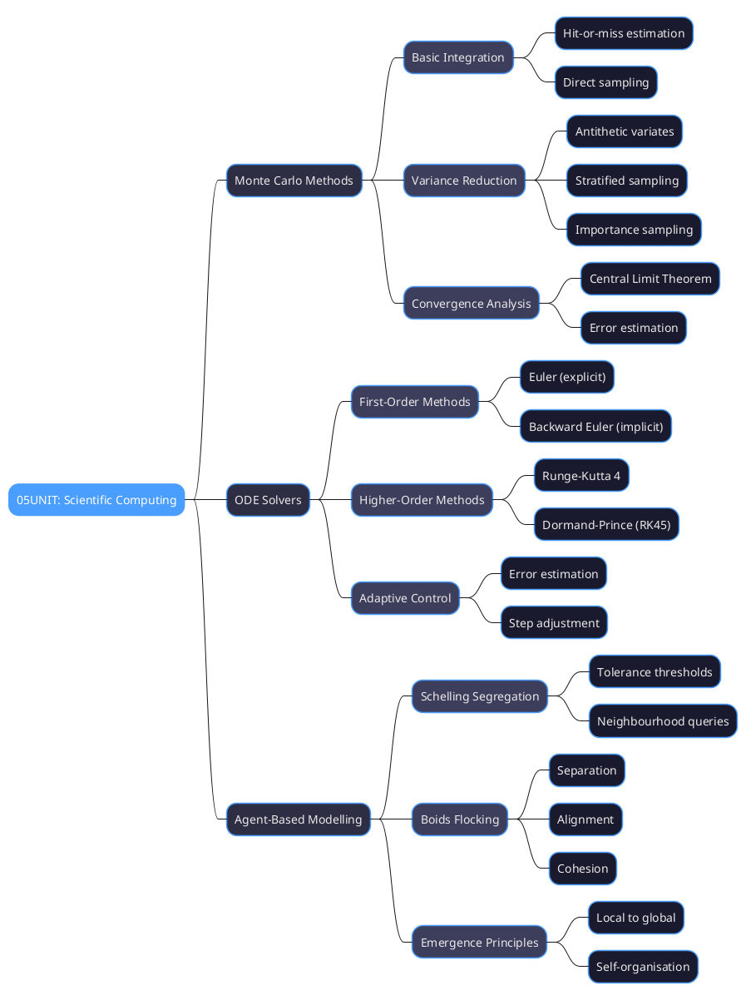
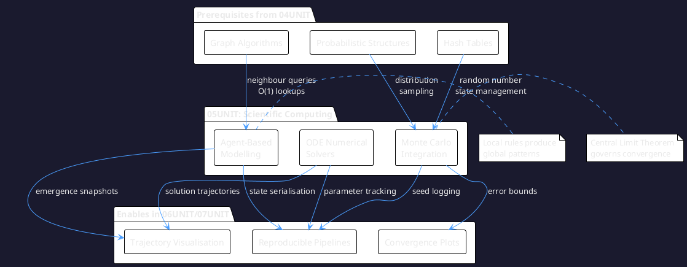
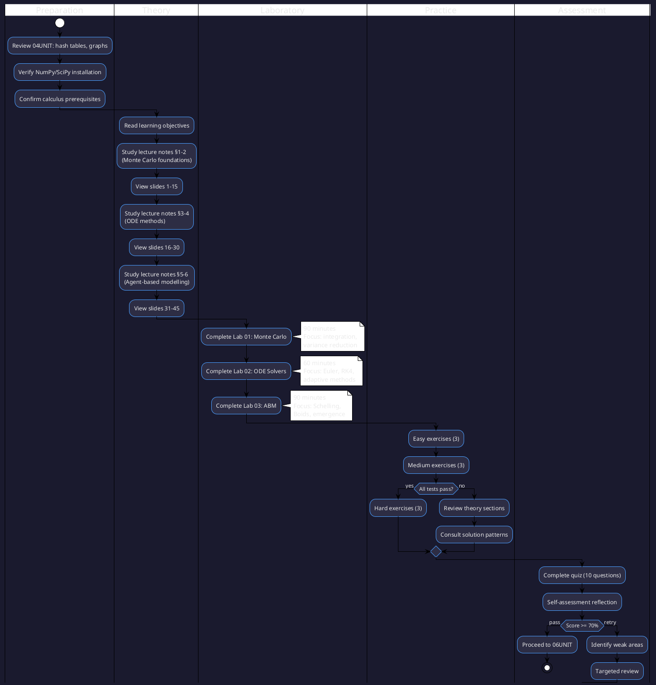
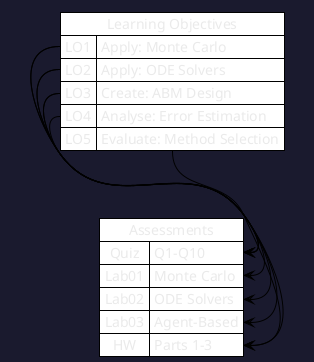
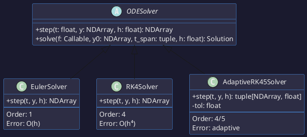
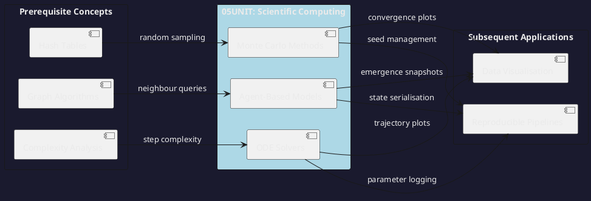

# 05UNIT: Scientific Computing

## The Art of Computational Thinking for Researchers

> **UNIT 05 of 7** | **Bloom Level**: Apply/Create | **Est. Time**: 7 hours

---

## 1. UNIT Synopsis

### 1.1 Abstract

This unit establishes the computational apparatus required for numerical simulation—a domain where analytical mathematics yields to algorithmic approximation. The treatment covers Monte Carlo methods for stochastic integration, ordinary differential equation (ODE) solvers for deterministic dynamics and agent-based models (ABMs) for emergent phenomena arising from local interactions.

The progression from random sampling through numerical integration to multi-agent simulation reflects increasing computational sophistication whilst maintaining unified themes: decomposition of intractable problems into iterable steps, rigorous error analysis and careful attention to convergence properties. Laboratory exercises instantiate theoretical constructs in executable Python implementations, emphasising reproducibility through seed management and statistical reporting.

**Keywords**: Monte Carlo integration, variance reduction, Runge-Kutta methods, adaptive step control, agent-based modelling, emergence, Schelling segregation, Boids algorithm

**Estimated Duration**: 7 hours (theory: 2h, laboratory: 3.5h, exercises: 1.5h)

**Difficulty Level**: ★★★★☆ (4/5)

### 1.2 Position in Curriculum


This unit occupies position 5 of 7 in the curriculum sequence. It receives conceptual prerequisites from 04UNIT (efficient data structures, graph algorithms) and furnishes foundational simulation capabilities essential for 06UNIT (visualising simulation output) and 07UNIT (reproducible computational pipelines).

| Dependency Type | Source | Concepts Required |
|-----------------|--------|-------------------|
| Hard prerequisite | 04UNIT | Graph representations, hash tables, algorithmic complexity |
| Soft prerequisite | 03UNIT | Big-O notation, amortised analysis |
| Mathematical | Calculus | Derivatives, definite integrals, Taylor series |

### 1.3 Pedagogical Rationale

The instructional design scaffolds knowledge acquisition through progressive complexity. Participants first encounter Monte Carlo methods—conceptually accessible yet mathematically profound—before advancing to ODE solvers requiring Taylor expansion intuition. Agent-based modelling synthesises preceding material whilst introducing emergent phenomena absent from deterministic frameworks.

**Instructional Strategies Employed:**

1. **Worked Examples**: Complete implementations with explicit reasoning traces
2. **Cognitive Apprenticeship**: Expert problem decomposition made visible through verbose logging
3. **Deliberate Practice**: Graded exercises targeting specific computational subskills
4. **Metacognitive Prompts**: Self-assessment instruments encouraging reflection on learning
5. **Transfer Tasks**: Application to novel research contexts (epidemiology, ecology, economics)

---

## 2. Visual Overview

### 2.1 Conceptual Architecture



### 2.2 UNIT Dependencies Graph



### 2.3 Learning Pathway



---

## 3. Learning Objectives

### 3.1 Cognitive Objectives

Upon successful completion of this unit, participants will demonstrate the ability to:

| ID | Level | Verb | Objective Statement | Assessment |
|----|-------|------|---------------------|------------|
| LO1 | Apply | Implement | Implement Monte Carlo integration with variance reduction techniques | Lab 01, Quiz Q1-4 |
| LO2 | Apply | Solve | Solve ordinary differential equations using Euler, RK4 and adaptive methods | Lab 02, Quiz Q5-7 |
| LO3 | Create | Design | Design agent-based models exhibiting emergent behaviour from local rules | Lab 03, Quiz Q8-10 |
| LO4 | Analyse | Estimate | Estimate numerical errors and convergence rates empirically | Homework P1-P2 |
| LO5 | Evaluate | Select | Select appropriate numerical methods based on accuracy-efficiency trade-offs | Homework P3 |

### 3.2 Skill Objectives

**Technical Skills:**

| Skill | Proficiency Level | Evidence |
|-------|-------------------|----------|
| Random number generation with seed control | Competent | Lab 01 reproducibility |
| Numerical integration error estimation | Proficient | Homework confidence intervals |
| ODE solver implementation | Competent | Lab 02 solver hierarchy |
| Adaptive step size control | Advanced | Hard exercise RKF45 |
| Agent behaviour specification | Proficient | Lab 03 Schelling/Boids |

**Transferable Skills:**

- **Numerical Reasoning**: Quantify approximation errors and convergence behaviour
- **Algorithmic Design**: Structure iterative computations for efficiency and clarity
- **Scientific Communication**: Report simulation results with appropriate uncertainty

### 3.3 Objectives-Assessment Alignment Matrix



---

## 4. Theoretical Foundations

### 4.1 Historical Context

Monte Carlo methods emerged from wartime computation at Los Alamos, where Stanislaw Ulam and John von Neumann recognised that random sampling could solve neutron diffusion problems intractable to analytical methods. The name derives from the Monte Carlo Casino in Monaco—a playful reference to the role of chance in the methodology.

Numerical ODE methods trace to Leonhard Euler's 1768 treatise on differential equations, though systematic error analysis awaited Carl Runge (1895) and Martin Kutta (1901). Modern adaptive methods, particularly the Dormand-Prince family, became practical with digital computation in the latter twentieth century.

Agent-based modelling gained prominence through Thomas Schelling's 1971 segregation model and Craig Reynolds' 1987 Boids algorithm, demonstrating how simple local rules generate complex global patterns—a framework now central to computational social science, ecology and artificial life research.

### 4.2 Core Concepts

#### Monte Carlo Integration

**Definition 4.1** (Monte Carlo Estimator). Let $f: [a,b] \to \mathbb{R}$ be integrable. The Monte Carlo estimator for $I = \int_a^b f(x)\,dx$ is:

$$
\hat{I}_n = \frac{b-a}{n} \sum_{i=1}^{n} f(X_i), \quad X_i \sim \text{Uniform}(a,b)
$$

**Theorem 4.1** (Strong Law of Large Numbers). The Monte Carlo estimator converges almost surely: $\hat{I}_n \xrightarrow{a.s.} I$ as $n \to \infty$.

**Theorem 4.2** (Central Limit Theorem). The standardised estimator converges in distribution:

$$
\sqrt{n}\left(\hat{I}_n - I\right) \xrightarrow{d} \mathcal{N}(0, \sigma^2)
$$

where $\sigma^2 = \text{Var}[f(X)] \cdot (b-a)^2$. The standard error thus decreases as $O(n^{-1/2})$.

#### ODE Numerical Methods

**Definition 4.2** (Initial Value Problem). Given $f: \mathbb{R} \times \mathbb{R}^d \to \mathbb{R}^d$ and initial condition $y_0 \in \mathbb{R}^d$, find $y: [t_0, T] \to \mathbb{R}^d$ satisfying:

$$
\frac{dy}{dt} = f(t, y), \quad y(t_0) = y_0
$$

**Definition 4.3** (Local Truncation Error). For a one-step method $y_{n+1} = y_n + h\,\Phi(t_n, y_n, h)$, the local truncation error is:

$$
\tau_{n+1} = \frac{y(t_{n+1}) - y(t_n)}{h} - \Phi(t_n, y(t_n), h)
$$

A method is **order $p$** if $\tau = O(h^p)$.

### 4.3 Mathematical Framework

**Euler Method** (Order 1):
$$y_{n+1} = y_n + h \cdot f(t_n, y_n)$$

**Runge-Kutta 4** (Order 4):
$$y_{n+1} = y_n + \frac{h}{6}(k_1 + 2k_2 + 2k_3 + k_4)$$

where:
- $k_1 = f(t_n, y_n)$
- $k_2 = f(t_n + h/2, y_n + hk_1/2)$
- $k_3 = f(t_n + h/2, y_n + hk_2/2)$
- $k_4 = f(t_n + h, y_n + hk_3)$

**Variance Reduction Comparison:**

| Technique | Variance Factor | Optimal Conditions |
|-----------|-----------------|-------------------|
| Naive MC | $\sigma^2/n$ | Baseline |
| Antithetic | $\frac{\sigma^2}{2n}(1 + \rho)$ | Monotonic integrand |
| Stratified | $\leq \sigma^2/n$ | Heterogeneous domain |
| Importance | $\sigma_g^2/n$ | Known high-contribution regions |

---

## 5. Algorithmic Content

### 5.1 Algorithm Catalogue

| Algorithm | Problem | Time Complexity | Space Complexity |
|-----------|---------|-----------------|------------------|
| Basic Monte Carlo | Integration | $O(n \cdot c_f)$ | $O(n)$ |
| Antithetic Variates | Variance reduction | $O(n \cdot c_f)$ | $O(n)$ |
| Euler Method | ODE solving | $O(N \cdot c_f)$ | $O(d)$ |
| RK4 | ODE solving | $O(4N \cdot c_f)$ | $O(d)$ |
| Adaptive RK45 | ODE solving | $O(6N' \cdot c_f)$ | $O(d)$ |
| Schelling | Segregation | $O(s \cdot n^2)$ | $O(n^2)$ |
| Boids | Flocking | $O(s \cdot n^2)$ | $O(n)$ |

where $c_f$ denotes function evaluation cost, $N$ denotes fixed steps, $N'$ denotes adaptive steps, $s$ denotes simulation steps, and $n$ denotes agent count.

### 5.2 Pseudocode: Monte Carlo Integration

```
ALGORITHM MonteCarloIntegrate(f, a, b, n, seed)
━━━━━━━━━━━━━━━━━━━━━━━━━━━━━━━━━━━━━━━━━━━━━━━━━━━━━━━━━━━━━━━
INPUT:  f — integrand function
        a, b — integration bounds
        n — sample count
        seed — random state (optional)
OUTPUT: estimate, standard_error, confidence_interval
━━━━━━━━━━━━━━━━━━━━━━━━━━━━━━━━━━━━━━━━━━━━━━━━━━━━━━━━━━━━━━━

1   rng ← RandomGenerator(seed)
2   samples ← array of size n
3   
4   FOR i ← 1 TO n DO                           ▷ Sampling loop
5   │   x ← rng.uniform(a, b)
6   │   samples[i] ← f(x)
7   END FOR
8   
9   mean ← sum(samples) / n
10  estimate ← (b - a) × mean
11  
12  variance ← sum((samples - mean)²) / (n - 1)  ▷ Bessel correction
13  standard_error ← sqrt(variance / n) × (b - a)
14  
15  margin ← 1.96 × standard_error               ▷ 95% CI
16  ci ← (estimate - margin, estimate + margin)
17  
18  RETURN estimate, standard_error, ci

━━━━━━━━━━━━━━━━━━━━━━━━━━━━━━━━━━━━━━━━━━━━━━━━━━━━━━━━━━━━━━━
COMPLEXITY: Time O(n × cost(f)), Space O(n)
INVARIANT: All samples drawn i.i.d. from Uniform(a, b)
━━━━━━━━━━━━━━━━━━━━━━━━━━━━━━━━━━━━━━━━━━━━━━━━━━━━━━━━━━━━━━━
```

### 5.3 Pseudocode: Runge-Kutta 4

```
ALGORITHM RK4Step(f, t, y, h)
━━━━━━━━━━━━━━━━━━━━━━━━━━━━━━━━━━━━━━━━━━━━━━━━━━━━━━━━━━━━━━━
INPUT:  f — derivative function f(t, y)
        t — current time
        y — current state vector
        h — step size
OUTPUT: y_next — state at time t + h
━━━━━━━━━━━━━━━━━━━━━━━━━━━━━━━━━━━━━━━━━━━━━━━━━━━━━━━━━━━━━━━

1   k₁ ← f(t, y)
2   k₂ ← f(t + h/2, y + h×k₁/2)
3   k₃ ← f(t + h/2, y + h×k₂/2)
4   k₄ ← f(t + h, y + h×k₃)
5   
6   y_next ← y + (h/6) × (k₁ + 2×k₂ + 2×k₃ + k₄)
7   
8   RETURN y_next

━━━━━━━━━━━━━━━━━━━━━━━━━━━━━━━━━━━━━━━━━━━━━━━━━━━━━━━━━━━━━━━
COMPLEXITY: Time O(4 × cost(f)), Space O(d) for d-dimensional y
ERROR: Local truncation O(h⁵), Global O(h⁴)
━━━━━━━━━━━━━━━━━━━━━━━━━━━━━━━━━━━━━━━━━━━━━━━━━━━━━━━━━━━━━━━
```

---

## 6. Practical Applications

### 6.1 Research Domain Examples

| Domain | Problem | Technique | Reference |
|--------|---------|-----------|-----------|
| Physics | Particle system dynamics | RK4 + Monte Carlo | Landau & Binder (2014) |
| Epidemiology | Disease spread (SIR/SEIR) | ODE solvers | Keeling & Rohani (2008) |
| Economics | Option pricing | Monte Carlo + antithetic | Glasserman (2003) |
| Ecology | Predator-prey dynamics | Lotka-Volterra ODE | Murray (2002) |
| Social Science | Residential segregation | Schelling ABM | Schelling (1971) |
| Artificial Life | Flocking behaviour | Boids ABM | Reynolds (1987) |

### 6.2 Case Study: Epidemic Simulation

**Context**: The SIR (Susceptible-Infected-Recovered) model describes disease transmission through coupled ODEs:

$$
\frac{dS}{dt} = -\beta SI, \quad \frac{dI}{dt} = \beta SI - \gamma I, \quad \frac{dR}{dt} = \gamma I
$$

**Implementation**: Lab 02 demonstrates RK4 integration of this system, enabling exploration of $R_0 = \beta/\gamma$ effects on epidemic dynamics.

**Results**: Parameter sensitivity analysis via Monte Carlo sampling of $(\beta, \gamma)$ space reveals threshold behaviour at $R_0 = 1$.

---

## 7. Laboratory Guide

### 7.1 Lab Overview

| Lab | Title | Duration | Primary Objective | Files |
|-----|-------|----------|-------------------|-------|
| 01 | Monte Carlo Methods | 90 min | LO1: Integration with variance reduction | `lab_05_01_monte_carlo.py` |
| 02 | ODE Solvers | 60 min | LO2: Euler, RK4, adaptive methods | `lab_05_02_ode_solvers.py` |
| 03 | Agent-Based Modelling | 90 min | LO3: Schelling, Boids, emergence | `lab_05_03_agent_based_modelling.py` |

### 7.2 Lab 01: Monte Carlo Methods

**Synopsis**: This laboratory instantiates stochastic integration theory in executable Python code, progressing from basic estimation through variance reduction techniques.

**Key Components**:
- `MonteCarloResult`: Dataclass encapsulating estimate, error and confidence interval
- `monte_carlo_integrate()`: Core integration with seed control
- `antithetic_variates()`: Variance reduction via negatively correlated pairs
- `stratified_sampling()`: Domain partitioning for heterogeneous integrands

### 7.3 Lab 02: ODE Solvers

**Synopsis**: The laboratory implements a solver hierarchy permitting algorithmic substitution via the Strategy pattern.



### 7.4 Lab 03: Agent-Based Modelling

**Synopsis**: The ABM framework separates agent behaviour from environment dynamics, enabling modular construction of diverse simulations.

| Component | Responsibility | Interface |
|-----------|---------------|-----------|
| `Agent` | Individual state and decision rules | `update(neighbours)` |
| `Environment` | Spatial structure and queries | `get_neighbours(agent)` |
| `Simulation` | Time stepping and data collection | `run(steps)` |

---

## 8. Exercise Framework

### 8.1 Difficulty Progression

```
Easy (★☆☆☆☆)        → Direct application of single concept
    ↓
Medium (★★★☆☆)      → Combination of 2-3 concepts
    ↓
Hard (★★★★★)        → Novel synthesis, optimisation required
```

### 8.2 Exercise-Objective Mapping

| Exercise | Objectives | Concepts | Estimated Time |
|----------|------------|----------|----------------|
| easy_01_monte_carlo_area | LO1 | Basic MC | 10 min |
| easy_02_euler_decay | LO2 | Euler method | 10 min |
| easy_03_random_walk | LO1, LO3 | Random sampling | 10 min |
| medium_01_variance_reduction | LO1, LO4 | Antithetic variates | 15 min |
| medium_02_rk4_harmonic | LO2, LO4 | RK4, harmonic oscillator | 15 min |
| medium_03_schelling | LO3 | Schelling model | 15 min |
| hard_01_importance_sampling | LO1, LO5 | Importance sampling | 20 min |
| hard_02_adaptive_rkf45 | LO2, LO5 | RKF45 adaptive | 20 min |
| hard_03_boids_flocking | LO3 | Boids algorithm | 20 min |

---

## 9. Directory Structure

```
05UNIT/
├── 📄 README.md                              ← You are here
├── 📚 theory/
│   ├── 05UNIT_slides.html                    ← 45 slides, ~90 min
│   ├── lecture_notes.md                      ← 2,500+ words
│   └── learning_objectives.md                ← Measurable outcomes
├── 🔬 lab/
│   ├── __init__.py                           ← Package initialisation
│   ├── lab_05_01_monte_carlo.py              ← 917 lines
│   ├── lab_05_02_ode_solvers.py              ← 863 lines
│   ├── lab_05_03_agent_based_modelling.py    ← 980 lines
│   └── solutions/
│       ├── lab_05_01_solution.py
│       ├── lab_05_02_solution.py
│       └── lab_05_03_solution.py
├── ✏️ exercises/
│   ├── homework.md                           ← 100 points, 3 parts
│   ├── practice/
│   │   ├── easy_01_monte_carlo_area.py
│   │   ├── easy_02_euler_decay.py
│   │   ├── easy_03_random_walk.py
│   │   ├── medium_01_variance_reduction.py
│   │   ├── medium_02_rk4_harmonic.py
│   │   ├── medium_03_schelling.py
│   │   ├── hard_01_importance_sampling.py
│   │   ├── hard_02_adaptive_rkf45.py
│   │   └── hard_03_boids_flocking.py
│   └── solutions/
│       └── *.py
├── 📋 assessments/
│   ├── quiz.md                               ← 10 questions
│   ├── rubric.md                             ← Grading rubric
│   └── self_check.md                         ← Self-assessment
├── 📊 assets/
│   ├── diagrams/
│   │   ├── monte_carlo_convergence.puml
│   │   ├── monte_carlo_convergence.svg
│   │   ├── ode_solver_hierarchy.puml
│   │   ├── ode_solver_comparison.svg
│   │   ├── abm_architecture.puml
│   │   └── abm_emergence_patterns.svg
│   ├── animations/
│   │   └── 05UNIT_boids_interactive.html
│   └── images/
├── 📚 resources/
│   ├── cheatsheet.md                         ← 2-page summary
│   ├── further_reading.md                    ← Curated references
│   ├── glossary.md                           ← Terminology
│   └── datasets/
├── 🧪 tests/
│   ├── __init__.py
│   ├── conftest.py                           ← Shared fixtures
│   ├── test_lab_05_01.py
│   ├── test_lab_05_02.py
│   └── test_lab_05_03.py
└── Makefile                                  ← Build automation
```

---

## 10. Quick Start

```bash
# 1. Navigate to UNIT directory
cd 05UNIT

# 2. Verify environment
make check

# 3. Run laboratory demonstrations
python -m lab.lab_05_01_monte_carlo --demo
python -m lab.lab_05_02_ode_solvers --demo
python -m lab.lab_05_03_agent_based_modelling --demo

# 4. Execute test suite
make test

# 5. Validate structure
python ../scripts/validate_unit.py 05
```

---

## 11. Key Diagrams

### Monte Carlo Convergence


The convergence plot demonstrates the $O(n^{-1/2})$ error decay characteristic of Monte Carlo estimation. The confidence band narrows as sample size increases, with the envelope following $\pm 1.96\sigma/\sqrt{n}$.

### ODE Solver Comparison


Error accumulation differs dramatically between methods. Euler exhibits linear error growth unsuitable for long integrations; RK4 maintains precision over extended intervals at modest computational premium.

### ABM Emergence Patterns


Schelling segregation snapshots illustrate how micro-level tolerance thresholds generate macro-level clustering—the hallmark of emergent phenomena in agent-based systems.

---

## 12. Progress Checklist

| Component | Status | Estimated Time |
|-----------|--------|----------------|
| Lecture slides viewed | ⬜ | ~90 min |
| Lecture notes read | ⬜ | ~30 min |
| Lab 01 (Monte Carlo) completed | ⬜ | ~90 min |
| Lab 02 (ODE Solvers) completed | ⬜ | ~60 min |
| Lab 03 (ABM) completed | ⬜ | ~90 min |
| Easy exercises (3) | ⬜ | ~30 min |
| Medium exercises (3) | ⬜ | ~45 min |
| Hard exercises (3) | ⬜ | ~60 min |
| Quiz passed (≥70%) | ⬜ | ~15 min |
| Self-assessment completed | ⬜ | ~10 min |

---

## 13. Research Applications

### Physics

Numerical simulation pervades computational physics. N-body gravitational dynamics require $O(n^2)$ force calculations per timestep—ameliorated by Barnes-Hut tree approximations. Orbital mechanics employs RK4 for trajectory integration; Monte Carlo methods sample Boltzmann distributions in statistical mechanics.

### Epidemiology

Disease transmission models range from compartmental ODEs (SIR, SEIR) to individual-based simulations capturing contact network structure. Parameter sensitivity analysis—varying $R_0$, recovery rates, intervention timing—relies on Monte Carlo sampling of model space.

### Economics and Social Science

Market microstructure models simulate order flow and price formation through interacting trading agents. The Schelling model remains foundational for understanding residential segregation. Option pricing via Black-Scholes Monte Carlo handles path-dependent derivatives intractable to analytical methods.

### Ecology

Lotka-Volterra predator-prey dynamics yield oscillatory solutions amenable to ODE analysis. Spatial models—incorporating movement, territoriality, foraging—necessitate agent-based approaches. Boids-style flocking algorithms inform collective animal behaviour research.

---

## 14. Troubleshooting

### Common Issues

| Problem | Cause | Solution |
|---------|-------|----------|
| Import errors | Module path | Run from UNIT root: `python -m lab.lab_05_01_monte_carlo` |
| Slow convergence | Insufficient samples | Increase `n_samples`; apply variance reduction |
| ODE instability | Step size too large | Reduce `h`; use adaptive solver |
| Boids clustering | Separation weight | Increase separation coefficient |

### FAQ

**Q: Why does Monte Carlo converge so slowly?**
A: The $O(n^{-1/2})$ rate is inherent to random sampling. Variance reduction techniques improve constants but not the rate. For smooth integrands in low dimensions, deterministic quadrature may outperform.

**Q: When should I use adaptive step control?**
A: Adaptive methods excel when solution smoothness varies—stiff systems, near singularities, or long integration intervals where error accumulation matters.

---

## 15. UNIT Connections



---

## 📜 Licence and Terms of Use

<div align="center">

<table>
<tr>
<td>

<div align="center">
<h3>🔒 RESTRICTIVE LICENCE</h3>
<p><strong>Version 4.1.0 — January 2025</strong></p>
</div>

---

**© 2025 Antonio Clim. All rights reserved.**

<table>
<tr>
<th>✅ PERMITTED</th>
<th>❌ PROHIBITED</th>
</tr>
<tr>
<td>

- Personal use for self-study
- Viewing and running code for personal educational purposes
- Local modifications for personal experimentation

</td>
<td>

- Publishing materials (online or offline)
- Use in formal teaching activities
- Teaching or presenting to third parties
- Redistribution in any form
- Creating derivative works for public use
- Commercial use of any kind

</td>
</tr>
</table>

---

<p><em>For requests regarding educational use or publication,<br>
please contact the author to obtain written consent.</em></p>

</td>
</tr>
</table>

</div>

### Terms and Conditions

1. **Intellectual Property**: All materials, including code, documentation,
   presentations and exercises, are the intellectual property of Antonio Clim.

2. **No Warranty**: Materials are provided "as is" without warranty of any kind,
   express or implied.

3. **Limitation of Liability**: The author shall not be liable for any damages
   arising from the use of these materials.

4. **Governing Law**: These terms are governed by the laws of Romania.

5. **Contact**: For permissions and enquiries, contact the author through
   official academic channels.

### Technology Stack

<div align="center">

| Technology | Version | Purpose |
|:----------:|:-------:|:--------|
| Python | 3.12+ | Primary programming language |
| NumPy | ≥1.24 | Numerical computing |
| SciPy | ≥1.11 | Scientific algorithms |
| Matplotlib | ≥3.7 | Static visualisation |
| pytest | ≥7.0 | Testing framework |
| pytest-cov | ≥4.0 | Coverage reporting |
| ruff | ≥0.1 | Linting and formatting |
| mypy | ≥1.0 | Type checking |

</div>

---

*Last updated: January 2025 — v4.1.0 Enhanced*
