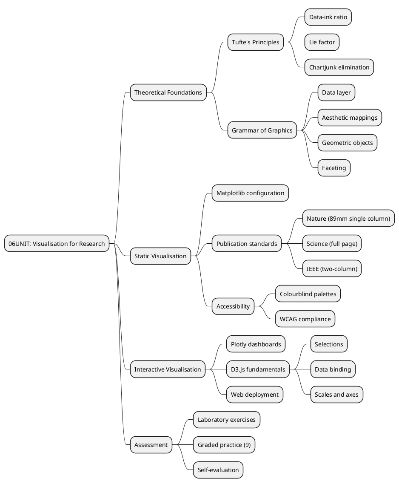
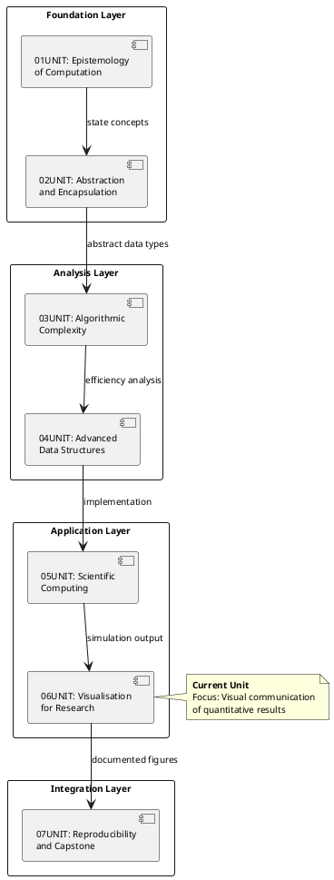
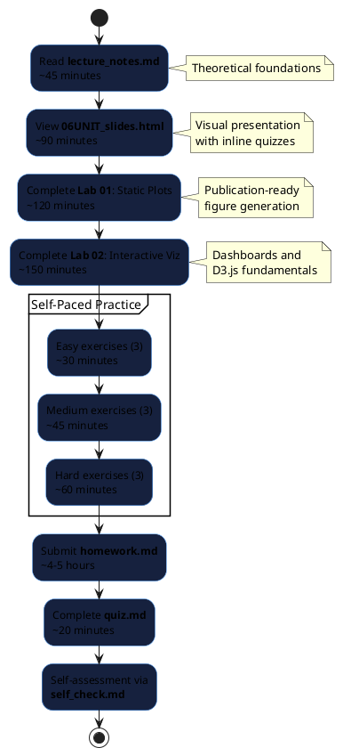

# 06UNIT: Visualisation for Research

## The Art of Computational Thinking for Researchers

> **UNIT 06 of 7** | **Bloom Level**: Create | **Est. Time**: 13–15 hours

---

## 📊 UNIT Architecture

The structure of this unit follows a progression from theoretical foundations through practical implementation to evaluative application. The following diagram illustrates the principal components and their interrelationships:



---

## 🎯 Learning Objectives

Upon completion of this unit, participants will demonstrate competence across the following measurable objectives, organised by cognitive demand according to educational taxonomy:

| # | Objective | Cognitive Level | Lab Coverage | Assessment |
|---|-----------|-----------------|--------------|------------|
| 1 | Configure matplotlib rendering pipelines to produce figures conforming to Nature, Science and IEEE submission requirements | Apply | Lab 01, §2–4 | Quiz Q1–3, Homework P1 |
| 2 | Construct interactive dashboards incorporating brushing, linking and filtering mechanisms | Create | Lab 02, §1–5 | Homework P2, Quiz Q7–8 |
| 3 | Discriminate between visualisation modalities based on data characteristics, research questions and publication constraints | Evaluate | Both labs | Quiz Q4–6, Self-check |
| 4 | Critique existing figures through application of Tufte's data-ink ratio and lie factor metrics | Analyse | Lab 01, §1 | Homework P3, Quiz Q9–10 |

---

## 🔗 Prerequisites and Dependencies

### Prerequisite Knowledge Graph

The following diagram situates this unit within the broader curricular sequence, illustrating the conceptual dependencies that inform the pedagogical design:



### Required Competencies

Prior to engaging with this unit, participants must possess demonstrable proficiency in:

- **05UNIT concepts**: Monte Carlo simulation, ODE solvers, agent-based modelling output
- **Python proficiency**: Intermediate facility with NumPy array operations and Pandas DataFrames
- **Web fundamentals**: Basic HTML/CSS sufficient for embedding interactive components

---

## 📐 Mathematical Foundations

### The Grammar of Graphics Formalisation

Wilkinson's grammar of graphics provides a formal specification language for statistical visualisations. A graphic $G$ may be expressed as a composition of mappings:

$$G = \text{COORD} \circ \text{SCALE} \circ \text{STAT} \circ \text{GEOM} \circ \text{FACET} \circ \text{DATA}$$

where each component transforms the representation:

| Component | Function | Mathematical Description |
|-----------|----------|-------------------------|
| DATA | $D: \mathbb{R}^n \to \mathcal{D}$ | Maps raw values to a data frame structure |
| FACET | $F: \mathcal{D} \to \mathcal{D}^k$ | Partitions data into $k$ subsets by categorical variable |
| GEOM | $G: \mathcal{D} \to \mathcal{V}$ | Maps data points to visual primitives (marks) |
| STAT | $S: \mathcal{D} \to \mathcal{D}'$ | Applies statistical transformations (binning, smoothing) |
| SCALE | $\sigma: \mathcal{V} \to \mathcal{V}'$ | Maps aesthetic values to perceptual ranges |
| COORD | $C: \mathbb{R}^2 \to \mathbb{R}^2$ | Applies coordinate transformations (Cartesian, polar) |

### Tufte's Data-Ink Ratio

Edward Tufte formalised the principle of graphical integrity through the data-ink ratio metric:

$$\text{Data-ink ratio} = \frac{\text{Data-ink}}{\text{Total ink used in graphic}} = 1 - \text{proportion of erasable ink}$$

A ratio approaching unity indicates efficient encoding; superfluous decorative elements (termed "chartjunk") reduce this ratio without contributing information content.

### Lie Factor

The lie factor quantifies distortion in graphical representation:

$$\text{Lie Factor} = \frac{\text{Size of effect shown in graphic}}{\text{Size of effect in data}}$$

Values substantially deviating from unity (conventionally, outside the range $[0.95, 1.05]$) indicate misleading visual rhetoric.

### Colour Perception and Accessibility

The CIE $L^*a^*b^*$ colour space provides a perceptually uniform metric. The colour difference $\Delta E^*_{ab}$ between two colours is given by:

$$\Delta E^*_{ab} = \sqrt{(\Delta L^*)^2 + (\Delta a^*)^2 + (\Delta b^*)^2}$$

For accessibility, adjacent colours in a palette should maintain $\Delta E^*_{ab} \geq 40$ to ensure discriminability under various forms of colour vision deficiency.

---

## 📁 UNIT Structure

The following directory hierarchy presents the organisation of materials within this unit:

```
06UNIT/
├── 📄 README.md                    ← Current document
├── 📚 theory/
│   ├── 06UNIT_slides.html          ← 45 slides, reveal.js 5.0
│   ├── lecture_notes.md            ← Theoretical exposition
│   └── learning_objectives.md      ← Measurable outcomes
├── 🔬 lab/
│   ├── __init__.py
│   ├── lab_06_01_static_plots.py   ← 1127 lines, matplotlib toolkit
│   ├── lab_06_02_interactive_viz.py ← 1403 lines, Plotly/D3
│   └── solutions/
│       ├── lab_06_01_solution.py
│       └── lab_06_02_solution.py
├── ✏️ exercises/
│   ├── homework.md                 ← Main assignment (100 points)
│   └── practice/
│       ├── easy_01_line_plot.py
│       ├── easy_02_scatter_regression.py
│       ├── easy_03_bar_chart.py
│       ├── medium_01_heatmap.py
│       ├── medium_02_small_multiples.py
│       ├── medium_03_plotly_interactive.py
│       ├── hard_01_d3_bar_chart.py
│       ├── hard_02_publication_figure.py
│       └── hard_03_animation.py
├── 📊 assets/
│   ├── diagrams/
│   │   ├── grammar_of_graphics.svg
│   │   ├── tufte_principles.svg
│   │   ├── d3_enter_update_exit.svg
│   │   ├── grammar_of_graphics.puml
│   │   ├── visualisation_selection.puml
│   │   └── dashboard_layout_patterns.puml
│   └── animations/
│       └── 06UNIT_chart_animation.html
├── 📝 assessments/
│   ├── quiz.md                     ← 10 questions
│   ├── rubric.md                   ← Grading criteria
│   └── self_check.md               ← Self-evaluation
├── 📖 resources/
│   ├── cheatsheet.md               ← A4 reference card
│   ├── further_reading.md          ← Curated bibliography
│   ├── glossary.md                 ← Terminology definitions
│   └── datasets/
│       ├── sample_timeseries.csv
│       ├── sample_research_data.json
│       └── correlation_matrix.csv
├── 🧪 tests/
│   ├── __init__.py
│   ├── conftest.py
│   ├── test_lab_06_01.py
│   └── test_lab_06_02.py
└── Makefile
```

---

## 🎓 Learning Path

The recommended progression through this unit follows a structured sequence designed to build competence incrementally:



---

## 🚀 Quick Start

Execute the following commands to initialise the laboratory environment and verify installation:

```bash
# 1. Navigate to UNIT directory
cd 06UNIT

# 2. Verify environment and dependencies
make check

# 3. Execute Lab 01 in demonstration mode
python -m lab.lab_06_01_static_plots --demo

# 4. Execute Lab 02 in demonstration mode
python -m lab.lab_06_02_interactive_viz --demo

# 5. Run the test suite with coverage reporting
make test

# 6. Validate UNIT structure
python ../scripts/validate_unit.py 06

# 7. Launch the presentation (Linux)
xdg-open theory/06UNIT_slides.html
```

---

## 💻 Key Algorithms and Patterns

### Publication Figure Configuration

The following pseudocode describes the procedure for configuring matplotlib to produce figures conforming to journal specifications:

```pseudocode
PROCEDURE ConfigureJournalStyle(journal, figure_type)
    INPUT: journal ∈ {Nature, Science, IEEE}, figure_type ∈ {single_column, double_column, full_page}
    OUTPUT: Configured matplotlib rcParams
    
    style ← LOAD_JOURNAL_SPEC(journal)
    
    IF figure_type = single_column THEN
        width ← style.single_column_width
    ELSE IF figure_type = double_column THEN
        width ← style.double_column_width
    ELSE
        width ← style.page_width
    END IF
    
    height ← width × style.aspect_ratio
    
    SET rcParams['figure.figsize'] ← (width, height)
    SET rcParams['font.size'] ← style.base_font_size
    SET rcParams['font.family'] ← style.font_family
    SET rcParams['axes.linewidth'] ← style.axis_linewidth
    SET rcParams['savefig.dpi'] ← style.export_dpi
    
    RETURN rcParams
END PROCEDURE
```

### Python Implementation

```python
from dataclasses import dataclass
from typing import Literal
import matplotlib.pyplot as plt

@dataclass(frozen=True)
class JournalSpec:
    """Specification for journal figure requirements."""
    
    single_column_mm: float
    double_column_mm: float
    font_size_pt: int
    font_family: str
    dpi: int
    
    @property
    def single_column_inches(self) -> float:
        return self.single_column_mm / 25.4

JOURNAL_SPECS: dict[str, JournalSpec] = {
    'nature': JournalSpec(89.0, 183.0, 7, 'Arial', 300),
    'science': JournalSpec(90.0, 180.0, 8, 'Helvetica', 300),
    'ieee': JournalSpec(88.9, 183.0, 8, 'Times New Roman', 600),
}

def configure_for_journal(
    journal: Literal['nature', 'science', 'ieee'],
    column: Literal['single', 'double'] = 'single',
) -> None:
    """
    Configure matplotlib for journal-compliant figure output.
    
    Args:
        journal: Target journal specification.
        column: Column width selection.
    
    Complexity:
        Time: O(1) — constant-time dictionary access.
        Space: O(1) — modifies global state in-place.
    """
    spec = JOURNAL_SPECS[journal]
    width = (spec.single_column_inches if column == 'single' 
             else spec.double_column_mm / 25.4)
    
    plt.rcParams.update({
        'figure.figsize': (width, width * 0.75),
        'font.size': spec.font_size_pt,
        'font.family': spec.font_family,
        'savefig.dpi': spec.dpi,
        'axes.linewidth': 0.5,
    })
```

---

## 📈 Visualisation Selection Guide

The choice of visual encoding depends upon the data type, dimensionality and communicative intent. The following table provides guidance:

| Data Characteristic | Recommended Visualisation | Avoid |
|---------------------|---------------------------|-------|
| Univariate distribution | Histogram, density plot, box plot | Pie chart |
| Bivariate continuous | Scatter plot, hexbin, 2D density | 3D surface (overplotting) |
| Time series | Line plot, area chart | Bar chart (discrete appearance) |
| Categorical comparison | Bar chart, dot plot | Pie chart (perceptual limitations) |
| Part-to-whole | Stacked bar, treemap | 3D pie (distortion) |
| Multivariate | Parallel coordinates, heatmap | Radar chart (>5 axes) |
| Hierarchical | Treemap, sunburst, icicle | Network diagram (for trees) |
| Network/relational | Force-directed, adjacency matrix | Chord diagram (dense networks) |

---

## ✅ Progress Checklist

Track completion of unit components using this checklist:

| Component | Status | Estimated Duration | Notes |
|-----------|--------|-------------------|-------|
| Lecture notes read | ⬜ | 45 min | Theoretical foundations |
| Slides presentation viewed | ⬜ | 90 min | Includes inline quizzes |
| Lab 01 completed | ⬜ | 120 min | Static visualisation toolkit |
| Lab 02 completed | ⬜ | 150 min | Interactive dashboards |
| Easy exercises (3) | ⬜ | 30 min | Line, scatter, bar |
| Medium exercises (3) | ⬜ | 45 min | Heatmap, multiples, Plotly |
| Hard exercises (3) | ⬜ | 60 min | D3, publication, animation |
| Homework submitted | ⬜ | 4–5 hours | 100 points |
| Quiz passed (≥70%) | ⬜ | 20 min | 10 questions |
| Self-assessment completed | ⬜ | 15 min | Reflective evaluation |

---

## 🔄 Connections to Adjacent Units

### From 05UNIT: Scientific Computing

This unit receives as input the simulation outputs generated in 05UNIT:

- Monte Carlo convergence data → error progression visualisation
- ODE solver trajectories → phase space plots and time series
- Agent-based model states → animation frames and heatmaps

### To 07UNIT: Reproducibility and Capstone

Materials produced in this unit feed forward into the reproducibility module:

- Generated figures → documentation in project structure
- Interactive dashboards → deployment and containerisation
- Visualisation code → testing and CI/CD integration

---

## 📜 Licence and Terms of Use

╔═══════════════════════════════════════════════════════════════════════════════╗
║                           RESTRICTIVE LICENCE                                  ║
║                              Version 3.1.0                                     ║
║                             January 2025                                       ║
╠═══════════════════════════════════════════════════════════════════════════════╣
║                                                                               ║
║   © 2025 Antonio Clim. All rights reserved.                                   ║
║                                                                               ║
║   PERMITTED:                                                                  ║
║   ✓ Personal use for self-study                                               ║
║   ✓ Viewing and running code for personal educational purposes                ║
║   ✓ Local modifications for personal experimentation                          ║
║                                                                               ║
║   PROHIBITED (without prior written consent):                                 ║
║   ✗ Publishing materials (online or offline)                                  ║
║   ✗ Use in formal teaching activities                                         ║
║   ✗ Teaching or presenting materials to third parties                         ║
║   ✗ Redistribution in any form                                                ║
║   ✗ Creating derivative works for public use                                  ║
║   ✗ Commercial use of any kind                                                ║
║                                                                               ║
║   For requests regarding educational use or publication,                      ║
║   please contact the author to obtain written consent.                        ║
║                                                                               ║
╚═══════════════════════════════════════════════════════════════════════════════╝

### Terms and Conditions

1. **Intellectual Property**: All materials, including but not limited to code, documentation, presentations and exercises, are the intellectual property of Antonio Clim.

2. **No Warranty**: Materials are provided "as is" without warranty of any kind, express or implied.

3. **Limitation of Liability**: The author shall not be liable for any damages arising from the use of these materials.

4. **Governing Law**: These terms are governed by the laws of Romania.

5. **Contact**: For permissions and enquiries, contact the author through official academic channels.

### Technology Stack

This project uses the following technologies:

| Technology | Version | Purpose |
|------------|---------|---------|
| Python | 3.12+ | Primary programming language |
| NumPy | ≥1.24 | Numerical computing |
| Pandas | ≥2.0 | Data manipulation |
| Matplotlib | ≥3.7 | Static visualisation |
| Seaborn | ≥0.12 | Statistical visualisation |
| Plotly | ≥5.18 | Interactive visualisation |
| SciPy | ≥1.11 | Scientific computing |
| pytest | ≥7.0 | Testing framework |
| pytest-cov | ≥4.0 | Coverage reporting |
| ruff | ≥0.1 | Linting and formatting |
| mypy | ≥1.0 | Type checking |
| Docker | 24+ | Containerisation |
| reveal.js | 5.0 | Presentation framework |
| D3.js | 7.8+ | Data-driven documents |
| PlantUML | 1.2024+ | Diagram generation |

---

*THE ART OF COMPUTATIONAL THINKING FOR RESEARCHERS*  
*06UNIT — Visualisation for Research*
