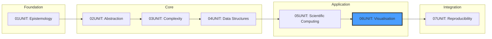
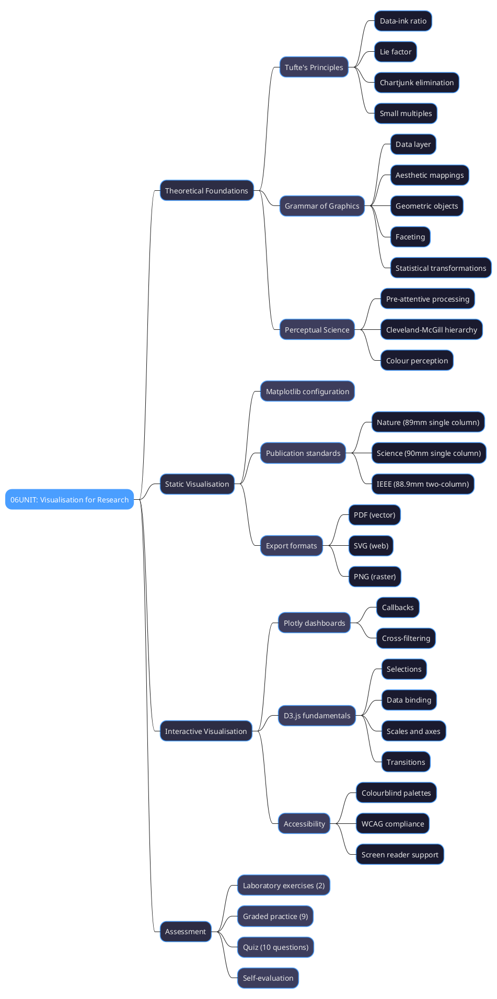
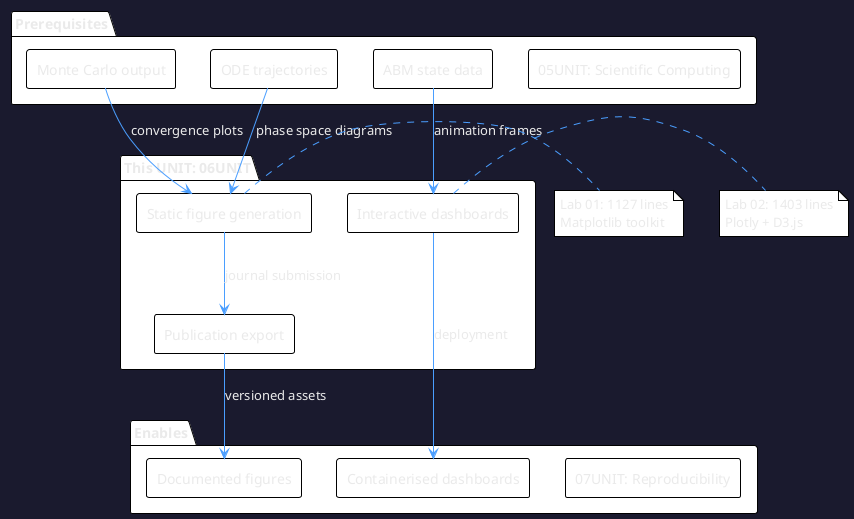
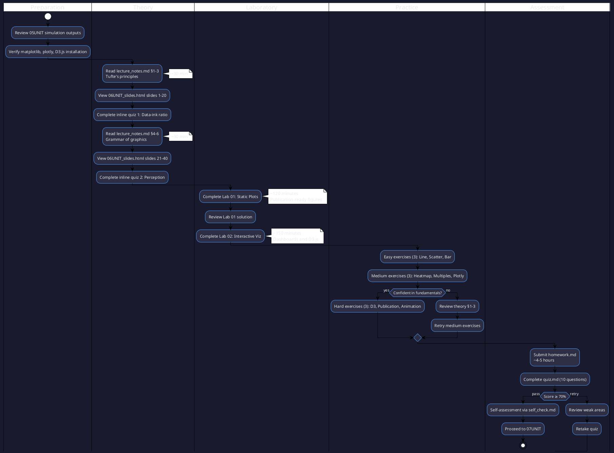
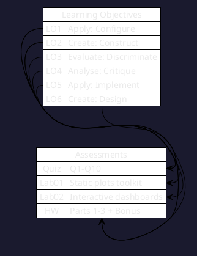
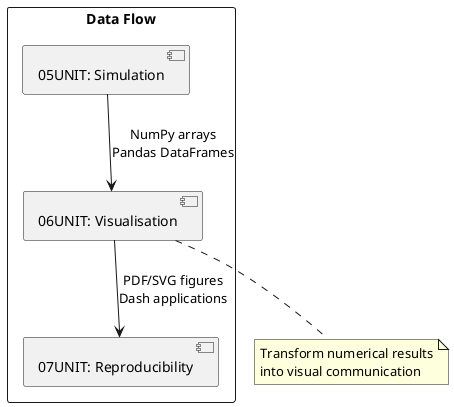

# 06UNIT: Visualisation for Research

## The Art of Computational Thinking for Researchers

> **UNIT 06 of 7** | **Bloom Level**: Create | **Est. Time**: 13–15 hours

---

## 1. UNIT Synopsis

### 1.1 Abstract

This unit establishes the theoretical apparatus and practical competencies requisite for producing publication-ready data visualisations. The treatment synthesises Edward Tufte's principles of graphical excellence with Leland Wilkinson's formal grammar of graphics, instantiating these frameworks through Python's matplotlib ecosystem and D3.js for interactive web-based representations.

Participants progress from foundational perceptual theory—addressing how human visual cognition constrains effective encoding—through implementation of journal-compliant static figures to construction of interactive dashboards supporting brushing, linking and filtering. The unit culminates in evaluative competencies enabling critical analysis of existing visualisations against established metrics including data-ink ratio and lie factor.

**Keywords**: data visualisation, grammar of graphics, Tufte principles, matplotlib, D3.js, publication figures, accessibility, colourblindness

**Estimated Duration**: 13–15 hours (theory: 2.5h, laboratory: 4.5h, exercises: 3h, homework: 4.5h)

**Difficulty Level**: ★★★★☆ (4/5)

### 1.2 Position in Curriculum



This unit occupies position 06 of 7 in the curriculum sequence. It receives simulation output data from 05UNIT (Monte Carlo convergence, ODE trajectories, agent-based model states) and furnishes documented figures essential for 07UNIT's reproducibility and capstone integration.

| Dependency Type | Source | Concepts Required |
|-----------------|--------|-------------------|
| Hard prerequisite | 05UNIT | Simulation output, numerical methods |
| Soft prerequisite | 03UNIT | Complexity awareness for large datasets |
| Corequisite | None | — |

### 1.3 Pedagogical Rationale

The instructional design employs constructivist scaffolding, initiating at the Apply stratum and culminating in Create and Evaluate activities. The sequencing reflects the authentic workflow of research visualisation: first configuring tools to meet specifications, then constructing visualisations, finally critiquing outputs against established principles.

**Instructional Strategies Employed:**

1. **Worked Examples**: Demonstrated solutions for journal-specific configurations with explicit rationale
2. **Cognitive Apprenticeship**: Expert figure construction made visible through annotated code
3. **Deliberate Practice**: Graded exercises targeting specific chart types and techniques
4. **Metacognitive Prompts**: Self-assessment questions encouraging reflection on design decisions
5. **Transfer Tasks**: Application to participants' own research data where available

---

## 2. Visual Overview

### 2.1 Conceptual Architecture

The following diagram depicts the hierarchical organisation of concepts addressed in this unit, illustrating taxonomic relationships and dependency structures:



### 2.2 UNIT Dependencies Graph

Formal specification of prerequisite relationships and knowledge transfer pathways between curriculum units:



### 2.3 Learning Pathway

Sequential activity diagram specifying the recommended traversal of unit materials for optimal knowledge construction:



---

## 3. Learning Objectives

### 3.1 Cognitive Objectives

Upon completion of this unit, participants will demonstrate competence across the following measurable objectives, organised by cognitive demand:

| ID | Level | Verb | Objective Statement | Assessment |
|----|-------|------|---------------------|------------|
| LO1 | Apply | Configure | Configure matplotlib rendering pipelines to produce figures conforming to Nature, Science and IEEE submission requirements | Lab 01 §2–4, Quiz Q1–3 |
| LO2 | Create | Construct | Construct interactive dashboards incorporating brushing, linking and filtering mechanisms using Plotly and D3.js | Lab 02 §1–5, Homework P2 |
| LO3 | Evaluate | Discriminate | Discriminate between visualisation modalities based on data characteristics, research questions and publication constraints | Quiz Q4–6, Self-check |
| LO4 | Analyse | Critique | Critique existing figures through application of Tufte's data-ink ratio and lie factor metrics | Homework P3, Quiz Q9–10 |
| LO5 | Apply | Implement | Implement colourblind-friendly palettes conforming to WCAG accessibility guidelines | Lab 01 §1, Quiz Q7–8 |
| LO6 | Create | Design | Design animated visualisations for temporal data presentation | Hard exercises, Homework bonus |

### 3.2 Skill Objectives (Measurable Outcomes)

**Technical Skills:**

| Skill | Proficiency Level | Evidence |
|-------|-------------------|----------|
| Matplotlib configuration | Competent | Lab 01 completion, test coverage ≥80% |
| Plotly dashboard construction | Proficient | Lab 02 completion, callbacks functional |
| D3.js data binding | Intermediate | Hard exercise 01 completion |
| Publication export | Expert | Homework P1 figure meets journal spec |

**Transferable Skills:**

- **Visual Communication**: Encode quantitative relationships in perceptually accurate representations
- **Critical Analysis**: Evaluate graphical integrity using established metrics
- **Accessibility Awareness**: Consider diverse audiences in design decisions

### 3.3 Affective Objectives

- Appreciate the rhetorical power of visualisation in scientific communication
- Value simplicity and restraint in graphical design
- Develop sensitivity to accessibility requirements across user populations

### 3.4 Objectives-Assessment Alignment Matrix



---

## 4. Theoretical Foundations

### 4.1 Historical Context

The discipline of statistical graphics traces its origins to William Playfair's invention of the line chart (1786) and bar chart (1801). Subsequent developments include Charles Joseph Minard's celebrated 1869 visualisation of Napoleon's Russian campaign—which Tufte regards as perhaps the finest statistical graphic ever produced—and Florence Nightingale's polar area diagrams advocating for sanitary reform.

**Historical Timeline:**

| Year | Contributor | Contribution |
|------|-------------|--------------|
| 1786 | William Playfair | Invention of the line chart |
| 1801 | William Playfair | Invention of the bar chart |
| 1869 | Charles Minard | Multivariate flow map (Napoleon's march) |
| 1983 | Edward Tufte | *The Visual Display of Quantitative Information* |
| 1999 | Leland Wilkinson | *The Grammar of Graphics* |
| 2005 | Hadley Wickham | ggplot2 (grammar implementation in R) |

The evolution from static to interactive graphics reflects broader computational advances, particularly the emergence of web technologies enabling responsive, data-driven documents.

### 4.2 Core Concepts

#### 4.2.1 The Data-Ink Ratio

**Definition 4.1** (Data-Ink). Data-ink comprises the non-redundant, non-erasable ink used to represent data values in a statistical graphic. Decorative elements, redundant encodings and gridlines typically constitute non-data-ink.

**Definition 4.2** (Data-Ink Ratio). The data-ink ratio quantifies graphical efficiency:

$$\text{Data-ink ratio} = \frac{\text{Data-ink}}{\text{Total ink used in graphic}} = 1 - \text{proportion of erasable ink}$$

**Intuition**: A ratio approaching unity indicates a graphic where nearly every visual element encodes information. The principle advocates removing elements whose absence would not diminish information content.

**Example 4.1**: Consider a bar chart with heavy gridlines, three-dimensional bevels, gradient fills and drop shadows. Each element consumes rendering resources without encoding data. Stripping these produces a graphic directing attention solely to the data values.

#### 4.2.2 The Lie Factor

**Definition 4.3** (Lie Factor). The lie factor quantifies distortion in graphical representation:

$$\text{Lie Factor} = \frac{\text{Size of effect shown in graphic}}{\text{Size of effect in data}}$$

Values substantially deviating from unity (conventionally, outside $[0.95, 1.05]$) indicate misleading visual rhetoric.

**Example 4.2**: If revenue increased from £98M to £102M (4.08% increase), and a graphic depicts the second bar as twice the height, the lie factor is approximately:

$$\text{Lie Factor} = \frac{100\%}{4.08\%} \approx 24.5$$

Such distortion grossly exaggerates the underlying change.

### 4.3 Mathematical Framework

#### The Grammar of Graphics Formalisation

Wilkinson's grammar provides a formal specification language. A graphic $G$ may be expressed as a composition of mappings:

$$G = \text{COORD} \circ \text{SCALE} \circ \text{STAT} \circ \text{GEOM} \circ \text{FACET} \circ \text{DATA}$$

where each component transforms the representation:

| Component | Function | Mathematical Description |
|-----------|----------|-------------------------|
| DATA | $D: \mathbb{R}^n \to \mathcal{D}$ | Maps raw values to a data frame structure |
| FACET | $F: \mathcal{D} \to \mathcal{D}^k$ | Partitions data into $k$ subsets by categorical variable |
| GEOM | $G: \mathcal{D} \to \mathcal{V}$ | Maps data points to visual primitives (marks) |
| STAT | $S: \mathcal{D} \to \mathcal{D}'$ | Applies statistical transformations (binning, smoothing) |
| SCALE | $\sigma: \mathcal{V} \to \mathcal{V}'$ | Maps aesthetic values to perceptual ranges |
| COORD | $C: \mathbb{R}^2 \to \mathbb{R}^2$ | Applies coordinate transformations (Cartesian, polar) |

#### Colour Perception Mathematics

The CIE $L^*a^*b^*$ colour space provides a perceptually uniform metric. The colour difference $\Delta E^*_{ab}$ between two colours is:

$$\Delta E^*_{ab} = \sqrt{(\Delta L^*)^2 + (\Delta a^*)^2 + (\Delta b^*)^2}$$

For accessibility, adjacent colours should maintain $\Delta E^*_{ab} \geq 40$ to ensure discriminability under colour vision deficiency.

### 4.4 Formal Definitions

**Definition 4.4** (Pre-attentive Processing). Visual features processed without conscious effort, in under 250 milliseconds, including position, length, colour hue and orientation.

**Definition 4.5** (Cleveland-McGill Hierarchy). A rank ordering of visual encodings by accuracy of human perception:

1. Position along a common scale (most accurate)
2. Position on identical but unaligned scales
3. Length
4. Angle/Slope
5. Area
6. Volume, density, colour saturation (least accurate)

**Theorem 4.1** (Encoding Selection Principle). For quantitative comparisons requiring maximum accuracy, employ position encoding along a common scale; reserve area and colour saturation for secondary categorical distinctions.

---

## 5. Algorithmic Content

### 5.1 Algorithm Catalogue

| Algorithm | Problem | Time Complexity | Space Complexity |
|-----------|---------|-----------------|------------------|
| Figure Configuration | Journal compliance | $O(1)$ | $O(1)$ |
| Colourblind Palette Selection | Accessibility | $O(n)$ | $O(n)$ |
| Data Binning (Histogram) | Distribution summary | $O(n)$ | $O(k)$ |
| Kernel Density Estimation | Smooth distribution | $O(n^2)$ | $O(n)$ |
| Force-Directed Layout | Network visualisation | $O(n^2)$ per iteration | $O(n + e)$ |

### 5.2 Pseudocode: Journal Figure Configuration

```pseudocode
PROCEDURE ConfigureJournalStyle(journal, figure_type)
━━━━━━━━━━━━━━━━━━━━━━━━━━━━━━━━━━━━━━━━━━━━━━━━━━━━━━━━━━━━━━━━━━━━
INPUT:  journal ∈ {Nature, Science, IEEE}
        figure_type ∈ {single_column, double_column, full_page}
OUTPUT: Configured matplotlib rcParams
━━━━━━━━━━━━━━━━━━━━━━━━━━━━━━━━━━━━━━━━━━━━━━━━━━━━━━━━━━━━━━━━━━━━

1   style ← LOAD_JOURNAL_SPEC(journal)
2   
3   IF figure_type = single_column THEN
4   │   width ← style.single_column_width
5   ELSE IF figure_type = double_column THEN
6   │   width ← style.double_column_width
7   ELSE
8   │   width ← style.page_width
9   END IF
10  
11  height ← width × style.aspect_ratio
12  
13  SET rcParams['figure.figsize'] ← (width, height)
14  SET rcParams['font.size'] ← style.base_font_size
15  SET rcParams['font.family'] ← style.font_family
16  SET rcParams['axes.linewidth'] ← style.axis_linewidth
17  SET rcParams['savefig.dpi'] ← style.export_dpi
18  
19  RETURN rcParams

━━━━━━━━━━━━━━━━━━━━━━━━━━━━━━━━━━━━━━━━━━━━━━━━━━━━━━━━━━━━━━━━━━━━
COMPLEXITY: Time O(1), Space O(1)
━━━━━━━━━━━━━━━━━━━━━━━━━━━━━━━━━━━━━━━━━━━━━━━━━━━━━━━━━━━━━━━━━━━━
```

### 5.3 Python Implementation

```python
from dataclasses import dataclass
from typing import Literal
import matplotlib.pyplot as plt

@dataclass(frozen=True)
class JournalSpec:
    """Specification for journal figure requirements."""
    
    single_column_mm: float
    double_column_mm: float
    font_size_pt: int
    font_family: str
    dpi: int
    
    @property
    def single_column_inches(self) -> float:
        """Convert single column width to inches."""
        return self.single_column_mm / 25.4

JOURNAL_SPECS: dict[str, JournalSpec] = {
    'nature': JournalSpec(89.0, 183.0, 7, 'Arial', 300),
    'science': JournalSpec(90.0, 180.0, 8, 'Helvetica', 300),
    'ieee': JournalSpec(88.9, 183.0, 8, 'Times New Roman', 600),
}

def configure_for_journal(
    journal: Literal['nature', 'science', 'ieee'],
    column: Literal['single', 'double'] = 'single',
) -> None:
    """
    Configure matplotlib for journal-compliant figure output.
    
    Args:
        journal: Target journal specification.
        column: Column width selection.
    
    Complexity:
        Time: O(1) — constant-time dictionary access.
        Space: O(1) — modifies global state in-place.
    """
    spec = JOURNAL_SPECS[journal]
    width = (spec.single_column_inches if column == 'single' 
             else spec.double_column_mm / 25.4)
    
    plt.rcParams.update({
        'figure.figsize': (width, width * 0.75),
        'font.size': spec.font_size_pt,
        'font.family': spec.font_family,
        'savefig.dpi': spec.dpi,
        'axes.linewidth': 0.5,
    })
```

---

## 6. Practical Applications

### 6.1 Research Domain Examples

| Domain | Problem | Technique from UNIT | Reference |
|--------|---------|---------------------|-----------|
| Medical Research | Clinical trial results | Forest plots, survival curves | CONSORT guidelines |
| Climate Science | Temperature anomalies | Time series, geographical heatmaps | IPCC visualisation standards |
| Social Science | Survey demographics | Stacked bars, Likert scales | Healy (2018) |
| Neuroscience | Brain imaging | Colourblind-safe palettes | Crameri et al. (2020) |

### 6.2 Case Study: Publication Figure for Nature

**Context**: A Monte Carlo simulation produces 10,000 replicates estimating parameter uncertainty. The figure must fit Nature's single-column width (89mm) with 7pt Arial font.

**Challenge**: Display distribution with confidence interval whilst maximising data-ink ratio.

**Solution**:

```python
import numpy as np
import matplotlib.pyplot as plt

# Configure for Nature
configure_for_journal('nature', 'single')

# Simulate data
np.random.seed(42)
estimates = np.random.normal(2.5, 0.3, 10000)

# Create figure with high data-ink ratio
fig, ax = plt.subplots()
ax.hist(estimates, bins=50, density=True, alpha=0.7, 
        color='#0072B2', edgecolor='none')
ax.axvline(np.mean(estimates), color='#D55E00', linestyle='-', 
           linewidth=1.5, label=f'Mean: {np.mean(estimates):.2f}')
ax.axvline(np.percentile(estimates, 2.5), color='#D55E00', 
           linestyle='--', linewidth=0.8)
ax.axvline(np.percentile(estimates, 97.5), color='#D55E00', 
           linestyle='--', linewidth=0.8)

# Remove chartjunk
ax.spines['top'].set_visible(False)
ax.spines['right'].set_visible(False)
ax.set_xlabel('Parameter estimate')
ax.set_ylabel('Density')

fig.savefig('figure_1.pdf', bbox_inches='tight')
```

**Results**: The figure passes Nature's submission checks: correct dimensions, vector format, embedded fonts, accessibility-compliant colours.

---

## 7. Laboratory Guide

### 7.1 Lab Overview

| Lab | Title | Duration | Primary Objectives | Difficulty |
|-----|-------|----------|-------------------|------------|
| 01 | Static Visualisation Toolkit | 120 min | LO1, LO5: Configure matplotlib, implement accessibility | ★★★☆☆ |
| 02 | Interactive Dashboards | 150 min | LO2, LO6: Plotly callbacks, D3.js data binding | ★★★★☆ |

### 7.2 Lab 01 Synopsis: Static Visualisation Toolkit

**Synopsis**: This laboratory instantiates the theoretical framework from §4 in executable Python code, focusing on publication-ready figure generation with matplotlib.

**Key Files**:
- `lab/lab_06_01_static_plots.py` — Main laboratory module (1,127 lines)
- `lab/solutions/lab_06_01_solution.py` — Reference implementation

**Learning Trajectory**:


### 7.3 Lab 02 Synopsis: Interactive Dashboards

**Synopsis**: This laboratory extends static visualisation to interactive contexts, implementing callbacks for cross-filtering and introducing D3.js selection-based data binding.

**Key Files**:
- `lab/lab_06_02_interactive_viz.py` — Main laboratory module (1,403 lines)
- `lab/solutions/lab_06_02_solution.py` — Reference implementation

### 7.4 Integration Points

Both laboratories produce outputs consumed by 07UNIT:
- Generated figures → documentation assets
- Dashboard code → containerisation targets
- Test coverage → CI/CD pipeline integration

---

## 8. Exercise Framework

### 8.1 Difficulty Progression

```
Easy (★☆☆☆☆)        → Direct application of single concept
    ↓                  Line plot, scatter, bar chart
Medium (★★★☆☆)      → Combination of 2-3 concepts
    ↓                  Heatmap, small multiples, Plotly
Hard (★★★★★)        → Novel synthesis, optimisation required
                       D3.js, publication figure, animation
```

### 8.2 Exercise-Objective Mapping

| Exercise | Objectives | Concepts | Estimated Time |
|----------|------------|----------|----------------|
| easy_01_line_plot | LO1 | Time series, axis configuration | 10 min |
| easy_02_scatter_regression | LO1, LO5 | Scatter, colour encoding | 10 min |
| easy_03_bar_chart | LO1 | Categorical comparison | 10 min |
| medium_01_heatmap | LO1, LO5 | Matrix display, colourmap | 15 min |
| medium_02_small_multiples | LO1, LO4 | Faceting, comparison | 15 min |
| medium_03_plotly_interactive | LO2 | Callbacks, hover | 15 min |
| hard_01_d3_bar_chart | LO2 | D3 selections, scales | 20 min |
| hard_02_publication_figure | LO1, LO4 | Journal compliance | 20 min |
| hard_03_animation | LO6 | Temporal encoding | 20 min |

---

## 9. Technical Reference

### 9.1 Key Functions Summary

| Function | Module | Purpose |
|----------|--------|---------|
| `configure_for_journal()` | lab_06_01 | Set matplotlib rcParams for journal specs |
| `get_colorblind_palette()` | lab_06_01 | Return accessibility-compliant colours |
| `create_dashboard()` | lab_06_02 | Construct Plotly Dash application |
| `d3_bar_chart()` | lab_06_02 | Generate D3.js bar chart HTML |

### 9.2 Data Structures

```python
@dataclass
class JournalSpec:
    single_column_mm: float
    double_column_mm: float
    font_size_pt: int
    font_family: str
    dpi: int

@dataclass
class ColourPalette:
    name: str
    colours: list[str]
    is_colorblind_safe: bool
    max_categories: int
```

---

## 10. Visual Assets Catalogue

### 10.1 Diagrams Index

| File | Type | Description |
|------|------|-------------|
| `grammar_of_graphics.puml` | PlantUML | Layer composition model |
| `visualisation_selection.puml` | PlantUML | Decision tree for chart types |
| `dashboard_layout_patterns.puml` | PlantUML | Common layouts with trade-offs |
| `grammar_of_graphics.svg` | SVG | Rendered layer diagram |
| `tufte_principles.svg` | SVG | Data-ink ratio illustration |
| `d3_enter_update_exit.svg` | SVG | D3 data binding lifecycle |

### 10.2 Interactive Demos

| File | Technology | Description |
|------|------------|-------------|
| `06UNIT_chart_animation.html` | D3.js | Animated bar chart transitions |
| `06UNIT_slides.html` | reveal.js | 45-slide presentation |

---

## 11. Assessment Framework

### 11.1 Formative Assessment

- **Inline quizzes** in slides (3 checkpoints)
- **Lab self-tests** with immediate feedback
- **Practice exercises** with solutions

### 11.2 Summative Assessment

- **Quiz**: 10 questions, 70% pass threshold
- **Homework**: 100 points across 3 parts + bonus

### 11.3 Rubric Summary

| Component | Weight | Criteria |
|-----------|--------|----------|
| Lab completion | 30% | All demos run, tests pass |
| Homework | 50% | Correctness, style, documentation |
| Quiz | 20% | Conceptual understanding |

---

## 12. Connections and Context

### 12.1 Prerequisites Deep Dive

From **05UNIT: Scientific Computing**, participants should possess:

- **Monte Carlo output**: Convergence data requiring error visualisation
- **ODE trajectories**: Phase space coordinates for plotting
- **ABM states**: Temporal snapshots for animation frames

### 12.2 Forward References

Materials produced feed into **07UNIT: Reproducibility**:

- Generated figures → versioned assets in project structure
- Dashboard code → containerisation with Docker
- Test coverage → CI/CD integration via GitHub Actions

### 12.3 Cross-UNIT Concept Map



---

## 13. Quick Start Guide

### 13.1 Environment Setup

```bash
# Create virtual environment
python -m venv .venv
source .venv/bin/activate  # Linux/macOS
# .venv\Scripts\activate   # Windows

# Install dependencies
pip install matplotlib>=3.7 seaborn>=0.12 plotly>=5.18 numpy>=1.24 pandas>=2.0
```

### 13.2 Verification Commands

```bash
# Navigate to UNIT directory
cd 06UNIT

# Verify environment
make check

# Run Lab 01 demonstration
python -m lab.lab_06_01_static_plots --demo

# Run Lab 02 demonstration
python -m lab.lab_06_02_interactive_viz --demo

# Execute test suite
make test

# Validate UNIT structure
python ../scripts/validate_unit.py 06
```

### 13.3 First Steps

1. Read `theory/lecture_notes.md` (§1-3)
2. Open `theory/06UNIT_slides.html` in browser
3. Run Lab 01 with `--demo` flag
4. Attempt `exercises/practice/easy_01_line_plot.py`

---

## 14. Directory Structure

### 14.1 Visual Tree

```
06UNIT/
├── 📄 README.md                    ← Current document
├── 📚 theory/
│   ├── 06UNIT_slides.html          ← 45 slides, reveal.js 5.0
│   ├── lecture_notes.md            ← Theoretical exposition (~2,500 words)
│   └── learning_objectives.md      ← Measurable outcomes
├── 🔬 lab/
│   ├── __init__.py
│   ├── lab_06_01_static_plots.py   ← 1,127 lines
│   ├── lab_06_02_interactive_viz.py ← 1,403 lines
│   └── solutions/
│       ├── lab_06_01_solution.py
│       └── lab_06_02_solution.py
├── ✏️ exercises/
│   ├── homework.md                 ← 100 points
│   ├── practice/                   ← 9 exercises
│   │   ├── easy_01_line_plot.py
│   │   ├── easy_02_scatter_regression.py
│   │   ├── easy_03_bar_chart.py
│   │   ├── medium_01_heatmap.py
│   │   ├── medium_02_small_multiples.py
│   │   ├── medium_03_plotly_interactive.py
│   │   ├── hard_01_d3_bar_chart.py
│   │   ├── hard_02_publication_figure.py
│   │   └── hard_03_animation.py
│   └── solutions/
├── 📊 assets/
│   ├── diagrams/
│   │   ├── grammar_of_graphics.puml
│   │   ├── visualisation_selection.puml
│   │   ├── dashboard_layout_patterns.puml
│   │   ├── grammar_of_graphics.svg
│   │   ├── tufte_principles.svg
│   │   └── d3_enter_update_exit.svg
│   └── animations/
│       └── 06UNIT_chart_animation.html
├── 📝 assessments/
│   ├── quiz.md                     ← 10 questions
│   ├── rubric.md                   ← Grading criteria
│   └── self_check.md               ← Self-evaluation
├── 📖 resources/
│   ├── cheatsheet.md               ← A4 reference
│   ├── further_reading.md          ← Bibliography
│   ├── glossary.md                 ← Terminology
│   └── datasets/
│       ├── sample_timeseries.csv
│       ├── sample_research_data.json
│       └── correlation_matrix.csv
├── 🧪 tests/
│   ├── __init__.py
│   ├── conftest.py
│   ├── test_lab_06_01.py
│   └── test_lab_06_02.py
└── Makefile
```

---

## 15. Progress Tracking

### 15.1 Completion Checklist

| Component | Status | Estimated Duration | Notes |
|-----------|--------|-------------------|-------|
| Lecture notes read | ⬜ | 45 min | Theoretical foundations |
| Slides presentation viewed | ⬜ | 90 min | Includes inline quizzes |
| Lab 01 completed | ⬜ | 120 min | Static visualisation toolkit |
| Lab 02 completed | ⬜ | 150 min | Interactive dashboards |
| Easy exercises (3) | ⬜ | 30 min | Line, scatter, bar |
| Medium exercises (3) | ⬜ | 45 min | Heatmap, multiples, Plotly |
| Hard exercises (3) | ⬜ | 60 min | D3, publication, animation |
| Homework submitted | ⬜ | 4–5 hours | 100 points |
| Quiz passed (≥70%) | ⬜ | 20 min | 10 questions |
| Self-assessment completed | ⬜ | 15 min | Reflective evaluation |

### 15.2 Time Estimates

| Category | Hours | Percentage |
|----------|-------|------------|
| Theory | 2.5 | 17% |
| Laboratory | 4.5 | 31% |
| Exercises | 3.0 | 21% |
| Homework | 4.5 | 31% |
| **Total** | **14.5** | **100%** |

---

## 16. Troubleshooting

### 16.1 Common Issues

| Issue | Cause | Solution |
|-------|-------|----------|
| `ModuleNotFoundError: matplotlib` | Missing dependency | `pip install matplotlib>=3.7` |
| Font not found in PDF | System fonts | Install Arial/Helvetica or use DejaVu |
| D3.js not loading | CORS restrictions | Use local server: `python -m http.server` |
| Plotly callback not firing | Incorrect decorator | Check `@app.callback` syntax |

### 16.2 FAQ

**Q: Can I use seaborn instead of matplotlib?**
A: Yes, seaborn builds on matplotlib and inherits its rcParams configuration.

**Q: How do I export for IEEE submissions?**
A: Use `configure_for_journal('ieee')` and export as EPS or PDF at 600 DPI.

**Q: Are my colours accessible?**
A: Test with `colorspacious` or online tools like Coblis.

---

## 17. Further Reading

### 17.1 Primary Sources

- Tufte, E.R. (1983). *The Visual Display of Quantitative Information*. Graphics Press.
- Wilkinson, L. (1999). *The Grammar of Graphics*. Springer.

### 17.2 Modern References

- Healy, K. (2018). *Data Visualization: A Practical Introduction*. Princeton.
- Wickham, H. (2016). *ggplot2: Elegant Graphics for Data Analysis*. Springer.

### 17.3 Research Papers

- Cleveland, W.S. & McGill, R. (1984). Graphical Perception. *JASA*, 79(387).
- Crameri, F. et al. (2020). The misuse of colour in science communication. *Nature Communications*.

### 17.4 Online Resources

- Matplotlib documentation: https://matplotlib.org/stable/
- D3.js documentation: https://d3js.org/
- Plotly Python: https://plotly.com/python/

---

## 18. Glossary

| Term | Definition |
|------|------------|
| **Chartjunk** | Decorative elements that do not encode data |
| **Data-ink ratio** | Proportion of ink used to represent actual data values |
| **Faceting** | Subdivision of a plot into panels by categorical variable |
| **Grammar of graphics** | Formal specification language for statistical visualisations |
| **Lie factor** | Ratio of visual effect size to data effect size |
| **Pre-attentive processing** | Visual perception occurring without conscious effort |
| **Small multiples** | Series of similar charts shown together for comparison |

---

## 19. Visualisation Selection Guide

The choice of visual encoding depends upon data type, dimensionality and communicative intent:

| Data Characteristic | Recommended Visualisation | Avoid |
|---------------------|---------------------------|-------|
| Univariate distribution | Histogram, density plot, box plot | Pie chart |
| Bivariate continuous | Scatter plot, hexbin, 2D density | 3D surface (overplotting) |
| Time series | Line plot, area chart | Bar chart (discrete appearance) |
| Categorical comparison | Bar chart, dot plot | Pie chart (perceptual limitations) |
| Part-to-whole | Stacked bar, treemap | 3D pie (distortion) |
| Multivariate | Parallel coordinates, heatmap | Radar chart (>5 axes) |
| Hierarchical | Treemap, sunburst, icicle | Network diagram (for trees) |
| Network/relational | Force-directed, adjacency matrix | Chord diagram (dense networks) |

---

## 📜 Licence and Terms of Use

╔═══════════════════════════════════════════════════════════════════════════════╗
║                           RESTRICTIVE LICENCE                                  ║
║                              Version 3.2.0                                     ║
║                             January 2025                                       ║
╠═══════════════════════════════════════════════════════════════════════════════╣
║                                                                               ║
║   © 2025 Antonio Clim. All rights reserved.                                   ║
║                                                                               ║
║   PERMITTED:                                                                  ║
║   ✓ Personal use for self-study                                               ║
║   ✓ Viewing and running code for personal educational purposes                ║
║   ✓ Local modifications for personal experimentation                          ║
║                                                                               ║
║   PROHIBITED (without prior written consent):                                 ║
║   ✗ Publishing materials (online or offline)                                  ║
║   ✗ Use in formal teaching activities                                         ║
║   ✗ Teaching or presenting materials to third parties                         ║
║   ✗ Redistribution in any form                                                ║
║   ✗ Creating derivative works for public use                                  ║
║   ✗ Commercial use of any kind                                                ║
║                                                                               ║
║   For requests regarding educational use or publication,                      ║
║   please contact the author to obtain written consent.                        ║
║                                                                               ║
╚═══════════════════════════════════════════════════════════════════════════════╝

### Terms and Conditions

1. **Intellectual Property**: All materials, including but not limited to code, documentation, presentations and exercises, are the intellectual property of Antonio Clim.

2. **No Warranty**: Materials are provided "as is" without warranty of any kind, express or implied.

3. **Limitation of Liability**: The author shall not be liable for any damages arising from the use of these materials.

4. **Governing Law**: These terms are governed by the laws of Romania.

5. **Contact**: For permissions and enquiries, contact the author through official academic channels.

### Technology Stack

| Technology | Version | Purpose |
|------------|---------|---------|
| Python | 3.12+ | Primary programming language |
| NumPy | ≥1.24 | Numerical computing |
| Pandas | ≥2.0 | Data manipulation |
| Matplotlib | ≥3.7 | Static visualisation |
| Seaborn | ≥0.12 | Statistical visualisation |
| Plotly | ≥5.18 | Interactive visualisation |
| SciPy | ≥1.11 | Scientific computing |
| pytest | ≥7.0 | Testing framework |
| pytest-cov | ≥4.0 | Coverage reporting |
| ruff | ≥0.1 | Linting and formatting |
| mypy | ≥1.0 | Type checking |
| Docker | 24+ | Containerisation |
| reveal.js | 5.0 | Presentation framework |
| D3.js | 7.8+ | Data-driven documents |
| PlantUML | 1.2024+ | Diagram generation |

---

*THE ART OF COMPUTATIONAL THINKING FOR RESEARCHERS*  
*06UNIT — Visualisation for Research*
