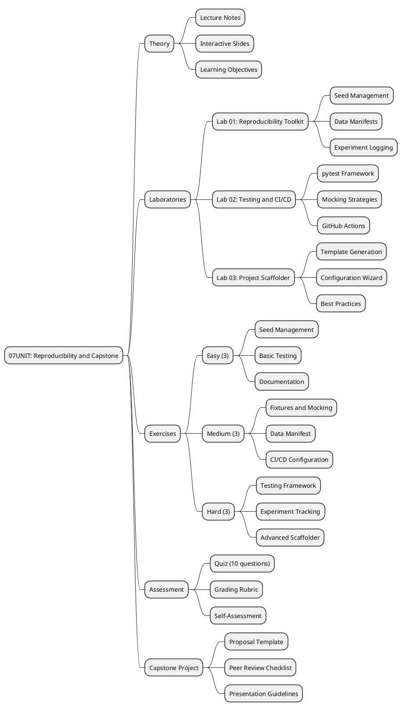
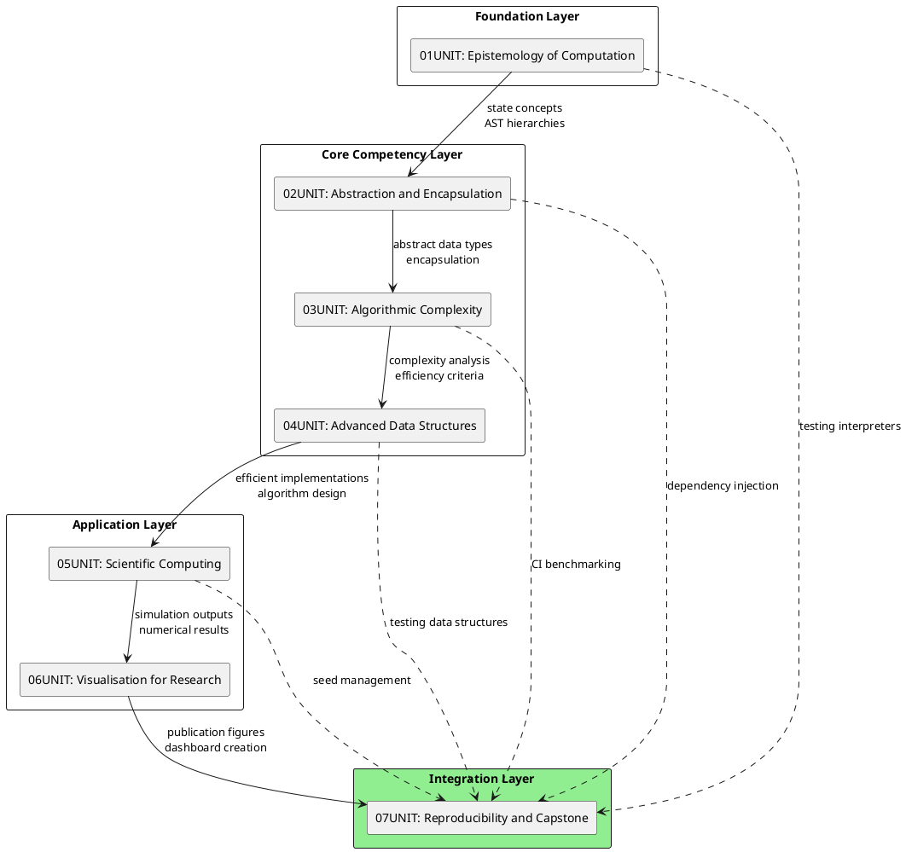
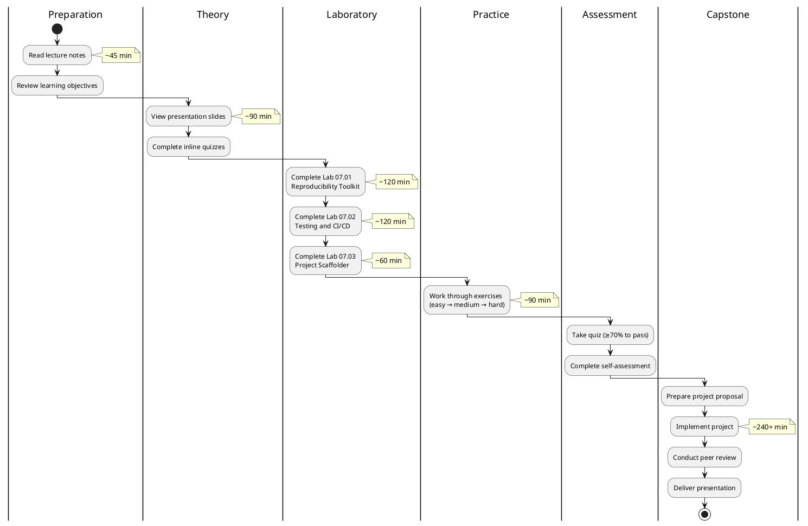
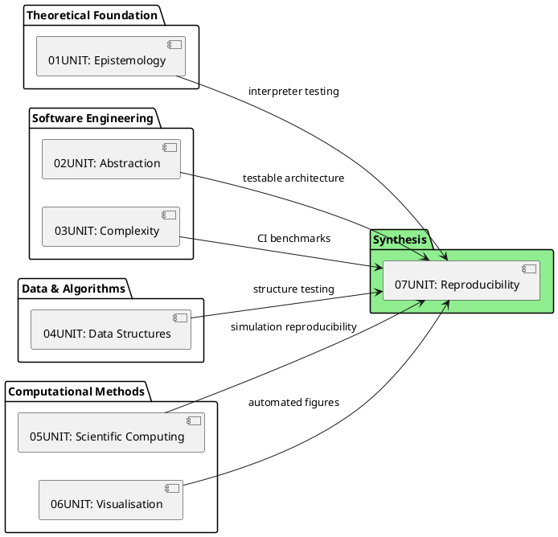

# 07UNIT: Reproducibility and Capstone

## The Art of Computational Thinking for Researchers

> **UNIT 07 of 7** | **Bloom Level**: Create/Evaluate | **Est. Time**: 11 hours

---

## 📊 UNIT Architecture



---

## Overview

This concluding UNIT synthesises the theoretical foundations and practical competencies developed throughout the preceding six units into a cohesive framework for reproducible computational research. The materials address a critical challenge confronting modern science: the reproducibility crisis, wherein a substantial proportion of published computational findings prove irreproducible even by their original authors. The Nature survey of 2016 revealed that 70% of researchers had failed to reproduce another scientist's experiments, whilst 50% could not replicate their own work—figures that underscore the imperative for rigorous software engineering practices in research contexts.

The laboratory components provide hands-on experience with the tooling and methodologies that distinguish professional research software from ad hoc scripts: comprehensive testing pyramids, continuous integration pipelines, cryptographic data verification, structured experiment logging, and automated project scaffolding. These competencies constitute prerequisites for meaningful participation in open science initiatives and collaborative research endeavours.

**Core Themes**: Reproducibility crisis and its computational dimensions, Testing architectures (unit, integration, end-to-end), Continuous integration and deployment (GitHub Actions), Documentation frameworks (Sphinx, MkDocs), Version control workflows, Peer review methodologies

---

## 🎯 Learning Objectives

| # | Objective | Bloom Level | Lab Coverage | Assessment |
|---|-----------|-------------|--------------|------------|
| 1 | Implement comprehensive testing suites using pytest with fixtures, parametrisation and mocking | [Apply] | Lab 02, §1-3 | Quiz Q1-4, Homework P1 |
| 2 | Configure continuous integration pipelines with GitHub Actions for automated quality assurance | [Apply] | Lab 02, §4-5 | Quiz Q5-6, Homework P2 |
| 3 | Construct reproducible project structures with proper documentation and dependency management | [Create] | Lab 01, 03 | Homework P3, Capstone |
| 4 | Evaluate research software against established reproducibility criteria through structured peer review | [Evaluate] | All Labs | Self-check, Peer Review |

---

## 🔗 Prerequisites

### Dependency Graph



This UNIT presupposes completion of all preceding units. The capstone project requires demonstrable competence across the full curriculum: computational foundations from 01UNIT inform testing strategies for interpreters; design patterns from 02UNIT enable testable architectures through dependency injection; complexity analysis from 03UNIT integrates into continuous integration benchmarks; data structure implementations from 04UNIT require comprehensive test suites; scientific computing simulations from 05UNIT demand reproducible seed management; and visualisation outputs from 06UNIT necessitate automated figure generation within CI pipelines.

---

## 📐 Mathematical Foundations

### Cryptographic Hash Functions for Data Integrity

The data manifest system employs cryptographic hash functions $H: \{0,1\}^* \rightarrow \{0,1\}^n$ satisfying:

$$\text{Pre-image resistance}: \forall y \in \{0,1\}^n, \text{ finding } x \text{ s.t. } H(x) = y \text{ is computationally infeasible}$$

$$\text{Collision resistance}: \text{Finding } x_1 \neq x_2 \text{ s.t. } H(x_1) = H(x_2) \text{ is computationally infeasible}$$

SHA-256 produces 256-bit digests, yielding a collision probability bounded by the birthday paradox:

$$P(\text{collision}) \approx 1 - e^{-\frac{n^2}{2 \cdot 2^{256}}}$$

For $n = 10^9$ files, $P(\text{collision}) < 10^{-58}$—negligible for practical purposes.

### Test Coverage Metrics

Test coverage $C$ quantifies the proportion of code exercised by the test suite:

$$C_{\text{line}} = \frac{|\text{executed lines}|}{|\text{total lines}|} \times 100\%$$

$$C_{\text{branch}} = \frac{|\text{executed branches}|}{|\text{total branches}|} \times 100\%$$

The testing pyramid prescribes proportional distribution:

$$\text{Unit} : \text{Integration} : \text{E2E} \approx 70\% : 20\% : 10\%$$

---

## 📚 Learning Path



---

## 📁 UNIT Structure

```
07UNIT/
├── 📄 README.md                        ← You are here
│
├── 📚 theory/
│   ├── 07UNIT_slides.html              ← 45+ slides, ~90 min
│   ├── lecture_notes.md                ← 2,500+ words
│   └── learning_objectives.md          ← Measurable objectives
│
├── 🔬 lab/
│   ├── __init__.py                     ← Package initialisation
│   ├── lab_07_01_reproducibility.py    ← 944 lines, seed/manifest
│   ├── lab_07_02_testing_cicd.py       ← 880 lines, pytest/Actions
│   ├── lab_07_03_project_scaffolder.py ← 1005 lines, templates
│   └── solutions/
│       ├── lab_07_01_solution.py
│       ├── lab_07_02_solution.py
│       └── lab_07_03_solution.py
│
├── ✏️ exercises/
│   ├── homework.md                     ← Capstone requirements
│   ├── practice/
│   │   ├── easy_01_seed_management.py
│   │   ├── easy_02_basic_testing.py
│   │   ├── easy_03_documentation.py
│   │   ├── medium_01_fixtures_mocking.py
│   │   ├── medium_02_data_manifest.py
│   │   ├── medium_03_cicd_config.py
│   │   ├── hard_01_testing_framework.py
│   │   ├── hard_02_experiment_tracking.py
│   │   └── hard_03_advanced_scaffolder.py
│   └── solutions/
│       └── *.py
│
├── 📋 assessments/
│   ├── quiz.md                         ← 10 questions
│   ├── rubric.md                       ← Grading criteria
│   └── self_check.md                   ← Self-assessment
│
├── 📖 resources/
│   ├── cheatsheet.md                   ← One-pager A4
│   ├── further_reading.md              ← 10+ resources
│   ├── glossary.md                     ← UNIT terminology
│   └── datasets/
│       └── sample_experiment.json
│
├── 🎨 assets/
│   ├── diagrams/
│   │   ├── cicd_pipeline.puml
│   │   ├── project_structure.puml
│   │   ├── testing_pyramid.puml
│   │   ├── ci_cd_pipeline.svg
│   │   ├── project_structure.svg
│   │   ├── testing_pyramid.svg
│   │   ├── reproducibility_spectrum.svg
│   │   └── code_review_checklist.svg
│   ├── animations/
│   │   └── 07UNIT_project_scaffolder.html
│   └── images/
│       └── 07UNIT_badge.svg
│
├── 🧪 tests/
│   ├── __init__.py
│   ├── conftest.py
│   ├── test_lab_07_01.py
│   ├── test_lab_07_02.py
│   └── test_lab_07_03.py
│
└── Makefile
```

---

## 💻 Key Algorithms

### Reproducibility Configuration (Pseudocode)

```pseudocode
PROCEDURE ConfigureReproducibility(seed)
    INPUT: Integer seed value
    OUTPUT: All random generators configured deterministically
    
    SET Python.random.seed(seed)
    SET os.environ["PYTHONHASHSEED"] = string(seed)
    
    IF NumPy available THEN
        SET numpy.random.seed(seed)
    END IF
    
    IF PyTorch available THEN
        SET torch.manual_seed(seed)
        IF CUDA available THEN
            SET torch.cuda.manual_seed_all(seed)
        END IF
        SET torch.backends.cudnn.deterministic = TRUE
        SET torch.backends.cudnn.benchmark = FALSE
    END IF
    
    IF TensorFlow available THEN
        SET tensorflow.random.set_seed(seed)
    END IF
    
    LOG "Reproducibility configured: seed={seed}"
END PROCEDURE
```

### Data Manifest Verification

```python
def verify_data_integrity(manifest_path: Path) -> dict[str, bool]:
    """
    Verify all files in a data manifest against stored checksums.
    
    Implements cryptographic verification using SHA-256 hashes
    computed during manifest creation. Returns mapping of file
    paths to verification status.
    
    Args:
        manifest_path: Path to JSON manifest file.
    
    Returns:
        Dictionary mapping file paths to boolean verification results.
    
    Complexity:
        Time: O(n × m) where n = file count, m = average file size.
        Space: O(n) for result dictionary.
    """
    manifest = json.loads(manifest_path.read_text())
    results = {}
    
    for filepath, expected_hash in manifest["files"].items():
        actual_hash = compute_sha256(filepath)
        results[filepath] = (actual_hash == expected_hash)
    
    return results
```

---

## 🚀 Quick Start

```bash
# 1. Navigate to UNIT directory
cd 07UNIT

# 2. Verify environment
make check

# 3. Run labs with demonstration mode
python -m lab.lab_07_01_reproducibility --demo
python -m lab.lab_07_02_testing_cicd --demo
python -m lab.lab_07_03_project_scaffolder --demo

# 4. Execute test suite
make test

# 5. Validate UNIT structure
python ../scripts/validate_unit.py 07
```

---

## ✅ Progress Checklist

| Component | Status | Estimated Duration |
|-----------|--------|-------------------|
| Lecture notes studied | ⬜ | ~45 min |
| Presentation slides viewed | ⬜ | ~90 min |
| Lab 01: Reproducibility Toolkit completed | ⬜ | ~120 min |
| Lab 02: Testing and CI/CD completed | ⬜ | ~120 min |
| Lab 03: Project Scaffolder completed | ⬜ | ~60 min |
| Easy exercises (3) completed | ⬜ | ~30 min |
| Medium exercises (3) completed | ⬜ | ~45 min |
| Hard exercises (3) completed | ⬜ | ~60 min |
| Quiz passed (≥70%) | ⬜ | ~15 min |
| Self-assessment completed | ⬜ | ~20 min |
| Capstone project proposal submitted | ⬜ | ~60 min |
| Capstone project implemented | ⬜ | ~240+ min |
| Peer review conducted | ⬜ | ~30 min |
| Presentation delivered | ⬜ | ~20 min |

---

## 🔄 UNIT Connections

### Integration with Course Curriculum



### Capstone Project Integration Matrix

| Previous UNIT | Concept | Capstone Application |
|---------------|---------|---------------------|
| 01UNIT | Turing machines, interpreters | Testing computational models |
| 02UNIT | Design patterns, SOLID | Dependency injection for testability |
| 03UNIT | Complexity analysis | Performance regression testing in CI |
| 04UNIT | Graphs, probabilistic structures | Test suite for data structure implementations |
| 05UNIT | Monte Carlo, ODE solvers | Seed-controlled reproducible simulations |
| 06UNIT | Publication figures | Automated figure generation and validation |

---

## 📖 Research Context

The reproducibility crisis extends beyond psychology and biomedical sciences into computational disciplines. A 2018 study by Stodden et al. found that only 26% of articles in Science from 2011-2012 provided access to data, and merely 22% included code. Even when code was available, fewer than half of those scripts could be executed successfully. This UNIT addresses these systemic deficiencies through:

1. **Deterministic execution**: Comprehensive seed management across all stochastic operations
2. **Data provenance**: Cryptographic hashing and manifest verification
3. **Environment capture**: Dependency pinning and containerisation
4. **Automated validation**: Continuous integration with quality gates

The testing pyramid—70% unit tests, 20% integration tests, 10% end-to-end tests—derives from industry practice but adapts well to research software. Unit tests verify individual functions in isolation; integration tests confirm component interactions; end-to-end tests validate complete workflows against expected outputs.

---

## 📜 Licence and Terms of Use

╔═══════════════════════════════════════════════════════════════════════════════╗
║                           RESTRICTIVE LICENCE                                  ║
║                              Version 3.1.0                                     ║
║                             January 2025                                       ║
╠═══════════════════════════════════════════════════════════════════════════════╣
║                                                                               ║
║   © 2025 Antonio Clim. All rights reserved.                                   ║
║                                                                               ║
║   PERMITTED:                                                                  ║
║   ✓ Personal use for self-study                                               ║
║   ✓ Viewing and running code for personal educational purposes                ║
║   ✓ Local modifications for personal experimentation                          ║
║                                                                               ║
║   PROHIBITED (without prior written consent):                                 ║
║   ✗ Publishing materials (online or offline)                                  ║
║   ✗ Use in formal teaching activities                                         ║
║   ✗ Teaching or presenting materials to third parties                         ║
║   ✗ Redistribution in any form                                                ║
║   ✗ Creating derivative works for public use                                  ║
║   ✗ Commercial use of any kind                                                ║
║                                                                               ║
║   For requests regarding educational use or publication,                      ║
║   please contact the author to obtain written consent.                        ║
║                                                                               ║
╚═══════════════════════════════════════════════════════════════════════════════╝

### Terms and Conditions

1. **Intellectual Property**: All materials, including but not limited to code,
   documentation, presentations and exercises, are the intellectual property of
   Antonio Clim.

2. **No Warranty**: Materials are provided "as is" without warranty of any kind,
   express or implied.

3. **Limitation of Liability**: The author shall not be liable for any damages
   arising from the use of these materials.

4. **Governing Law**: These terms are governed by the laws of Romania.

5. **Contact**: For permissions and enquiries, contact the author through
   official academic channels.

### Technology Stack

| Technology | Version | Purpose |
|------------|---------|---------|
| Python | 3.12+ | Primary programming language |
| NumPy | ≥1.24 | Numerical computing |
| Pandas | ≥2.0 | Data manipulation |
| Matplotlib | ≥3.7 | Static visualisation |
| SciPy | ≥1.11 | Scientific computing |
| NetworkX | ≥3.0 | Graph algorithms |
| pytest | ≥7.0 | Testing framework |
| pytest-cov | ≥4.0 | Coverage reporting |
| ruff | ≥0.1 | Linting and formatting |
| mypy | ≥1.0 | Type checking |
| Docker | 24+ | Containerisation |
| Node.js | 20 LTS | JavaScript runtime |
| reveal.js | 5.0 | Presentation framework |
| PlantUML | 1.2024+ | Diagram generation |
| D3.js | 7.8+ | Interactive visualisations |

---
