# 07UNIT: Reproducibility and Capstone

## The Art of Computational Thinking for Researchers


> **UNIT 07 of 7** | **Bloom Level**: Create/Evaluate | **Est. Time**: 11 hours

---

## 1. UNIT Synopsis

### 1.1 Abstract

This culminating unit addresses the reproducibility imperative that defines rigorous computational scholarship. The materials systematically treat the methodological, technical and cultural dimensions of reproducible research software development—an area where contemporary computational practice demonstrably falls short of scientific ideals. A 2016 Nature survey revealed that 70% of researchers failed to reproduce others' experiments whilst 50% could not replicate their own work; parallel studies in computational disciplines by Stodden et al. (2018) found that fewer than 26% of Science articles provided data access and merely 22% included executable code.

The laboratory components instantiate theoretical principles through practical tooling: deterministic seed management across heterogeneous stochastic sources, cryptographic data verification via SHA-256 manifests, pytest-based testing architectures adhering to the canonical testing pyramid, GitHub Actions continuous integration pipelines, and template-driven project scaffolding. These competencies constitute prerequisites for meaningful participation in open science initiatives, collaborative research endeavours and the broader movement toward computational transparency.

**Keywords**: reproducibility crisis, continuous integration, testing pyramid, data provenance, seed management, GitHub Actions, peer review

**Estimated Duration**: 11 hours (theory: 2.5h, laboratory: 5h, exercises: 3.5h)

**Difficulty Level**: ★★★★★ (5/5)

### 1.2 Position in Curriculum


This unit occupies the terminal position in the curriculum sequence, synthesising concepts from all preceding units into a coherent framework for reproducible research software. The capstone project requires demonstrable competence across the full curriculum: computational foundations from 01UNIT inform testing strategies for interpreters; design patterns from 02UNIT enable testable architectures through dependency injection; complexity analysis from 03UNIT integrates into continuous integration benchmarks; data structure implementations from 04UNIT require test suites; scientific computing simulations from 05UNIT demand reproducible seed management; and visualisation outputs from 06UNIT necessitate automated figure generation within CI pipelines.

| Dependency Type | Source | Concepts Required |
|-----------------|--------|-------------------|
| Hard prerequisite | 01-06UNIT | All preceding concepts |
| Soft prerequisite | None | — |
| Corequisite | None | — |

### 1.3 Pedagogical Rationale

The instructional design follows constructivist principles, scaffolding knowledge acquisition through progressive complexity. The sequence initiates at the Apply stratum (implementing testing suites, configuring CI pipelines) and culminates in Create/Evaluate activities (designing reproducible project structures, conducting peer review against established criteria). The capstone project serves as a summative assessment demanding synthesis across all cognitive levels.

**Instructional Strategies Employed:**

1. **Worked Examples**: Demonstrated solutions with explicit reasoning traces for testing and CI configuration
2. **Cognitive Apprenticeship**: Expert reproducibility practices made visible through scaffolder templates
3. **Deliberate Practice**: Targeted exercises addressing specific testing and documentation subskills
4. **Metacognitive Prompts**: Self-assessment and peer review reflection opportunities
5. **Transfer Tasks**: Application of reproducibility principles to novel research contexts via capstone

---

## 2. Visual Overview

### 2.1 Conceptual Architecture


### 2.2 UNIT Dependencies Graph


### 2.3 Learning Pathway

```plantuml
@startuml
!theme plain
skinparam backgroundColor #1a1a2e
skinparam defaultFontColor #eaeaea
skinparam ActivityBackgroundColor #2d2d44
skinparam ActivityBorderColor #4a9eff

|Preparation|
start
:Review all preceding UNIT concepts;
:Verify environment setup;
note right: Python 3.12+, pytest, ruff

|Theory|
:Study lecture notes §1-4;
note right: ~45 min
:View slides 1-20;
:Complete inline quiz 1;
:Study lecture notes §5-8;
:View slides 21-45;
:Complete inline quiz 2;
note right: ~90 min total

|Laboratory|
:Complete Lab 01\nReproducibility Toolkit;
note right
  ~120 min
  Seed management
  Data manifests
end note
:Complete Lab 02\nTesting and CI/CD;
note right
  ~120 min
  pytest, fixtures
  GitHub Actions
end note
:Complete Lab 03\nProject Scaffolder;
note right
  ~60 min
  Template generation
end note

|Practice|
:Easy exercises (3);
note right: ~30 min
:Medium exercises (3);
note right: ~45 min
if (Confident?) then (yes)
  :Hard exercises (3);
  note right: ~60 min
else (no)
  :Review theory;
  :Retry medium exercises;
endif

|Assessment|
:Complete quiz (≥70%);
:Self-assessment reflection;
if (Score ≥ 70%) then (pass)
  :Proceed to Capstone;
else (retry)
  :Review weak areas;
  :Retake quiz;
endif

|Capstone|
:Submit project proposal;
note right: ~60 min
:Implement project;
note right: ~240+ min
:Conduct peer review;
:Deliver presentation;
stop
@enduml
```



---

## 3. Learning Objectives

### 3.1 Cognitive Objectives

| ID | Level | Verb | Objective Statement | Assessment |
|----|-------|------|---------------------|------------|
| LO1 | Apply | Implement | Implement testing suites using pytest with fixtures, parametrisation and mocking | Lab 02, Quiz Q1-4 |
| LO2 | Apply | Configure | Configure continuous integration pipelines with GitHub Actions for automated quality assurance | Lab 02, Quiz Q5-6, Homework P2 |
| LO3 | Create | Construct | Construct reproducible project structures with proper documentation and dependency management | Lab 01, 03, Homework P3 |
| LO4 | Evaluate | Assess | Evaluate research software against established reproducibility criteria through structured peer review | All Labs, Self-check |

### 3.2 Skill Objectives

**Technical Skills:**

| Skill | Proficiency Level | Evidence |
|-------|-------------------|----------|
| pytest testing | Competent | Lab 02 completion, test coverage ≥80% |
| CI/CD configuration | Proficient | Lab 02 §4-5, working GitHub Actions workflow |
| Seed management | Competent | Lab 01 §1-2, deterministic execution |
| Data verification | Competent | Lab 01 §3, SHA-256 manifest validation |
| Project scaffolding | Proficient | Lab 03, generated project structure |

**Transferable Skills:**

- **Analytical Reasoning**: Decompose reproducibility requirements into implementable components
- **Technical Communication**: Document code with precision following established conventions
- **Critical Evaluation**: Assess software quality against multiple reproducibility criteria

### 3.3 Affective Objectives

- Appreciate the scientific imperative for computational reproducibility
- Value rigorous testing as integral to research quality, not mere compliance
- Develop intellectual commitment to open science practices

### 3.4 Objectives-Assessment Alignment Matrix

| Learning Objective | Quiz | Lab 01 | Lab 02 | Lab 03 | Homework | Capstone |
|--------------------|------|--------|--------|--------|----------|----------|
| LO1: Implement testing | Q1-4 | — | §1-3 | — | P1 | Testing |
| LO2: Configure CI/CD | Q5-6 | — | §4-5 | — | P2 | Pipeline |
| LO3: Construct projects | Q7-8 | §1-3 | — | §1-4 | P3 | Structure |
| LO4: Evaluate software | Q9-10 | — | — | — | — | Peer Review |

---

## 4. Theoretical Foundations

### 4.1 Historical Context

The reproducibility crisis emerged as a central concern in computational science during the 2010s, though its antecedents trace to earlier debates about scientific transparency. Jon Claerbout's pioneering work at Stanford in the 1990s advocated for "reproducible research" in computational geophysics, establishing templates that would influence subsequent practice. The term gained broader currency following a 2005 paper by Ioannidis ("Why Most Published Research Findings Are False") and crystallised with the 2016 Nature survey documenting widespread reproduction failures across disciplines.

**Historical Timeline:**

| Year | Contributor | Contribution |
|------|-------------|--------------|
| 1992 | Claerbout & Karrenbach | Reproducible documents in computational geophysics |
| 2005 | Ioannidis | "Why Most Published Research Findings Are False" |
| 2011 | Peng | Reproducible research in computational science (Science) |
| 2016 | Baker | Nature survey: 1,500 scientists on reproducibility |
| 2021 | Pineau et al. | ML reproducibility checklist (JMLR) |

### 4.2 Core Concepts

#### 4.2.1 Reproducibility Spectrum

**Definition 4.1** (Computational Reproducibility). Let $\mathcal{D}$ denote a dataset, $\mathcal{C}$ a codebase, and $\mathcal{E}$ an execution environment. A computational result $R$ is reproducible if and only if:

$$R' = f_{\mathcal{C}}(\mathcal{D}, \mathcal{E}) \implies R' = R$$

where $f_{\mathcal{C}}$ denotes execution of codebase $\mathcal{C}$.

**Definition 4.2** (Replicability). A finding is replicable if independent investigators using different data $\mathcal{D}'$ but the same methodology obtain consistent results:

$$R' = f_{\mathcal{C}}(\mathcal{D}', \mathcal{E}') \approx R \text{ (within statistical bounds)}$$

#### 4.2.2 Testing Pyramid


The testing pyramid prescribes a distribution of test types that optimises coverage against execution cost:

$$\text{Unit} : \text{Integration} : \text{E2E} \approx 70\% : 20\% : 10\%$$

This ratio reflects the trade-off between test granularity and execution time. Unit tests execute in milliseconds, verify isolated functions, and pinpoint failures precisely. Integration tests verify component interactions but require more setup. End-to-end tests validate complete workflows but are slow and brittle.

### 4.3 Mathematical Framework

#### Cryptographic Hash Functions for Data Integrity

The data manifest system employs cryptographic hash functions $H: \{0,1\}^* \rightarrow \{0,1\}^n$ satisfying:

**Pre-image resistance:**
$$\forall y \in \{0,1\}^n, \text{ finding } x \text{ s.t. } H(x) = y \text{ is computationally infeasible}$$

**Collision resistance:**
$$\text{Finding } x_1 \neq x_2 \text{ s.t. } H(x_1) = H(x_2) \text{ is computationally infeasible}$$

SHA-256 produces 256-bit digests. The collision probability follows the birthday paradox:

$$P(\text{collision}) \approx 1 - e^{-\frac{n^2}{2 \cdot 2^{256}}}$$

For $n = 10^9$ files, $P(\text{collision}) < 10^{-58}$—negligible for practical purposes.

#### Test Coverage Metrics

Test coverage $C$ quantifies the proportion of code exercised by the test suite:

$$C_{\text{line}} = \frac{|\text{executed lines}|}{|\text{total lines}|} \times 100\%$$

$$C_{\text{branch}} = \frac{|\text{executed branches}|}{|\text{total branches}|} \times 100\%$$

$$C_{\text{mutation}} = \frac{|\text{killed mutants}|}{|\text{total mutants}|} \times 100\%$$

### 4.4 Formal Definitions

**Definition 4.3** (Test Fixture). A test fixture $\mathcal{F}$ is a tuple $(S, T, V)$ where $S$ is the setup procedure, $T$ is teardown, and $V$ is the validated precondition set.

**Lemma 4.1** (Fixture Isolation). For any two tests $t_1, t_2$ sharing fixture $\mathcal{F}$, the execution order does not affect outcomes provided $T$ fully reverses $S$.

**Theorem 4.1** (Coverage Completeness). Given a test suite $\mathcal{T}$ achieving 100% branch coverage on codebase $\mathcal{C}$, any execution path through $\mathcal{C}$ is exercised by at least one test in $\mathcal{T}$.

*Note*: 100% coverage does not guarantee correctness—it ensures only that code is executed, not that behaviour is verified.

---

## 5. Algorithmic Content

### 5.1 Algorithm Catalogue

| Algorithm | Problem | Time Complexity | Space Complexity |
|-----------|---------|-----------------|------------------|
| SHA-256 | Hash computation | $O(n)$ | $O(1)$ |
| Seed propagation | Deterministic RNG | $O(1)$ | $O(1)$ |
| Manifest verification | Data integrity | $O(n \times m)$ | $O(n)$ |
| Test discovery | pytest collection | $O(f)$ | $O(f)$ |

where $n$ = file count, $m$ = average file size, $f$ = file count in test directories.

### 5.2 Pseudocode Specifications

#### Algorithm: Configure Reproducibility

```
ALGORITHM ConfigureReproducibility(seed)
━━━━━━━━━━━━━━━━━━━━━━━━━━━━━━━━━━━━━━━━━━━━━━━━━━━━━━━━━━━━━━━━━━━━━━━━━━
INPUT:  seed — Integer value for deterministic execution
OUTPUT: All random generators configured deterministically
━━━━━━━━━━━━━━━━━━━━━━━━━━━━━━━━━━━━━━━━━━━━━━━━━━━━━━━━━━━━━━━━━━━━━━━━━━

1   SET Python.random.seed(seed)
2   SET os.environ["PYTHONHASHSEED"] ← string(seed)
3   
4   IF NumPy available THEN
5   │   SET numpy.random.seed(seed)
6   END IF
7   
8   IF PyTorch available THEN
9   │   SET torch.manual_seed(seed)
10  │   IF CUDA available THEN
11  │   │   SET torch.cuda.manual_seed_all(seed)
12  │   END IF
13  │   SET torch.backends.cudnn.deterministic ← TRUE
14  │   SET torch.backends.cudnn.benchmark ← FALSE
15  END IF
16  
17  IF TensorFlow available THEN
18  │   SET tensorflow.random.set_seed(seed)
19  END IF
20  
21  LOG "Reproducibility configured: seed={seed}"

━━━━━━━━━━━━━━━━━━━━━━━━━━━━━━━━━━━━━━━━━━━━━━━━━━━━━━━━━━━━━━━━━━━━━━━━━━
COMPLEXITY: Time O(1), Space O(1)
━━━━━━━━━━━━━━━━━━━━━━━━━━━━━━━━━━━━━━━━━━━━━━━━━━━━━━━━━━━━━━━━━━━━━━━━━━
```

#### Algorithm: Verify Data Manifest

```
ALGORITHM VerifyManifest(manifest_path)
━━━━━━━━━━━━━━━━━━━━━━━━━━━━━━━━━━━━━━━━━━━━━━━━━━━━━━━━━━━━━━━━━━━━━━━━━━
INPUT:  manifest_path — Path to JSON manifest file
OUTPUT: Dictionary mapping file paths to verification status
━━━━━━━━━━━━━━━━━━━━━━━━━━━━━━━━━━━━━━━━━━━━━━━━━━━━━━━━━━━━━━━━━━━━━━━━━━

1   manifest ← JSON.parse(read(manifest_path))
2   results ← empty dictionary
3   
4   FOR EACH (filepath, expected_hash) IN manifest.files DO
5   │   actual_hash ← SHA256(read_bytes(filepath))
6   │   results[filepath] ← (actual_hash = expected_hash)
7   END FOR
8   
9   RETURN results

━━━━━━━━━━━━━━━━━━━━━━━━━━━━━━━━━━━━━━━━━━━━━━━━━━━━━━━━━━━━━━━━━━━━━━━━━━
COMPLEXITY: Time O(n × m), Space O(n)
━━━━━━━━━━━━━━━━━━━━━━━━━━━━━━━━━━━━━━━━━━━━━━━━━━━━━━━━━━━━━━━━━━━━━━━━━━
```

### 5.3 Implementation Notes

```python
def verify_data_integrity(manifest_path: Path) -> dict[str, bool]:
    """
    Verify all files in a data manifest against stored checksums.
    
    Implements cryptographic verification using SHA-256 hashes
    computed during manifest creation. Returns mapping of file
    paths to verification status.
    
    Args:
        manifest_path: Path to JSON manifest file.
    
    Returns:
        Dictionary mapping file paths to boolean verification results.
    
    Complexity:
        Time: O(n × m) where n = file count, m = average file size.
        Space: O(n) for result dictionary.
    """
    manifest = json.loads(manifest_path.read_text())
    results = {}
    
    for filepath, expected_hash in manifest["files"].items():
        actual_hash = compute_sha256(filepath)
        results[filepath] = (actual_hash == expected_hash)
    
    return results
```

---

## 6. Practical Applications

### 6.1 Research Domain Examples

| Domain | Problem | Technique from UNIT | Reference |
|--------|---------|---------------------|-----------|
| Psychology | Replication studies | Seed management, data manifests | Open Science Collaboration (2015) |
| Bioinformatics | Pipeline reproducibility | Docker, CI/CD | Grüning et al. (2018) |
| Machine Learning | Experiment tracking | MLflow integration, seed control | Pineau et al. (2021) |
| Climate Science | Model validation | Version control, testing | Sandve et al. (2013) |

### 6.2 Case Study: Reproducible ML Pipeline

**Context**: A research group develops a neural network classifier for medical imaging. Initial results are promising but cannot be reproduced by collaborators.

**Challenge**: Non-deterministic training due to uncontrolled random seeds, undocumented preprocessing steps, and implicit GPU-specific behaviour.

**Solution**: Application of 07UNIT concepts:
1. Seed management across Python, NumPy, PyTorch and CUDA
2. Data manifest with SHA-256 verification of training images
3. pytest suite covering preprocessing and model inference
4. GitHub Actions pipeline ensuring consistent execution
5. Docker container fixing all dependency versions

**Results**: Collaborators achieved identical training curves (within floating-point tolerance) and test accuracy, enabling confident publication.

---

## 7. Laboratory Guide

### 7.1 Lab Overview

| Lab | Title | Duration | Primary Objective | Difficulty |
|-----|-------|----------|-------------------|------------|
| 01 | Reproducibility Toolkit | 120 min | LO3: Construct reproducible environment | ★★★☆☆ |
| 02 | Testing and CI/CD | 120 min | LO1, LO2: Implement testing, configure CI | ★★★★☆ |
| 03 | Project Scaffolder | 60 min | LO3: Generate project templates | ★★★☆☆ |

### 7.2 Lab 01: Reproducibility Toolkit

**Synopsis**: This laboratory establishes foundational reproducibility infrastructure: deterministic seed management across heterogeneous random sources, cryptographic data manifests with SHA-256 verification, and structured experiment logging.

**Key Components**:
- `SeedManager`: Unified seed propagation to Python, NumPy, PyTorch, TensorFlow
- `DataManifest`: JSON-based file registry with SHA-256 checksums
- `ExperimentLogger`: Structured logging with timestamp and configuration capture

**Files**: `lab_07_01_reproducibility.py` (944 lines)

### 7.3 Lab 02: Testing and CI/CD

**Synopsis**: This laboratory implements the testing pyramid using pytest, progressing from unit tests through integration tests. The second half configures GitHub Actions for continuous integration with automated linting, type checking and test execution.

**Key Components**:
- pytest fixtures with scope management
- Parametrised tests for edge case coverage
- Mocking strategies using `unittest.mock` and `pytest-mock`
- GitHub Actions workflow configuration

**Files**: `lab_07_02_testing_cicd.py` (880 lines)

### 7.4 Lab 03: Project Scaffolder

**Synopsis**: This laboratory constructs an automated project scaffolding system generating reproducible Python project structures with pre-configured testing, CI/CD and documentation.

**Files**: `lab_07_03_project_scaffolder.py` (1005 lines)

---

## 8. Exercise Framework

### 8.1 Difficulty Progression

```
Easy (★☆☆☆☆)        → Direct application of single concept
    ↓
Medium (★★★☆☆)      → Combination of 2-3 concepts
    ↓
Hard (★★★★★)        → Novel synthesis, optimisation required
```

### 8.2 Exercise-Objective Mapping

| Exercise | Objectives | Concepts | Estimated Time |
|----------|------------|----------|----------------|
| easy_01_seed_management | LO3 | Seed propagation | 10 min |
| easy_02_basic_testing | LO1 | pytest basics | 10 min |
| easy_03_documentation | LO3 | Docstrings | 15 min |
| medium_01_fixtures_mocking | LO1 | Fixtures, mocking | 20 min |
| medium_02_data_manifest | LO3 | SHA-256 manifests | 20 min |
| medium_03_cicd_config | LO2 | GitHub Actions | 25 min |
| hard_01_testing_framework | LO1 | Custom framework | 30 min |
| hard_02_experiment_tracking | LO3 | Experiment logging | 35 min |
| hard_03_advanced_scaffolder | LO3 | Template generation | 40 min |

---

## 9. Technical Reference

### 9.1 Key Classes

| Class | Module | Purpose |
|-------|--------|---------|
| `SeedManager` | lab_07_01 | Unified seed management |
| `DataManifest` | lab_07_01 | File registry with checksums |
| `ExperimentLogger` | lab_07_01 | Structured experiment logging |
| `TestRunner` | lab_07_02 | pytest execution wrapper |
| `CIConfig` | lab_07_02 | GitHub Actions configuration |
| `ProjectScaffolder` | lab_07_03 | Template generation |

### 9.2 Data Structures

**Manifest Schema:**
```json
{
    "version": "1.0",
    "created": "2025-01-17T12:00:00Z",
    "files": {
        "data/train.csv": "sha256:abc123...",
        "data/test.csv": "sha256:def456..."
    }
}
```

---

## 10. Visual Assets Catalogue

### 10.1 Diagrams Index

| Filename | Type | Description |
|----------|------|-------------|
| cicd_pipeline.puml | PlantUML | GitHub Actions workflow |
| project_structure.puml | PlantUML | Recommended directory layout |
| testing_pyramid.puml | PlantUML | Unit/Integration/E2E proportions |
| ci_cd_pipeline.svg | SVG | Rendered workflow diagram |
| project_structure.svg | SVG | Directory layout visualisation |
| testing_pyramid.svg | SVG | Testing pyramid illustration |
| reproducibility_spectrum.svg | SVG | Reproducibility levels |
| code_review_checklist.svg | SVG | Peer review guide |

### 10.2 Interactive Demos

| Filename | Description |
|----------|-------------|
| 07UNIT_project_scaffolder.html | Configuration wizard for project generation |

---

## 11. Assessment Framework

### 11.1 Formative Assessment

- Inline quizzes in presentation slides (2 quizzes, 5 questions each)
- Lab exercise verification with automated tests
- Self-assessment checklist after each laboratory

### 11.2 Summative Assessment

- Quiz: 10 questions (6 multiple choice, 4 short answer)
- Homework: 3 parts + bonus (100 points total)
- Capstone project: Full integration demonstration

### 11.3 Rubric Summary

| Component | Exemplary (90-100%) | Proficient (70-89%) | Developing (50-69%) |
|-----------|---------------------|---------------------|---------------------|
| Testing | ≥90% coverage, edge cases | ≥80% coverage | ≥70% coverage |
| CI/CD | Full pipeline, quality gates | Basic pipeline | Tests only |
| Documentation | Publication-quality | Complete | Adequate |

---

## 12. Connections and Context

### 12.1 Prerequisites Deep Dive

**From 01UNIT**: Turing machine concepts inform testing strategies—a test suite verifies that computational models produce expected state transitions.

**From 02UNIT**: Design patterns (particularly Strategy, Factory and Dependency Injection) enable testable architectures by decoupling components.

**From 03UNIT**: Complexity analysis integrates into CI pipelines through benchmark tests detecting performance regressions.

**From 04UNIT**: Data structure implementations require test suites verifying invariants (e.g., heap property maintenance).

**From 05UNIT**: Monte Carlo simulations and ODE solvers demand reproducible seed management for consistent results.

**From 06UNIT**: Automated figure generation within CI pipelines ensures publication-quality visualisations.

### 12.2 Research Frontiers

- **Containerisation standards**: OCI containers for reproducible environments
- **Workflow management**: Snakemake, Nextflow for complex pipelines
- **Provenance tracking**: W3C PROV model for computational lineage

---

## 13. Quick Start Guide

### 13.1 Environment Setup

```bash
# Create virtual environment
python -m venv .venv
source .venv/bin/activate  # Linux/macOS

# Install dependencies
pip install -e ".[dev]"
```

### 13.2 Verification Commands

```bash
# Navigate to UNIT directory
cd 07UNIT

# Verify environment
make check

# Run labs with demonstration mode
python -m lab.lab_07_01_reproducibility --demo
python -m lab.lab_07_02_testing_cicd --demo
python -m lab.lab_07_03_project_scaffolder --demo

# Execute test suite
make test

# Validate UNIT structure
python ../scripts/validate_unit.py 07
```

---

## 14. Directory Structure

```
07UNIT/
├── 📄 README.md                        ← You are here
│
├── 📚 theory/
│   ├── 07UNIT_slides.html              ← 45+ slides, ~90 min
│   ├── lecture_notes.md                ← 2,500+ words
│   └── learning_objectives.md          ← Measurable objectives
│
├── 🔬 lab/
│   ├── __init__.py                     ← Package initialisation
│   ├── lab_07_01_reproducibility.py    ← 944 lines
│   ├── lab_07_02_testing_cicd.py       ← 880 lines
│   ├── lab_07_03_project_scaffolder.py ← 1005 lines
│   └── solutions/
│       └── *.py
│
├── ✏️ exercises/
│   ├── homework.md                     ← Capstone requirements
│   ├── practice/
│   │   ├── easy_01_seed_management.py
│   │   ├── easy_02_basic_testing.py
│   │   ├── easy_03_documentation.py
│   │   ├── medium_01_fixtures_mocking.py
│   │   ├── medium_02_data_manifest.py
│   │   ├── medium_03_cicd_config.py
│   │   ├── hard_01_testing_framework.py
│   │   ├── hard_02_experiment_tracking.py
│   │   └── hard_03_advanced_scaffolder.py
│   └── solutions/
│       └── *.py
│
├── 📋 assessments/
│   ├── quiz.md                         ← 10 questions
│   ├── rubric.md                       ← Grading criteria
│   └── self_check.md                   ← Self-assessment
│
├── 📖 resources/
│   ├── cheatsheet.md                   ← One-pager A4
│   ├── further_reading.md              ← 10+ resources
│   ├── glossary.md                     ← UNIT terminology
│   └── datasets/
│       └── sample_experiment.json
│
├── 🎨 assets/
│   ├── diagrams/
│   │   ├── cicd_pipeline.puml
│   │   ├── project_structure.puml
│   │   ├── testing_pyramid.puml
│   │   ├── ci_cd_pipeline.svg
│   │   ├── project_structure.svg
│   │   ├── testing_pyramid.svg
│   │   ├── reproducibility_spectrum.svg
│   │   └── code_review_checklist.svg
│   ├── animations/
│   │   └── 07UNIT_project_scaffolder.html
│   └── images/
│       └── 07UNIT_badge.svg
│
├── 🧪 tests/
│   ├── __init__.py
│   ├── conftest.py
│   ├── test_lab_07_01.py
│   ├── test_lab_07_02.py
│   └── test_lab_07_03.py
│
└── Makefile
```

---

## 15. Progress Tracking

### 15.1 Completion Checklist

| Component | Status | Estimated Duration |
|-----------|--------|-------------------|
| Lecture notes studied | ⬜ | ~45 min |
| Presentation slides viewed | ⬜ | ~90 min |
| Lab 01: Reproducibility Toolkit completed | ⬜ | ~120 min |
| Lab 02: Testing and CI/CD completed | ⬜ | ~120 min |
| Lab 03: Project Scaffolder completed | ⬜ | ~60 min |
| Easy exercises (3) completed | ⬜ | ~30 min |
| Medium exercises (3) completed | ⬜ | ~45 min |
| Hard exercises (3) completed | ⬜ | ~60 min |
| Quiz passed (≥70%) | ⬜ | ~15 min |
| Self-assessment completed | ⬜ | ~20 min |
| Capstone project proposal submitted | ⬜ | ~60 min |
| Capstone project implemented | ⬜ | ~240+ min |
| Peer review conducted | ⬜ | ~30 min |
| Presentation delivered | ⬜ | ~20 min |

---

## 16. Troubleshooting

### 16.1 Common Issues

| Issue | Cause | Solution |
|-------|-------|----------|
| `ModuleNotFoundError` | Missing dependencies | Run `pip install -e ".[dev]"` |
| Non-deterministic results | Unseeded RNG | Verify all seed sources configured |
| CI pipeline fails | Environment mismatch | Check Python version in workflow |
| Hash mismatch | File modified | Regenerate manifest |

### 16.2 FAQ

**Q: Why does my test pass locally but fail in CI?**
A: Common causes include environment differences (Python version, dependencies), path assumptions (relative vs absolute), and timing issues (race conditions). Ensure `pyproject.toml` pins dependency versions.

**Q: How do I handle unavoidable non-determinism?**
A: Document expected variability, report results as mean ± standard deviation over multiple runs, and archive representative outputs.

---

## 17. Further Reading

### 17.1 Primary Sources

- Baker, M. (2016). 1,500 scientists lift the lid on reproducibility. *Nature*, 533(7604), 452-454.
- Peng, R. D. (2011). Reproducible research in computational science. *Science*, 334(6060), 1226-1227.

### 17.2 Textbooks

- Wilson, G., et al. (2017). Good enough practices in scientific computing. *PLOS Computational Biology*, 13(6), e1005510.
- Sandve, G. K., et al. (2013). Ten simple rules for reproducible computational research. *PLOS Computational Biology*, 9(10), e1003285.

### 17.3 Online Resources

- pytest documentation: https://docs.pytest.org/
- GitHub Actions documentation: https://docs.github.com/actions
- The Turing Way: https://the-turing-way.netlify.app/

---

## 18. Glossary

| Term | Definition |
|------|------------|
| **CI/CD** | Continuous Integration / Continuous Deployment—automated build, test and deployment pipelines |
| **Coverage** | Proportion of code exercised by test suite |
| **Fixture** | Test setup providing controlled preconditions |
| **Manifest** | Registry of files with integrity checksums |
| **Mocking** | Replacing dependencies with controlled substitutes |
| **Reproducibility** | Ability to obtain identical results from same data and code |
| **Seed** | Initial value for deterministic random number generation |
| **SHA-256** | Cryptographic hash function producing 256-bit digests |

---

## 📜 Licence and Terms of Use

<div align="center">

<table>
<tr>
<td>

<div align="center">
<h3>🔒 RESTRICTIVE LICENCE</h3>
<p><strong>Version 4.1.0 — January 2025</strong></p>
</div>

---

**© 2025 Antonio Clim. All rights reserved.**

<table>
<tr>
<th>✅ PERMITTED</th>
<th>❌ PROHIBITED</th>
</tr>
<tr>
<td>

- Personal use for self-study
- Viewing and running code for personal educational purposes
- Local modifications for personal experimentation

</td>
<td>

- Publishing materials (online or offline)
- Use in formal teaching activities
- Teaching or presenting to third parties
- Redistribution in any form
- Creating derivative works for public use
- Commercial use of any kind

</td>
</tr>
</table>

---

<p><em>For requests regarding educational use or publication,<br>
please contact the author to obtain written consent.</em></p>

</td>
</tr>
</table>

</div>

### Terms and Conditions

1. **Intellectual Property**: All materials, including code, documentation,
   presentations and exercises, are the intellectual property of Antonio Clim.

2. **No Warranty**: Materials are provided "as is" without warranty of any kind,
   express or implied.

3. **Limitation of Liability**: The author shall not be liable for any damages
   arising from the use of these materials.

4. **Governing Law**: These terms are governed by the laws of Romania.

5. **Contact**: For permissions and enquiries, contact the author through
   official academic channels.

### Technology Stack

<div align="center">

| Technology | Version | Purpose |
|:----------:|:-------:|:--------|
| Python | 3.12+ | Primary programming language |
| pytest | ≥7.0 | Testing framework |
| pytest-cov | ≥4.0 | Coverage reporting |
| pytest-mock | ≥3.0 | Mocking support |
| ruff | ≥0.1 | Linting and formatting |
| mypy | ≥1.0 | Type checking |
| PyYAML | ≥6.0 | Configuration files |
| Jinja2 | ≥3.0 | Template rendering |
| Docker | 24+ | Containerisation |

</div>

---
