# 08UNIT: Recursion and Dynamic Programming

## The Art of Computational Thinking for Researchers

> **UNIT 08 of 14** | **Cognitive Level**: Apply / Analyse / Evaluate | **Est. Time**: 14 hours

---

## 1. UNIT Synopsis

### 1.1 Abstract

This unit establishes systematic mastery of recursive algorithmic design and dynamic programming optimisation, two foundational paradigms that underpin efficient solutions to complex computational problems across scientific disciplines. Through rigorous examination of recursive decomposition strategies, memoisation techniques, tabulation methods and classical optimisation problems, participants develop proficiency in transforming intractable exponential-time algorithms into polynomial-time solutions suitable for research-scale data processing.

The treatment progresses from fundamental recursive structures through the mathematical framework of recurrence relations to advanced dynamic programming formulations, employing a synthesis of theoretical analysis and executable Python implementations. Laboratory exercises instantiate these paradigms through canonical problems including the Fibonacci sequence, the knapsack problem, longest common subsequence and matrix chain multiplication, whilst assessments verify attainment of specified learning outcomes across cognitive domains from procedural application through analytical evaluation.

**Keywords**: recursion, dynamic programming, memoisation, tabulation, divide-and-conquer, backtracking, optimal substructure, overlapping subproblems, recurrence relations

**Estimated Duration**: 14 hours (theory: 3h, laboratory: 6h, exercises: 2.5h, assessment: 2.5h)

**Difficulty Level**: ★★★★☆ (4/5 — intermediate-advanced)

### 1.2 Position in Curriculum

This unit occupies position 08 of 14 in the curriculum sequence. It synthesises foundational concepts from earlier units whilst furnishing essential algorithmic techniques for subsequent applied units addressing machine learning and parallel computing.

| Dependency Type | Source | Concepts Required |
|-----------------|--------|-------------------|
| Hard prerequisite | 01UNIT | Computational foundations, recursive definitions |
| Hard prerequisite | 02UNIT | Abstraction patterns, function composition |
| Hard prerequisite | 03UNIT | Complexity analysis, Big-O notation, space-time tradeoffs |
| Soft prerequisite | 04UNIT | Tree and graph structures (for recursive traversal) |
| Forward dependency | 13UNIT | Algorithmic optimisation for ML pipelines |
| Forward dependency | 14UNIT | Recursive parallelisation strategies |

### 1.3 Pedagogical Rationale

The instructional design follows constructivist principles, scaffolding knowledge acquisition through progressive complexity. The sequence initiates at the Apply stratum (implementing recursive solutions) and culminates in Evaluate activities (comparing algorithmic approaches and selecting optimal strategies for given problem constraints).

**Instructional Strategies Employed:**

1. **Worked Examples**: Demonstrated solutions with explicit reasoning traces for recursive decomposition and DP table construction
2. **Cognitive Apprenticeship**: Expert problem-solving made visible through step-by-step algorithm development and complexity analysis
3. **Deliberate Practice**: Targeted exercises addressing specific subskills from base case identification to state transition formulation
4. **Metacognitive Prompts**: Self-explanation opportunities embedded in laboratory exercises requiring justification of design decisions
5. **Transfer Tasks**: Application to bioinformatics sequence alignment, economic optimisation and combinatorial scheduling contexts

---

## 2. Visual Overview

### 2.1 Conceptual Architecture

The following diagram depicts the hierarchical organisation of concepts addressed in this unit, illustrating taxonomic relationships and dependency structures.


### 2.2 UNIT Dependencies Graph

Formal specification of prerequisite relationships and knowledge transfer pathways between curriculum units.


### 2.3 Learning Pathway

```plantuml
@startuml
skinparam backgroundColor #1a1a2e
skinparam defaultFontColor white
skinparam activityBackgroundColor #0f3460
skinparam activityBorderColor #58a6ff
skinparam arrowColor #58a6ff

|Preparation|
start
:Verify Python 3.12+ environment;
:Review 03UNIT complexity analysis;

|Theory|
:Read lecture notes §1-4;
note right: ~50 minutes
:View slides 1-20;
:Complete inline quiz 1;
:Read lecture notes §5-8;
note right: ~50 minutes
:View slides 21-40;
:Complete inline quiz 2;

|Laboratory|
:Complete Lab 01: Recursive Patterns;
note right
  ~180 minutes
  Focus: recursive decomposition
  memoisation techniques
end note
:Review Lab 01 solution;
:Complete Lab 02: Dynamic Programming;
note right
  ~180 minutes
  Focus: tabulation
  classical DP problems
end note

|Practice|
:Easy exercises (3);
:Medium exercises (3);
if (Confident?) then (yes)
  :Hard exercises (3);
else (no)
  :Review theory;
  :Retry medium exercises;
endif

|Assessment|
:Complete quiz (10 questions);
:Self-assessment reflection;
if (Score ≥ 70%) then (pass)
  :Proceed to 09UNIT;
  stop
else (retry)
  :Review weak areas;
  :Retake quiz;
endif
@enduml
```



---

## 3. Learning Objectives

### 3.1 Cognitive Objectives

Upon successful completion of this unit, participants will demonstrate the ability to:

| ID | Level | Verb | Objective Statement | Assessment |
|----|-------|------|---------------------|------------|
| LO1 | Apply | Implement | Implement recursive solutions with appropriate base cases and recursive decomposition for tree traversal, mathematical sequences and divide-and-conquer algorithms | Lab 01 |
| LO2 | Analyse | Derive | Derive recurrence relations from recursive algorithms and solve them to determine time and space complexity | Quiz Q1-4 |
| LO3 | Apply | Transform | Transform naive recursive solutions into memoised versions using dictionary-based caching and functools.lru_cache | Lab 01 |
| LO4 | Apply | Construct | Construct bottom-up dynamic programming solutions with appropriate table initialisation and state transitions | Lab 02 |
| LO5 | Analyse | Compare | Compare memoisation and tabulation approaches, identifying conditions favouring each strategy | Homework P2 |
| LO6 | Evaluate | Select | Select and justify the optimal algorithmic approach (recursive, memoised, tabulated, space-optimised) for given problem constraints | Quiz Q8-10 |

### 3.2 Skill Objectives

**Technical Skills:**

| Skill | Proficiency Level | Evidence |
|-------|-------------------|----------|
| Recursive algorithm design | Proficient | Lab 01 completion, all base/recursive cases identified |
| Memoisation implementation | Competent | Lab 01 completion, cache hit ratio analysis |
| DP table construction | Proficient | Lab 02 completion, correct state transitions |
| Complexity analysis | Competent | Quiz performance, recurrence relation derivation |

**Transferable Skills:**

- **Analytical Reasoning**: Decompose complex problems into optimal substructure components
- **Strategic Decision-Making**: Evaluate tradeoffs between time, space and implementation complexity
- **Mathematical Modelling**: Formalise problem constraints as recurrence relations

### 3.3 Objectives-Assessment Alignment


---

## 4. Theoretical Foundations

### 4.1 Historical Context

The concepts addressed in this unit trace their origins to foundational developments in mathematics and computer science spanning the mid-twentieth century. Richard Bellman's seminal work on dynamic programming (1957) emerged from practical optimisation challenges at the RAND Corporation, whilst recursive algorithmic thinking evolved through the theoretical contributions of Church, Turing and their successors.

**Historical Timeline:**

| Year | Contributor | Contribution |
|------|-------------|--------------|
| 1936 | Alonzo Church | Lambda calculus with recursive function definitions |
| 1936 | Alan Turing | Recursive computability in Turing machines |
| 1957 | Richard Bellman | Dynamic programming formalism and Principle of Optimality |
| 1960 | Donald Michie | Memoisation concept (termed "memo functions") |
| 1962 | Corrado Böhm | Structured recursion in programming languages |
| 1968 | Donald Knuth | Comprehensive analysis of recursive algorithms |

The evolution from Bellman's optimisation framework to modern dynamic programming applications reflects a profound synthesis of mathematical rigour and computational pragmatism. Bellman himself chose the term "dynamic programming" deliberately, seeking nomenclature that would appeal to government sponsors whilst obscuring the theoretical nature of his research—a historical irony given the paradigm's subsequent foundational status (Bellman, 1984, p. 159).

### 4.2 Core Concepts

#### 4.2.1 The Anatomy of Recursive Solutions

**Definition 4.1** (Recursive Algorithm). A recursive algorithm is a computational procedure that solves a problem by reducing it to one or more smaller instances of the same problem, with explicitly defined base cases that terminate the recursion.

Every properly structured recursive algorithm contains at least two essential components:

**Base Case(s):** The simplest instances of the problem that can be solved directly without further recursion. Base cases serve as termination conditions, preventing infinite recursion and providing the foundation upon which more complex solutions are built. A recursive algorithm must have at least one base case, though multiple base cases are sometimes needed (Cormen et al., 2009, p. 65).

**Recursive Case(s):** These define how to solve the problem by breaking it into one or more simpler subproblems of the same type, then combining their solutions. Each recursive call must work on a problem that is "smaller" in some well-defined sense, ensuring progress toward a base case.

#### 4.2.2 Recurrence Relations

**Definition 4.2** (Recurrence Relation). A recurrence relation expresses the cost function $T(n)$ of a recursive algorithm in terms of the cost of solving smaller instances, plus the additional work performed at the current level.

For the factorial function, the recurrence relation is:

$$T(n) = T(n-1) + O(1), \quad T(1) = O(1)$$

This solves to $T(n) = O(n)$.

For the naive Fibonacci implementation:

$$T(n) = T(n-1) + T(n-2) + O(1), \quad T(0) = T(1) = O(1)$$

This solves to $T(n) = O(\phi^n)$ where $\phi \approx 1.618$ is the golden ratio.

**Theorem 4.1** (Master Theorem). For recurrences of the form $T(n) = aT(n/b) + f(n)$ where $a \geq 1$ and $b > 1$:

1. If $f(n) = O(n^{\log_b a - \epsilon})$ for some $\epsilon > 0$, then $T(n) = \Theta(n^{\log_b a})$
2. If $f(n) = \Theta(n^{\log_b a})$, then $T(n) = \Theta(n^{\log_b a} \log n)$
3. If $f(n) = \Omega(n^{\log_b a + \epsilon})$ for some $\epsilon > 0$, then $T(n) = \Theta(f(n))$

#### 4.2.3 Optimal Substructure and Overlapping Subproblems

**Definition 4.3** (Optimal Substructure). A problem exhibits optimal substructure if an optimal solution to the problem contains optimal solutions to its subproblems.

**Definition 4.4** (Overlapping Subproblems). A problem has overlapping subproblems if the same subproblems are encountered multiple times during recursive solution.

The presence of both properties signals that dynamic programming is applicable. Optimal substructure ensures correctness of the decomposition approach, whilst overlapping subproblems justify the computational savings from caching.

#### 4.2.4 The Principle of Optimality

**Theorem 4.2** (Bellman's Principle of Optimality). An optimal policy has the property that whatever the initial state and initial decision are, the remaining decisions must constitute an optimal policy with regard to the state resulting from the first decision (Bellman, 1957, p. 83).

This principle provides the mathematical foundation for dynamic programming, ensuring that optimal solutions can be constructed incrementally from optimal subsolutions.

### 4.3 Mathematical Framework

**Notation Reference:**

| Symbol | Meaning | Example |
|--------|---------|---------|
| $T(n)$ | Time complexity function | $T(n) = 2T(n/2) + O(n)$ |
| $S(n)$ | Space complexity function | $S(n) = O(n)$ |
| $\text{OPT}(i)$ | Optimal value for subproblem $i$ | $\text{OPT}(n) = \max\{v_n + \text{OPT}(n-1), \text{OPT}(n-1)\}$ |
| $\text{dp}[i][j]$ | DP table entry | $\text{dp}[i][w] = $ max value with items $1..i$, capacity $w$ |

---

## 5. Algorithmic Content

### 5.1 Algorithm Catalogue

| Algorithm | Problem | Time Complexity | Space Complexity |
|-----------|---------|-----------------|------------------|
| Naive Recursion (Fibonacci) | Sequence computation | $O(2^n)$ | $O(n)$ stack |
| Memoised Recursion | Sequence computation | $O(n)$ | $O(n)$ cache + stack |
| Bottom-Up DP (Fibonacci) | Sequence computation | $O(n)$ | $O(n)$ table |
| Space-Optimised DP | Sequence computation | $O(n)$ | $O(1)$ |
| 0-1 Knapsack (DP) | Constrained optimisation | $O(nW)$ | $O(nW)$ or $O(W)$ |
| LCS (DP) | Sequence alignment | $O(mn)$ | $O(mn)$ or $O(\min(m,n))$ |
| Matrix Chain Multiplication | Optimal parenthesisation | $O(n^3)$ | $O(n^2)$ |
| Edit Distance (Levenshtein) | String similarity | $O(mn)$ | $O(mn)$ or $O(\min(m,n))$ |

### 5.2 Memoisation Pattern Pseudocode

```
ALGORITHM MemoiseRecursive(problem, memo)
━━━━━━━━━━━━━━━━━━━━━━━━━━━━━━━━━━━━━━━━━━━━━━━━━━━━━━━━━━━━━━━━━━━━━━━━━━
INPUT:  problem — Current subproblem instance
        memo — Dictionary storing computed results
OUTPUT: Solution to problem
━━━━━━━━━━━━━━━━━━━━━━━━━━━━━━━━━━━━━━━━━━━━━━━━━━━━━━━━━━━━━━━━━━━━━━━━━━

1   key ← ExtractKey(problem)               ▷ Unique identifier for subproblem
2   
3   IF key ∈ memo THEN
4   │   RETURN memo[key]                    ▷ Cache hit: return stored result
5   END IF
6   
7   IF IsBaseCase(problem) THEN
8   │   result ← SolveBaseCase(problem)     ▷ Direct solution
9   ELSE
10  │   subproblems ← Decompose(problem)    ▷ Break into smaller instances
11  │   subresults ← []
12  │   FOR each sub IN subproblems DO
13  │   │   subresults.append(MemoiseRecursive(sub, memo))
14  │   END FOR
15  │   result ← Combine(subresults)        ▷ Merge subsolutions
16  END IF
17  
18  memo[key] ← result                       ▷ Store for future use
19  RETURN result

━━━━━━━━━━━━━━━━━━━━━━━━━━━━━━━━━━━━━━━━━━━━━━━━━━━━━━━━━━━━━━━━━━━━━━━━━━
COMPLEXITY: Time O(unique subproblems × work per subproblem)
            Space O(unique subproblems) for cache
━━━━━━━━━━━━━━━━━━━━━━━━━━━━━━━━━━━━━━━━━━━━━━━━━━━━━━━━━━━━━━━━━━━━━━━━━━
```

### 5.3 Dynamic Programming Tabulation Pseudocode

```
ALGORITHM TabulateDP(n, dependencies)
━━━━━━━━━━━━━━━━━━━━━━━━━━━━━━━━━━━━━━━━━━━━━━━━━━━━━━━━━━━━━━━━━━━━━━━━━━
INPUT:  n — Problem size
        dependencies — Function mapping state to required prior states
OUTPUT: Optimal solution value
━━━━━━━━━━━━━━━━━━━━━━━━━━━━━━━━━━━━━━━━━━━━━━━━━━━━━━━━━━━━━━━━━━━━━━━━━━

1   dp ← InitialiseTable(n)                  ▷ Allocate with base values
2   
3   FOR state IN TopologicalOrder(n) DO      ▷ Process in dependency order
4   │   IF IsBaseState(state) THEN
5   │   │   dp[state] ← BaseValue(state)
6   │   ELSE
7   │   │   prior_states ← dependencies(state)
8   │   │   dp[state] ← Optimise(dp[s] for s in prior_states)
9   │   END IF
10  END FOR
11  
12  RETURN dp[FinalState(n)]

━━━━━━━━━━━━━━━━━━━━━━━━━━━━━━━━━━━━━━━━━━━━━━━━━━━━━━━━━━━━━━━━━━━━━━━━━━
COMPLEXITY: Time O(states × transitions per state)
            Space O(states) or O(active states) with rolling optimisation
━━━━━━━━━━━━━━━━━━━━━━━━━━━━━━━━━━━━━━━━━━━━━━━━━━━━━━━━━━━━━━━━━━━━━━━━━━
```

### 5.4 Python Implementation Patterns

```python
from functools import lru_cache
from typing import TypeVar, Callable

T = TypeVar('T')


def fibonacci_naive(n: int) -> int:
    """
    Compute nth Fibonacci number using naive recursion.
    
    Demonstrates exponential time complexity due to overlapping subproblems.
    
    Args:
        n: Non-negative integer index into Fibonacci sequence.
    
    Returns:
        The nth Fibonacci number (0-indexed: F(0)=0, F(1)=1).
    
    Complexity:
        Time: O(φⁿ) where φ ≈ 1.618 (golden ratio).
        Space: O(n) for recursion stack.
    
    Warning:
        Impractical for n > 35 due to exponential growth.
    """
    if n <= 1:
        return n
    return fibonacci_naive(n - 1) + fibonacci_naive(n - 2)


def fibonacci_memoised(n: int, memo: dict[int, int] | None = None) -> int:
    """
    Compute nth Fibonacci number using memoisation.
    
    Eliminates redundant computation by caching results.
    
    Args:
        n: Non-negative integer index.
        memo: Optional pre-populated cache dictionary.
    
    Returns:
        The nth Fibonacci number.
    
    Complexity:
        Time: O(n) — each subproblem solved exactly once.
        Space: O(n) for cache plus O(n) for recursion stack.
    """
    if memo is None:
        memo = {}
    
    if n in memo:
        return memo[n]
    
    if n <= 1:
        return n
    
    memo[n] = fibonacci_memoised(n - 1, memo) + fibonacci_memoised(n - 2, memo)
    return memo[n]


@lru_cache(maxsize=None)
def fibonacci_lru(n: int) -> int:
    """
    Compute nth Fibonacci using functools.lru_cache decorator.
    
    Provides automatic memoisation with minimal code changes.
    
    Complexity:
        Time: O(n).
        Space: O(n) for cache.
    """
    if n <= 1:
        return n
    return fibonacci_lru(n - 1) + fibonacci_lru(n - 2)


def fibonacci_tabulated(n: int) -> int:
    """
    Compute nth Fibonacci using bottom-up dynamic programming.
    
    Builds solution iteratively from base cases.
    
    Complexity:
        Time: O(n).
        Space: O(n) for table.
    """
    if n <= 1:
        return n
    
    dp = [0] * (n + 1)
    dp[1] = 1
    
    for i in range(2, n + 1):
        dp[i] = dp[i - 1] + dp[i - 2]
    
    return dp[n]


def fibonacci_optimised(n: int) -> int:
    """
    Compute nth Fibonacci with O(1) space.
    
    Maintains only the two most recent values.
    
    Complexity:
        Time: O(n).
        Space: O(1).
    """
    if n <= 1:
        return n
    
    prev2, prev1 = 0, 1
    
    for _ in range(2, n + 1):
        prev2, prev1 = prev1, prev2 + prev1
    
    return prev1
```

---

## 6. Practical Applications

### 6.1 Research Domain Examples

| Domain | Problem | Technique from Unit | Reference |
|--------|---------|---------------------|-----------|
| Bioinformatics | DNA/protein sequence alignment | LCS, Edit Distance (DP) | Needleman & Wunsch (1970) |
| Computational Linguistics | Parsing natural language | CYK algorithm (DP) | Jurafsky & Martin (2023) |
| Operations Research | Resource allocation, scheduling | Knapsack, Job Scheduling (DP) | Papadimitriou & Steiglitz (1998) |
| Computer Vision | Seam carving, stereo matching | Energy minimisation (DP) | Avidan & Shamir (2007) |
| Economics | Portfolio optimisation | Bellman equations | Bellman (1957) |
| Machine Learning | Viterbi decoding in HMMs | Forward-backward (DP) | Rabiner (1989) |

### 6.2 Case Study: Sequence Alignment in Genomics

**Context**: Comparing DNA or protein sequences to identify evolutionary relationships, functional similarities, or disease-associated mutations requires efficient alignment algorithms.

**Challenge**: Naive comparison of two sequences of length $m$ and $n$ would require $O(2^{m+n})$ time to evaluate all possible alignments.

**Solution**: Dynamic programming reduces this to $O(mn)$ time by recognising that optimal alignments exhibit optimal substructure. The Needleman-Wunsch algorithm constructs a scoring matrix where each cell represents the optimal alignment score for prefixes of the two sequences.

**State Transition**:
$$\text{dp}[i][j] = \max\begin{cases}
\text{dp}[i-1][j-1] + \text{score}(s_1[i], s_2[j]) & \text{(match/mismatch)} \\
\text{dp}[i-1][j] + \text{gap\_penalty} & \text{(gap in } s_2\text{)} \\
\text{dp}[i][j-1] + \text{gap\_penalty} & \text{(gap in } s_1\text{)}
\end{cases}$$

**Results**: Tools such as BLAST employ variations of this approach, enabling comparison against databases containing billions of sequences in practical time frames.

---

## 7. Laboratory Guide

### 7.1 Lab Overview

| Lab | Title | Duration | Primary Objective | Difficulty |
|-----|-------|----------|-------------------|------------|
| 01 | Recursive Patterns | 180 min | LO1, LO3: Implement recursive solutions with memoisation | ★★★☆☆ |
| 02 | Dynamic Programming | 180 min | LO4, LO6: Construct DP solutions for classical problems | ★★★★☆ |

### 7.2 Lab 01: Recursive Patterns

**Synopsis**: This laboratory develops systematic proficiency in recursive algorithm design, from identifying base cases and recursive decomposition through memoisation optimisation and complexity analysis.

**Key Files**:
- `lab/lab_08_01_recursive_patterns.py` — Main laboratory module (500+ lines)
- `lab/solutions/lab_08_01_solutions.py` — Reference implementation

**Visual Reference**: See `assets/diagrams/recursion_call_tree.svg` for call tree visualisation.

**Exercises Include**:
- Factorial and Fibonacci implementations (naive → memoised → optimised)
- Tree traversal algorithms (preorder, inorder, postorder)
- Divide-and-conquer: merge sort, binary search
- Backtracking: N-Queens, subset sum

### 7.3 Lab 02: Dynamic Programming

**Synopsis**: This laboratory establishes mastery of dynamic programming through systematic application to classical optimisation problems, developing skills in state definition, transition formulation and space optimisation.

**Key Files**:
- `lab/lab_08_02_dynamic_programming.py` — Main laboratory module (300+ lines)
- `lab/solutions/lab_08_02_solutions.py` — Reference implementation

**Visual Reference**: See `assets/diagrams/dp_table_construction.svg` for table visualisation.

**Exercises Include**:
- 0-1 Knapsack (recursive → memoised → tabulated → space-optimised)
- Longest Common Subsequence with backtracking
- Matrix Chain Multiplication with optimal parenthesisation
- Edit Distance with operation reconstruction

### 7.4 Laboratory Integration Points


---

## 8. Technical Reference

### 8.1 Key Data Structures

| Structure | Purpose | Module |
|-----------|---------|--------|
| `MemoCache` | Hash-based result storage | lab_08_01 |
| `DPTable` | 2D array for tabulation | lab_08_02 |
| `CallTree` | Visualisation of recursion | lab_08_01 |
| `Backtracker` | Solution reconstruction | lab_08_02 |

### 8.2 Error Handling Patterns

```python
class RecursionDepthError(Exception):
    """Raised when recursion exceeds safe stack depth."""

class InvalidSubproblemError(Exception):
    """Raised when subproblem formulation violates constraints."""

class DPTableIndexError(Exception):
    """Raised when DP table access is out of bounds."""
```

---

## 9. Visual Assets Catalogue

### 9.1 Diagrams Index

| File | Type | Description |
|------|------|-------------|
| `assets/diagrams/recursion_call_tree.svg` | SVG | Fibonacci call tree visualisation |
| `assets/diagrams/recursion_call_tree.puml` | PlantUML | Source for above |
| `assets/diagrams/dp_table_construction.svg` | SVG | Knapsack DP table animation |
| `assets/diagrams/memoisation_flow.svg` | SVG | Cache lookup flowchart |
| `assets/diagrams/complexity_comparison.svg` | SVG | Time complexity growth curves |
| `assets/diagrams/backtracking_tree.puml` | PlantUML | N-Queens search tree |

### 9.2 Interactive Demos

| File | Description |
|------|-------------|
| `assets/animations/08UNIT_recursion_visualiser.html` | Interactive recursion call tree explorer |

---

## 10. Directory Structure

```
08UNIT/
├── 📄 README.md              ← You are here
├── 📚 theory/
│   ├── 08UNIT_slides.html    ← 40+ slides, ~90 min
│   ├── lecture_notes.md      ← ~2,500 words
│   └── learning_objectives.md
├── 🔬 lab/
│   ├── __init__.py
│   ├── lab_08_01_recursive_patterns.py    ← 500+ lines
│   ├── lab_08_02_dynamic_programming.py   ← 300+ lines
│   └── solutions/
│       ├── lab_08_01_solutions.py
│       └── lab_08_02_solutions.py
├── ✏️ exercises/
│   ├── homework.md
│   ├── practice/             ← 9 exercises (easy/medium/hard)
│   └── solutions/
├── 📊 assessments/
│   ├── quiz.md               ← 10 questions
│   ├── rubric.md
│   └── self_check.md
├── 📖 resources/
│   ├── cheatsheet.md
│   ├── further_reading.md
│   ├── glossary.md
│   └── datasets/
├── 🎨 assets/
│   ├── diagrams/             ← 5 PlantUML, 3 SVG
│   ├── animations/           ← Interactive HTML
│   └── images/
├── 🧪 tests/
│   ├── conftest.py
│   ├── test_lab_08_01.py
│   └── test_lab_08_02.py
└── Makefile
```

---

## 11. Quick Start

```bash
# 1. Navigate to UNIT directory
cd 08UNIT

# 2. Verify environment
make check

# 3. Run labs with demonstration mode
python -m lab.lab_08_01_recursive_patterns --demo

# 4. Execute test suite
make test

# 5. View presentation
open theory/08UNIT_slides.html
```

---

## 12. Progress Checklist

| Component | Status | Duration |
|-----------|--------|----------|
| Lecture notes studied | ⬜ | ~60 min |
| Presentation reviewed | ⬜ | ~90 min |
| Lab 01 completed | ⬜ | ~180 min |
| Lab 02 completed | ⬜ | ~180 min |
| Easy exercises (3) | ⬜ | ~30 min |
| Medium exercises (3) | ⬜ | ~45 min |
| Hard exercises (3) | ⬜ | ~60 min |
| Quiz passed (≥70%) | ⬜ | ~30 min |
| Self-assessment done | ⬜ | ~15 min |

---

## 13. Assessment Overview

### 13.1 Formative Assessments

- **Inline Quizzes**: Embedded concept checks during lecture content
- **Lab Checkpoints**: Automated test validation of implementation milestones
- **Peer Review**: Optional code review with suggested improvements

### 13.2 Summative Assessments

| Assessment | Weight | Duration | Passing Threshold |
|------------|--------|----------|-------------------|
| Quiz | 30% | 30 min | 70% |
| Laboratory Completion | 50% | 6 hours | All tests passing |
| Homework | 20% | 2 hours | 60% |

---

## 14. Troubleshooting

### 14.1 Common Issues

| Issue | Cause | Resolution |
|-------|-------|------------|
| `RecursionError: maximum recursion depth exceeded` | Unbounded recursion or missing base case | Verify base case conditions; consider `sys.setrecursionlimit()` for deep valid recursion |
| Memoisation not improving performance | Incorrect cache key; unhashable arguments | Ensure cache keys uniquely identify subproblems; convert lists to tuples |
| DP table indices off-by-one | Confusion between 0-indexed and 1-indexed | Explicitly document indexing convention; add boundary checks |
| Space-optimised DP produces incorrect results | Incorrect dependency traversal order | Verify iteration direction matches dependency structure |

### 14.2 Performance Optimisation Tips

1. **Profile before optimising**: Use `cProfile` to identify actual bottlenecks
2. **Choose appropriate data structures**: Dictionaries for sparse subproblems, arrays for dense
3. **Consider itertools and generators**: Reduce memory for enumeration problems
4. **Use NumPy for numerical DP**: Vectorised operations outperform Python loops

---

## 15. References

### 15.1 Primary Sources

Bellman, R. (1957). *Dynamic Programming*. Princeton University Press.

Cormen, T. H., Leiserson, C. E., Rivest, R. L., & Stein, C. (2009). *Introduction to Algorithms* (3rd ed.). MIT Press.

Sedgewick, R., & Wayne, K. (2011). *Algorithms* (4th ed.). Addison-Wesley.

### 15.2 Supplementary Reading

Kleinberg, J., & Tardos, É. (2006). *Algorithm Design*. Pearson.

Skiena, S. S. (2020). *The Algorithm Design Manual* (3rd ed.). Springer.

Dasgupta, S., Papadimitriou, C. H., & Vazirani, U. V. (2008). *Algorithms*. McGraw-Hill.

---

## 📜 Licence and Terms of Use

<div align="center">

<table>
<tr>
<td>

<div align="center">
<h3>🔒 RESTRICTIVE LICENCE</h3>
<p><strong>Version 4.1.0 — January 2025</strong></p>
</div>

---

**© 2025 Antonio Clim. All rights reserved.**

<table>
<tr>
<th>✅ PERMITTED</th>
<th>❌ PROHIBITED</th>
</tr>
<tr>
<td>

- Personal use for self-study
- Viewing and running code for personal educational purposes
- Local modifications for personal experimentation

</td>
<td>

- Publishing materials (online or offline)
- Use in formal teaching activities
- Teaching or presenting to third parties
- Redistribution in any form
- Creating derivative works for public use
- Commercial use of any kind

</td>
</tr>
</table>

---

<p><em>For requests regarding educational use or publication,<br>
please contact the author to obtain written consent.</em></p>

</td>
</tr>
</table>

</div>

### Terms and Conditions

1. **Intellectual Property**: All materials, including code, documentation,
   presentations and exercises, are the intellectual property of Antonio Clim.

2. **No Warranty**: Materials are provided "as is" without warranty of any kind,
   express or implied.

3. **Limitation of Liability**: The author shall not be liable for any damages
   arising from the use of these materials.

4. **Governing Law**: These terms are governed by the laws of Romania.

5. **Contact**: For permissions and enquiries, contact the author through
   official academic channels.

### Technology Stack

<div align="center">

| Technology | Version | Purpose |
|:----------:|:-------:|:--------|
| Python | 3.12+ | Primary programming language |
| NumPy | ≥1.24 | Numerical computing |
| Matplotlib | ≥3.7 | Visualisation |
| pytest | ≥7.0 | Testing framework |
| ruff | ≥0.1 | Linting |
| mypy | ≥1.0 | Type checking |

</div>

---

## 17. Version History

| Version | Date | Changes |
|---------|------|---------|
| **4.1.0** | **2025-01** | **HTML licence block, domain-specific Makefile, AI fingerprint removal** |
| 4.0.0 | 2025-01 | Initial release aligned with curriculum v4 |

---

*End of README.md for 08UNIT: Recursion and Dynamic Programming*
