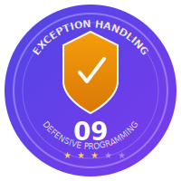
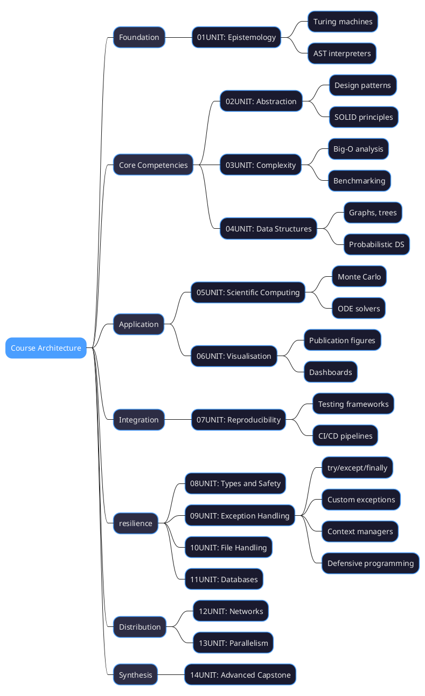
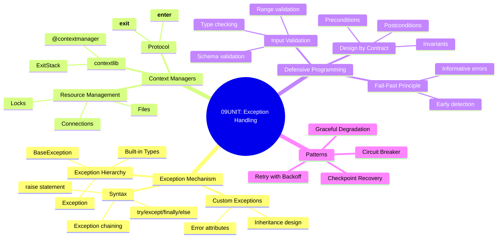
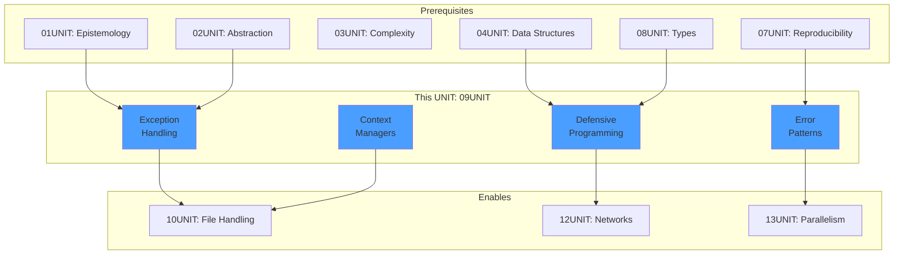
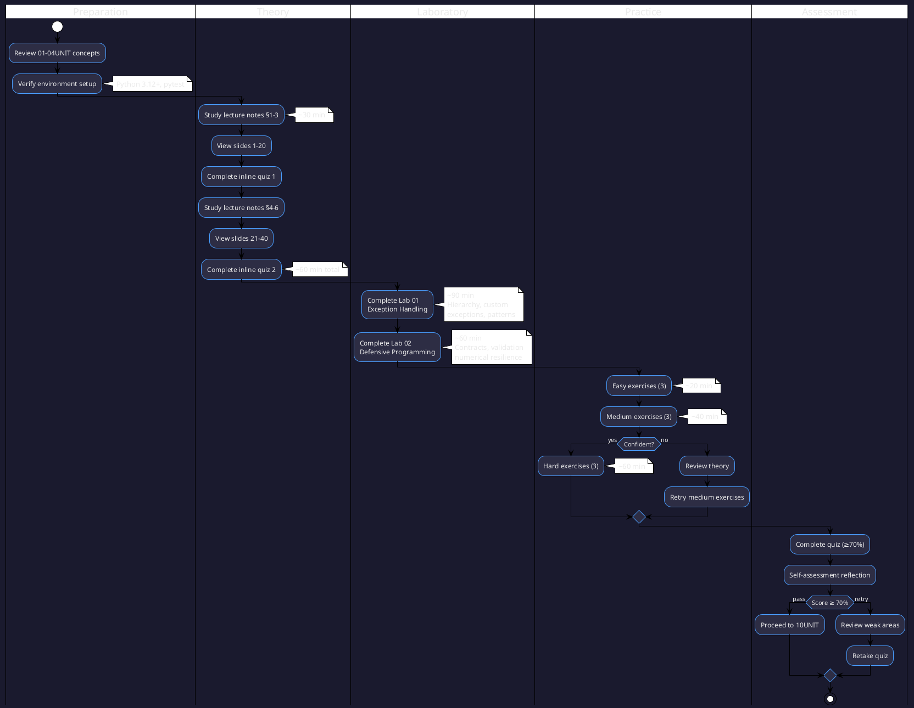

# 09UNIT: Exception Handling and Defensive Programming

## The Art of Computational Thinking for Researchers



> **UNIT 09 of 14** | **Bloom Level**: Apply/Evaluate | **Est. Time**: 6–8 hours

---

## 1. UNIT Synopsis

### 1.1 Abstract

This unit addresses the critical imperative of software resilience in computational research—the capacity for code to anticipate, detect and gracefully recover from exceptional conditions that inevitably arise during complex scientific computations. Research software operates in inherently uncertain environments: data arrives malformed, network connections fail, numerical operations produce undefined results and computational resources become exhausted. The materials systematically treat Python's exception mechanism alongside defensive programming techniques that transform fragile scripts into consistent scientific instruments.

Computational simulations can run thousands of iterations, creating probability distributions that capture the full range of possible outcomes. This comprehensive view of uncertainty enables more consistent decision-making, particularly in domains where rare events have significant consequences (Taleb, 2007, p. 28). Yet such extensive computations remain vulnerable to catastrophic failure from unhandled exceptions—a single division by zero or malformed input record can terminate hours of accumulated results. The defensive programming practices taught in this unit provide systematic approaches to anticipating and managing these failures.

The laboratory components progress from fundamental exception handling through custom exception hierarchies to context managers and design-by-contract principles. Students implement retry mechanisms with exponential backoff, circuit breakers for external service calls, checkpoint-based recovery for long-running computations and input validation frameworks suitable for scientific data pipelines. These competencies constitute prerequisites for the file handling operations in 10UNIT and the network error management techniques necessary to 12UNIT's distributed computing content.

**Keywords**: exception handling, defensive programming, context managers, design by contract, input validation, graceful degradation, fail-fast principle

**Estimated Duration**: 6–8 hours (theory: 1.5h, laboratory: 3h, exercises: 2h)

**Difficulty Level**: ★★★☆☆ (3/5)

### 1.2 Position in Curriculum



This unit occupies a central position in the resilience cluster, building upon the type safety foundations established in 08UNIT and preparing students for the error-prone domains of file handling (10UNIT) and network programming (12UNIT). The design patterns from 02UNIT inform exception hierarchy design, whilst the testing frameworks from 07UNIT enable systematic verification of error handling behaviour.

| Dependency Type | Source | Concepts Required |
|-----------------|--------|-------------------|
| Hard prerequisite | 01–04UNIT | Functions, classes, data structures |
| Soft prerequisite | 07UNIT | Testing with pytest |
| Corequisite | 08UNIT | Type annotations |

### 1.3 Pedagogical Rationale

The instructional design follows constructivist principles, scaffolding knowledge acquisition through progressive complexity. The sequence initiates at the Apply stratum (implementing try/except blocks, creating custom exceptions) and culminates in Evaluate activities (assessing error handling strategies, designing defensive validation frameworks). Scientific computing often involves complex data transformations where errors can be subtle and difficult to detect. Defensive programming—anticipating and handling potential errors and edge cases—helps create more consistent functions that fail gracefully when presented with unexpected inputs (Downey, 2015, p. 126).

**Instructional Strategies Employed:**

1. **Worked Examples**: Demonstrated solutions with explicit reasoning traces for exception handling patterns
2. **Cognitive Apprenticeship**: Expert defensive programming practices made visible through scaffolded implementations
3. **Deliberate Practice**: Targeted exercises addressing specific error handling subskills
4. **Metacognitive Prompts**: Self-assessment opportunities examining error handling decisions
5. **Transfer Tasks**: Application of resilience principles to novel scientific computing contexts

---

## 2. Visual Overview

### 2.1 Conceptual Architecture



### 2.2 UNIT Dependencies Graph



### 2.3 Learning Pathway



---

## 3. Learning Objectives

### 3.1 Cognitive Objectives

| ID | Level | Verb | Objective Statement | Assessment |
|----|-------|------|---------------------|------------|
| LO1 | Apply | Implement | Implement exception handling using try/except/finally/else blocks with appropriate exception types | Lab 01, Quiz Q1-3 |
| LO2 | Apply | Create | Create custom exception hierarchies that communicate domain-specific error conditions | Lab 01, Quiz Q4-5 |
| LO3 | Apply | Design | Design and implement context managers for resource management using both class and decorator approaches | Lab 01, Quiz Q6 |
| LO4 | Evaluate | Assess | Evaluate error handling strategies and select appropriate patterns for given computational scenarios | Lab 02, Homework P2-3 |

### 3.2 Skill Objectives

**Technical Skills:**

| Skill | Proficiency Level | Evidence |
|-------|-------------------|----------|
| Exception handling | Competent | Lab 01 completion, proper exception chaining |
| Custom exceptions | Proficient | Lab 01 §2, well-designed hierarchy |
| Context managers | Competent | Lab 01 §3, both protocols implemented |
| Input validation | Proficient | Lab 02 §2, comprehensive validation |
| Defensive patterns | Competent | Lab 02 §4, checkpoint recovery working |

**Transferable Skills:**

- **Analytical Reasoning**: Decompose failure modes into implementable exception handling strategies
- **Risk Assessment**: Identify potential failure points in computational workflows
- **Technical Communication**: Document error conditions with precision following conventions

### 3.3 Affective Objectives

- Appreciate the scientific imperative for consistent, failure-resistant computational tools
- Value defensive programming as integral to research quality, not mere overhead
- Develop intellectual commitment to graceful degradation over catastrophic failure

### 3.4 Objectives-Assessment Alignment Matrix

| Learning Objective | Quiz | Lab 01 | Lab 02 | Homework | Self-check |
|--------------------|------|--------|--------|----------|------------|
| LO1: Exception handling | Q1-3 | §1, §4 | — | P1 | ✓ |
| LO2: Custom exceptions | Q4-5 | §2 | — | P1 | ✓ |
| LO3: Context managers | Q6 | §3 | — | P2 | ✓ |
| LO4: Defensive patterns | Q7-10 | §5 | §1-4 | P2-3 | ✓ |

---

## 4. Theoretical Foundations

### 4.1 Historical Context

Exception handling mechanisms emerged from the recognition that error conditions require structured management beyond simple return codes. The concept originated in PL/I (1964) and was refined through CLU (1975), where Barbara Liskov's team developed the termination model that influenced modern languages. Python's exception system, influenced by C++ and Java, provides a clean separation between normal execution flow and error handling paths.

As researchers develop computational implementations, understanding the nuances of control structures becomes increasingly important. Issues like boundary conditions (ensuring loops terminate properly), edge cases (handling special inputs correctly) and logical completeness (covering all possible conditions) directly affect the correctness and resilience of the implementation. Research in formal methods emphasises the importance of systematic reasoning about these aspects to ensure program correctness (Dijkstra, 1976, p. 217).

**Historical Timeline:**

| Year | Contributor | Contribution |
|------|-------------|--------------|
| 1964 | IBM | PL/I ON-conditions for error handling |
| 1975 | Liskov et al. | CLU termination exception model |
| 1983 | Stroustrup | C++ exception handling |
| 1991 | van Rossum | Python exception mechanism |
| 2020 | Python 3.11 | Exception groups and except* |

### 4.2 Core Concepts

#### 4.2.1 Exception Hierarchy

Python's exception hierarchy forms a tree rooted at `BaseException`. The primary branch for user-catchable exceptions descends through `Exception`. Understanding this hierarchy enables precise exception handling—catching specific exceptions whilst allowing others to propagate.

**Definition 4.1** (Exception). An exception is an object representing an abnormal condition that disrupts normal program flow. Formally, an exception $e$ is a tuple $(T, m, c)$ where $T$ is the exception type, $m$ is the message string and $c$ is the optional cause (chained exception).

**Definition 4.2** (Exception Safety). A function $f$ is exception-safe if for any input $x$ and exception $e$ raised during $f(x)$:
- **Basic guarantee**: All invariants are preserved and no resources leak
- **Strong guarantee**: Either $f(x)$ completes successfully or the program state is unchanged
- **No-throw guarantee**: $f(x)$ never raises exceptions

#### 4.2.2 Context Manager Protocol

Context managers implement the resource acquisition is initialisation (RAII) pattern through the `__enter__` and `__exit__` protocol methods. This pattern ensures deterministic resource cleanup regardless of how the controlled block exits—normally, via exception or through early return.

As computational models grow in complexity, managing state effectively becomes increasingly important. Large simulations might track thousands of variables across multiple systems, requiring careful organisation to maintain clarity and correctness. Software engineering principles like encapsulation (grouping related state and behaviour), immutability (minimising state changes) and separation of concerns (isolating state management to specific components) help manage this complexity. Research in software architecture emphasises these principles as necessary for building maintainable, consistent systems (Gamma et al., 1994, p. 19).

### 4.3 Mathematical Framework

#### Exception Propagation Model

Exception propagation follows a stack-unwinding model. Let $S = [f_1, f_2, \ldots, f_n]$ represent the call stack where $f_n$ is the current function. When exception $e$ is raised in $f_n$:

$$\text{propagate}(e, S) = \begin{cases} 
\text{handle}(e, f_i) & \text{if } \exists i : \text{catches}(f_i, e) \\
\text{terminate}(e) & \text{otherwise}
\end{cases}$$

where $\text{catches}(f, e)$ is true iff function $f$ contains a handler for exception type $T_e$ or any supertype of $T_e$.

#### Retry with Exponential Backoff

For transient failures, retry mechanisms employ exponential backoff. The delay before attempt $n$ is:

$$d_n = \min(d_{\text{max}}, d_0 \cdot b^{n-1} + \text{jitter})$$

where $d_0$ is the initial delay, $b$ is the backoff multiplier (typically 2), $d_{\text{max}}$ is the maximum delay and jitter introduces randomness to prevent thundering herd effects.

### 4.4 Formal Definitions

**Definition 4.3** (Precondition). A precondition $P$ for function $f$ is a predicate over the input space that must hold for $f$ to execute correctly: $\forall x : P(x) \implies f(x) \text{ is defined}$.

**Definition 4.4** (Postcondition). A postcondition $Q$ for function $f$ is a predicate over the input-output pair that holds upon successful completion: $\forall x : P(x) \implies Q(x, f(x))$.

**Definition 4.5** (Class Invariant). A class invariant $I$ is a predicate over instance state that holds after construction and after every public method: $\forall o \in C : I(o)$ after any public operation on $o$.

**Theorem 4.1** (Design by Contract). If precondition $P$ holds on entry to $f$, and $f$ preserves invariant $I$ and establishes postcondition $Q$, then the contract $\{P \land I\} f \{Q \land I\}$ is satisfied.

---

## 5. Algorithmic Content

### 5.1 Algorithm Catalogue

| Algorithm | Problem | Time Complexity | Space Complexity |
|-----------|---------|-----------------|------------------|
| Exception propagation | Error handling | $O(d)$ | $O(d)$ |
| Retry with backoff | Transient failures | $O(n \cdot t)$ | $O(1)$ |
| Circuit breaker | Cascading failures | $O(1)$ | $O(1)$ |
| Input validation | Data integrity | $O(v)$ | $O(1)$ |

where $d$ = call stack depth, $n$ = retry count, $t$ = operation time, $v$ = validation complexity.

### 5.2 Pseudocode Specifications

#### Algorithm: Retry with Exponential Backoff

```
ALGORITHM RetryWithBackoff(operation, max_attempts, base_delay)
━━━━━━━━━━━━━━━━━━━━━━━━━━━━━━━━━━━━━━━━━━━━━━━━━━━━━━━━━━━━━━━━━━━━━━━━━━
INPUT:  operation — Callable that may raise transient exceptions
        max_attempts — Maximum number of retry attempts
        base_delay — Initial delay in seconds
OUTPUT: Result of operation or raises final exception
━━━━━━━━━━━━━━━━━━━━━━━━━━━━━━━━━━━━━━━━━━━━━━━━━━━━━━━━━━━━━━━━━━━━━━━━━━

1   last_exception ← None
2   
3   FOR attempt FROM 1 TO max_attempts DO
4   │   TRY
5   │   │   RETURN operation()
6   │   CATCH TransientError AS e
7   │   │   last_exception ← e
8   │   │   IF attempt < max_attempts THEN
9   │   │   │   delay ← base_delay × 2^(attempt-1) + random(0, 0.1)
10  │   │   │   SLEEP(delay)
11  │   │   │   LOG "Retry {attempt}/{max_attempts} after {delay}s"
12  │   │   END IF
13  │   END TRY
14  END FOR
15  
16  RAISE last_exception

━━━━━━━━━━━━━━━━━━━━━━━━━━━━━━━━━━━━━━━━━━━━━━━━━━━━━━━━━━━━━━━━━━━━━━━━━━
COMPLEXITY: Time O(n × t), Space O(1)
━━━━━━━━━━━━━━━━━━━━━━━━━━━━━━━━━━━━━━━━━━━━━━━━━━━━━━━━━━━━━━━━━━━━━━━━━━
```

#### Algorithm: Circuit Breaker Pattern

```
ALGORITHM CircuitBreaker(operation, failure_threshold, reset_timeout)
━━━━━━━━━━━━━━━━━━━━━━━━━━━━━━━━━━━━━━━━━━━━━━━━━━━━━━━━━━━━━━━━━━━━━━━━━━
INPUT:  operation — Callable to protect
        failure_threshold — Failures before opening circuit
        reset_timeout — Time before attempting reset
OUTPUT: Result of operation or raises CircuitOpenError
━━━━━━━━━━━━━━━━━━━━━━━━━━━━━━━━━━━━━━━━━━━━━━━━━━━━━━━━━━━━━━━━━━━━━━━━━━

1   IF state = OPEN THEN
2   │   IF time_since_open ≥ reset_timeout THEN
3   │   │   state ← HALF_OPEN
4   │   ELSE
5   │   │   RAISE CircuitOpenError
6   │   END IF
7   END IF
8   
9   TRY
10  │   result ← operation()
11  │   IF state = HALF_OPEN THEN
12  │   │   state ← CLOSED
13  │   │   failure_count ← 0
14  │   END IF
15  │   RETURN result
16  CATCH Exception AS e
17  │   failure_count ← failure_count + 1
18  │   IF failure_count ≥ failure_threshold THEN
19  │   │   state ← OPEN
20  │   │   open_time ← current_time()
21  │   END IF
22  │   RAISE e
23  END TRY

━━━━━━━━━━━━━━━━━━━━━━━━━━━━━━━━━━━━━━━━━━━━━━━━━━━━━━━━━━━━━━━━━━━━━━━━━━
COMPLEXITY: Time O(1), Space O(1)
━━━━━━━━━━━━━━━━━━━━━━━━━━━━━━━━━━━━━━━━━━━━━━━━━━━━━━━━━━━━━━━━━━━━━━━━━━
```

### 5.3 Implementation Notes

Effective error handling is necessary for creating functions that fail gracefully and provide meaningful feedback when problems occur. Python's exception mechanism offers a structured approach to error handling, enabling functions to detect and respond to exceptional conditions (Beazley, 2009, p. 114).

Key implementation considerations:

1. **Exception specificity**: Catch specific exceptions rather than bare `except:` clauses
2. **Exception chaining**: Use `raise ... from ...` to preserve causal context
3. **Resource cleanup**: Employ context managers for deterministic resource management
4. **Logging integration**: Record exception details before re-raising for diagnostics

---

## 6. Laboratory Components

### 6.1 Lab 01: Exception Handling Fundamentals

**Duration**: 90 minutes | **File**: `lab/lab_09_01_exception_handling.py`

| Section | Topic | Lines | Functions |
|---------|-------|-------|-----------|
| §1 | Exception Mechanism | ~100 | `demonstrate_exception_hierarchy`, `safe_divide`, `parse_config` |
| §2 | Custom Exceptions | ~120 | `ResearchError` hierarchy, `DataValidationError`, `ComputationError` |
| §3 | Context Managers | ~130 | `ManagedFile`, `temporary_directory`, `DatabaseConnection`, `Timer` |
| §4 | Exception Patterns | ~100 | `retry_with_backoff`, `circuit_breaker`, `graceful_degradation` |
| §5 | Logging Integration | ~50 | `setup_logging`, `logged_function` decorator |

### 6.2 Lab 02: Defensive Programming

**Duration**: 60 minutes | **File**: `lab/lab_09_02_defensive_programming.py`

Research in software engineering consistently shows that modular designs with high cohesion (functions focused on single tasks) and low coupling (minimal dependencies between functions) lead to more maintainable, consistent code (Yourdon & Constantine, 1979, p. 85).

| Section | Topic | Lines | Functions |
|---------|-------|-------|-----------|
| §1 | Design by Contract | ~80 | `@precondition`, `@postcondition`, `@invariant` decorators |
| §2 | Input Validation | ~80 | `validate_numeric_range`, `validate_string_pattern`, `ValidationResult` |
| §3 | Numerical resilience | ~70 | `safe_float_comparison`, `detect_numerical_instability`, `kahan_summation` |
| §4 | Defensive Data Processing | ~70 | `safe_json_load`, `resilient_csv_reader`, `checkpoint_processor` |

---

## 7. Practice Exercises

### 7.1 Exercise Distribution

| Difficulty | Count | Focus Areas | Est. Time |
|------------|-------|-------------|-----------|
| Easy | 3 | Basic exception handling, simple validation | 20 min |
| Medium | 3 | Custom exceptions, context managers, patterns | 40 min |
| Hard | 3 | Complex validation, resilience patterns, integration | 60 min |

### 7.2 Exercise Summaries

**Easy Exercises:**
- `e01_basic_exception_handling.py`: Implement try/except blocks for common error scenarios
- `e02_custom_exception.py`: Create a simple domain-specific exception class
- `e03_input_validation.py`: Validate function inputs with informative error messages

**Medium Exercises:**
- `e04_exception_hierarchy.py`: Design a complete exception hierarchy for a scientific domain
- `e05_context_manager.py`: Implement a context manager for database connections
- `e06_retry_mechanism.py`: Build a retry decorator with configurable parameters

**Hard Exercises:**
- `e07_circuit_breaker.py`: Implement a full circuit breaker with state transitions
- `e08_validation_framework.py`: Create a composable validation framework
- `e09_checkpoint_recovery.py`: Build a checkpoint-based recovery system for long computations

---

## 8. Assessment Materials

### 8.1 Quiz Structure

| Component | Questions | Points | Duration |
|-----------|-----------|--------|----------|
| Multiple Choice | 6 | 30 | 15 min |
| Short Answer | 4 | 20 | 15 min |
| **Total** | **10** | **50** | **30 min** |

### 8.2 Grading Rubric Summary

| Criterion | Excellent (90-100%) | Proficient (70-89%) | Developing (50-69%) | Beginning (<50%) |
|-----------|---------------------|---------------------|---------------------|------------------|
| Exception handling | Sophisticated hierarchies | Proper basic handling | Some handling | Minimal/incorrect |
| Context managers | Both protocols, ExitStack | Class-based managers | Basic with statement | No implementation |
| Defensive programming | Full contract system | Validation present | Some preconditions | No validation |
| Code quality | Exemplary style | Good practices | Acceptable | Poor quality |

---

## 9. Resources

### 9.1 Primary Resources

| Resource | Type | Location |
|----------|------|----------|
| Lecture Notes | Markdown | `theory/lecture_notes.md` |
| Slides | HTML | `theory/09UNIT_slides.html` |
| Cheatsheet | Markdown | `resources/cheatsheet.md` |
| Glossary | Markdown | `resources/glossary.md` |

### 9.2 Interactive Components

| Component | Description | Location |
|-----------|-------------|----------|
| Exception Explorer | Interactive exception hierarchy visualiser | `assets/animations/09UNIT_exception_explorer.html` |

---

## 10. Technical Requirements

### 10.1 Software Prerequisites

| Component | Version | Purpose |
|-----------|---------|---------|
| Python | ≥3.12 | Exception groups, type hints |
| pytest | ≥7.0 | Testing framework |
| ruff | ≥0.1 | Linting and formatting |
| mypy | ≥1.0 | Static type checking |

### 10.2 Environment Setup

```bash
# Create virtual environment
python -m venv .venv
source .venv/bin/activate  # Linux/macOS
# .venv\Scripts\activate   # Windows

# Install dependencies
pip install pytest pytest-cov ruff mypy

# Verify installation
python --version  # Should show 3.12+
pytest --version
```

---

## 11. Directory Structure

```
09UNIT/
├── README.md                          # This file
├── Makefile                           # Build automation
├── theory/
│   ├── lecture_notes.md              # Comprehensive theory
│   ├── learning_objectives.md        # Detailed objectives
│   └── 09UNIT_slides.html            # Reveal.js presentation
├── lab/
│   ├── __init__.py
│   ├── lab_09_01_exception_handling.py
│   ├── lab_09_02_defensive_programming.py
│   └── solutions/
│       ├── lab_09_01_solution.py
│       └── lab_09_02_solution.py
├── exercises/
│   ├── homework.md                   # Assignment specification
│   ├── practice/
│   │   ├── e01_basic_exception_handling.py
│   │   ├── e02_custom_exception.py
│   │   ├── e03_input_validation.py
│   │   ├── e04_exception_hierarchy.py
│   │   ├── e05_context_manager.py
│   │   ├── e06_retry_mechanism.py
│   │   ├── e07_circuit_breaker.py
│   │   ├── e08_validation_framework.py
│   │   └── e09_checkpoint_recovery.py
│   └── solutions/
│       └── [corresponding solution files]
├── assessments/
│   ├── quiz.md                       # Assessment questions
│   ├── rubric.md                     # Grading criteria
│   └── self_check.md                 # Self-assessment
├── resources/
│   ├── cheatsheet.md                 # Quick reference
│   ├── glossary.md                   # Term definitions
│   └── further_reading.md            # Annotated bibliography
├── tests/
│   ├── conftest.py                   # Shared fixtures
│   ├── test_lab_09_01.py
│   └── test_lab_09_02.py
└── assets/
    ├── diagrams/
    │   ├── exception_hierarchy.puml
    │   ├── context_manager_flow.puml
    │   ├── circuit_breaker_states.puml
    │   ├── retry_backoff.puml
    │   └── validation_pipeline.puml
    ├── images/
    │   └── 09UNIT_badge.svg
    └── animations/
        └── 09UNIT_exception_explorer.html
```

---

## 12. Research Applications

### 12.1 Domain Applications

For scientific computing, error handling extends beyond technical correctness to domain-specific validity. Functions should check not just that inputs are well-formed but that they are meaningful in the relevant scientific context. For example, a function implementing a statistical test might verify that assumptions like normality or independence are met, raising appropriate warnings or errors when these conditions are violated (Downey, 2015, p. 127).

| Domain | Application | Exception Handling Focus |
|--------|-------------|--------------------------|
| Data Science | Handling missing data, malformed CSV/JSON | Graceful degradation, partial processing |
| Bioinformatics | consistent FASTA/FASTQ parsing | Format validation, sequence integrity |
| Web Scraping | Network failures, rate limiting | Retry mechanisms, circuit breakers |
| Scientific Simulation | Long-running experiments | Checkpoint/resume, partial failure recovery |
| Distributed Computing | Fault tolerance | Graceful degradation, consensus protocols |

### 12.2 Case Study: Numerical Stability

These limitations motivate several defensive programming practices. First, we should avoid testing floating-point values for exact equality, instead using a tolerance value to accommodate small representational differences. Second, where possible, we should reformulate algorithms to avoid operations prone to numerical instability, particularly subtractive cancellation. Third, we must be mindful of the order of operations, as floating-point arithmetic is not always associative—that is, $(a + b) + c$ may not equal $a + (b + c)$ due to intermediate rounding.

---

## 13. Common Pitfalls

### 13.1 Anti-patterns to Avoid

| Anti-pattern | Problem | Correct Approach |
|--------------|---------|------------------|
| Bare `except:` | Catches `SystemExit`, `KeyboardInterrupt` | Catch `Exception` or specific types |
| Silent exception swallowing | Hides errors, complicates debugging | Log exceptions before handling |
| Raising `Exception` directly | Loses semantic meaning | Use specific exception types |
| Nested try/except | Complex control flow | Refactor into separate functions |
| Exception for control flow | Performance overhead, unclear intent | Use explicit conditionals |

### 13.2 Debugging Strategies

1. **Enable traceback preservation**: Use `raise ... from e` to maintain exception chains
2. **Structured logging**: Include exception type, message and context in log entries
3. **Breakpoint on exceptions**: Configure debugger to break on exception raise
4. **Unit test error paths**: Verify exception behaviour with pytest.raises

---

## 14. Extension Activities

### 14.1 Advanced Topics

| Topic | Description | Resources |
|-------|-------------|-----------|
| Exception Groups | Python 3.11 except* syntax for concurrent exceptions | PEP 654 |
| Async Context Managers | `async with` for asynchronous resource management | asyncio documentation |
| Structured Concurrency | Exception handling in concurrent contexts | trio library |

### 14.2 Research Projects

1. **Fault Injection Framework**: Build a system to simulate exceptions for testing resilience
2. **Exception Telemetry**: Implement distributed exception tracking across services
3. **Contract Verification**: Explore formal verification of design-by-contract assertions

---

## 15. Instructor Notes

### 15.1 Common Misconceptions

| Misconception | Clarification |
|---------------|---------------|
| "Exceptions are slow" | Exception overhead is negligible unless frequently raised |
| "Catch everything to be safe" | Over-catching hides bugs; catch only expected exceptions |
| "finally always runs" | Not if process is killed; use OS-level cleanup for critical resources |
| "Context managers are just for files" | Applicable to any resource requiring deterministic cleanup |

### 15.2 Differentiation Strategies

**For struggling students:**
- Provide additional worked examples with explicit reasoning traces
- Focus on basic try/except before advancing to context managers
- Use visual flowcharts for exception propagation

**For advanced students:**
- Introduce exception groups and except* syntax
- Explore async context managers
- Challenge with fault-tolerant distributed system design

---

## 16. Version History

| Version | Date | Author | Changes |
|---------|------|--------|---------|
| 1.0.0 | 2025-01 | Course Team | Initial release |

---

## 17. Acknowledgements

This unit draws upon the foundational work in software engineering by Dijkstra (1976) on program correctness, Gamma et al. (1994) on design patterns, Meyer (1988) on design by contract and the Python community's extensive documentation on exception handling conventions.

---

## 📜 Licence and Terms of Use

<div align="center">

<table>
<tr>
<td>

<div align="center">
<h3>🔒 RESTRICTIVE LICENCE</h3>
<p><strong>Version 4.1.0 — January 2025</strong></p>
</div>

---

**© 2025 Antonio Clim. All rights reserved.**

<table>
<tr>
<th>✅ PERMITTED</th>
<th>❌ PROHIBITED</th>
</tr>
<tr>
<td>

- Personal use for self-study
- Viewing and running code for personal educational purposes
- Local modifications for personal experimentation

</td>
<td>

- Publishing materials (online or offline)
- Use in formal teaching activities
- Teaching or presenting to third parties
- Redistribution in any form
- Creating derivative works for public use
- Commercial use of any kind

</td>
</tr>
</table>

---

<p><em>For requests regarding educational use or publication,<br>
please contact the author to obtain written consent.</em></p>

</td>
</tr>
</table>

</div>

### Terms and Conditions

1. **Intellectual Property**: All materials, including code, documentation,
   presentations and exercises, are the intellectual property of Antonio Clim.

2. **No Warranty**: Materials are provided "as is" without warranty of any kind,
   express or implied.

3. **Limitation of Liability**: The author shall not be liable for any damages
   arising from the use of these materials.

4. **Governing Law**: These terms are governed by the laws of Romania.

5. **Contact**: For permissions and enquiries, contact the author through
   official academic channels.

### Technology Stack

<div align="center">

| Technology | Version | Purpose |
|:----------:|:-------:|:--------|
| Python | 3.12+ | Primary programming language |
| pytest | ≥7.0 | Testing framework |
| ruff | ≥0.1 | Linting and formatting |
| mypy | ≥1.0 | Static type checking |
| tenacity | ≥8.0 | Retry mechanisms |

</div>

---

**v4.1.0** | **09UNIT** | **Exception Handling and Defensive Programming**
