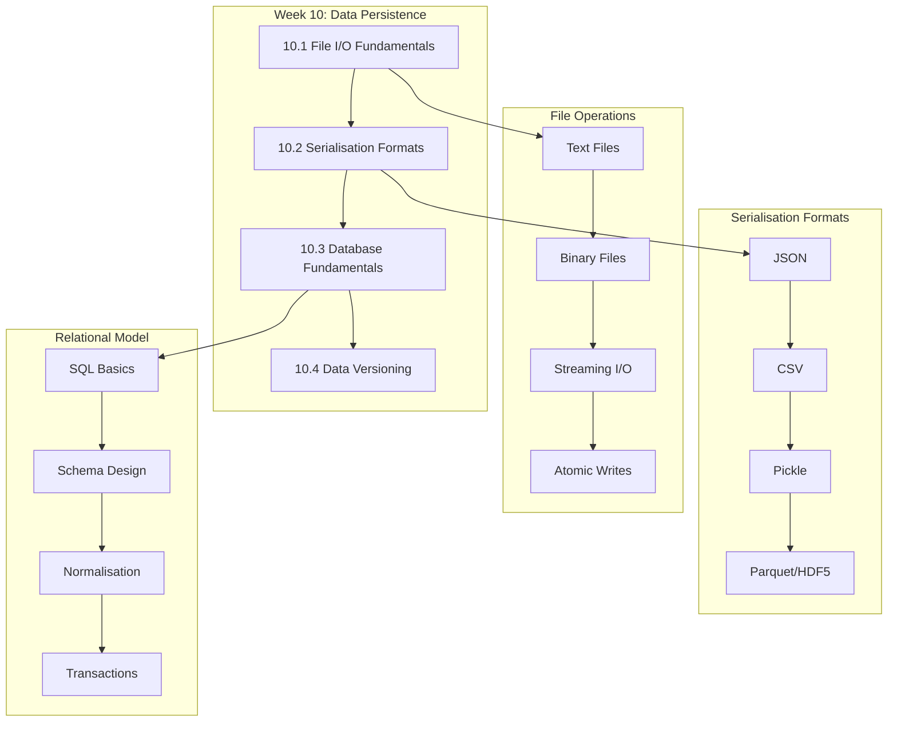
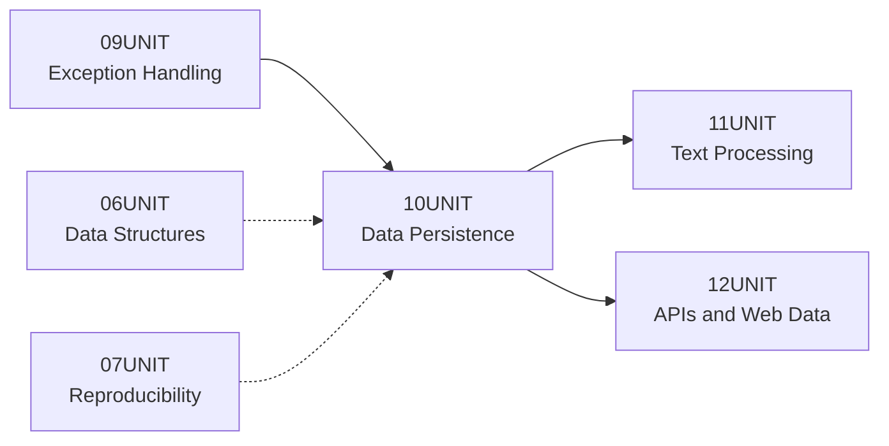

# 10UNIT — Data Persistence and Serialisation

> "Scientific computing also involves practical constraints that sometimes necessitate side effects. Large datasets may not fit entirely in memory, requiring streaming processing. Simulations may run for days or weeks, necessitating checkpointing—saving intermediate states to files."
> — Wilson et al., 2017, p. 6

## 📋 Unit Overview

| Property | Value |
|----------|-------|
| **Unit Number** | 10 of 14 |
| **Title** | Data Persistence and Serialisation |
| **Book Chapters** | 13 (Data Persistence and File Management), 14 (Databases and Data Management) |
| **Difficulty** | ★★★☆☆ (3/5) |
| **Estimated Time** | 7–9 hours |
| **Bloom Level** | Apply / Analyse |

---

## 🎯 Learning Objectives

Upon completing this unit, you will be able to:

1. **Remember** the fundamental file modes, encodings and their appropriate use cases in Python I/O operations
2. **Understand** the trade-offs between human-readable formats (JSON, CSV) and binary formats (Pickle, Parquet) for different research contexts
3. **Apply** the `pathlib` module and context managers to implement reliable, cross-platform file handling with proper resource management
4. **Analyse** data storage requirements to select appropriate serialisation strategies based on performance, interoperability and security considerations
5. **Evaluate** when relational database solutions (SQLite) outperform flat-file storage for research data management
6. **Create** data versioning systems using cryptographic checksums and manifest files to ensure research reproducibility

---

## 🔗 Prerequisites

Before beginning this unit, ensure you have completed:

- [x] **09UNIT**: Exception Handling and Defensive Programming
  - Required for: handling I/O errors gracefully, implementing dependable file operations
- [x] **06UNIT**: Data Structures
  - Required for: understanding dictionaries, nested structures, tuple-record parallels
- [x] **05UNIT**: Functions and Modularity
  - Required for: implementing clean file processing functions with proper separation of concerns

### Technical Requirements

```bash
# Verify Python version (3.12+ required)
python --version

# Install required packages
pip install pandas pyarrow pytest pytest-cov --break-system-packages
```

---

## 🗺️ Unit Roadmap



---

## 📚 Core Concepts

### The Persistence Imperative

Research data possesses an inherent paradox: it must simultaneously exist transiently in memory for computation and permanently on storage media for reproducibility. This tension between ephemeral processing and durable archival forms the conceptual foundation of data persistence.

The question of whether to preprocess data before querying it represents a fundamental computational trade-off. As the textbook observes:

> "The question of whether to sort data before searching epitomises a central theme in computational thinking: the trade-off between preprocessing and query efficiency. This trade-off permeates countless computational problems, from database design to machine learning pipeline optimisation."

This principle extends directly to file format selection: investing computational effort in structuring and indexing data during write operations yields substantial benefits during subsequent read operations.

### File I/O Foundations

Python's file handling model operates through file objects that mediate between program memory and persistent storage. The `open()` function serves as the gateway to this mechanism, accepting mode specifiers that govern operational semantics:

| Mode | Operation | File Pointer | Creates | Truncates |
|------|-----------|--------------|---------|-----------|
| `'r'` | Read | Start | No | No |
| `'w'` | Write | Start | Yes | Yes |
| `'a'` | Append | End | Yes | No |
| `'x'` | Exclusive create | Start | Yes | Error if exists |
| `'b'` | Binary modifier | — | — | — |
| `'+'` | Read/write modifier | — | — | — |

The binary modifier (`'b'`) bypasses character encoding entirely, treating file contents as raw byte sequences. This distinction matters critically for research data: numerical arrays, images and compressed archives demand binary handling, whilst configuration files and logs typically use text mode with explicit encoding declarations.

### Encoding Vigilance

Character encoding represents one of the most insidious sources of data corruption in research pipelines. UTF-8 has emerged as the *de facto* standard for text interchange, but legacy systems and specialised instruments may produce data in Latin-1, Windows-1252 or domain-specific encodings.

```python
# Explicit encoding prevents silent corruption
with open(data_path, 'r', encoding='utf-8') as f:
    content = f.read()
```

The absence of an explicit encoding parameter causes Python to use platform-dependent defaults—a recipe for irreproducible behaviour across computing environments.

### Serialisation Strategies

Serialisation transforms in-memory data structures into byte sequences suitable for storage or transmission. The choice of serialisation format profoundly affects research workflows across multiple dimensions:

**JSON (JavaScript Object Notation)** provides human-readable, language-agnostic representation of hierarchical data. Its universal support makes it ideal for configuration files, metadata records and API communication. However, JSON's text-based nature incurs storage overhead and parsing latency for large numerical datasets.

**CSV (Comma-Separated Values)** remains the *lingua franca* of tabular research data. Its simplicity enables interchange between statistical packages, spreadsheet applications and programming environments. Yet CSV's lack of type information and ambiguous handling of special characters (embedded commas, quotes, newlines) demands careful attention to edge cases.

**Pickle** offers Python-native serialisation capable of preserving arbitrary object graphs, including custom classes, closures and circular references. This power carries significant caveats: Pickle files are Python-version-sensitive, inherently insecure against malicious payloads and entirely opaque to non-Python tools.

**Parquet and HDF5** represent columnar and hierarchical binary formats optimised for analytical workloads. These formats provide compression, chunked access and efficient querying over specific columns without loading entire datasets into memory—essential capabilities for research involving gigabytes or terabytes of observational data.

### The Relational Model

Database systems epitomise the prepare-once, use-many pattern that pervades computational thinking:

> "Database systems epitomize this pattern, maintaining indices (essentially sorted or structured access paths) to accelerate queries at the cost of increased storage and update overhead."
> — Garcia-Molina et al., 2008, p. 145

Furthermore:

> "The purpose of an index is to speed up access to data. Given a specific search condition, an index can be used to locate records quickly, without examining all the data."

SQLite provides a self-contained, serverless relational database engine embedded within Python's standard library. For research applications, SQLite offers several compelling advantages over flat-file storage:

1. **Atomic transactions** ensure data integrity even during system failures
2. **Structured Query Language** enables powerful data retrieval without loading entire datasets
3. **Relational integrity** enforces constraints that prevent invalid data states
4. **Concurrent access** supports multiple readers simultaneously

The relational model organises data into tables (relations) containing rows (tuples) with columns (attributes). This structure maps naturally to research data:

> "Database operations often process sets of tuples, applying transformations and filters to extract meaningful information. The parallel between tuples and database rows makes these operations natural to express in Python."

### Normalisation Principles

Database normalisation systematically eliminates redundancy and anomalies through progressive refinement:

**First Normal Form (1NF)**: Each column contains atomic (indivisible) values; each row is unique.

**Second Normal Form (2NF)**: All non-key attributes depend on the entire primary key, not just part of it.

**Third Normal Form (3NF)**: No non-key attribute depends on another non-key attribute (no transitive dependencies).

For research databases, normalisation reduces storage requirements, prevents update anomalies and simplifies maintenance—though analytical queries may benefit from strategic denormalisation.

---

## 🔬 Research Applications

### Climate Science: Multi-dimensional Time-Series

Climate researchers routinely work with NetCDF and HDF5 files containing multi-dimensional arrays of temperature, pressure and precipitation measurements across spatial grids and temporal spans. These formats support:

- Arbitrary dimensionality (latitude × longitude × altitude × time)
- Self-describing metadata (variable names, units, coordinate systems)
- Chunked storage enabling regional subsets without full-file loading
- Lossless compression achieving 3–5× size reduction

### Genomics: Indexed Sequence Retrieval

Genomic databases containing millions of DNA sequences require specialised indexing strategies. FASTA index files (`.fai`) enable random access to specific sequences within multi-gigabyte genome files, transforming O(n) sequential scans into O(1) direct seeks.

### Social Science: Longitudinal Survey Data

Survey researchers managing panel studies across decades must preserve data provenance, handle missing values systematically and maintain codebook documentation. Relational databases with proper schema design ensure consistency across waves whilst enabling complex cross-temporal analyses.

### Digital Humanities: Corpus Management

Text corpus management involves storing documents alongside rich annotation layers (part-of-speech tags, named entities, sentiment scores). SQLite databases with full-text search extensions provide efficient querying over millions of documents without specialised infrastructure.

---

## 📁 Unit Contents

### Laboratory Materials

| File | Description | Est. Time |
|------|-------------|-----------|
| `lab/lab_10_01_file_io_serialisation.py` | File operations, JSON/CSV processing, binary formats | 90 min |
| `lab/lab_10_02_database_fundamentals.py` | SQLite operations, schema design, advanced queries | 75 min |

### Practice Exercises

| Difficulty | File | Focus Area |
|------------|------|------------|
| ⭐ Easy | `easy_01_basic_file_io.py` | Text file reading/writing |
| ⭐ Easy | `easy_02_json_basics.py` | JSON serialisation |
| ⭐ Easy | `easy_03_csv_processing.py` | CSV reading with DictReader |
| ⭐⭐ Medium | `medium_01_binary_formats.py` | Pickle and compression |
| ⭐⭐ Medium | `medium_02_sqlite_crud.py` | Database CRUD operations |
| ⭐⭐ Medium | `medium_03_data_migration.py` | Format conversion pipelines |
| ⭐⭐⭐ Hard | `hard_01_streaming_processor.py` | Memory-efficient processing |
| ⭐⭐⭐ Hard | `hard_02_schema_design.py` | Normalised database design |
| ⭐⭐⭐ Hard | `hard_03_versioning_system.py` | Checksum-based versioning |

### Assessment Materials

| File | Purpose |
|------|---------|
| `assessments/quiz.md` | 10 questions (6 MCQ + 4 short answer) |
| `assessments/rubric.md` | Detailed grading criteria |
| `assessments/self_check.md` | Pre-submission verification |

### Resources

| File | Contents |
|------|----------|
| `resources/cheatsheet.md` | Quick reference for file modes, SQL syntax |
| `resources/glossary.md` | 20+ key terms with definitions |
| `resources/further_reading.md` | 15+ curated references |

### Visual Materials

| File | Description |
|------|-------------|
| `assets/animations/10UNIT_format_explorer.html` | Interactive format comparison tool |
| `assets/diagrams/file_modes.puml` | File operation flowchart |
| `assets/diagrams/serialisation_decision.puml` | Format selection guide |
| `assets/diagrams/normalisation_forms.puml` | Database normalisation levels |
| `assets/diagrams/data_pipeline.svg` | End-to-end persistence workflow |

---

## 🛠️ Development Environment

### Recommended Directory Structure

```
10UNIT/
├── lab/
│   ├── lab_10_01_file_io_serialisation.py
│   ├── lab_10_02_database_fundamentals.py
│   └── data/
│       ├── sample_measurements.json
│       ├── experiment_log.csv
│       └── research.db
├── exercises/
│   ├── practice/
│   └── solutions/
└── tests/
    ├── test_lab_10_01.py
    └── test_lab_10_02.py
```

### Running Tests

```bash
# Run all unit tests with coverage
pytest tests/ --cov=lab --cov-report=term-missing

# Run specific test file
pytest tests/test_lab_10_01.py -v

# Generate HTML coverage report
pytest tests/ --cov=lab --cov-report=html
```

---

## ⚠️ Common Pitfalls

### 1. Resource Leaks

**Problem**: Forgetting to close file handles leads to resource exhaustion and data corruption.

**Solution**: Always use context managers (`with` statements) for automatic cleanup.

```python
# Dangerous: manual resource management
f = open('data.txt', 'w')
f.write(content)  # If exception occurs, file never closes
f.close()

# Safe: context manager guarantees cleanup
with open('data.txt', 'w', encoding='utf-8') as f:
    f.write(content)
```

### 2. Pickle Security Vulnerabilities

**Problem**: Loading untrusted Pickle files enables arbitrary code execution.

**Solution**: Never unpickle data from unknown sources. Use JSON for interchange with external systems.

### 3. SQL Injection

**Problem**: String concatenation in SQL queries creates security vulnerabilities.

**Solution**: Use parameterised queries exclusively.

```python
# Vulnerable to injection
cursor.execute(f"SELECT * FROM users WHERE name = '{user_input}'")

# Safe: parameterised query
cursor.execute("SELECT * FROM users WHERE name = ?", (user_input,))
```

### 4. Encoding Mismatches

**Problem**: Platform-dependent default encodings cause cross-system failures.

**Solution**: Always specify `encoding='utf-8'` explicitly for text files.

### 5. Atomic Write Failures

**Problem**: Interrupted writes leave files in corrupted partial states.

**Solution**: Write to temporary files and rename atomically upon completion.

---

## 📖 Key Terminology

| Term | Definition |
|------|------------|
| **Serialisation** | Converting in-memory objects to storable byte sequences |
| **Deserialisation** | Reconstructing objects from stored representations |
| **ACID** | Atomicity, Consistency, Isolation, Durability—transaction guarantees |
| **Normalisation** | Systematic elimination of data redundancy in databases |
| **Checkpointing** | Saving intermediate computation states for recovery |
| **Streaming I/O** | Processing data incrementally without full memory loading |

---

## 🔄 Connection to Other Units



**From 09UNIT**: Exception handling patterns for reliable I/O error recovery.

**To 11UNIT**: Stored text data becomes input for regular expression processing.

**To 12UNIT**: Serialisation formats enable API data storage and caching.

---

## 📊 Self-Assessment Checklist

Before proceeding to the next unit, verify you can:

- [ ] Open files in appropriate modes with explicit encoding
- [ ] Implement streaming file processing for large datasets
- [ ] Serialise and deserialise complex data structures using JSON
- [ ] Handle CSV edge cases (quotes, delimiters, missing values)
- [ ] Execute parameterised SQL queries safely
- [ ] Design normalised database schemas (up to 3NF)
- [ ] Generate and verify file checksums for data integrity
- [ ] Choose appropriate formats based on use-case requirements

---

## 📚 References

Garcia-Molina, H., Ullman, J. D., & Widom, J. (2008). *Database Systems: The Complete Book* (2nd ed.). Pearson.

McKinney, W. (2022). *Python for Data Analysis* (3rd ed.). O'Reilly Media.

Reitz, K., & Schlusser, T. (2016). *The Hitchhiker's Guide to Python*. O'Reilly Media.

Wilson, G., Bryan, J., Cranston, K., Kitzes, J., Nederbragt, L., & Teal, T. K. (2017). Good enough practices in scientific computing. *PLOS Computational Biology*, 13(6), e1005510.

---

## 🏷️ Licence

© 2025 Antonio Clim. All rights reserved.

This material is provided for educational purposes as part of "The Art of Computational Thinking for Researchers" course at ASE-CSIE. Redistribution or commercial use requires explicit written permission.

---

## 📈 Performance Considerations

### File I/O Optimisation

File operations constitute a significant bottleneck in many research workflows. Understanding the performance characteristics of different approaches enables informed decisions about implementation strategies.

**Buffering behaviour**: Python's default buffering (typically 8KB for binary, line-buffered for text in interactive mode) balances system call overhead against memory usage. For sequential reads of large files, increasing buffer size can reduce system call frequency substantially.

**Memory-mapped files**: The `mmap` module provides direct memory access to file contents, enabling efficient random access patterns and sharing between processes. This technique proves particularly valuable for large binary datasets requiring non-sequential access patterns.

**Asynchronous I/O**: For I/O-bound applications, `asyncio` with `aiofiles` enables concurrent file operations without threading complexity. This approach suits scenarios with multiple independent file operations where total throughput matters more than individual operation latency.

### Database Performance

SQLite performance depends critically on proper indexing and query design. Common optimisation strategies include:

**Index selection**: Create indices on columns appearing in WHERE clauses and JOIN conditions. Composite indices on multiple columns benefit queries filtering on those columns together. However, excessive indices degrade write performance.

**Transaction batching**: Grouping multiple operations within single transactions reduces commit overhead significantly. For bulk inserts, wrapping thousands of operations in one transaction can improve throughput by orders of magnitude.

**Query planning**: Use `EXPLAIN QUERY PLAN` to understand how SQLite executes queries. Look for table scans (SCAN) that indicate missing indices, and ensure JOIN operations use indexed columns.

**Connection management**: Maintain persistent connections for repeated operations rather than connecting per-operation. Enable Write-Ahead Logging (WAL) mode for improved concurrent read performance.

---

## 🔧 Troubleshooting Guide

### Common Issues and Solutions

**UnicodeDecodeError when reading files**: Specify explicit encoding matching the file's actual encoding. When uncertain, try `chardet` library to detect encoding automatically, or use `errors='replace'` to substitute problematic characters.

**PermissionError on Windows**: Windows file locking prevents opening files already opened by other processes. Ensure proper file closure using context managers, or implement retry logic for transient lock conditions.

**Database locked errors**: SQLite allows only one writer at a time. Use WAL mode (`PRAGMA journal_mode=WAL`) for better concurrent access, implement retry logic with exponential backoff, or consider connection pooling.

**Memory exhaustion with large files**: Process files incrementally using generators and iteration rather than loading entirely into memory. For structured data, use chunked reading (`pandas.read_csv(chunksize=...)`) or streaming parsers.

**Data corruption after crashes**: Implement atomic write patterns using temporary files and rename operations. Enable SQLite's synchronous mode (`PRAGMA synchronous=FULL`) for critical data, accepting performance trade-offs.

---

## 📚 Extended References

### Foundational Texts

McKinney, W. (2022). *Python for Data Analysis* (3rd ed.). O'Reilly Media. — Comprehensive coverage of pandas for data manipulation, including file format handling and database integration.

Beaulieu, A. (2020). *Learning SQL* (3rd ed.). O'Reilly Media. — Thorough introduction to SQL concepts applicable across database systems, with emphasis on query construction and optimisation.

### Research Computing

Wilson, G., Bryan, J., Cranston, K., Kitzes, J., Nederbragt, L., & Teal, T. K. (2017). Good enough practices in scientific computing. *PLOS Computational Biology*, 13(6), e1005510. — Practical guidelines for data management in research contexts.

Stodden, V., Leisch, F., & Peng, R. D. (Eds.). (2014). *Implementing Reproducible Research*. CRC Press. — Collection addressing reproducibility challenges including data persistence strategies.

### Technical Documentation

Python Software Foundation. (2024). sqlite3 — DB-API 2.0 interface for SQLite databases. *Python Documentation*. https://docs.python.org/3/library/sqlite3.html

Apache Arrow Project. (2024). PyArrow Documentation. https://arrow.apache.org/docs/python/

---

*THE ART OF COMPUTATIONAL THINKING FOR RESEARCHERS*
*Unit 10 — Data Persistence and Serialisation*

---

## 📜 Licence and Terms of Use

<div align="center">

<table>
<tr>
<td>

<div align="center">
<h3>🔒 RESTRICTIVE LICENCE</h3>
<p><strong>Version 4.1.0 — January 2025</strong></p>
</div>

---

**© 2025 Antonio Clim. All rights reserved.**

<table>
<tr>
<th>✅ PERMITTED</th>
<th>❌ PROHIBITED</th>
</tr>
<tr>
<td>

- Personal use for self-study
- Viewing and running code for personal educational purposes
- Local modifications for personal experimentation

</td>
<td>

- Publishing materials (online or offline)
- Use in formal teaching activities
- Teaching or presenting to third parties
- Redistribution in any form
- Creating derivative works for public use
- Commercial use of any kind

</td>
</tr>
</table>

---

<p><em>For requests regarding educational use or publication,<br>
please contact the author to obtain written consent.</em></p>

</td>
</tr>
</table>

</div>

### Terms and Conditions

1. **Intellectual Property**: All materials, including code, documentation,
   presentations and exercises, are the intellectual property of Antonio Clim.

2. **No Warranty**: Materials are provided "as is" without warranty of any kind,
   express or implied.

3. **Limitation of Liability**: The author shall not be liable for any damages
   arising from the use of these materials.

4. **Governing Law**: These terms are governed by the laws of Romania.

5. **Contact**: For permissions and enquiries, contact the author through
   official academic channels.

### Technology Stack

<div align="center">

| Technology | Version | Purpose |
|:----------:|:-------:|:--------|
| Python | 3.12+ | Primary programming language |
| pandas | ≥2.0 | Data manipulation |
| SQLite | 3.x | Embedded database |
| h5py | ≥3.0 | HDF5 file handling |
| PyArrow | ≥14.0 | Parquet support |
| pytest | ≥7.0 | Testing framework |

</div>
