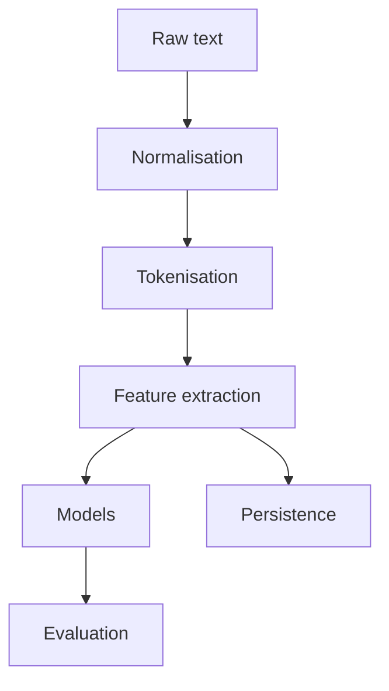

# 11UNIT — Text Processing and NLP Fundamentals


## Synopsis


Text processing for research datasets is treated here as a research-oriented craft rather than a
collection of library calls. The central question is how an analyst moves from raw character
sequences to defensible claims, given that token boundaries, normalisation choices and annotation
schemes impose inductive bias. We therefore separate specification from implementation: we first
state what a pipeline must preserve or discard, then encode those constraints as pure functions with
explicit preconditions. Attention is paid to failure modes, including ambiguous segmentation,
encoding artefacts and domain drift, since these frequently dominate error budgets in empirical
studies. In practice, the unit couples formal definitions with executable checks so that each step
has a measurable contract: input alphabet, transformation invariants and complexity expectations.

Text processing for research datasets is treated here as a research-oriented craft rather than a
collection of library calls. The central question is how an analyst moves from raw character
sequences to defensible claims, given that token boundaries, normalisation choices and annotation
schemes impose inductive bias. We therefore separate specification from implementation: we first
state what a pipeline must preserve or discard, then encode those constraints as pure functions with
explicit preconditions. Attention is paid to failure modes, including ambiguous segmentation,
encoding artefacts and domain drift, since these frequently dominate error budgets in empirical
studies. In practice, the unit couples formal definitions with executable checks so that each step
has a measurable contract: input alphabet, transformation invariants and complexity expectations.

Text processing for research datasets is treated here as a research-oriented craft rather than a
collection of library calls. The central question is how an analyst moves from raw character
sequences to defensible claims, given that token boundaries, normalisation choices and annotation
schemes impose inductive bias. We therefore separate specification from implementation: we first
state what a pipeline must preserve or discard, then encode those constraints as pure functions with
explicit preconditions. Attention is paid to failure modes, including ambiguous segmentation,
encoding artefacts and domain drift, since these frequently dominate error budgets in empirical
studies. In practice, the unit couples formal definitions with executable checks so that each step
has a measurable contract: input alphabet, transformation invariants and complexity expectations.

Text processing for research datasets is treated here as a research-oriented craft rather than a
collection of library calls. The central question is how an analyst moves from raw character
sequences to defensible claims, given that token boundaries, normalisation choices and annotation
schemes impose inductive bias. We therefore separate specification from implementation: we first
state what a pipeline must preserve or discard, then encode those constraints as pure functions with
explicit preconditions. Attention is paid to failure modes, including ambiguous segmentation,
encoding artefacts and domain drift, since these frequently dominate error budgets in empirical
studies. In practice, the unit couples formal definitions with executable checks so that each step
has a measurable contract: input alphabet, transformation invariants and complexity expectations.

Text processing for research datasets is treated here as a research-oriented craft rather than a
collection of library calls. The central question is how an analyst moves from raw character
sequences to defensible claims, given that token boundaries, normalisation choices and annotation
schemes impose inductive bias. We therefore separate specification from implementation: we first
state what a pipeline must preserve or discard, then encode those constraints as pure functions with
explicit preconditions. Attention is paid to failure modes, including ambiguous segmentation,
encoding artefacts and domain drift, since these frequently dominate error budgets in empirical
studies. In practice, the unit couples formal definitions with executable checks so that each step
has a measurable contract: input alphabet, transformation invariants and complexity expectations.

Text processing for research datasets is treated here as a research-oriented craft rather than a
collection of library calls. The central question is how an analyst moves from raw character
sequences to defensible claims, given that token boundaries, normalisation choices and annotation
schemes impose inductive bias. We therefore separate specification from implementation: we first
state what a pipeline must preserve or discard, then encode those constraints as pure functions with
explicit preconditions. Attention is paid to failure modes, including ambiguous segmentation,
encoding artefacts and domain drift, since these frequently dominate error budgets in empirical
studies. In practice, the unit couples formal definitions with executable checks so that each step
has a measurable contract: input alphabet, transformation invariants and complexity expectations.

Text processing for research datasets is treated here as a research-oriented craft rather than a
collection of library calls. The central question is how an analyst moves from raw character
sequences to defensible claims, given that token boundaries, normalisation choices and annotation
schemes impose inductive bias. We therefore separate specification from implementation: we first
state what a pipeline must preserve or discard, then encode those constraints as pure functions with
explicit preconditions. Attention is paid to failure modes, including ambiguous segmentation,
encoding artefacts and domain drift, since these frequently dominate error budgets in empirical
studies. In practice, the unit couples formal definitions with executable checks so that each step
has a measurable contract: input alphabet, transformation invariants and complexity expectations.

## Learning objectives

- Explain, with examples, how tokenisation and normalisation affect downstream statistics and model validity.
- Construct regex-based extractors that are testable, auditable and resistant to malformed inputs.
- Build a compact corpus analysis pipeline (token counts, n-grams and TF–IDF) and interpret outputs with caveats.
- Compare alternative representations (bag-of-words, character n-grams and sparse TF–IDF) using reproducible experiments.
- Implement named-entity extraction using rule-based heuristics and evaluate it with precision, recall and $F_1$.

## Prerequisites and positioning within the course

This unit is treated here as a research-oriented craft rather than a collection of library calls.
The central question is how an analyst moves from raw character sequences to defensible claims,
given that token boundaries, normalisation choices and annotation schemes impose inductive bias. We
therefore separate specification from implementation: we first state what a pipeline must preserve
or discard, then encode those constraints as pure functions with explicit preconditions. Attention
is paid to failure modes, including ambiguous segmentation, encoding artefacts and domain drift,
since these frequently dominate error budgets in empirical studies. In practice, the unit couples
formal definitions with executable checks so that each step has a measurable contract: input
alphabet, transformation invariants and complexity expectations.

This unit is treated here as a research-oriented craft rather than a collection of library calls.
The central question is how an analyst moves from raw character sequences to defensible claims,
given that token boundaries, normalisation choices and annotation schemes impose inductive bias. We
therefore separate specification from implementation: we first state what a pipeline must preserve
or discard, then encode those constraints as pure functions with explicit preconditions. Attention
is paid to failure modes, including ambiguous segmentation, encoding artefacts and domain drift,
since these frequently dominate error budgets in empirical studies. In practice, the unit couples
formal definitions with executable checks so that each step has a measurable contract: input
alphabet, transformation invariants and complexity expectations.

This unit is treated here as a research-oriented craft rather than a collection of library calls.
The central question is how an analyst moves from raw character sequences to defensible claims,
given that token boundaries, normalisation choices and annotation schemes impose inductive bias. We
therefore separate specification from implementation: we first state what a pipeline must preserve
or discard, then encode those constraints as pure functions with explicit preconditions. Attention
is paid to failure modes, including ambiguous segmentation, encoding artefacts and domain drift,
since these frequently dominate error budgets in empirical studies. In practice, the unit couples
formal definitions with executable checks so that each step has a measurable contract: input
alphabet, transformation invariants and complexity expectations.

This unit is treated here as a research-oriented craft rather than a collection of library calls.
The central question is how an analyst moves from raw character sequences to defensible claims,
given that token boundaries, normalisation choices and annotation schemes impose inductive bias. We
therefore separate specification from implementation: we first state what a pipeline must preserve
or discard, then encode those constraints as pure functions with explicit preconditions. Attention
is paid to failure modes, including ambiguous segmentation, encoding artefacts and domain drift,
since these frequently dominate error budgets in empirical studies. In practice, the unit couples
formal definitions with executable checks so that each step has a measurable contract: input
alphabet, transformation invariants and complexity expectations.

This unit is treated here as a research-oriented craft rather than a collection of library calls.
The central question is how an analyst moves from raw character sequences to defensible claims,
given that token boundaries, normalisation choices and annotation schemes impose inductive bias. We
therefore separate specification from implementation: we first state what a pipeline must preserve
or discard, then encode those constraints as pure functions with explicit preconditions. Attention
is paid to failure modes, including ambiguous segmentation, encoding artefacts and domain drift,
since these frequently dominate error budgets in empirical studies. In practice, the unit couples
formal definitions with executable checks so that each step has a measurable contract: input
alphabet, transformation invariants and complexity expectations.

## Theoretical foundations

A formal view of strings, languages and regular expressions is treated here as a research-oriented
craft rather than a collection of library calls. The central question is how an analyst moves from
raw character sequences to defensible claims, given that token boundaries, normalisation choices and
annotation schemes impose inductive bias. We therefore separate specification from implementation:
we first state what a pipeline must preserve or discard, then encode those constraints as pure
functions with explicit preconditions. Attention is paid to failure modes, including ambiguous
segmentation, encoding artefacts and domain drift, since these frequently dominate error budgets in
empirical studies. In practice, the unit couples formal definitions with executable checks so that
each step has a measurable contract: input alphabet, transformation invariants and complexity
expectations.

A formal view of strings, languages and regular expressions is treated here as a research-oriented
craft rather than a collection of library calls. The central question is how an analyst moves from
raw character sequences to defensible claims, given that token boundaries, normalisation choices and
annotation schemes impose inductive bias. We therefore separate specification from implementation:
we first state what a pipeline must preserve or discard, then encode those constraints as pure
functions with explicit preconditions. Attention is paid to failure modes, including ambiguous
segmentation, encoding artefacts and domain drift, since these frequently dominate error budgets in
empirical studies. In practice, the unit couples formal definitions with executable checks so that
each step has a measurable contract: input alphabet, transformation invariants and complexity
expectations.

A formal view of strings, languages and regular expressions is treated here as a research-oriented
craft rather than a collection of library calls. The central question is how an analyst moves from
raw character sequences to defensible claims, given that token boundaries, normalisation choices and
annotation schemes impose inductive bias. We therefore separate specification from implementation:
we first state what a pipeline must preserve or discard, then encode those constraints as pure
functions with explicit preconditions. Attention is paid to failure modes, including ambiguous
segmentation, encoding artefacts and domain drift, since these frequently dominate error budgets in
empirical studies. In practice, the unit couples formal definitions with executable checks so that
each step has a measurable contract: input alphabet, transformation invariants and complexity
expectations.

A formal view of strings, languages and regular expressions is treated here as a research-oriented
craft rather than a collection of library calls. The central question is how an analyst moves from
raw character sequences to defensible claims, given that token boundaries, normalisation choices and
annotation schemes impose inductive bias. We therefore separate specification from implementation:
we first state what a pipeline must preserve or discard, then encode those constraints as pure
functions with explicit preconditions. Attention is paid to failure modes, including ambiguous
segmentation, encoding artefacts and domain drift, since these frequently dominate error budgets in
empirical studies. In practice, the unit couples formal definitions with executable checks so that
each step has a measurable contract: input alphabet, transformation invariants and complexity
expectations.

A formal view of strings, languages and regular expressions is treated here as a research-oriented
craft rather than a collection of library calls. The central question is how an analyst moves from
raw character sequences to defensible claims, given that token boundaries, normalisation choices and
annotation schemes impose inductive bias. We therefore separate specification from implementation:
we first state what a pipeline must preserve or discard, then encode those constraints as pure
functions with explicit preconditions. Attention is paid to failure modes, including ambiguous
segmentation, encoding artefacts and domain drift, since these frequently dominate error budgets in
empirical studies. In practice, the unit couples formal definitions with executable checks so that
each step has a measurable contract: input alphabet, transformation invariants and complexity
expectations.

A formal view of strings, languages and regular expressions is treated here as a research-oriented
craft rather than a collection of library calls. The central question is how an analyst moves from
raw character sequences to defensible claims, given that token boundaries, normalisation choices and
annotation schemes impose inductive bias. We therefore separate specification from implementation:
we first state what a pipeline must preserve or discard, then encode those constraints as pure
functions with explicit preconditions. Attention is paid to failure modes, including ambiguous
segmentation, encoding artefacts and domain drift, since these frequently dominate error budgets in
empirical studies. In practice, the unit couples formal definitions with executable checks so that
each step has a measurable contract: input alphabet, transformation invariants and complexity
expectations.

A formal view of strings, languages and regular expressions is treated here as a research-oriented
craft rather than a collection of library calls. The central question is how an analyst moves from
raw character sequences to defensible claims, given that token boundaries, normalisation choices and
annotation schemes impose inductive bias. We therefore separate specification from implementation:
we first state what a pipeline must preserve or discard, then encode those constraints as pure
functions with explicit preconditions. Attention is paid to failure modes, including ambiguous
segmentation, encoding artefacts and domain drift, since these frequently dominate error budgets in
empirical studies. In practice, the unit couples formal definitions with executable checks so that
each step has a measurable contract: input alphabet, transformation invariants and complexity
expectations.

A formal view of strings, languages and regular expressions is treated here as a research-oriented
craft rather than a collection of library calls. The central question is how an analyst moves from
raw character sequences to defensible claims, given that token boundaries, normalisation choices and
annotation schemes impose inductive bias. We therefore separate specification from implementation:
we first state what a pipeline must preserve or discard, then encode those constraints as pure
functions with explicit preconditions. Attention is paid to failure modes, including ambiguous
segmentation, encoding artefacts and domain drift, since these frequently dominate error budgets in
empirical studies. In practice, the unit couples formal definitions with executable checks so that
each step has a measurable contract: input alphabet, transformation invariants and complexity
expectations.

A formal view of strings, languages and regular expressions is treated here as a research-oriented
craft rather than a collection of library calls. The central question is how an analyst moves from
raw character sequences to defensible claims, given that token boundaries, normalisation choices and
annotation schemes impose inductive bias. We therefore separate specification from implementation:
we first state what a pipeline must preserve or discard, then encode those constraints as pure
functions with explicit preconditions. Attention is paid to failure modes, including ambiguous
segmentation, encoding artefacts and domain drift, since these frequently dominate error budgets in
empirical studies. In practice, the unit couples formal definitions with executable checks so that
each step has a measurable contract: input alphabet, transformation invariants and complexity
expectations.

A formal view of strings, languages and regular expressions is treated here as a research-oriented
craft rather than a collection of library calls. The central question is how an analyst moves from
raw character sequences to defensible claims, given that token boundaries, normalisation choices and
annotation schemes impose inductive bias. We therefore separate specification from implementation:
we first state what a pipeline must preserve or discard, then encode those constraints as pure
functions with explicit preconditions. Attention is paid to failure modes, including ambiguous
segmentation, encoding artefacts and domain drift, since these frequently dominate error budgets in
empirical studies. In practice, the unit couples formal definitions with executable checks so that
each step has a measurable contract: input alphabet, transformation invariants and complexity
expectations.

## Repository structure

```
11UNIT/
├── README.md
├── requirements.txt
├── Makefile
├── theory/
│   ├── 11UNIT_slides.html
│   ├── lecture_notes.md
│   └── learning_objectives.md
├── lab/
│   ├── __init__.py
│   ├── lab_11_01_regex_string_ops.py
│   ├── lab_11_02_nlp_fundamentals.py
│   └── solutions/
├── exercises/
│   ├── homework.md
│   ├── practice/
│   └── solutions/
├── assessments/
│   ├── quiz.md
│   ├── rubric.md
│   └── self_check.md
├── resources/
│   ├── cheatsheet.md
│   ├── further_reading.md
│   └── glossary.md
├── assets/
│   ├── diagrams/
│   ├── animations/
│   └── images/
├── tests/
└── scripts/
```

The directory layout is treated here as a research-oriented craft rather than a collection of
library calls. The central question is how an analyst moves from raw character sequences to
defensible claims, given that token boundaries, normalisation choices and annotation schemes impose
inductive bias. We therefore separate specification from implementation: we first state what a
pipeline must preserve or discard, then encode those constraints as pure functions with explicit
preconditions. Attention is paid to failure modes, including ambiguous segmentation, encoding
artefacts and domain drift, since these frequently dominate error budgets in empirical studies. In
practice, the unit couples formal definitions with executable checks so that each step has a
measurable contract: input alphabet, transformation invariants and complexity expectations.

The directory layout is treated here as a research-oriented craft rather than a collection of
library calls. The central question is how an analyst moves from raw character sequences to
defensible claims, given that token boundaries, normalisation choices and annotation schemes impose
inductive bias. We therefore separate specification from implementation: we first state what a
pipeline must preserve or discard, then encode those constraints as pure functions with explicit
preconditions. Attention is paid to failure modes, including ambiguous segmentation, encoding
artefacts and domain drift, since these frequently dominate error budgets in empirical studies. In
practice, the unit couples formal definitions with executable checks so that each step has a
measurable contract: input alphabet, transformation invariants and complexity expectations.

The directory layout is treated here as a research-oriented craft rather than a collection of
library calls. The central question is how an analyst moves from raw character sequences to
defensible claims, given that token boundaries, normalisation choices and annotation schemes impose
inductive bias. We therefore separate specification from implementation: we first state what a
pipeline must preserve or discard, then encode those constraints as pure functions with explicit
preconditions. Attention is paid to failure modes, including ambiguous segmentation, encoding
artefacts and domain drift, since these frequently dominate error budgets in empirical studies. In
practice, the unit couples formal definitions with executable checks so that each step has a
measurable contract: input alphabet, transformation invariants and complexity expectations.

## Quick start

### 1) Environment
```bash
python3 -m venv .venv
source .venv/bin/activate
pip install -r requirements.txt
```
### 2) Quality gates
```bash
make lint
make typecheck
make test
```
### 3) Run demonstrations
```bash
make run-regex
make run-nlp
make analyse-corpus
```

## Progress tracking

Progress should be tracked by observable artefacts is treated here as a research-oriented craft
rather than a collection of library calls. The central question is how an analyst moves from raw
character sequences to defensible claims, given that token boundaries, normalisation choices and
annotation schemes impose inductive bias. We therefore separate specification from implementation:
we first state what a pipeline must preserve or discard, then encode those constraints as pure
functions with explicit preconditions. Attention is paid to failure modes, including ambiguous
segmentation, encoding artefacts and domain drift, since these frequently dominate error budgets in
empirical studies. In practice, the unit couples formal definitions with executable checks so that
each step has a measurable contract: input alphabet, transformation invariants and complexity
expectations.

Progress should be tracked by observable artefacts is treated here as a research-oriented craft
rather than a collection of library calls. The central question is how an analyst moves from raw
character sequences to defensible claims, given that token boundaries, normalisation choices and
annotation schemes impose inductive bias. We therefore separate specification from implementation:
we first state what a pipeline must preserve or discard, then encode those constraints as pure
functions with explicit preconditions. Attention is paid to failure modes, including ambiguous
segmentation, encoding artefacts and domain drift, since these frequently dominate error budgets in
empirical studies. In practice, the unit couples formal definitions with executable checks so that
each step has a measurable contract: input alphabet, transformation invariants and complexity
expectations.

Progress should be tracked by observable artefacts is treated here as a research-oriented craft
rather than a collection of library calls. The central question is how an analyst moves from raw
character sequences to defensible claims, given that token boundaries, normalisation choices and
annotation schemes impose inductive bias. We therefore separate specification from implementation:
we first state what a pipeline must preserve or discard, then encode those constraints as pure
functions with explicit preconditions. Attention is paid to failure modes, including ambiguous
segmentation, encoding artefacts and domain drift, since these frequently dominate error budgets in
empirical studies. In practice, the unit couples formal definitions with executable checks so that
each step has a measurable contract: input alphabet, transformation invariants and complexity
expectations.

Progress should be tracked by observable artefacts is treated here as a research-oriented craft
rather than a collection of library calls. The central question is how an analyst moves from raw
character sequences to defensible claims, given that token boundaries, normalisation choices and
annotation schemes impose inductive bias. We therefore separate specification from implementation:
we first state what a pipeline must preserve or discard, then encode those constraints as pure
functions with explicit preconditions. Attention is paid to failure modes, including ambiguous
segmentation, encoding artefacts and domain drift, since these frequently dominate error budgets in
empirical studies. In practice, the unit couples formal definitions with executable checks so that
each step has a measurable contract: input alphabet, transformation invariants and complexity
expectations.

## Connections to other UNITs

The unit connects to earlier material on complexity and data persistence is treated here as a
research-oriented craft rather than a collection of library calls. The central question is how an
analyst moves from raw character sequences to defensible claims, given that token boundaries,
normalisation choices and annotation schemes impose inductive bias. We therefore separate
specification from implementation: we first state what a pipeline must preserve or discard, then
encode those constraints as pure functions with explicit preconditions. Attention is paid to failure
modes, including ambiguous segmentation, encoding artefacts and domain drift, since these frequently
dominate error budgets in empirical studies. In practice, the unit couples formal definitions with
executable checks so that each step has a measurable contract: input alphabet, transformation
invariants and complexity expectations.

The unit connects to earlier material on complexity and data persistence is treated here as a
research-oriented craft rather than a collection of library calls. The central question is how an
analyst moves from raw character sequences to defensible claims, given that token boundaries,
normalisation choices and annotation schemes impose inductive bias. We therefore separate
specification from implementation: we first state what a pipeline must preserve or discard, then
encode those constraints as pure functions with explicit preconditions. Attention is paid to failure
modes, including ambiguous segmentation, encoding artefacts and domain drift, since these frequently
dominate error budgets in empirical studies. In practice, the unit couples formal definitions with
executable checks so that each step has a measurable contract: input alphabet, transformation
invariants and complexity expectations.

The unit connects to earlier material on complexity and data persistence is treated here as a
research-oriented craft rather than a collection of library calls. The central question is how an
analyst moves from raw character sequences to defensible claims, given that token boundaries,
normalisation choices and annotation schemes impose inductive bias. We therefore separate
specification from implementation: we first state what a pipeline must preserve or discard, then
encode those constraints as pure functions with explicit preconditions. Attention is paid to failure
modes, including ambiguous segmentation, encoding artefacts and domain drift, since these frequently
dominate error budgets in empirical studies. In practice, the unit couples formal definitions with
executable checks so that each step has a measurable contract: input alphabet, transformation
invariants and complexity expectations.

The unit connects to earlier material on complexity and data persistence is treated here as a
research-oriented craft rather than a collection of library calls. The central question is how an
analyst moves from raw character sequences to defensible claims, given that token boundaries,
normalisation choices and annotation schemes impose inductive bias. We therefore separate
specification from implementation: we first state what a pipeline must preserve or discard, then
encode those constraints as pure functions with explicit preconditions. Attention is paid to failure
modes, including ambiguous segmentation, encoding artefacts and domain drift, since these frequently
dominate error budgets in empirical studies. In practice, the unit couples formal definitions with
executable checks so that each step has a measurable contract: input alphabet, transformation
invariants and complexity expectations.

## References

Selected references are listed in `resources/further_reading.md`, with DOIs where available.

---

## 📜 Licence and Terms of Use

<div align="center">

<table>
<tr>
<td>

<div align="center">
<h3>🔒 RESTRICTIVE LICENCE</h3>
<p><strong>Version 4.1.0 — January 2025</strong></p>
</div>

---

**© 2025 Antonio Clim. All rights reserved.**

<table>
<tr>
<th>✅ PERMITTED</th>
<th>❌ PROHIBITED</th>
</tr>
<tr>
<td>

- Personal use for self-study
- Viewing and running code for personal educational purposes
- Local modifications for personal experimentation

</td>
<td>

- Publishing materials (online or offline)
- Use in formal teaching activities
- Teaching or presenting to third parties
- Redistribution in any form
- Creating derivative works for public use
- Commercial use of any kind

</td>
</tr>
</table>

---

<p><em>For requests regarding educational use or publication,<br>
please contact the author to obtain written consent.</em></p>

</td>
</tr>
</table>

</div>

### Terms and Conditions

1. **Intellectual Property**: All materials, including code, documentation,
   presentations and exercises, are the intellectual property of Antonio Clim.

2. **No Warranty**: Materials are provided "as is" without warranty of any kind,
   express or implied.

3. **Limitation of Liability**: The author shall not be liable for any damages
   arising from the use of these materials.

4. **Governing Law**: These terms are governed by the laws of Romania.

5. **Contact**: For permissions and enquiries, contact the author through
   official academic channels.

### Technology Stack

<div align="center">

| Technology | Version | Purpose |
|:----------:|:-------:|:--------|
| Python | 3.12+ | Primary programming language |
| pandas | ≥2.0 | Tabular data handling |
| matplotlib | ≥3.7 | Plots for diagnostics |
| nltk | ≥3.8 | Tokenisation utilities |
| scikit-learn | ≥1.3 | Vectorisers and baseline models |
| pytest | ≥7.0 | Testing framework |
| Docker | 24+ | Containerisation |

</div>
