# 11UNIT: Text Processing and NLP Fundamentals

## The Art of Computational Thinking for Researchers


> **UNIT 11 of 14** | **Bloom Level**: Apply/Analyse | **Est. Time**: 8-10 hours

---

## 1. UNIT Synopsis

### 1.1 Abstract

This unit addresses the computational machinery underlying textual data analysis—an increasingly vital competency as research corpora expand across disciplines. The materials systematically treat regular expression pattern matching, string manipulation paradigms and the foundational techniques of Natural Language Processing (NLP). As Jockers and Underwood observe, computational text analysis has "uncovered authorship patterns and thematic developments across centuries of literature" (2016, p. 292), transforming humanistic inquiry through algorithmic precision.

The laboratory components instantiate theoretical principles through practical implementation: regular expression engines for pattern extraction and validation, Unicode normalisation for multilingual corpora, tokenisation strategies across diverse textual domains and statistical text features including term frequency-inverse document frequency (TF-IDF). These competencies constitute prerequisites for downstream machine learning applications, corpus linguistics research and digital humanities methodologies.

**Keywords**: regular expressions, text processing, tokenisation, NLP, stemming, lemmatisation, TF-IDF, Unicode, pattern matching

**Estimated Duration**: 8-10 hours (theory: 2h, laboratory: 4h, exercises: 3h)

**Difficulty Level**: ★★★★☆ (4/5)

### 1.2 Position in Curriculum

```plantuml
@startmindmap
<style>
mindmapDiagram {
    node {
        BackgroundColor #1a1a2e
        FontColor #eaeaea
        LineColor #4a9eff
    }
    :depth(0) {
        BackgroundColor #4a9eff
        FontColor #ffffff
    }
    :depth(1) {
        BackgroundColor #2d2d44
    }
}
</style>
* Course Architecture
** Foundation (01-07)
*** 01UNIT: Epistemology
*** 02UNIT: Abstraction
*** 03UNIT: Complexity
*** 04UNIT: Data Structures
*** 05UNIT: Scientific Computing
*** 06UNIT: Visualisation
*** 07UNIT: Reproducibility
** Advanced Topics (08-14)
*** 08UNIT: Databases
*** 09UNIT: Web & APIs
*** 10UNIT: File I/O
*** **11UNIT: Text & NLP** ◄ CURRENT
*** 12UNIT: Concurrency
*** 13UNIT: Machine Learning
*** 14UNIT: Capstone
@endmindmap
```



This unit occupies a significant position bridging file-based data handling (10UNIT) with machine learning text features (13UNIT). The text processing competencies developed herein—pattern extraction, normalisation pipelines and feature engineering—provide essential preprocessing capabilities for subsequent analytical endeavours. Domain-specific indexing structures such as suffix trees for text processing exemplify how specialised data organisation enables efficient textual operations at scale.

| Dependency Type | Source | Concepts Required |
|-----------------|--------|-------------------|
| Hard prerequisite | 10UNIT | File I/O, path handling, encoding |
| Soft prerequisite | 04UNIT | String operations, data structures |
| Corequisite | None | — |
| Prepares for | 13UNIT | ML text features, vectorisation |

### 1.3 Pedagogical Rationale

The instructional design follows constructivist principles, scaffolding knowledge acquisition through progressive complexity. The sequence initiates at the Apply stratum (implementing regex patterns, executing tokenisation) and culminates in Analyse/Create activities (designing text processing pipelines, evaluating feature extraction approaches). Consider how decomposition transforms an approach to sentiment analysis: rather than assessing sentiment as a unified whole, a computational approach decomposes the task into preprocessing, sentence splitting, word-level analysis, aggregation and document-level computation.

**Instructional Strategies Employed:**

1. **Pattern Recognition**: Progressive regex complexity from literal matching through lookahead assertions
2. **Pipeline Thinking**: Modular text processing stages with clear interfaces
3. **Comparative Analysis**: Stemming versus lemmatisation trade-offs
4. **Transfer Application**: Techniques applied to diverse corpora (literature, social media, historical documents)
5. **Research Contextualisation**: NLP methods situated within disciplinary methodologies

---

## 2. Visual Overview

### 2.1 Conceptual Architecture


### 2.2 UNIT Dependencies Graph


### 2.3 Algorithm Selection Flowchart


---

## 3. Learning Objectives

### 3.1 Primary Objectives

Upon successful completion of this unit, learners will be able to:

| ID | Bloom Level | Objective |
|----|-------------|-----------|
| LO1 | Understand | Explain regular expression syntax, metacharacters and matching semantics |
| LO2 | Apply | Implement text extraction and validation using regex patterns |
| LO3 | Apply | Build text preprocessing pipelines: tokenisation, normalisation, stopwords |
| LO4 | Apply | Apply NLP techniques: stemming, lemmatisation, POS tagging, n-grams |
| LO5 | Analyse | Analyse text corpora using frequency analysis and TF-IDF |
| LO6 | Create | Design end-to-end text processing pipelines for research applications |

### 3.2 Supporting Objectives

| ID | Bloom Level | Objective |
|----|-------------|-----------|
| SO1 | Remember | Recall common regex metacharacters and their functions |
| SO2 | Understand | Distinguish between stemming and lemmatisation approaches |
| SO3 | Apply | Handle Unicode text with appropriate normalisation |
| SO4 | Analyse | Compare TF-IDF weights across document collections |

---

## 4. Prerequisites

### 4.1 Required Knowledge

Before commencing this unit, learners should possess:

**From 10UNIT (File I/O)**:
- File reading and writing operations
- Text encoding specification (UTF-8)
- Path manipulation with pathlib
- Context managers for file handling

**From 04UNIT (Data Structures)**:
- String slicing and indexing
- List operations and comprehensions
- Dictionary usage for frequency counting
- Set operations for unique elements

### 4.2 Technical Requirements

**Python Environment**:
- Python 3.12 or higher
- Virtual environment (recommended)

**Required Packages**:
```bash
pip install nltk>=3.8 spacy>=3.7
python -m spacy download en_core_web_sm
python -c "import nltk; nltk.download('punkt'); nltk.download('wordnet'); nltk.download('stopwords'); nltk.download('averaged_perceptron_tagger')"
```

### 4.3 Diagnostic Self-Assessment

Complete these tasks to verify prerequisite readiness:

1. Read a text file and count line occurrences
2. Split a string on multiple delimiters
3. Create a frequency dictionary from a word list
4. Use list comprehensions with conditional filtering

---

## 5. Core Concepts

### 5.1 Regular Expressions

**Metacharacters**: The regex engine interprets certain characters as operators rather than literals. The metacharacter set comprises: `. ^ $ * + ? { } [ ] \ | ( )`. Each serves distinct pattern-matching functions.

**Quantifiers**: Control repetition counts—`*` (zero or more), `+` (one or more), `?` (zero or one), `{n}` (exactly n), `{n,m}` (between n and m).

**Character Classes**: Bracketed expressions `[abc]` match any single character within. Predefined classes include `\d` (digit), `\w` (word character), `\s` (whitespace).

**Anchors**: Position assertions without consuming characters—`^` (start), `$` (end), `\b` (word boundary).

**Groups**: Parentheses create capturing groups for extraction. Non-capturing `(?:...)` groups for structure without capture. Named groups `(?P<n>...)` improve readability.

**Lookahead/Lookbehind**: Zero-width assertions examining context—`(?=...)` (positive lookahead), `(?!...)` (negative lookahead), `(?<=...)` (positive lookbehind), `(?<!...)` (negative lookbehind).

### 5.2 String Methods

**Transformation**: `upper()`, `lower()`, `title()`, `capitalize()`, `swapcase()`

**Whitespace**: `strip()`, `lstrip()`, `rstrip()`, `split()`, `splitlines()`

**Search**: `find()`, `rfind()`, `index()`, `count()`, `startswith()`, `endswith()`

**Modification**: `replace()`, `translate()`, `join()`

**Encoding**: `encode()`, `decode()` for byte/string conversion

### 5.3 Unicode Handling

**Code Points**: Unicode assigns unique integers to characters. Python strings are sequences of code points.

**Encodings**: UTF-8 (variable-length, ASCII-compatible), UTF-16 (2/4 bytes), UTF-32 (fixed 4 bytes).

**Normalisation Forms**: NFC (composed), NFD (decomposed), NFKC (compatibility composed), NFKD (compatibility decomposed). Essential for consistent text comparison.

### 5.4 NLP Fundamentals

**Tokenisation**: Segmenting text into units (words, sentences, subwords). Word tokenisation handles contractions, punctuation and hyphenation. Sentence tokenisation addresses abbreviations and decimal points.

**Stemming**: Rule-based affix removal producing stems. Porter stemmer applies cascading rules. Snowball stemmer supports multiple languages.

**Lemmatisation**: Dictionary-based reduction to lemmas (canonical forms). Requires part-of-speech information for accuracy.

**Stopwords**: High-frequency, low-information words removed for efficiency.

**N-grams**: Contiguous sequences of n items. Bigrams capture word pairs; trigrams capture triples.

**TF-IDF**: Term Frequency × Inverse Document Frequency. Weights terms by distinctiveness across documents. A list comprehension like `[x**2 for x in range(10) if x % 2 == 0]` exemplifies the functional style commonly employed in text feature computation.

---

## 6. Laboratory Sessions

### 6.1 Lab 11_01: Regex and String Operations

**Duration**: 50 minutes | **Difficulty**: ★★★☆☆

This laboratory develops proficiency with Python's `re` module and advanced string manipulation techniques.

**Sections**:

1. **String Methods** (~80 lines): Case transformations, splitting strategies, string formatting
2. **Regex Fundamentals** (~120 lines): Pattern compilation, matching, extraction, substitution
3. **Advanced Patterns** (~120 lines): Lookahead/lookbehind, named groups, compiled patterns
4. **Unicode Handling** (~80 lines): Encoding detection, normalisation, transliteration
5. **Text Cleaning Pipeline** (~100 lines): HTML removal, OCR error correction, whitespace normalisation

**Learning Outcomes**: LO1, LO2, SO1, SO3

### 6.2 Lab 11_02: NLP Fundamentals

**Duration**: 40 minutes | **Difficulty**: ★★★★☆

This laboratory introduces core NLP concepts using NLTK and spaCy libraries.

**Sections**:

1. **Tokenisation** (~80 lines): Word and sentence tokenisers, custom tokenisation rules
2. **Normalisation** (~80 lines): Stemming algorithms, lemmatisation, stopword filtering
3. **Text Features** (~100 lines): Word frequencies, n-gram extraction, TF-IDF computation
4. **Basic NLP Tasks** (~90 lines): POS tagging, simple sentiment analysis, TextAnalyser class

**Learning Outcomes**: LO3, LO4, LO5, SO2, SO4

---

## 7. Practice Exercises

### 7.1 Exercise Structure

| Difficulty | Count | Duration | Focus |
|------------|-------|----------|-------|
| Easy | 3 | 10-15 min | Foundational operations |
| Medium | 3 | 20-25 min | Integration and application |
| Hard | 3 | 30-40 min | Pipeline design and analysis |

### 7.2 Exercise Catalogue

**Easy Exercises**:
- `easy_01_string_operations.py`: String method practice
- `easy_02_regex_basics.py`: Simple pattern matching
- `easy_03_tokenisation_intro.py`: Basic tokenisation

**Medium Exercises**:
- `medium_01_regex_extraction.py`: Data extraction with groups
- `medium_02_text_normalisation.py`: Preprocessing pipelines
- `medium_03_frequency_analysis.py`: Word frequency analysis

**Hard Exercises**:
- `hard_01_document_parser.py`: Structured document parsing
- `hard_02_nlp_pipeline.py`: End-to-end NLP pipeline
- `hard_03_corpus_analyser.py`: Multi-document corpus analysis

---

## 8. Assessment

### 8.1 Formative Assessment

**Quiz**: 10 questions assessing conceptual understanding
- 6 multiple-choice questions (regex, tokenisation, NLP concepts)
- 4 short-answer questions (pattern writing, pipeline design)

**Self-Check**: Reflective exercises with worked solutions

### 8.2 Summative Assessment

Assessment criteria align with learning objectives through the provided rubric. Evidence of achievement includes:
- Correct regex patterns for extraction tasks
- Functional preprocessing pipelines
- Appropriate method selection with justification

---

## 9. Research Applications

### 9.1 Disciplinary Contexts

**Literary Studies**: Authorship attribution through stylometric analysis, distant reading of large corpora, thematic pattern detection across literary periods.

**Social Science**: Survey response coding, interview transcript analysis, social media sentiment tracking.

**Historical Research**: Document digitisation post-processing, OCR error correction, named entity extraction from historical texts.

**Media Studies**: News sentiment analysis, topic modelling across publications, media bias quantification.

**Linguistics**: Corpus construction and annotation, dialectometry, historical language change analysis.

### 9.2 Case Study: Computational Literary Analysis

The application of text processing to literature exemplifies the transformative potential of computational methods. Pattern matching enables identification of recurring motifs; frequency analysis reveals vocabulary distributions; TF-IDF highlights distinctive terminology across authorial corpora.

---

## 10. Resources

### 10.1 Included Materials

| Resource | Description |
|----------|-------------|
| `cheatsheet.md` | Quick reference for regex and NLP operations |
| `glossary.md` | 20+ key terms with definitions |
| `further_reading.md` | 15+ annotated references |
| `datasets/` | Sample text corpora for exercises |

### 10.2 External Resources

**Documentation**:
- [Python re module](https://docs.python.org/3/library/re.html)
- [NLTK Documentation](https://www.nltk.org/)
- [spaCy Documentation](https://spacy.io/usage)

**Interactive Tools**:
- [regex101.com](https://regex101.com/) — Pattern testing with explanations
- [regexr.com](https://regexr.com/) — Visual regex builder

---

## 11. Directory Structure

```
11UNIT - Text Processing and NLP Fundamentals (text)/
├── README.md
├── Makefile
├── theory/
│   ├── lecture_notes.md
│   ├── learning_objectives.md
│   └── 11UNIT_slides.html
├── lab/
│   ├── __init__.py
│   ├── lab_11_01_regex_string_ops.py
│   ├── lab_11_02_nlp_fundamentals.py
│   └── solutions/
│       ├── lab_11_01_solutions.py
│       └── lab_11_02_solutions.py
├── exercises/
│   ├── homework.md
│   ├── practice/
│   │   ├── easy_01_string_operations.py
│   │   ├── easy_02_regex_basics.py
│   │   ├── easy_03_tokenisation_intro.py
│   │   ├── medium_01_regex_extraction.py
│   │   ├── medium_02_text_normalisation.py
│   │   ├── medium_03_frequency_analysis.py
│   │   ├── hard_01_document_parser.py
│   │   ├── hard_02_nlp_pipeline.py
│   │   └── hard_03_corpus_analyser.py
│   └── solutions/
│       └── [corresponding solutions]
├── assessments/
│   ├── quiz.md
│   ├── rubric.md
│   └── self_check.md
├── resources/
│   ├── cheatsheet.md
│   ├── glossary.md
│   ├── further_reading.md
│   └── datasets/
│       └── sample_corpus.txt
├── assets/
│   ├── diagrams/
│   │   ├── regex_engine_flow.puml
│   │   ├── nlp_pipeline.puml
│   │   ├── tokenisation_approaches.puml
│   │   ├── text_preprocessing_stages.puml
│   │   └── pos_tag_hierarchy.puml
│   ├── animations/
│   │   └── 11UNIT_regex_tester.html
│   └── images/
│       ├── 11UNIT_badge.svg
│       ├── regex_metacharacters.svg
│       ├── tfidf_visualisation.svg
│       └── stemming_vs_lemma.svg
└── tests/
    ├── __init__.py
    ├── conftest.py
    ├── test_lab_11_01.py
    └── test_lab_11_02.py
```

---

## 12. Getting Started

### 12.1 Quick Start

```bash
# Navigate to unit directory
cd "11UNIT - Text Processing and NLP Fundamentals (text)"

# Create and activate virtual environment
python -m venv .venv
source .venv/bin/activate  # Linux/macOS
# .venv\Scripts\activate   # Windows

# Install dependencies
pip install nltk spacy pytest

# Download NLP resources
python -m spacy download en_core_web_sm
python -c "import nltk; nltk.download('punkt'); nltk.download('wordnet')"

# Run tests to verify setup
pytest tests/ -v
```

### 12.2 Recommended Sequence

1. Read `theory/lecture_notes.md` for conceptual grounding
2. Complete `lab/lab_11_01_regex_string_ops.py`
3. Work through easy exercises
4. Complete `lab/lab_11_02_nlp_fundamentals.py`
5. Attempt medium and hard exercises
6. Take the quiz for self-assessment

---

## 13. Common Pitfalls

### 13.1 Regex Gotchas

- **Greedy matching**: Default quantifiers match maximally; use `*?` or `+?` for non-greedy
- **Backslash escaping**: Raw strings `r"..."` prevent Python escape interpretation
- **Anchors in multiline**: `^` and `$` behaviour changes with `re.MULTILINE` flag
- **Unicode categories**: Use `\p{L}` patterns in regex libraries supporting Unicode properties

### 13.2 NLP Pitfalls

- **Tokenisation assumptions**: English rules fail for agglutinative languages
- **Stemmer over-reduction**: "university" and "universe" may stem identically
- **Stopword lists**: Domain-specific corpora may require customised lists
- **TF-IDF sparsity**: High-dimensional vectors require dimensionality reduction

---

## 14. Troubleshooting

| Issue | Cause | Solution |
|-------|-------|----------|
| `UnicodeDecodeError` | Wrong encoding specification | Specify `encoding='utf-8'` or detect with `chardet` |
| `LookupError: punkt` | Missing NLTK data | Run `nltk.download('punkt')` |
| Empty match results | Incorrect pattern | Test pattern on regex101.com |
| Import errors | Missing packages | Verify virtual environment activation |

---

## 15. Extensions

### 15.1 Advanced Topics

For those seeking deeper engagement:

- **Named Entity Recognition**: Entity extraction with spaCy's NER pipeline
- **Dependency Parsing**: Syntactic structure analysis
- **Word Embeddings**: Distributional semantics (Word2Vec, GloVe)
- **Transformers**: Modern NLP with BERT and GPT architectures

### 15.2 Research Extensions

- Design a custom tokeniser for domain-specific terminology
- Build a citation parser for academic references
- Implement authorship attribution using stylometric features
- Create an OCR post-correction pipeline

---

## 16. Connections to Other Units

### 16.1 Building Upon

**10UNIT (File I/O)**: Text processing extends file handling to structured textual content, applying encoding awareness and iterative processing patterns.

### 16.2 Preparing For

**13UNIT (Machine Learning)**: Text features (TF-IDF, n-grams) serve as input representations for classification, clustering and topic modelling algorithms.

---

## 17. Version History

| Version | Date | Changes |
|---------|------|---------|
| 4.1.0 | 2025-01 | HTML-styled licence; domain Makefile; enhanced validation |
| 1.0.1 | 2025-01 | AI fingerprint refinement; licence correction |
| 1.0.0 | 2025-01 | Initial release |

---

## 📜 Licence and Terms of Use

<div align="center">

<table>
<tr>
<td>

<div align="center">
<h3>🔒 RESTRICTIVE LICENCE</h3>
<p><strong>Version 4.1.0 — January 2025</strong></p>
</div>

---

**© 2025 Antonio Clim. All rights reserved.**

<table>
<tr>
<th>✅ PERMITTED</th>
<th>❌ PROHIBITED</th>
</tr>
<tr>
<td>

- Personal use for self-study
- Viewing and running code for personal educational purposes
- Local modifications for personal experimentation

</td>
<td>

- Publishing materials (online or offline)
- Use in formal teaching activities
- Teaching or presenting to third parties
- Redistribution in any form
- Creating derivative works for public use
- Commercial use of any kind

</td>
</tr>
</table>

---

<p><em>For requests regarding educational use or publication,<br>
please contact the author to obtain written consent.</em></p>

</td>
</tr>
</table>

</div>

### Terms and Conditions

1. **Intellectual Property**: All materials, including code, documentation,
   presentations and exercises, are the intellectual property of Antonio Clim.

2. **No Warranty**: Materials are provided "as is" without warranty of any kind,
   express or implied.

3. **Limitation of Liability**: The author shall not be liable for any damages
   arising from the use of these materials.

4. **Governing Law**: These terms are governed by the laws of Romania.

5. **Contact**: For permissions and enquiries, contact the author through
   official academic channels.

### Technology Stack

<div align="center">

| Technology | Version | Purpose |
|:----------:|:-------:|:--------|
| Python | 3.12+ | Primary programming language |
| NLTK | ≥3.8 | Natural language processing |
| scikit-learn | ≥1.3 | TF-IDF and text vectorisation |
| pandas | ≥2.0 | Data manipulation |
| pytest | ≥7.0 | Testing framework |
| ruff | ≥0.1 | Linting and code quality |

</div>
