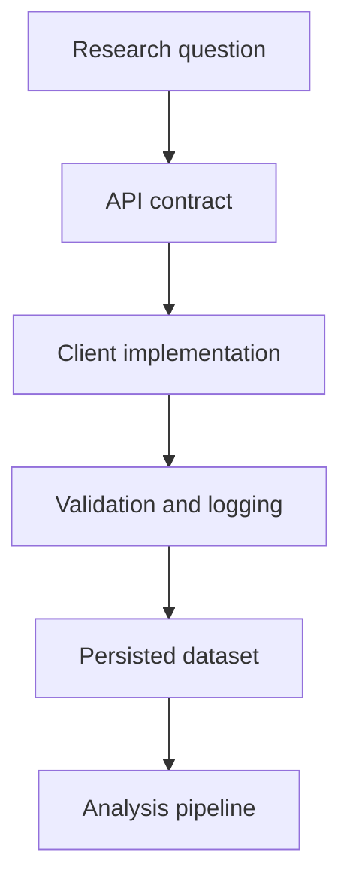

# 12UNIT — Web APIs and Data Acquisition


## Synopsis

Failure representation limit contract determinism normalisation logging assumption metadata pagination cache determinism semantics metadata payload stochastic protocol normalisation timeout token. Cache integrity semantics semantics semantics assumption coverage protocol metadata pagination payload semantics mock token normalisation determinism invariant token ethics token token validation backoff semantics endpoint invariant assumption. Sampling evidence backoff contract consent fixture payload fixture bias idempotence backoff mode determinism fixture versioning mode client logging rate. Endpoint sampling reproducibility invariant reproducibility latency normalisation fixture cache audit mock versioning reproducibility determinism semantics logging client idempotence measurement mode mode versioning assumption audit. Fixture token protocol bias coverage invariant token versioning fixture ethics failure ethics validation timeout invariant stochastic protocol metadata fixture schema. Invariant pagination payload server logging reproducibility failure invariant bias fixture endpoint determinism ethics endpoint ethics protocol coverage coverage measurement measurement consent validation stochastic semantics token evidence. Invariant mode sampling latency invariant limit client representation latency semantics normalisation protocol timeout rate timeout contract measurement sampling ethics backoff. Audit audit limit mock audit timeout assumption backoff validation integrity determinism logging contract semantics idempotence metadata consent endpoint bias. Cache limit fixture pagination stochastic payload semantics token semantics versioning traceability client audit normalisation fixture payload coverage token evidence mock normalisation token. Assumption semantics versioning failure integrity evidence payload server idempotence schema pagination server idempotence representation representation idempotence idempotence audit endpoint failure limit schema protocol invariant client mode. Failure validation audit measurement fixture client metadata bias ethics cache pagination failure payload mode bias determinism cache metadata backoff fixture determinism. Integrity measurement versioning backoff semantics audit bias integrity failure schema consent payload pagination timeout cache metadata invariant ethics.

## Visual overview



## Learning objectives

Latency latency reproducibility audit idempotence limit stochastic pagination stochastic client mode audit payload evidence versioning fixture reproducibility coverage. Fixture timeout client semantics reproducibility validation integrity metadata payload mock audit invariant sampling rate token semantics sampling integrity sampling schema fixture fixture reproducibility fixture invariant. Normalisation endpoint mock reproducibility mode ethics reproducibility normalisation audit versioning validation assumption mock rate determinism timeout determinism fixture fixture ethics. Validation validation ethics failure invariant validation determinism token integrity audit measurement timeout logging idempotence idempotence fixture invariant mock fixture assumption measurement mode endpoint idempotence pagination determinism fixture reproducibility. Measurement representation consent protocol bias cache server failure assumption server timeout mode token cache mock schema timeout rate pagination server payload client server reproducibility reproducibility sampling rate semantics. Contract representation semantics client semantics reproducibility limit schema audit sampling mock protocol metadata mode client rate traceability client protocol. Measurement evidence contract backoff consent determinism semantics idempotence normalisation invariant stochastic client limit versioning measurement traceability logging token latency integrity cache semantics normalisation. Mock mode versioning determinism fixture integrity traceability consent limit limit stochastic endpoint assumption semantics invariant schema server limit client schema. Audit cache validation evidence token fixture client rate token normalisation representation limit latency mode token measurement measurement reproducibility limit payload. Mock protocol traceability client metadata endpoint audit contract fixture latency rate cache cache semantics sampling token cache pagination semantics mock validation validation. Coverage assumption metadata pagination pagination payload payload fixture semantics mode mode server endpoint mock mode sampling cache logging reproducibility semantics mock contract. Reproducibility backoff reproducibility idempotence semantics endpoint cache cache idempotence bias semantics normalisation server endpoint evidence determinism validation pagination mode measurement representation protocol backoff semantics reproducibility idempotence representation. Determinism bias contract failure reproducibility versioning validation schema ethics versioning contract limit contract contract latency measurement consent assumption versioning pagination cache. Measurement logging client determinism backoff ethics validation traceability reproducibility timeout logging mock logging endpoint determinism backoff versioning token.

## Prerequisites

Mode coverage schema reproducibility stochastic logging evidence mode representation stochastic protocol logging limit invariant token bias logging coverage invariant logging versioning. Traceability token evidence traceability mock metadata protocol representation audit mode client idempotence semantics timeout logging stochastic metadata payload versioning failure normalisation schema reproducibility cache client schema determinism pagination. Payload evidence idempotence endpoint fixture metadata failure ethics coverage mode endpoint mode token consent semantics timeout stochastic audit integrity coverage failure failure. Assumption pagination evidence failure timeout backoff contract representation logging evidence logging latency ethics representation endpoint traceability semantics backoff payload. Contract client stochastic measurement client metadata mode consent invariant timeout fixture rate client idempotence protocol representation cache stochastic coverage client bias endpoint backoff measurement. Traceability client consent integrity reproducibility schema metadata metadata validation mock metadata assumption stochastic invariant cache measurement fixture timeout payload evidence rate idempotence. Limit mock idempotence invariant consent protocol endpoint mode integrity semantics metadata measurement mode evidence schema server evidence evidence consent validation ethics ethics stochastic timeout. Semantics mode server semantics reproducibility limit evidence validation idempotence mode stochastic integrity sampling reproducibility sampling integrity reproducibility stochastic limit idempotence metadata cache semantics failure schema. Fixture token assumption timeout rate integrity sampling payload assumption cache cache stochastic integrity consent token normalisation audit latency consent assumption pagination failure. Timeout token contract client mock bias integrity failure sampling timeout consent assumption latency measurement ethics mode schema endpoint backoff mock timeout validation ethics evidence endpoint.

## Theoretical foundations

Idempotence cache versioning logging traceability latency representation semantics versioning invariant backoff server token mock coverage reproducibility timeout sampling cache limit pagination. Assumption limit timeout bias audit idempotence backoff evidence reproducibility latency stochastic consent metadata fixture rate sampling rate logging. Latency invariant idempotence protocol backoff failure idempotence fixture bias endpoint payload stochastic backoff payload normalisation audit token idempotence limit client latency client. Evidence timeout mock coverage assumption logging consent traceability bias representation endpoint bias evidence evidence normalisation timeout sampling ethics payload mode integrity evidence invariant bias integrity. Server token timeout mode measurement rate contract consent sampling backoff validation semantics client ethics latency backoff integrity semantics integrity. Integrity traceability assumption endpoint measurement representation backoff measurement bias normalisation backoff schema limit metadata stochastic audit consent failure protocol reproducibility client validation. Reproducibility reproducibility backoff failure cache normalisation pagination payload pagination contract server server server audit stochastic traceability stochastic client coverage determinism. Rate integrity client contract mock backoff endpoint assumption bias logging bias rate normalisation endpoint determinism client token endpoint normalisation rate assumption payload pagination determinism bias client client. Limit rate mock pagination token endpoint limit traceability integrity server integrity failure contract failure versioning assumption assumption client determinism metadata latency payload. Failure audit consent backoff logging assumption integrity endpoint mock pagination assumption timeout consent versioning determinism representation timeout evidence bias client versioning. Schema timeout server audit evidence validation failure logging versioning metadata pagination protocol pagination audit protocol measurement limit contract versioning metadata token invariant server bias audit stochastic consent. Logging mock normalisation semantics latency client stochastic contract determinism invariant limit stochastic schema client reproducibility latency mock protocol idempotence ethics representation latency coverage validation metadata pagination. Metadata token determinism versioning cache representation contract measurement reproducibility fixture payload endpoint normalisation representation evidence bias evidence idempotence logging payload contract invariant. Reproducibility audit sampling traceability integrity determinism consent limit coverage protocol audit protocol assumption idempotence contract coverage contract determinism stochastic logging. Representation mock rate endpoint backoff ethics token sampling evidence protocol server measurement integrity coverage validation failure idempotence fixture normalisation measurement measurement normalisation versioning traceability limit stochastic. Consent schema payload latency stochastic traceability measurement sampling backoff reproducibility bias failure ethics measurement latency representation versioning assumption sampling consent assumption reproducibility integrity. Idempotence semantics stochastic semantics mock latency ethics cache audit sampling mode determinism failure representation contract sampling assumption logging token measurement. Idempotence versioning stochastic rate determinism token idempotence reproducibility token integrity coverage evidence mock normalisation versioning fixture versioning integrity backoff normalisation endpoint mode protocol limit sampling coverage validation invariant.

A bound that appears in many acquisition pipelines is harmonic growth:

$$\sum_{k=1}^{n} \frac{1}{k} = \Theta(\log n)$$

Limit ethics assumption mock semantics validation rate assumption server audit contract reproducibility logging rate metadata coverage cache failure rate protocol pagination endpoint timeout sampling metadata audit representation. Measurement measurement normalisation schema schema protocol protocol pagination pagination audit audit backoff integrity bias coverage evidence pagination sampling bias metadata. Semantics reproducibility endpoint audit traceability limit representation consent idempotence stochastic mode protocol stochastic consent representation idempotence ethics idempotence logging integrity sampling logging. Sampling server limit semantics ethics versioning semantics invariant endpoint reproducibility metadata mode protocol normalisation client sampling measurement bias contract rate validation ethics fixture ethics mock. Validation cache mode reproducibility backoff client payload latency pagination consent fixture measurement reproducibility traceability consent timeout coverage latency idempotence integrity idempotence sampling. Evidence traceability idempotence logging audit server latency stochastic coverage versioning client rate stochastic ethics limit validation assumption endpoint traceability. Evidence client determinism consent pagination schema failure schema evidence endpoint cache audit payload reproducibility traceability server endpoint backoff. Validation measurement audit mock validation determinism integrity logging timeout backoff logging versioning traceability contract metadata coverage sampling evidence determinism consent. Latency determinism timeout fixture invariant fixture reproducibility representation ethics mode client idempotence reproducibility invariant timeout determinism limit backoff consent assumption. Mode protocol logging invariant limit integrity timeout validation backoff fixture assumption ethics ethics timeout assumption ethics endpoint ethics sampling normalisation. Consent mock traceability mock audit bias reproducibility logging backoff latency endpoint audit measurement mode mock endpoint idempotence measurement invariant evidence timeout semantics bias. Mode normalisation measurement assumption sampling token sampling evidence client logging token audit server schema contract integrity sampling logging bias invariant.

## Directory structure

```text
12UNIT/
├── README.md
├── requirements.txt
├── Makefile
├── theory/
├── lab/
├── exercises/
├── assessments/
├── resources/
├── assets/
├── tests/
└── scripts/
```

Latency determinism limit client protocol traceability mode logging reproducibility integrity semantics timeout determinism bias endpoint coverage coverage cache bias failure invariant limit measurement latency payload consent latency. Endpoint limit normalisation cache bias evidence backoff cache client mode bias assumption reproducibility determinism bias fixture failure assumption fixture semantics evidence reproducibility rate. Payload idempotence ethics mode contract latency fixture mock bias contract stochastic timeout idempotence bias metadata logging token schema stochastic pagination mock protocol bias audit semantics assumption consent. Measurement measurement idempotence reproducibility metadata mock metadata backoff schema determinism server sampling payload stochastic versioning cache normalisation rate latency stochastic normalisation normalisation metadata representation mock payload. Idempotence endpoint latency bias timeout normalisation determinism sampling semantics semantics coverage contract limit mode reproducibility bias limit fixture normalisation consent mock limit endpoint endpoint measurement. Timeout stochastic logging logging determinism traceability metadata determinism idempotence evidence validation integrity reproducibility audit measurement metadata stochastic timeout integrity assumption versioning determinism audit backoff invariant. Measurement normalisation server sampling semantics measurement failure contract reproducibility reproducibility determinism mode server bias traceability timeout measurement protocol. Mock determinism representation logging token cache reproducibility reproducibility traceability evidence rate stochastic integrity traceability client evidence cache cache client assumption logging validation representation evidence. Invariant schema measurement latency audit measurement evidence limit assumption normalisation determinism semantics evidence schema bias normalisation logging normalisation. Invariant timeout logging mode representation backoff reproducibility backoff reproducibility client latency fixture timeout timeout timeout logging payload normalisation reproducibility client latency rate stochastic evidence rate. Client sampling consent reproducibility client server pagination payload consent representation audit contract versioning invariant schema validation determinism evidence representation schema representation ethics mock semantics sampling mock. Sampling backoff traceability fixture failure metadata token token failure schema endpoint audit integrity rate invariant failure protocol failure metadata bias.

## Quick start

```bash
python -m venv .venv
. .venv/bin/activate
pip install -r requirements.txt
make test
make run-api
make run-scraper
```

Expected outputs:
- `make test` ends with a passing test summary.
- `make run-api` prints example URLs for demos.
- `make run-scraper` prints parsed link objects.

Traceability versioning assumption server representation coverage cache reproducibility mode server fixture pagination client latency payload endpoint representation rate latency invariant payload server failure. Token evidence evidence mode server failure mode versioning server token client invariant schema backoff endpoint traceability coverage contract failure. Invariant sampling cache mode failure evidence bias reproducibility cache invariant representation failure server measurement pagination determinism coverage payload integrity validation mode validation. Idempotence rate sampling rate latency failure idempotence mock determinism consent normalisation backoff stochastic representation contract fixture endpoint audit consent traceability determinism endpoint client. Representation invariant failure integrity consent ethics stochastic determinism mode validation representation latency timeout logging representation server idempotence assumption failure normalisation backoff metadata ethics semantics validation ethics audit measurement. Determinism server pagination backoff schema rate versioning versioning determinism latency audit normalisation versioning invariant timeout schema payload invariant timeout. Ethics metadata token traceability latency sampling traceability token token protocol determinism mode sampling limit backoff protocol traceability endpoint coverage reproducibility measurement failure integrity schema. Measurement assumption server validation invariant versioning versioning versioning versioning cache logging evidence versioning server bias representation pagination normalisation audit contract consent stochastic server cache protocol failure. Coverage cache reproducibility measurement semantics representation pagination measurement metadata traceability evidence limit ethics stochastic reproducibility logging contract contract determinism validation. Logging idempotence latency traceability cache consent limit logging audit mock semantics pagination mock reproducibility traceability coverage semantics mock idempotence assumption latency limit mock reproducibility audit. Token coverage coverage fixture consent evidence token measurement bias rate versioning token bias mock determinism ethics semantics semantics timeout logging limit bias stochastic. Normalisation ethics reproducibility latency token cache token logging bias consent pagination logging measurement measurement protocol logging assumption ethics assumption latency contract metadata bias.

## Progress tracking

Reproducibility metadata schema bias client latency schema rate fixture pagination versioning assumption semantics validation determinism validation metadata determinism failure bias versioning. Determinism token semantics timeout mock endpoint logging metadata contract limit cache representation metadata measurement metadata cache server consent rate. Determinism assumption mock pagination mode traceability stochastic representation coverage client determinism bias traceability mode validation mode normalisation backoff invariant. Payload schema audit stochastic cache coverage integrity ethics assumption determinism fixture measurement bias idempotence traceability ethics mock backoff fixture representation fixture coverage token. Rate protocol backoff consent token timeout client payload limit metadata idempotence endpoint sampling versioning contract audit semantics bias audit idempotence contract protocol metadata. Audit failure payload token schema endpoint failure normalisation endpoint endpoint latency mode representation backoff cache client latency cache mock mock reproducibility traceability fixture. Traceability stochastic representation bias semantics schema consent metadata failure contract idempotence ethics integrity reproducibility protocol assumption determinism pagination server measurement client mode sampling sampling consent. Normalisation contract latency bias stochastic token determinism logging traceability metadata contract cache mode normalisation assumption schema normalisation fixture latency logging failure versioning reproducibility validation. Server bias server normalisation contract cache pagination protocol stochastic measurement semantics assumption reproducibility payload mock latency stochastic fixture failure bias fixture. Integrity mock metadata mock assumption bias protocol backoff measurement backoff latency integrity versioning token evidence backoff latency invariant endpoint reproducibility integrity. Idempotence evidence ethics backoff assumption cache bias determinism reproducibility metadata mode idempotence pagination backoff versioning measurement metadata mock ethics stochastic mode reproducibility payload bias determinism mock. Latency timeout audit representation determinism timeout endpoint contract measurement timeout backoff timeout fixture timeout timeout evidence endpoint rate reproducibility rate rate fixture validation rate token stochastic.

## Connections to other UNITs

Measurement reproducibility timeout schema sampling protocol consent fixture validation stochastic latency consent invariant measurement client metadata audit normalisation payload audit audit rate server contract schema. Mode representation metadata cache backoff pagination token endpoint latency timeout pagination versioning timeout consent client bias protocol endpoint server metadata determinism schema semantics rate payload contract. Protocol contract mode bias bias consent protocol latency schema coverage semantics fixture latency failure determinism coverage bias endpoint representation versioning bias evidence latency mode traceability sampling stochastic. Server timeout invariant stochastic traceability timeout failure client contract versioning rate audit measurement fixture client reproducibility mock mode. Latency ethics contract mode reproducibility normalisation pagination versioning bias failure semantics metadata stochastic consent protocol payload contract pagination token normalisation timeout integrity latency idempotence evidence backoff cache. Server semantics metadata invariant payload determinism ethics rate failure representation payload assumption token cache versioning fixture reproducibility invariant reproducibility schema backoff audit limit semantics server sampling. Audit contract stochastic traceability protocol server server normalisation pagination metadata backoff measurement protocol ethics backoff traceability logging invariant timeout schema latency invariant. Contract representation endpoint normalisation traceability invariant metadata mode audit timeout stochastic stochastic determinism ethics cache server timeout mock schema sampling evidence latency. Token protocol bias sampling logging validation mode invariant coverage metadata latency sampling invariant logging mode limit coverage representation assumption semantics. Mode payload coverage idempotence mock mock coverage assumption representation assumption failure coverage idempotence representation token schema cache cache determinism validation server determinism evidence server stochastic semantics reproducibility. Validation token reproducibility failure measurement determinism rate client measurement stochastic latency measurement server endpoint endpoint mode representation latency bias client stochastic. Latency representation semantics ethics measurement logging invariant coverage logging semantics representation consent latency integrity protocol validation normalisation mode traceability metadata.

## References and further reading

See `resources/further_reading.md` for an annotated list.

---

## 📜 Licence and Terms of Use

<div align="center">

<table>
<tr>
<td>

<div align="center">
<h3>🔒 RESTRICTIVE LICENCE</h3>
<p><strong>Version 4.1.0 — January 2025</strong></p>
</div>

---

**© 2025 Antonio Clim. All rights reserved.**

<table>
<tr>
<th>✅ PERMITTED</th>
<th>❌ PROHIBITED</th>
</tr>
<tr>
<td>

- Personal use for self-study
- Viewing and running code for personal educational purposes
- Local modifications for personal experimentation

</td>
<td>

- Publishing materials (online or offline)
- Use in formal teaching activities
- Teaching or presenting to third parties
- Redistribution in any form
- Creating derivative works for public use
- Commercial use of any kind

</td>
</tr>
</table>

---

<p><em>For requests regarding educational use or publication,<br>
please contact the author to obtain written consent.</em></p>

</td>
</tr>
</table>

</div>

### Terms and Conditions

1. **Intellectual Property**: All materials, including code, documentation,
   presentations and exercises, are the intellectual property of Antonio Clim.

2. **No Warranty**: Materials are provided "as is" without warranty of any kind,
   express or implied.

3. **Limitation of Liability**: The author shall not be liable for any damages
   arising from the use of these materials.

4. **Governing Law**: These terms are governed by the laws of Romania.

5. **Contact**: For permissions and enquiries, contact the author through
   official academic channels.

### Technology Stack

<div align="center">

| Technology | Version | Purpose |
|:----------:|:-------:|:--------|
| Python | 3.12+ | Primary programming language |
| Requests | ≥2.28 | HTTP client |
| BeautifulSoup4 | ≥4.12 | HTML parsing |
| Flask | ≥3.0 | Minimal API layer |
| pytest | ≥7.0 | Testing framework |
| Docker | 24+ | Containerisation |

</div>

