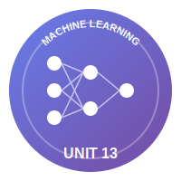
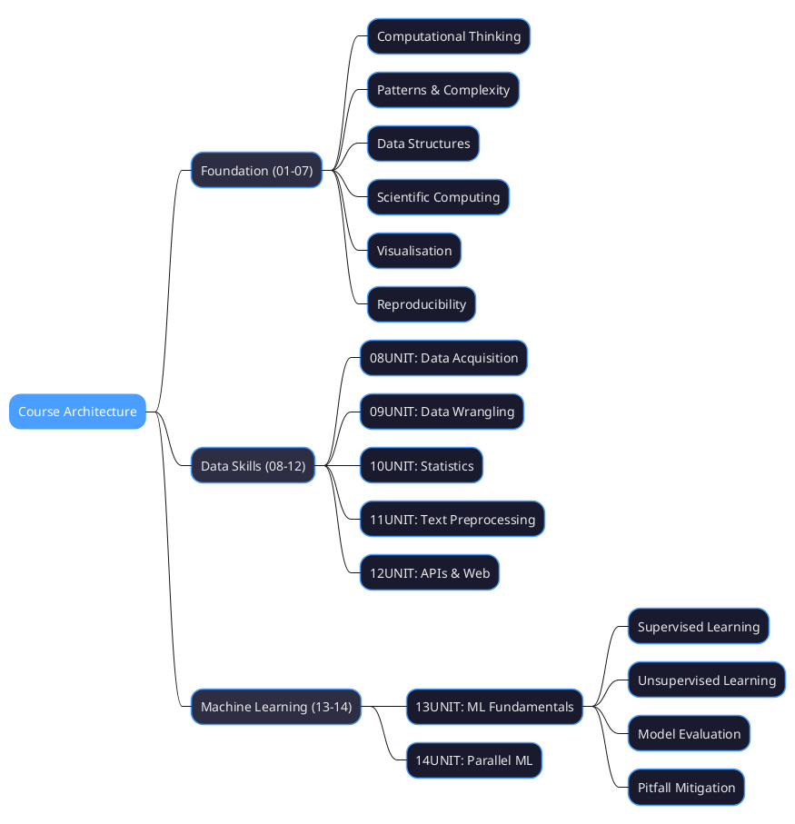
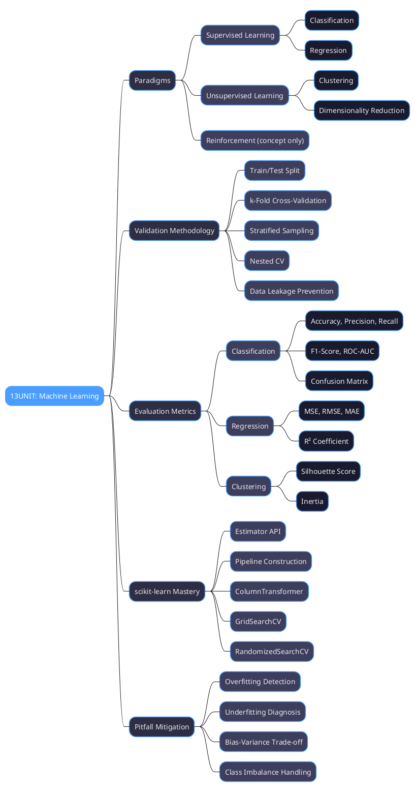
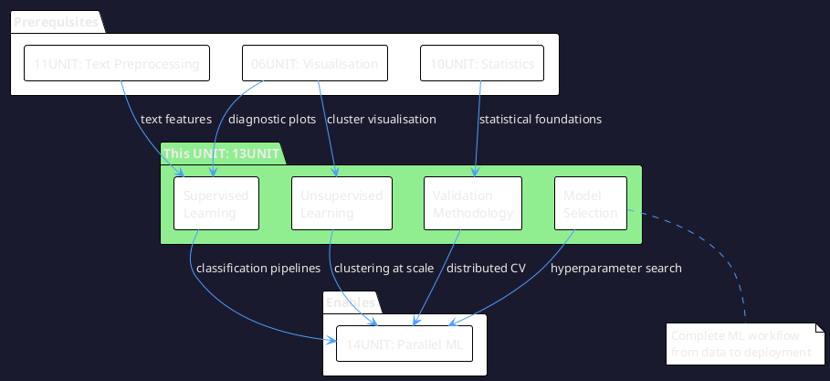
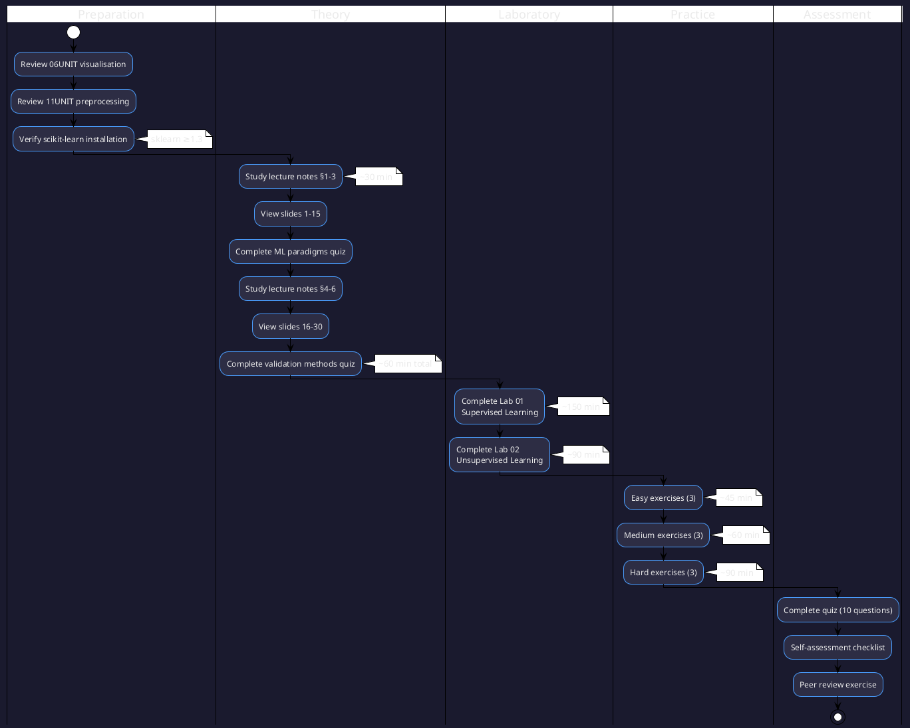

# 13UNIT: Machine Learning for Researchers

## The Art of Computational Thinking for Researchers



> **UNIT 13 of 14** | **Bloom Level**: Apply/Analyse/Evaluate | **Est. Time**: 10–12 hours

---

## 1. UNIT Synopsis

### 1.1 Abstract

This unit introduces the foundational principles of machine learning as a systematic methodology for extracting patterns from data—a capability that has become indispensable across virtually every research domain. The materials treat machine learning not as an opaque technological artifact but as an epistemological framework: a disciplined approach to constructing models that generalise from observed instances to unseen data. Researchers who grasp these principles gain the capacity to transform raw observations into predictive instruments, classification systems and explanatory models that advance domain-specific inquiry.

The laboratory components instantiate theoretical foundations through practical implementation using scikit-learn, the canonical Python library for machine learning. Participants construct complete supervised learning pipelines encompassing data preparation, model training, hyperparameter optimisation and rigorous evaluation. The unsupervised learning laboratory addresses clustering algorithms and dimensionality reduction techniques essential for exploratory data analysis. Throughout, the materials emphasise methodological rigour: proper validation protocols that prevent data leakage, stratified sampling that preserves class distributions, nested cross-validation for unbiased performance estimation and systematic approaches to diagnosing model pathologies such as overfitting and class imbalance.

**Keywords**: supervised learning, unsupervised learning, classification, regression, cross-validation, overfitting, scikit-learn, clustering, PCA, model selection

**Estimated Duration**: 10–12 hours (theory: 2.5h, laboratory: 5h, exercises: 4.5h)

**Difficulty Level**: ★★★★★ (5/5)

### 1.2 Position in Curriculum



This unit occupies a central position in the curriculum, building upon visualisation competencies from 06UNIT (essential for interpreting model diagnostics) and text preprocessing skills from 11UNIT (required for text classification tasks). The materials prepare participants for 14UNIT, which addresses parallelisation strategies for computationally intensive model training. The synthesis of statistical foundations from 10UNIT with algorithmic thinking from earlier units enables the systematic treatment of model selection and validation that distinguishes principled machine learning practice from ad hoc experimentation.

| Dependency Type | Source | Concepts Required |
|-----------------|--------|-------------------|
| Hard prerequisite | 06UNIT | Matplotlib, Seaborn visualisation |
| Hard prerequisite | 11UNIT | Text preprocessing, feature extraction |
| Soft prerequisite | 10UNIT | Statistical foundations, hypothesis testing |
| Prepares for | 14UNIT | Parallel ML training, distributed computing |

### 1.3 Pedagogical Rationale

The instructional design scaffolds competencies through progressive complexity, initiating at the Apply stratum (implementing pipelines using established APIs) and advancing through Analyse (interpreting evaluation metrics, diagnosing model behaviours) to Evaluate (selecting appropriate algorithms, assessing trade-offs between competing approaches). The laboratory sequence deliberately separates supervised and unsupervised paradigms, enabling focused attention on distinct learning objectives before synthesis in integrative exercises.

**Instructional Strategies Employed:**

1. **Worked Examples**: Complete pipelines with explicit reasoning traces for each methodological decision
2. **Deliberate Practice**: Graduated exercises targeting specific subskills—data splitting, metric interpretation, hyperparameter tuning
3. **Cognitive Apprenticeship**: Expert model selection heuristics made visible through decision flowcharts
4. **Error Analysis**: Systematic examination of common pitfalls—overfitting, data leakage, class imbalance—through diagnostic demonstrations
5. **Transfer Tasks**: Application of ML techniques to diverse research domains via contextualised exercises

---

## 2. Visual Overview

### 2.1 Conceptual Architecture



### 2.2 UNIT Dependencies Graph



### 2.3 Learning Pathway



---

## 3. Learning Objectives

Upon successful completion of this unit, participants will be able to:

| ID | Objective | Cognitive Level | Assessment Method |
|----|-----------|-----------------|-------------------|
| LO1 | Distinguish supervised, unsupervised and reinforcement learning paradigms based on problem characteristics | Understand | Quiz Q1–Q3 |
| LO2 | Implement classification and regression pipelines using scikit-learn's Estimator API | Apply | Lab 01 §1–§3 |
| LO3 | Apply proper validation protocols including train/test split, cross-validation and stratification | Apply | Lab 01 §4, Exercises |
| LO4 | Select and interpret evaluation metrics appropriate for classification and regression problems | Analyse | Lab 01 §2–§3, Quiz |
| LO5 | Identify and mitigate common pitfalls: overfitting, data leakage and class imbalance | Evaluate | Lab 01 §5, Hard exercises |
| LO6 | Implement unsupervised learning techniques: clustering and dimensionality reduction | Apply | Lab 02 §1–§3 |

---

## 4. Theoretical Foundation

### 4.1 The Nature of Machine Learning Models

The concept of a model pervades scientific practice, yet machine learning introduces distinctive considerations regarding model construction and validation. As the foundational text observes regarding computational modelling:

> **EXTRACT 13-A**: *"Consider a physicist modeling a bouncing ball. Reality involves complex interactions: air resistance, material deformation, surface friction, microscopic imperfections, and quantum effects. Yet for many purposes, we can abstract away most of these complexities to focus on a few key parameters: initial height, gravitational acceleration, and energy loss per bounce. Computational thinking teaches us to identify what matters in a given context and discard what doesn't."*

This principle of purposeful abstraction applies directly to machine learning: effective models capture decision-relevant patterns whilst discarding noise. The challenge lies in determining which features matter for a given predictive task—a determination that requires both domain expertise and empirical validation.

### 4.2 The Validation Challenge

Machine learning models face a distinctive epistemological challenge: they must generalise beyond their training data to perform well on unseen instances. This requirement distinguishes predictive modelling from mere curve-fitting. The foundational text articulates the broader challenge:

> **EXTRACT 13-B**: *"Unlike physical experiments, which interact directly with the phenomena under study, simulations operate on models—abstractions that necessarily omit details of the real system. This indirection raises important questions about validation: How do we know the simulation accurately represents the target system? What confidence can we place in its predictions, particularly in novel scenarios?"*

For machine learning, validation protocols such as cross-validation and held-out test sets provide empirical answers to these questions, estimating how models will perform on data they have not encountered during training.

### 4.3 Iterative Refinement

Machine learning development proceeds through cycles of model construction, evaluation and refinement. This iterative process mirrors broader patterns in computational inquiry:

> **EXTRACT 13-C**: *"The iterative refinement of models based on validation insights represents another distinctive aspect of computational approaches. As discrepancies between simulations and reality are identified, models can be enhanced to incorporate additional factors or modified to better capture observed behaviors."*

In practice, this means that initial models rarely achieve optimal performance. Systematic experimentation with features, algorithms and hyperparameters—guided by validation metrics—progressively improves model quality.

### 4.4 Debugging as Learning

The diagnostic process in machine learning shares deep similarities with software debugging. Each prediction error reveals information about model limitations:

> **EXTRACT 13-D**: *"Each debugging cycle reveals gaps between our mental model and reality, guiding us toward more accurate conceptualizations. In this way, computational thinking embodies a form of epistemological humility—an acknowledgment that our models are always approximations subject to refinement."*

Error analysis—examining which instances the model misclassifies and why—provides insights that inform model improvement strategies.

### 4.5 Research Domain Applications

Machine learning has transformed research practice across disciplines. The foundational text highlights the role of computational models in complex systems:

> **EXTRACT 13-E**: *"Computational approaches enable researchers to create agent-based models that simulate interactions among thousands of entities, revealing emergent properties that elude analytical treatment."*

In environmental science, ML models predict species distributions and classify satellite imagery. In medicine, they support diagnosis and patient stratification. In social science, they enable large-scale text analysis and demographic clustering. The techniques taught in this unit provide foundational capabilities applicable across these diverse contexts.

### 4.6 Simulation Without Risk

Machine learning enables researchers to explore scenarios that would be impractical or unethical to investigate directly:

> **EXTRACT 13-F**: *"An epidemiologist can model disease spread under varying interventions without putting populations at risk. A climate scientist can project long-term outcomes of policy decisions that would take decades to observe naturally."*

Predictive models, once validated, serve as computational laboratories for hypothesis testing and scenario analysis.

### 4.7 Sensitivity Analysis

Understanding how model behaviour changes with input variations constitutes an essential diagnostic capability:

> **EXTRACT 13-G**: *"Computational models also enable sensitivity analysis—exploring how model behavior changes under varying parameters. This capability allows researchers to identify which parameters most strongly influence outcomes, assess robustness to parameter uncertainty, and discover critical thresholds where system behavior changes qualitatively."*

In machine learning, feature importance analysis and partial dependence plots serve analogous functions, revealing which inputs most influence predictions.

### 4.8 Validation Approaches

The foundational text outlines multiple approaches to establishing model credibility:

> **EXTRACT 13-H**: *"In practice, validation often involves benchmarking simulations against known cases—comparing outputs to analytical solutions where available or to experimental results for well-understood scenarios. This calibration establishes confidence in the simulation's fidelity, creating a foundation for exploring novel conditions where experimental data may be unavailable."*

Machine learning validation follows this pattern: models are evaluated against held-out data where ground truth is known, establishing confidence that justifies deployment in settings where outcomes remain uncertain.

---

## 5. Key Mathematical Foundations

### 5.1 Classification Metrics

The evaluation of classification models requires metrics that capture different aspects of predictive performance:

**Accuracy** measures overall correctness:

$$\text{Accuracy} = \frac{TP + TN}{TP + TN + FP + FN}$$

**Precision** measures the proportion of positive predictions that are correct:

$$\text{Precision} = \frac{TP}{TP + FP}$$

**Recall** (sensitivity) measures the proportion of actual positives correctly identified:

$$\text{Recall} = \frac{TP}{TP + FN}$$

**F1-Score** provides the harmonic mean of precision and recall:

$$F_1 = 2 \cdot \frac{\text{Precision} \cdot \text{Recall}}{\text{Precision} + \text{Recall}}$$

Where TP = true positives, TN = true negatives, FP = false positives, FN = false negatives.

### 5.2 Regression Metrics

Regression models predict continuous values, requiring different evaluation metrics:

**Mean Squared Error** penalises large errors quadratically:

$$\text{MSE} = \frac{1}{n}\sum_{i=1}^{n}(y_i - \hat{y}_i)^2$$

**Coefficient of Determination** (R²) measures variance explained:

$$R^2 = 1 - \frac{\sum_{i=1}^{n}(y_i - \hat{y}_i)^2}{\sum_{i=1}^{n}(y_i - \bar{y})^2}$$

### 5.3 Clustering Evaluation

**Silhouette Score** measures cluster cohesion and separation:

$$s(i) = \frac{b(i) - a(i)}{\max(a(i), b(i))}$$

Where a(i) is the mean intra-cluster distance and b(i) is the mean nearest-cluster distance for sample i.

### 5.4 Dimensionality Reduction

**PCA Variance Explained** by component k:

$$\text{Var}_k = \frac{\lambda_k}{\sum_{i=1}^{p}\lambda_i}$$

Where λₖ is the eigenvalue corresponding to the k-th principal component.

---

## 6. Laboratory Overview

### 6.1 Lab 13_01: Supervised Learning Pipeline

**Duration**: ~150 minutes | **Lines**: 550+

This laboratory guides participants through constructing complete supervised learning pipelines:

| Section | Content | Functions Implemented |
|---------|---------|----------------------|
| §1 Data Preparation | Loading, exploration, preprocessing | `load_and_explore()`, `preprocess_features()`, `train_test_stratified_split()` |
| §2 Classification | Training, evaluation, comparison | `train_classifier()`, `evaluate_classifier()`, `compare_classifiers()`, `plot_confusion_matrix()`, `plot_roc_curves()` |
| §3 Regression | Pipeline construction, diagnostics | `train_regressor()`, `evaluate_regressor()`, `plot_predictions_vs_actual()`, `plot_residuals()` |
| §4 Model Selection | Cross-validation, hyperparameter search | `cross_validate_model()`, `grid_search_cv()`, `nested_cross_validation()`, `learning_curve_analysis()` |
| §5 Pitfall Demos | Overfitting, leakage, imbalance | `demonstrate_overfitting()`, `demonstrate_data_leakage()`, `handle_class_imbalance()` |

### 6.2 Lab 13_02: Unsupervised Learning

**Duration**: ~90 minutes | **Lines**: 350+

This laboratory addresses pattern discovery in unlabelled data:

| Section | Content | Functions Implemented |
|---------|---------|----------------------|
| §1 Clustering | k-Means, hierarchical, DBSCAN | `kmeans_clustering()`, `hierarchical_clustering()`, `dbscan_clustering()`, `evaluate_clustering()` |
| §2 Dimensionality | PCA, t-SNE visualisation | `pca_analysis()`, `visualise_pca_loadings()`, `tsne_visualisation()`, `compare_reduction_methods()` |
| §3 Pipelines | Preprocessing + clustering | `preprocessing_clustering_pipeline()`, `cluster_profiling()`, `anomaly_detection_isolation_forest()` |
| §4 Applications | Research domain examples | `customer_segmentation_demo()`, `document_clustering_demo()` |

---

## 7. Exercises Summary

### 7.1 Easy Exercises (Apply)

| Exercise | Focus | Learning Objective |
|----------|-------|-------------------|
| `easy_01_train_test_split.py` | Data splitting fundamentals | LO3 |
| `easy_02_simple_classifier.py` | Basic classification workflow | LO2 |
| `easy_03_metrics_basics.py` | Metric computation and interpretation | LO4 |

### 7.2 Medium Exercises (Analyse)

| Exercise | Focus | Learning Objective |
|----------|-------|-------------------|
| `medium_01_cross_validation.py` | k-Fold CV implementation | LO3 |
| `medium_02_pipeline_construction.py` | scikit-learn Pipeline API | LO2 |
| `medium_03_clustering_evaluation.py` | Cluster quality assessment | LO6 |

### 7.3 Hard Exercises (Evaluate/Create)

| Exercise | Focus | Learning Objective |
|----------|-------|-------------------|
| `hard_01_nested_cv.py` | Unbiased hyperparameter selection | LO3, LO5 |
| `hard_02_imbalanced_classification.py` | Class imbalance strategies | LO5 |
| `hard_03_complete_ml_pipeline.py` | End-to-end ML workflow | All LOs |

---

## 8. Assessment Components

### 8.1 Quiz Structure

The quiz comprises 10 questions across cognitive levels:

| Questions | Topic | Cognitive Level |
|-----------|-------|-----------------|
| Q1–Q3 | ML paradigm identification | Understand |
| Q4–Q5 | Validation methodology | Apply |
| Q6–Q7 | Metric interpretation | Analyse |
| Q8–Q10 | Pitfall diagnosis | Evaluate |

### 8.2 Grading Rubric

Laboratory submissions are evaluated against:

- **Correctness** (40%): Algorithms produce expected outputs
- **Code Quality** (25%): Type hints, docstrings, style compliance
- **Methodology** (25%): Appropriate validation, metric selection
- **Documentation** (10%): Clear reasoning, interpretation of results

### 8.3 Self-Assessment

Participants complete a checklist verifying competency in each learning objective before submission.

---

## 9. Research Domain Applications

### 9.1 Biology and Life Sciences

- **Species Classification**: Predicting species from morphological measurements
- **Gene Expression Clustering**: Identifying co-expressed gene groups
- **Disease Prediction**: Risk stratification from clinical features

### 9.2 Medicine and Healthcare

- **Diagnostic Support**: Classification from symptoms and test results
- **Patient Stratification**: Clustering for treatment personalisation
- **Drug Response Prediction**: Regression models for efficacy estimation

### 9.3 Social Sciences

- **Survey Response Clustering**: Identifying demographic segments
- **Text Classification**: Categorising open-ended responses
- **Behavioural Prediction**: Modelling decision outcomes

### 9.4 Economics and Business

- **Market Prediction**: Regression for price forecasting
- **Customer Segmentation**: Clustering for marketing strategy
- **Fraud Detection**: Anomaly detection in transactions

### 9.5 Environmental Science

- **Species Distribution Modelling**: Predicting habitat suitability
- **Climate Pattern Classification**: Categorising weather regimes
- **Remote Sensing Analysis**: Land cover classification from imagery

---

## 10. Technology Stack

| Technology | Version | Purpose |
|------------|---------|---------|
| Python | 3.12+ | Primary language |
| NumPy | ≥1.24 | Numerical computing |
| Pandas | ≥2.0 | Data manipulation |
| Matplotlib | ≥3.7 | Static visualisation |
| Seaborn | ≥0.12 | Statistical visualisation |
| scikit-learn | ≥1.3 | Machine learning algorithms |
| SciPy | ≥1.11 | Scientific computing |
| pytest | ≥7.0 | Testing framework |
| pytest-cov | ≥4.0 | Coverage reporting |
| ruff | ≥0.1 | Linting and formatting |
| mypy | ≥1.0 | Type checking |

---

## 11. Installation and Setup

### 11.1 Environment Preparation

```bash
# Create virtual environment
python -m venv .venv
source .venv/bin/activate  # Linux/macOS
# .venv\Scripts\activate   # Windows

# Install dependencies
pip install numpy pandas matplotlib seaborn scikit-learn scipy
pip install pytest pytest-cov ruff mypy

# Verify installation
python -c "import sklearn; print(f'scikit-learn {sklearn.__version__}')"
```

### 11.2 Verify Setup

```bash
cd "13UNIT - Machine Learning for Researchers (ML)"
python -c "from lab.lab_13_01_supervised_learning import *; print('Lab 01 OK')"
python -c "from lab.lab_13_02_unsupervised_learning import *; print('Lab 02 OK')"
```

---

## 12. Quick Start

### 12.1 Recommended Sequence

1. **Read** lecture notes sections 1–3 (ML paradigms, scikit-learn API)
2. **View** slides 1–15
3. **Complete** Lab 01 sections 1–2 (data prep, classification)
4. **Attempt** easy exercises 1–2
5. **Continue** Lab 01 sections 3–5 (regression, model selection, pitfalls)
6. **Read** lecture notes sections 4–6 (unsupervised learning)
7. **Complete** Lab 02
8. **Attempt** medium and hard exercises
9. **Take** quiz and self-assessment

### 12.2 Minimum Viable Path

For time-constrained participants:

1. Lab 01 §1–§2 (classification essentials)
2. Lab 01 §4 (cross-validation)
3. Easy exercises
4. Quiz

---

## 13. Running Tests

```bash
# Run all unit tests
pytest tests/ -v

# Run with coverage
pytest tests/ --cov=lab --cov-report=term-missing

# Run specific test module
pytest tests/test_lab_13_01.py -v

# Type checking
mypy lab/ --strict

# Linting
ruff check lab/ exercises/
```

---

## 14. Directory Structure

```
13UNIT - Machine Learning for Researchers (ML)/
├── 📄 README.md                        ← You are here
│
├── 📚 theory/
│   ├── 13UNIT_slides.html              ← 40+ slides, ~90 min
│   ├── lecture_notes.md                ← 2,500+ words
│   └── learning_objectives.md          ← Measurable objectives
│
├── 🔬 lab/
│   ├── __init__.py                     ← Package initialisation
│   ├── lab_13_01_supervised_learning.py    ← 550+ lines
│   ├── lab_13_02_unsupervised_learning.py  ← 350+ lines
│   └── solutions/
│       ├── lab_13_01_solution.py
│       └── lab_13_02_solution.py
│
├── ✏️ exercises/
│   ├── homework.md                     ← 1,500+ words
│   ├── practice/
│   │   ├── easy_01_train_test_split.py
│   │   ├── easy_02_simple_classifier.py
│   │   ├── easy_03_metrics_basics.py
│   │   ├── medium_01_cross_validation.py
│   │   ├── medium_02_pipeline_construction.py
│   │   ├── medium_03_clustering_evaluation.py
│   │   ├── hard_01_nested_cv.py
│   │   ├── hard_02_imbalanced_classification.py
│   │   └── hard_03_complete_ml_pipeline.py
│   └── solutions/
│       └── *.py
│
├── 📋 assessments/
│   ├── quiz.md                         ← 10 questions
│   ├── rubric.md                       ← Grading criteria
│   └── self_check.md                   ← Self-assessment
│
├── 📖 resources/
│   ├── cheatsheet.md                   ← scikit-learn one-pager
│   ├── further_reading.md              ← 15+ resources
│   ├── glossary.md                     ← 20+ terms
│   └── datasets/
│       └── sample_data.csv
│
├── 🎨 assets/
│   ├── diagrams/
│   │   ├── ml_workflow.puml
│   │   ├── sklearn_pipeline.puml
│   │   ├── cross_validation.puml
│   │   ├── bias_variance.puml
│   │   ├── clustering_comparison.puml
│   │   ├── confusion_matrix_explained.svg
│   │   ├── overfitting_curves.svg
│   │   └── pca_projection.svg
│   ├── animations/
│   │   └── 13UNIT_ml_playground.html   ← 600+ lines interactive
│   └── images/
│       └── 13UNIT_badge.svg
│
├── 🧪 tests/
│   ├── __init__.py
│   ├── conftest.py
│   ├── test_lab_13_01.py               ← 150+ lines
│   └── test_lab_13_02.py               ← 150+ lines
│
└── Makefile
```

---

## 15. Progress Tracking

### 15.1 Completion Checklist

| Component | Status | Estimated Duration |
|-----------|--------|-------------------|
| Lecture notes §1–3 studied | ⬜ | ~30 min |
| Slides 1–20 viewed | ⬜ | ~45 min |
| Lab 01 §1–§3 completed | ⬜ | ~90 min |
| Lab 01 §4–§5 completed | ⬜ | ~60 min |
| Lecture notes §4–6 studied | ⬜ | ~30 min |
| Slides 21–40 viewed | ⬜ | ~45 min |
| Lab 02 completed | ⬜ | ~90 min |
| Easy exercises (3) completed | ⬜ | ~45 min |
| Medium exercises (3) completed | ⬜ | ~60 min |
| Hard exercises (3) completed | ⬜ | ~90 min |
| Quiz passed (≥70%) | ⬜ | ~20 min |
| Self-assessment completed | ⬜ | ~15 min |

---

## 16. Troubleshooting

### 16.1 Common Issues

| Issue | Cause | Solution |
|-------|-------|----------|
| `ModuleNotFoundError: sklearn` | Missing installation | `pip install scikit-learn` |
| `ConvergenceWarning` | Insufficient iterations | Increase `max_iter` parameter |
| Poor cross-validation scores | Data leakage | Ensure preprocessing inside CV loop |
| Memory errors with large data | Dataset too large | Use `partial_fit` or sample data |
| Inconsistent results | Unseeded randomness | Set `random_state` parameter |

### 16.2 FAQ

**Q: Why does my test accuracy exceed training accuracy?**
A: This typically indicates data leakage—information from the test set has influenced training. Ensure preprocessing parameters are fitted only on training data.

**Q: How do I choose between precision and recall?**
A: Consider the cost of errors. If false positives are costly (e.g., unnecessary medical procedures), optimise for precision. If false negatives are costly (e.g., missing a disease), optimise for recall.

**Q: When should I use cross-validation vs. a single train/test split?**
A: Cross-validation provides more reliable estimates when data is limited. For large datasets (n > 10,000), a single stratified split often suffices.

---

## 17. Further Reading

### 17.1 Primary Sources

- Hastie, T., Tibshirani, R., & Friedman, J. (2009). *The Elements of Statistical Learning* (2nd ed.). Springer.
- Bishop, C. M. (2006). *Pattern Recognition and Machine Learning*. Springer.

### 17.2 Practical Guides

- Géron, A. (2022). *Hands-On Machine Learning with Scikit-Learn, Keras, and TensorFlow* (3rd ed.). O'Reilly.
- Müller, A. C., & Guido, S. (2016). *Introduction to Machine Learning with Python*. O'Reilly.

### 17.3 Online Resources

- scikit-learn documentation: https://scikit-learn.org/stable/
- scikit-learn user guide: https://scikit-learn.org/stable/user_guide.html
- Kaggle Learn: https://www.kaggle.com/learn

---

## 18. Glossary

| Term | Definition |
|------|------------|
| **Accuracy** | Proportion of correct predictions among all predictions |
| **Classification** | Predicting discrete class labels from input features |
| **Clustering** | Grouping similar instances without predefined labels |
| **Cross-validation** | Evaluation technique using multiple train/test splits |
| **Data leakage** | Information from test set influencing model training |
| **Dimensionality reduction** | Reducing feature count whilst preserving information |
| **F1-score** | Harmonic mean of precision and recall |
| **Feature** | Input variable used for prediction |
| **Hyperparameter** | Model setting determined before training |
| **Overfitting** | Model memorises training data, fails on new data |
| **PCA** | Principal Component Analysis—linear dimensionality reduction |
| **Pipeline** | Sequence of data transformations and model fitting |
| **Precision** | Proportion of positive predictions that are correct |
| **Recall** | Proportion of actual positives correctly identified |
| **Regression** | Predicting continuous values from input features |
| **ROC-AUC** | Area under the Receiver Operating Characteristic curve |
| **Stratification** | Preserving class proportions in data splits |
| **Supervised learning** | Learning from labelled examples |
| **t-SNE** | t-Distributed Stochastic Neighbor Embedding—nonlinear visualisation |
| **Unsupervised learning** | Learning patterns from unlabelled data |

---

## 19. Licence and Terms of Use

<div align="center">

<table>
<tr>
<td>

<div align="center">
<h3>🔒 RESTRICTIVE LICENCE</h3>
<p><strong>Version 4.1.0 — January 2025</strong></p>
</div>

---

**© 2025 Antonio Clim. All rights reserved.**

<table>
<tr>
<th>✅ PERMITTED</th>
<th>❌ PROHIBITED</th>
</tr>
<tr>
<td>

- Personal use for self-study
- Viewing and running code for personal educational purposes
- Local modifications for personal experimentation

</td>
<td>

- Publishing materials (online or offline)
- Use in formal teaching activities
- Teaching or presenting to third parties
- Redistribution in any form
- Creating derivative works for public use
- Commercial use of any kind

</td>
</tr>
</table>

---

<p><em>For requests regarding educational use or publication,<br>
please contact the author to obtain written consent.</em></p>

</td>
</tr>
</table>

</div>

### Terms and Conditions

1. **Intellectual Property**: All materials, including code, documentation,
   presentations and exercises, are the intellectual property of Antonio Clim.

2. **No Warranty**: Materials are provided "as is" without warranty of any kind,
   express or implied.

3. **Limitation of Liability**: The author shall not be liable for any damages
   arising from the use of these materials.

4. **Governing Law**: These terms are governed by the laws of Romania.

5. **Contact**: For permissions and enquiries, contact the author through
   official academic channels.

### Technology Stack

<div align="center">

| Technology | Version | Purpose |
|:----------:|:-------:|:--------|
| Python | 3.12+ | Primary programming language |
| NumPy | ≥1.24 | Numerical computing |
| Pandas | ≥2.0 | Data manipulation |
| scikit-learn | ≥1.3 | Machine learning |
| Matplotlib | ≥3.7 | Static visualisation |
| Seaborn | ≥0.12 | Statistical visualisation |
| pytest | ≥7.0 | Testing framework |

</div>

---
