# 14UNIT: Parallel Computing and Scalability

## The Art of Computational Thinking for Researchers

> **UNIT 14 of 14** | **Bloom Level**: Apply/Analyse/Create | **Est. Time**: 10-12 hours

---

## 1. UNIT Synopsis

### 1.1 Abstract

Modern computational research regularly confronts datasets and analyses that exceed single-processor capabilities. Genomic sequence alignment, climate modelling, Monte Carlo simulations and large-scale machine learning all demand computational resources beyond what sequential execution provides. This unit develops practical skills for parallel and scalable computing in Python, addressing the language's unique architectural constraints whilst providing effective strategies for both CPU-bound and I/O-bound workloads.

The treatment progresses from multiprocessing fundamentals—processes, pools and shared memory—through the concurrent.futures abstraction to the Dask framework for out-of-core computation. Participants confront the Global Interpreter Lock (GIL) directly, understanding when threading provides genuine benefit and when process-based parallelism becomes necessary. As the textbook observes: "Even for problems within theoretical computational boundaries, practical constraints may still apply. Available computational resources—processing power, memory, time—may limit the scale or precision of analysis."

Laboratory exercises instantiate these concepts through parallel Monte Carlo simulation, demonstrating how embarrassingly parallel problems scale across multiple cores and how Amdahl's Law governs the limits of achievable speedup. The synthesis of theoretical foundations and practical implementation equips researchers to scale their computations from laptop prototypes to production workloads.

**Keywords**: parallelism, concurrency, multiprocessing, threading, GIL, Dask, Amdahl's Law, Monte Carlo, scalability, profiling

**Estimated Duration**: 10-12 hours (theory: 3h, laboratory: 4h, exercises: 3h, assessment: 2h)

**Difficulty Level**: ★★★★★ (5/5)

### 1.2 Position in Curriculum


This unit occupies position 14 of 14 in the curriculum sequence, serving as the capstone for computational performance topics. It synthesises complexity analysis from 03UNIT with divide-and-conquer strategies from 08UNIT, demonstrating how algorithmic decomposition enables parallel execution. The unit also builds upon machine learning workflows from 13UNIT, showing how cross-validation and hyperparameter search parallelise naturally.

| Dependency Type | Source | Concepts Required |
|-----------------|--------|-------------------|
| Hard prerequisite | 03UNIT | Complexity analysis, Big-O notation, empirical benchmarking |
| Hard prerequisite | 08UNIT | Divide-and-conquer, recursive decomposition |
| Soft prerequisite | 13UNIT | ML pipelines, cross-validation, hyperparameter tuning |
| Corequisite | None | — |

### 1.3 Pedagogical Rationale

The instructional design follows constructivist principles, scaffolding knowledge acquisition through progressive complexity. The sequence adheres to cognitive progression from comprehension through application to analysis and synthesis:

**Instructional Strategies Employed:**

1. **Conceptual Foundations**: Distinguishing parallelism from concurrency, processes from threads
2. **Constraint Analysis**: Understanding the GIL and its implications for Python performance
3. **Pattern Recognition**: Identifying embarrassingly parallel problems amenable to scaling
4. **Empirical Validation**: Measuring actual speedup against theoretical predictions
5. **Scaling Strategies**: Progressing from multicore to out-of-core to distributed computation
6. **Transfer Tasks**: Application to Monte Carlo simulation, ML hyperparameter search and data pipelines

The unit addresses a common misconception: that adding more processors automatically yields proportional speedup. Amdahl's Law provides the theoretical framework for understanding speedup limits, whilst practical exercises reveal the constant factors and overhead that further constrain real-world performance.

---

## 2. Visual Overview

### 2.1 Conceptual Architecture


### 2.2 UNIT Dependencies Graph


### 2.3 Learning Pathway

```mermaid
flowchart TD
    A[Review Prerequisites: 03UNIT, 08UNIT] --> B[Read Learning Objectives]
    B --> C[Study Lecture Notes §1-2]
    C --> D[Understand GIL Implications]
    D --> E{Concept Check 1}
    E -->|Pass| F[Study Lecture Notes §3-4]
    E -->|Review| C
    F --> G[View Slides 1-20]
    G --> H[Complete Lab 01: Multiprocessing]
    H --> I{Lab 01 Tests Pass?}
    I -->|Yes| J[Study Lecture Notes §5-6]
    I -->|No| K[Review multiprocessing Docs]
    K --> H
    J --> L[View Slides 21-40]
    L --> M[Complete Lab 02: Dask & Profiling]
    M --> N[Easy Exercises ×3]
    N --> O[Medium Exercises ×3]
    O --> P{Confidence Check}
    P -->|Ready| Q[Hard Exercises ×3]
    P -->|Need Review| R[Revisit Labs]
    R --> N
    Q --> S[Take Quiz]
    S --> T{Score ≥70%?}
    T -->|Yes| U[Complete Homework]
    T -->|No| V[Review Weak Areas]
    V --> S
    U --> W[Self-Assessment]
    W --> X[Unit Complete]
```



---

## 3. Learning Objectives

### 3.1 Cognitive Objectives

Upon successful completion of this unit, participants shall demonstrate the following competencies:

| ID | Level | Verb | Objective Statement | Assessment |
|----|-------|------|---------------------|------------|
| LO1 | Understand | Explain | Explain the distinction between parallelism and concurrency, processes and threads, and the implications of Python's Global Interpreter Lock | Quiz Q1-Q3, Homework P1 |
| LO2 | Apply | Implement | Implement multiprocessing solutions for CPU-bound tasks using Process, Pool and shared memory primitives | Lab 01, Exercises easy_01-02 |
| LO3 | Apply | Implement | Implement threading and asyncio patterns for I/O-bound workloads with appropriate synchronisation | Lab 01 §5, Exercise medium_01 |
| LO4 | Apply | Use | Use concurrent.futures for high-level parallel execution patterns with proper error handling | Lab 01 §4, Exercise medium_02 |
| LO5 | Apply | Scale | Scale computations using Dask for datasets exceeding available memory | Lab 02, Exercises medium_03, hard_01 |
| LO6 | Analyse | Profile | Profile and optimise code using cProfile, line_profiler and memory_profiler to identify bottlenecks | Lab 02 §4, Exercise hard_02 |

### 3.2 Skill Objectives (Measurable Outcomes)

By the end of this unit, participants will be able to:

1. **Diagnose parallelisation opportunities**: Given a computational workload, determine whether it is CPU-bound or I/O-bound and select the appropriate parallelisation strategy
2. **Implement process pools**: Create multiprocessing.Pool instances with appropriate worker counts and use map/starmap/apply_async effectively
3. **Handle shared state**: Implement inter-process communication using Queue, Pipe, Value and Array with appropriate synchronisation
4. **Measure parallel efficiency**: Calculate speedup and efficiency, comparing empirical results against Amdahl's Law predictions
5. **Scale beyond memory**: Process datasets larger than RAM using Dask arrays and DataFrames with appropriate chunking strategies
6. **Profile systematically**: Use profiling tools to identify performance bottlenecks and validate optimisation efforts

### 3.3 Affective Objectives

Participants will develop:

- **Appreciation** for the complexity hidden beneath simple parallel abstractions
- **Scepticism** toward claims of linear speedup without empirical validation
- **Patience** with the debugging challenges inherent in concurrent code
- **Judgement** in selecting appropriate parallelisation strategies for different workloads

### 3.4 Objectives-Assessment Alignment Matrix


---

## 4. Theoretical Foundations

### 4.1 Historical Context

The pursuit of parallel computation predates electronic computers. In 1842, Luigi Menabrea documented Charles Babbage's observation that his Analytical Engine could perform multiple operations simultaneously. However, practical parallel computing awaited the semiconductor revolution of the late twentieth century.

| Year | Development | Significance |
|------|-------------|--------------|
| 1967 | Amdahl's Law | Theoretical limit on parallel speedup |
| 1988 | Gustafson's Law | Scaled speedup for larger problems |
| 1991 | Python 1.0 | Global Interpreter Lock introduced |
| 2001 | multiprocessing | Standard library parallel primitives |
| 2010 | concurrent.futures | High-level parallel abstraction (PEP 3148) |
| 2014 | Dask | Parallel computing for analytics |

The Global Interpreter Lock (GIL) in CPython—a mutex preventing multiple threads from executing Python bytecode simultaneously—has shaped Python's parallel computing environment profoundly. Understanding its implications is essential for effective parallelisation.

### 4.2 Parallelism versus Concurrency

These terms, often conflated, describe distinct phenomena:

**Parallelism** involves simultaneous execution of multiple computations on separate processing units. True parallelism requires multiple CPU cores executing instructions at the same instant.

**Concurrency** involves managing multiple tasks that may overlap in time but need not execute simultaneously. A single core can achieve concurrency through interleaved execution—switching between tasks rapidly enough to create the illusion of simultaneity.

The distinction matters practically: a web server handling many clients benefits from concurrency (I/O-bound); a Monte Carlo simulation benefits from parallelism (CPU-bound). Python's GIL permits concurrency through threading but requires multiprocessing for true parallelism of CPU-bound code.

### 4.3 The Global Interpreter Lock

CPython's GIL ensures only one thread executes Python bytecode at any moment. This simplifies memory management—reference counting needs no synchronisation—but constrains parallel execution.

```python
# This threading code achieves NO speedup for CPU-bound work
import threading

def cpu_intensive(n: int) -> int:
    """Compute sum of squares (CPU-bound)."""
    return sum(i * i for i in range(n))

# Two threads share one GIL—sequential execution
threads = [threading.Thread(target=cpu_intensive, args=(10_000_000,)) 
           for _ in range(2)]
```

The GIL releases during I/O operations and certain C extensions (NumPy, for instance), enabling genuine parallelism in those contexts. For pure Python CPU-bound code, multiprocessing circumvents the limitation through separate interpreter processes, each with its own GIL.

### 4.4 Amdahl's Law and Speedup Limits

Gene Amdahl's 1967 observation formalises the limits of parallel speedup. If a fraction $P$ of a program can be parallelised and $(1-P)$ must remain sequential, the maximum speedup with $n$ processors is:

$$S(n) = \frac{1}{(1-P) + \frac{P}{n}}$$

As $n \to \infty$, the speedup asymptotically approaches:

$$S_{max} = \frac{1}{1-P}$$

**Example**: If 95% of a program is parallelisable ($P = 0.95$), the maximum possible speedup is $1/0.05 = 20\times$, regardless of processor count. The sequential portion imposes an insurmountable bottleneck.

### 4.5 Gustafson's Law and Scaled Speedup

John Gustafson's 1988 reframing observes that problem size often scales with available resources. Rather than fixing the problem and adding processors, we fix the time and solve larger problems:

$$S(n) = n - \alpha(n-1)$$

where $\alpha$ represents the serial fraction. This perspective—scaled speedup—proves more relevant for scientific computing, where researchers expand their ambitions to match available resources.

### 4.6 Speedup and Efficiency Metrics

**Speedup** measures the ratio of sequential to parallel execution time:

$$S = \frac{T_1}{T_n}$$

where $T_1$ is single-processor time and $T_n$ is $n$-processor time.

**Efficiency** normalises speedup by processor count:

$$E = \frac{S}{n} = \frac{T_1}{n \cdot T_n}$$

Ideal (linear) speedup yields $E = 1$; real systems achieve $E < 1$ due to communication overhead, load imbalance and synchronisation costs. Superlinear speedup ($E > 1$) occasionally occurs when parallel execution improves cache utilisation.

### 4.7 Monte Carlo Methods and Parallelisation

As the textbook observes: "At the intuitive core of Monte Carlo methods lies a counterintuitive proposition: we can channel randomness to compute deterministic quantities. Named after the famous casino in Monaco, these methods transform random sampling into precise estimation."

Monte Carlo methods exemplify embarrassingly parallel computation—independent samples requiring no inter-process communication. The classic π estimation through the dartboard method illustrates this elegantly:

"The classic example of estimating π through the 'dartboard method' provides the perfect entry point to understanding this principle. Imagine a square with sides of length 2, centred at the origin of a coordinate system. Inside this square, we inscribe a circle with radius 1."

The standard error of Monte Carlo estimates decreases as $SE = \sigma / \sqrt{n}$, where $n$ is the sample count. Doubling accuracy requires quadrupling samples—a relationship that makes parallel sampling particularly valuable. "Computational simulations can run thousands of iterations, creating probability distributions that capture the full range of possible outcomes. This comprehensive view of uncertainty enables more reliable decision-making."

### 4.8 Collaborative Computation

The textbook captures a broader transformation: "These collaborative aspects highlight a broader transformation in scientific practice—from individual insight to collective intelligence. Where traditional research might rely on the brilliance of individual scientists, computational approaches often draw upon the distributed expertise of diverse teams."

This collaborative dimension extends to computation itself. "In astrophysics, simulations recreate conditions found in the early universe or inside collapsing stars—environments physically inaccessible to researchers" (Springel, 2005). Such simulations demand parallel computation at scales unimaginable to individual processors.

---

## 5. Algorithmic Content

### 5.1 Parallel Pattern Catalogue

| Pattern | Description | Example | Complexity |
|---------|-------------|---------|------------|
| Map | Apply function to each element independently | `Pool.map(f, items)` | O(n/p) ideal |
| Reduce | Combine results with associative operation | Sum partial results | O(log p) combination |
| Scatter-Gather | Distribute work, collect results | Monte Carlo sampling | Communication overhead |
| Pipeline | Chain processing stages | ETL workflows | Bounded by slowest stage |
| Fork-Join | Recursive decomposition | Parallel merge sort | O(log n) depth |
| Producer-Consumer | Separate generation and processing | Queue-based workflows | Queue capacity limits |

### 5.2 Work-Span Model

The work-span model provides theoretical analysis for parallel algorithms:

- **Work** ($W$): Total operations across all processors
- **Span** ($S$): Critical path length—longest chain of dependent operations

The parallel execution time satisfies:

$$T_p \geq \max\left(\frac{W}{p}, S\right)$$

**Parallelism** ($W/S$) indicates maximum useful processor count. Beyond this, additional processors yield no benefit.

### 5.3 Synchronisation Primitives

| Primitive | Purpose | Use Case |
|-----------|---------|----------|
| Lock | Mutual exclusion | Protecting shared counters |
| RLock | Reentrant lock | Recursive access patterns |
| Semaphore | Counting access | Connection pool limits |
| Event | Signal between threads | Coordinator patterns |
| Condition | Wait for predicate | Producer-consumer |
| Barrier | Synchronise phases | Parallel algorithm stages |

### 5.4 Dask Task Graph Execution

Dask builds computation graphs before execution, enabling optimisation:

```python
import dask

@dask.delayed
def process(chunk):
    return expensive_computation(chunk)

@dask.delayed  
def combine(results):
    return aggregate(results)

# Build graph (no computation yet)
parts = [process(chunk) for chunk in data_chunks]
result = combine(parts)

# Execute with chosen scheduler
final = result.compute(scheduler='processes')
```

The task graph reveals parallelisation opportunities, enables work stealing for load balancing and supports out-of-core execution for memory-constrained systems.

---

## 6. Practical Applications

### 6.1 Research Domain Examples

| Domain | Problem | Technique | Parallelisation Strategy |
|--------|---------|-----------|--------------------------|
| Bioinformatics | Sequence alignment | BLAST | Independent sequence comparisons |
| Climate Science | Ensemble modelling | Monte Carlo | Independent simulation runs |
| Machine Learning | Hyperparameter search | Grid/Random search | Independent model evaluations |
| Finance | Option pricing | Monte Carlo | Independent path simulations |
| Genomics | Variant calling | Pileup analysis | Chromosome-parallel processing |
| Image Processing | Batch transformation | Filter application | Independent image processing |

### 6.2 Case Study: Parallel Bootstrap Confidence Intervals

**Context**: A researcher needs 95% confidence intervals for a complex statistic computed from 10,000 observations. Bootstrap resampling requires 10,000 iterations.

**Challenge**: Each bootstrap iteration takes 0.5 seconds. Sequential execution requires 5,000 seconds (~83 minutes).

**Solution**: Bootstrap iterations are independent—perfect for parallel execution.

```python
from multiprocessing import Pool
import numpy as np

def bootstrap_statistic(args: tuple[np.ndarray, int]) -> float:
    """Compute statistic on bootstrap sample."""
    data, seed = args
    rng = np.random.default_rng(seed)
    sample = rng.choice(data, size=len(data), replace=True)
    return compute_complex_statistic(sample)

def parallel_bootstrap(
    data: np.ndarray,
    n_iterations: int = 10_000,
    n_workers: int = 8
) -> np.ndarray:
    """Execute bootstrap in parallel."""
    args = [(data, seed) for seed in range(n_iterations)]
    with Pool(n_workers) as pool:
        statistics = pool.map(bootstrap_statistic, args)
    return np.array(statistics)

# 8 workers: ~83 minutes → ~10.5 minutes (7.9× speedup)
```

**Results**: With 8 cores, execution time dropped from 83 to 10.5 minutes—a 7.9× speedup approaching theoretical maximum of 8× for embarrassingly parallel workloads.

**Lessons**: 
- Random number generation requires per-process seeding to avoid correlation
- Memory usage scales with worker count if each copies input data
- Load balancing matters little when iterations have uniform cost

### 6.3 Cross-Disciplinary Connections

Parallel computing connects to multiple curriculum threads:

- **Complexity Analysis (03UNIT)**: Amdahl's Law extends Big-O thinking to parallel contexts
- **Divide-and-Conquer (08UNIT)**: Recursive decomposition enables parallel execution
- **ML Workflows (13UNIT)**: Cross-validation and grid search parallelise naturally

---

## 7. Laboratory Guide

### 7.1 Lab Overview

| Lab | Title | Duration | Objective | Difficulty |
|-----|-------|----------|-----------|------------|
| 01 | Multiprocessing and Threading | 55 min | Implement parallel patterns using Process, Pool and threading | ★★★★☆ |
| 02 | Dask and Profiling | 45 min | Scale computations with Dask; profile and optimise code | ★★★★★ |

### 7.2 Lab 01 Synopsis: Multiprocessing and Threading

**Learning Trajectory:**


**Key Files:**
- `lab/lab_14_01_multiprocessing.py` — Primary implementation (550+ lines)
- `lab/solutions/lab_14_01_solution.py` — Complete reference solution

**Section Breakdown:**

| Section | Topic | Lines | Key Functions |
|---------|-------|-------|---------------|
| §1 | Process Fundamentals | ~100 | `spawn_process()`, `demonstrate_gil()` |
| §2 | Process Pool Patterns | ~120 | `parallel_map()`, `parallel_starmap()` |
| §3 | Monte Carlo Parallelisation | ~120 | `estimate_pi_parallel()`, `parallel_bootstrap()` |
| §4 | Shared State and Synchronisation | ~110 | `shared_counter_lock()`, `producer_consumer()` |
| §5 | Threading for I/O | ~100 | `download_urls_threaded()` |

### 7.3 Lab 02 Synopsis: Dask and Profiling

**Learning Trajectory:**


**Key Files:**
- `lab/lab_14_02_dask_profiling.py` — Primary implementation (350+ lines)
- `lab/solutions/lab_14_02_solution.py` — Complete reference solution

**Section Breakdown:**

| Section | Topic | Lines | Key Functions |
|---------|-------|-------|---------------|
| §1 | Dask Delayed | ~80 | `delayed_pipeline()`, `visualise_task_graph()` |
| §2 | Dask Arrays and DataFrames | ~100 | `dask_array_operations()`, `dask_groupby()` |
| §3 | Out-of-Core Computation | ~80 | `process_larger_than_memory()` |
| §4 | Profiling and Optimisation | ~90 | `profile_function()`, `identify_bottlenecks()` |

### 7.4 Integration Notes

Lab 01 establishes low-level parallel primitives; Lab 02 demonstrates higher-level abstractions. The progression mirrors real-world practice: understand fundamentals before adopting convenient abstractions that hide complexity.

---

## 8. Exercise Framework

### 8.1 Difficulty Progression

```
┌─────────────────────────────────────────────────────────────┐
│ EASY        │ MEDIUM           │ HARD                       │
│ (10-15 min) │ (20-25 min)      │ (30-40 min)                │
├─────────────┼──────────────────┼────────────────────────────┤
│ Process     │ Monte Carlo      │ Dask pipeline              │
│ basics      │ parallel         │                            │
│             │                  │                            │
│ Pool.map    │ Synchronisation  │ Profiling &                │
│ usage       │ patterns         │ optimisation               │
│             │                  │                            │
│ Threading   │ concurrent       │ Parallel ML                │
│ for I/O     │ futures          │ pipeline                   │
└─────────────┴──────────────────┴────────────────────────────┘
```

### 8.2 Exercise-Objective Mapping

| Exercise | LOs Addressed | Key Concepts | Est. Time |
|----------|---------------|--------------|-----------|
| easy_01_process_basics.py | LO1, LO2 | Process creation, return values | 15 min |
| easy_02_pool_map.py | LO2 | Pool.map, chunking | 15 min |
| easy_03_threading_io.py | LO3 | Threading for downloads | 15 min |
| medium_01_monte_carlo_parallel.py | LO2, LO6 | Pi estimation, speedup measurement | 25 min |
| medium_02_synchronisation.py | LO2, LO3 | Locks, race conditions | 20 min |
| medium_03_concurrent_futures.py | LO4 | Executor interface, Future handling | 25 min |
| hard_01_dask_pipeline.py | LO5 | End-to-end Dask workflow | 40 min |
| hard_02_profiling_optimisation.py | LO6 | cProfile, memory_profiler | 35 min |
| hard_03_parallel_ml.py | LO2, LO4 | Parallel cross-validation | 40 min |

### 8.3 Hints Policy

Each exercise includes progressive hints:

- **Hint 1**: Conceptual guidance (available immediately)
- **Hint 2**: Implementation approach (after 10 minutes)
- **Hint 3**: Code skeleton (after 20 minutes)

Solutions are provided in `exercises/solutions/` for self-assessment after genuine attempt.

---

## 9. Technical Reference

### 9.1 Key Module APIs

**multiprocessing**:
```python
from multiprocessing import Process, Pool, Queue, Lock, Value, Array

# Process creation
p = Process(target=func, args=(arg1, arg2))
p.start()
p.join()

# Pool for parallel mapping
with Pool(processes=4) as pool:
    results = pool.map(func, iterable)
    results = pool.starmap(func, [(a1, b1), (a2, b2)])
    async_result = pool.apply_async(func, args)
```

**concurrent.futures**:
```python
from concurrent.futures import ProcessPoolExecutor, as_completed

with ProcessPoolExecutor(max_workers=4) as executor:
    futures = [executor.submit(func, arg) for arg in args]
    for future in as_completed(futures):
        result = future.result()
```

**dask**:
```python
import dask
import dask.array as da
import dask.dataframe as dd

# Delayed computation
@dask.delayed
def process(x):
    return expensive_op(x)

# Dask array
arr = da.from_array(np_array, chunks=(1000, 1000))
result = arr.sum().compute()

# Dask DataFrame
ddf = dd.read_csv('large_*.csv')
result = ddf.groupby('col').mean().compute()
```

### 9.2 Common Pitfalls and Solutions

| Pitfall | Cause | Solution |
|---------|-------|----------|
| No speedup with threading | GIL limits CPU-bound parallelism | Use multiprocessing for CPU-bound work |
| Pickle errors | Lambda/closure serialisation fails | Use module-level functions |
| Memory explosion | Each process copies data | Use shared memory or Dask |
| Deadlock | Improper lock ordering | Consistent lock acquisition order |
| Race conditions | Unprotected shared state | Use Lock or Queue |
| Slow startup | Process spawn overhead | Reuse pools, consider fork |

### 9.3 Mathematical Formulae Reference

| Formula | Expression | Application |
|---------|------------|-------------|
| Amdahl's Law | $S(n) = \frac{1}{(1-P) + \frac{P}{n}}$ | Speedup limit prediction |
| Gustafson's Law | $S(n) = n - \alpha(n-1)$ | Scaled speedup |
| Speedup | $S = \frac{T_1}{T_n}$ | Parallel efficiency measure |
| Efficiency | $E = \frac{S}{n}$ | Resource utilisation |
| Monte Carlo SE | $SE = \frac{\sigma}{\sqrt{n}}$ | Sampling precision |
| Work-Span Bound | $T_p \geq \max(\frac{W}{p}, S)$ | Parallel time lower bound |

---

## 10. Visual Assets

### 10.1 Diagram Inventory

| Filename | Type | Description |
|----------|------|-------------|
| `process_vs_thread.puml` | PlantUML | Memory model comparison |
| `gil_impact.puml` | PlantUML | GIL effect on threading |
| `pool_execution.puml` | PlantUML | Pool work distribution |
| `dask_task_graph.puml` | PlantUML | Task graph visualisation |
| `amdahl_law.puml` | PlantUML | Speedup limit curves |
| `parallel_speedup.svg` | SVG | Empirical vs theoretical speedup |
| `memory_sharing.svg` | SVG | Shared memory architecture |
| `dask_chunks.svg` | SVG | Chunking strategy visualisation |

### 10.2 Interactive Demo

**File**: `assets/animations/14UNIT_parallel_visualiser.html`

**Features**:
- Task execution timeline with Gantt-style visualisation
- Speedup calculator comparing Amdahl predictions to input parameters
- Process pool simulator showing work distribution
- Memory sharing diagram with animation

---

## 11. Assessment Overview

### 11.1 Quiz Structure

- **10 questions total**: 6 multiple choice + 4 short answer
- **Time limit**: 20 minutes
- **Passing threshold**: 70%
- **Cognitive distribution**: Q1-Q3 (Remember/Understand), Q4-Q6 (Apply), Q7-Q10 (Analyse)

### 11.2 Homework Structure

- **Part 1** (30%): Theoretical analysis of Amdahl's Law scenarios
- **Part 2** (50%): Implementation of parallel data processing pipeline
- **Part 3** (20%): Profiling analysis and optimisation report
- **Bonus**: Distributed computing extension with Dask distributed

### 11.3 Grading Criteria Summary

| Component | Weight | Criteria |
|-----------|--------|----------|
| Code correctness | 40% | Tests pass, correct results |
| Code quality | 20% | Type hints, docstrings, style |
| Performance | 20% | Actual speedup achieved |
| Analysis | 20% | Explanation of results |

---

## 12. Cross-References and Connections

### 12.1 Prerequisites Review

**From 03UNIT (Algorithmic Complexity)**:
- Big-O notation for expressing scalability
- Empirical benchmarking methodology
- Time-space trade-off analysis

**From 08UNIT (Recursion and Dynamic Programming)**:
- Divide-and-conquer decomposition
- Problem subdivision strategies
- Fork-join parallel patterns

**From 13UNIT (Machine Learning)**:
- Cross-validation loop structure
- Hyperparameter grid search
- Pipeline design patterns

### 12.2 Forward Connections

This unit serves as the capstone for computational performance topics. The techniques developed here apply throughout computational research:

- Large-scale data analysis
- Simulation studies requiring many iterations
- Machine learning at scale
- Research computing infrastructure

### 12.3 Integration with Research Practice

Parallel computing connects computational thinking to research reality. The textbook observes that "even for problems within theoretical computational boundaries, practical constraints may still apply." This unit provides the tools to push those practical boundaries outward.

---

## 13. Quick Start Guide

### 13.1 Environment Setup

```bash
# Create virtual environment
python -m venv venv
source venv/bin/activate  # Unix
# venv\Scripts\activate   # Windows

# Install dependencies
pip install numpy pandas dask[complete] matplotlib
pip install pytest pytest-cov line-profiler memory-profiler

# Verify installation
python -c "import multiprocessing; print(f'CPUs: {multiprocessing.cpu_count()}')"
python -c "import dask; print(f'Dask: {dask.__version__}')"
```

### 13.2 Recommended Sequence

1. **Day 1** (3h): Theory sections 1-4, Slides 1-20, Lab 01 §1-3
2. **Day 2** (3h): Theory sections 5-6, Lab 01 §4-5, Easy exercises
3. **Day 3** (3h): Slides 21-40, Lab 02, Medium exercises
4. **Day 4** (3h): Hard exercises, Quiz, Homework start
5. **Day 5** (2h): Homework completion, Self-assessment

### 13.3 First Lab Quick Start

```bash
cd lab/
python lab_14_01_multiprocessing.py --demo
```

This runs the demonstration mode, showing key concepts with minimal setup.

---

## 14. Directory Structure

```
📁 14UNIT - Parallel Computing and Scalability (performance)/
│
├── 📄 README.md                          ← This document (2,500+ words)
│
├── 📁 theory/
│   ├── 14UNIT_slides.html                ← reveal.js presentation (40+ slides)
│   ├── lecture_notes.md                  ← Detailed notes (2,500+ words)
│   └── learning_objectives.md            ← LOs with alignment matrix
│
├── 📁 lab/
│   ├── __init__.py                       ← Package marker
│   ├── lab_14_01_multiprocessing.py      ← Primary lab (550+ lines)
│   ├── lab_14_02_dask_profiling.py       ← Secondary lab (350+ lines)
│   └── solutions/
│       ├── lab_14_01_solution.py         ← Complete solution
│       └── lab_14_02_solution.py         ← Complete solution
│
├── 📁 exercises/
│   ├── homework.md                       ← Assignment (1,500+ words)
│   ├── practice/
│   │   ├── easy_01_process_basics.py
│   │   ├── easy_02_pool_map.py
│   │   ├── easy_03_threading_io.py
│   │   ├── medium_01_monte_carlo_parallel.py
│   │   ├── medium_02_synchronisation.py
│   │   ├── medium_03_concurrent_futures.py
│   │   ├── hard_01_dask_pipeline.py
│   │   ├── hard_02_profiling_optimisation.py
│   │   └── hard_03_parallel_ml.py
│   └── solutions/
│       ├── easy_01_solution.py
│       ├── easy_02_solution.py
│       ├── easy_03_solution.py
│       ├── medium_01_solution.py
│       ├── medium_02_solution.py
│       ├── medium_03_solution.py
│       ├── hard_01_solution.py
│       ├── hard_02_solution.py
│       └── hard_03_solution.py
│
├── 📁 assessments/
│   ├── quiz.md                           ← 10 questions (800+ words)
│   ├── rubric.md                         ← Grading criteria (500+ words)
│   └── self_check.md                     ← Self-assessment checklist
│
├── 📁 resources/
│   ├── cheatsheet.md                     ← Quick reference (2 A4 pages)
│   ├── further_reading.md                ← 15+ annotated resources
│   ├── glossary.md                       ← 20+ term definitions
│   └── datasets/
│       └── benchmark_data.csv            ← Sample timing data
│
├── 📁 assets/
│   ├── diagrams/
│   │   ├── process_vs_thread.puml
│   │   ├── gil_impact.puml
│   │   ├── pool_execution.puml
│   │   ├── dask_task_graph.puml
│   │   ├── amdahl_law.puml
│   │   ├── parallel_speedup.svg
│   │   ├── memory_sharing.svg
│   │   └── dask_chunks.svg
│   ├── animations/
│   │   └── 14UNIT_parallel_visualiser.html
│   └── images/
│       └── 14UNIT_badge.svg
│
├── 📁 tests/
│   ├── __init__.py
│   ├── conftest.py                       ← Shared fixtures
│   ├── test_lab_14_01.py                 ← Multiprocessing tests
│   └── test_lab_14_02.py                 ← Dask/profiling tests
│
├── 📁 scripts/
│   └── validate_unit.py                  ← Structure validation
│
└── 📄 Makefile                           ← Build automation
```

---

## 15. Progress Checklist

| Component | Status | Estimated Duration |
|-----------|--------|-------------------|
| Learning objectives reviewed | ⬜ | 10 min |
| Lecture notes read (§1-3) | ⬜ | 30 min |
| Lecture slides viewed (1-20) | ⬜ | 40 min |
| GIL concept understood | ⬜ | 15 min |
| Lecture notes read (§4-6) | ⬜ | 30 min |
| Lecture slides viewed (21-40) | ⬜ | 40 min |
| Lab 01: Multiprocessing | ⬜ | 55 min |
| Lab 02: Dask & Profiling | ⬜ | 45 min |
| Easy exercises (3) | ⬜ | 45 min |
| Medium exercises (3) | ⬜ | 75 min |
| Hard exercises (3) | ⬜ | 120 min |
| Quiz completed (≥70%) | ⬜ | 20 min |
| Homework submitted | ⬜ | 180 min |
| Self-assessment reflection | ⬜ | 20 min |

**Total Estimated Time**: ~12 hours

---

## 16. Troubleshooting

### 16.1 Common Issues

| Issue | Cause | Solution |
|-------|-------|----------|
| `ModuleNotFoundError: dask` | Missing dependency | `pip install dask[complete]` |
| `PicklingError` | Lambda/local function | Use module-level function |
| No speedup observed | GIL limiting threads | Use multiprocessing instead |
| `BrokenProcessPool` | Child process crashed | Check for exceptions in workers |
| Memory exhaustion | Large data copied per process | Use shared memory or Dask |
| Deadlock | Lock acquisition order | Use consistent ordering; add timeouts |

### 16.2 Frequently Asked Questions

**Q: Why does adding more workers not improve performance linearly?**
A: Amdahl's Law explains this: sequential portions create bottlenecks. Additionally, process creation, communication and synchronisation add overhead. Profile to identify the limiting factor.

**Q: When should I use threading versus multiprocessing?**
A: Use threading for I/O-bound tasks (network, disk) where the GIL releases. Use multiprocessing for CPU-bound computation where true parallelism is required.

**Q: How many workers should I use?**
A: For CPU-bound work, start with `multiprocessing.cpu_count()`. For I/O-bound work, more workers than cores often helps. Profile to find the optimum for your specific workload.

**Q: Why is my parallel code slower than sequential?**
A: Process creation and data transfer overhead may exceed the computation time. Parallelisation benefits larger workloads. Ensure sufficient work per task to amortise overhead.

### 16.3 Getting Help

1. Review lecture notes sections relevant to your question
2. Check glossary for unfamiliar terminology
3. Consult further reading resources
4. Review Python documentation for `multiprocessing` and `concurrent.futures`
5. Contact course instructor through official academic channels

---

## 17. Further Reading

### 17.1 Foundational Texts

- Herlihy, M., & Shavit, N. (2012). *The Art of Multiprocessor Programming* (Revised ed.). Morgan Kaufmann. — Comprehensive treatment of concurrent programming principles.

- Gorelick, M., & Ozsvald, I. (2020). *High Performance Python* (2nd ed.). O'Reilly Media. — Python-specific performance optimisation including parallelisation.

- McCool, M., Reinders, J., & Robison, A. (2012). *Structured Parallel Programming*. Morgan Kaufmann. — Patterns for parallel algorithm design.

### 17.2 Research Papers

- Amdahl, G. M. (1967). Validity of the single processor approach to achieving large scale computing capabilities. *AFIPS Conference Proceedings*, 30, 483-485. — The foundational paper on speedup limits.

- Gustafson, J. L. (1988). Reevaluating Amdahl's law. *Communications of the ACM*, 31(5), 532-533. — The scaled speedup perspective.

- Dean, J., & Ghemawat, S. (2008). MapReduce: Simplified data processing on large clusters. *Communications of the ACM*, 51(1), 107-113. — Influential distributed computing framework.

### 17.3 Python Resources

- Python Documentation: `multiprocessing` — https://docs.python.org/3/library/multiprocessing.html

- Python Documentation: `concurrent.futures` — https://docs.python.org/3/library/concurrent.futures.html

- Dask Documentation — https://docs.dask.org/ — Comprehensive guide to the Dask framework.

- Beazley, D. (2010). Understanding the Python GIL. PyCon 2010. — Technical examination of GIL mechanics.

### 17.4 Online Courses

- Parallel Programming in Python (Real Python) — https://realpython.com/python-concurrency/

- Dask Tutorial (Official) — https://tutorial.dask.org/

---

## 18. Glossary

**Amdahl's Law**: Theoretical model predicting maximum parallel speedup given the fraction of parallelisable work; $S(n) = 1/((1-P) + P/n)$.

**Concurrency**: Managing multiple tasks that may overlap in time; tasks interleave but need not execute simultaneously.

**CPU-bound**: Computation limited by processor speed rather than I/O; benefits from parallel execution across cores.

**Dask**: Python library for parallel computing enabling out-of-core computation on datasets larger than memory.

**Deadlock**: Situation where two or more processes wait indefinitely for resources held by each other.

**Efficiency**: Ratio of speedup to processor count; $E = S/n$; measures resource utilisation.

**Embarrassingly Parallel**: Problems decomposing into independent subproblems requiring no inter-process communication.

**Fork**: Process creation method copying parent's memory space; fast but Unix-only and potentially unsafe with threads.

**Global Interpreter Lock (GIL)**: CPython mutex ensuring only one thread executes Python bytecode at a time.

**Gustafson's Law**: Scaled speedup model assuming problem size grows with processor count; $S(n) = n - \alpha(n-1)$.

**I/O-bound**: Computation limited by input/output operations; threading provides benefit as GIL releases during I/O.

**Lock**: Synchronisation primitive ensuring mutual exclusion; only one thread/process can hold the lock.

**Map-Reduce**: Parallel pattern: apply function to data partitions (map), then combine results (reduce).

**Multiprocessing**: Python module for spawning processes; circumvents GIL through separate interpreters.

**Parallelism**: Simultaneous execution of multiple computations on separate processing units.

**Pool**: Collection of worker processes reused across multiple tasks; avoids process creation overhead.

**Race Condition**: Bug arising when program behaviour depends on timing of concurrent operations.

**Shared Memory**: Memory accessible by multiple processes; requires synchronisation to avoid corruption.

**Spawn**: Process creation method creating fresh interpreter; portable but slower than fork.

**Speedup**: Ratio of sequential to parallel execution time; $S = T_1/T_n$.

**Task Graph**: Directed acyclic graph representing computational dependencies; enables parallel scheduling.

**Thread**: Lightweight execution unit sharing memory with parent process; limited by GIL for CPU-bound work.

**Work-Span Model**: Parallel analysis framework; work is total operations, span is critical path length.

---

## 📜 Licence and Terms of Use

<div align="center">

<table>
<tr>
<td>

<div align="center">
<h3>🔒 RESTRICTIVE LICENCE</h3>
<p><strong>Version 4.1.0 — January 2025</strong></p>
</div>

---

**© 2025 Antonio Clim. All rights reserved.**

<table>
<tr>
<th>✅ PERMITTED</th>
<th>❌ PROHIBITED</th>
</tr>
<tr>
<td>

- Personal use for self-study
- Viewing and running code for personal educational purposes
- Local modifications for personal experimentation

</td>
<td>

- Publishing materials (online or offline)
- Use in formal teaching activities
- Teaching or presenting to third parties
- Redistribution in any form
- Creating derivative works for public use
- Commercial use of any kind

</td>
</tr>
</table>

---

<p><em>For requests regarding educational use or publication,<br>
please contact the author to obtain written consent.</em></p>

</td>
</tr>
</table>

</div>

### Terms and Conditions

1. **Intellectual Property**: All materials, including code, documentation,
   presentations and exercises, are the intellectual property of Antonio Clim.

2. **No Warranty**: Materials are provided "as is" without warranty of any kind,
   express or implied.

3. **Limitation of Liability**: The author shall not be liable for any damages
   arising from the use of these materials.

4. **Governing Law**: These terms are governed by the laws of Romania.

5. **Contact**: For permissions and enquiries, contact the author through
   official academic channels at antonio.clim@csie.ase.ro.

### Technology Stack

<div align="center">

| Technology | Version | Purpose |
|:----------:|:-------:|:--------|
| Python | 3.12+ | Primary programming language |
| NumPy | ≥1.24 | Numerical computing |
| Pandas | ≥2.0 | Data manipulation |
| Dask | ≥2024.1 | Parallel computing framework |
| Matplotlib | ≥3.7 | Static visualisation |
| pytest | ≥7.0 | Testing framework |
| pytest-cov | ≥4.0 | Coverage reporting |
| line-profiler | ≥4.0 | Line-by-line profiling |
| memory-profiler | ≥0.60 | Memory profiling |
| ruff | ≥0.1 | Linting and formatting |
| mypy | ≥1.0 | Type checking |
| reveal.js | 5.0 | Presentation framework |
| PlantUML | 1.2024+ | Diagram generation |
| D3.js | 7.8+ | Interactive visualisations |

</div>
