<picture>
  <source media="(prefers-color-scheme: dark)" srcset="https://raw.githubusercontent.com/antonioclim/TAOCT4researchers/main/assets/banner_dark.svg">
  <source media="(prefers-color-scheme: light)" srcset="https://raw.githubusercontent.com/antonioclim/TAOCT4researchers/main/assets/banner_light.svg">
  
</picture>

<div align="center">

# THE ART OF COMPUTATIONAL THINKING FOR RESEARCHERS

### A Thorough Educational Framework for Computational Literacy in Scientific Inquiry

**Extended Edition — Fourteen Instructional Units**

[](https://www.python.org/)
[](LICENCE.md)
[](docs/curriculum.md)
[](docs/pacing.md)
[]()

**Foundations for Undergraduate Research** · **Intermediate Techniques for Master's-Level Projects** · **Advanced Methods for Doctoral Research**

</div>

---

<div align="center">

| 🎯 **Pedagogical Rigour** | 🔬 **Research-Oriented** | 🧪 **Hands-On Laboratories** | 📊 **Evidence-Based Assessment** |
|:------------------------:|:------------------------:|:----------------------------:|:-------------------------------:|
| Structured progression through cognitive levels | Applications drawn from authentic scientific domains | Executable Python implementations | Multiple assessment modalities |

</div>

---

## Table of Contents

<details>
<summary><strong>📖 Click to Expand Full Navigation</strong></summary>

### Part I: Introduction and Overview
- [1. Executive Summary](#1-executive-summary)
- [2. Philosophical Foundations](#2-philosophical-foundations)
- [3. Curriculum Architecture](#3-curriculum-architecture)
- [4. Target Audience and Prerequisites](#4-target-audience-and-prerequisites)

### Part II: The Fourteen Units
- [5. UNIT 01: The Epistemology of Computation](#5-unit-01-the-epistemology-of-computation)
- [6. UNIT 02: Abstraction and Encapsulation](#6-unit-02-abstraction-and-encapsulation)
- [7. UNIT 03: Algorithmic Complexity](#7-unit-03-algorithmic-complexity)
- [8. UNIT 04: Advanced Data Structures](#8-unit-04-advanced-data-structures)
- [9. UNIT 05: Scientific Computing](#9-unit-05-scientific-computing)
- [10. UNIT 06: Visualisation for Research](#10-unit-06-visualisation-for-research)
- [11. UNIT 07: Reproducibility and Capstone](#11-unit-07-reproducibility-and-capstone)
- [12. UNIT 08: Recursion and Dynamic Programming](#12-unit-08-recursion-and-dynamic-programming)
- [13. UNIT 09: Exception Handling and Defensive Code](#13-unit-09-exception-handling-and-defensive-code)
- [14. UNIT 10: Data Persistence and Serialisation](#14-unit-10-data-persistence-and-serialisation)
- [15. UNIT 11: Text Processing and NLP Fundamentals](#15-unit-11-text-processing-and-nlp-fundamentals)
- [16. UNIT 12: Web APIs and Data Acquisition](#16-unit-12-web-apis-and-data-acquisition)
- [17. UNIT 13: Machine Learning for Researchers](#17-unit-13-machine-learning-for-researchers)
- [18. UNIT 14: Parallel Computing and Scalability](#18-unit-14-parallel-computing-and-scalability)

### Part III: Technical Infrastructure
- [19. Repository Structure](#19-repository-structure)
- [20. Installation and Environment](#20-installation-and-environment)
- [21. Technology Stack](#21-technology-stack)
- [22. Development Workflow](#22-development-workflow)

### Part IV: Quick Start Guides
- [23. Obtaining the Materials](#23-obtaining-the-materials)
- [24. Environment Configuration](#24-environment-configuration)
- [25. Unit-by-Unit Deployment](#25-unit-by-unit-deployment)
- [26. Running Laboratories and Tests](#26-running-laboratories-and-tests)

### Part V: Pedagogical Framework
- [27. Learning Objectives Taxonomy](#27-learning-objectives-taxonomy)
- [28. Assessment Framework](#28-assessment-framework)
- [29. Instructional Strategies](#29-instructional-strategies)
- [30. Differentiated Pathways](#30-differentiated-pathways)

### Part VI: Resources and Support
- [31. Troubleshooting Guide](#31-troubleshooting-guide)
- [32. Further Reading](#32-further-reading)
- [33. Glossary of Terms](#33-glossary-of-terms)

### Part VII: Legal and Administrative
- [34. Licence and Terms of Use](#34-licence-and-terms-of-use)
- [35. Acknowledgements](#35-acknowledgements)
- [36. Version History](#36-version-history)
- [37. Contact Information](#37-contact-information)

</details>

---

## Part I: Introduction and Overview

---

## 1. Executive Summary

### 1.1 Mission Statement

This repository constitutes the primary educational resource accompanying *The Art of Computational Thinking for Researchers*, a thorough textbook designed to cultivate computational fluency amongst academic researchers across disciplinary boundaries. The materials herein represent a carefully orchestrated pedagogical intervention addressing a critical gap in contemporary research training: the systematic development of algorithmic reasoning capabilities that transcend mere programming proficiency.

The curriculum spans fourteen interconnected units, each addressing a distinct facet of computational thinking whilst maintaining rigorous attention to theoretical foundations and practical applicability. From the epistemological underpinnings of computation itself through advanced concerns of parallel processing and machine learning, the materials guide learners through a carefully scaffolded progression that respects both the intellectual depth of the subject matter and the time constraints facing working researchers.

### 1.2 Educational Objectives

The overarching educational objectives of this curriculum may be articulated across three dimensions:

**Cognitive Development**

Participants completing this curriculum will demonstrate mastery of:

- Formal models of computation including Turing machines and lambda calculus
- Design patterns and architectural principles enabling maintainable software construction
- Asymptotic analysis and empirical performance characterisation techniques
- Graph-theoretic and probabilistic data structures addressing real-world scale
- Numerical methods for simulation including Monte Carlo integration and ODE solvers
- Visual communication principles and publication-quality figure generation
- Testing frameworks and continuous integration pipelines ensuring reproducibility
- Recursive problem decomposition and dynamic programming strategies
- Exception handling approaches and defensive programming methodologies
- Data persistence mechanisms from file systems to relational databases
- Text processing pipelines and natural language processing fundamentals
- Web API consumption and ethical data acquisition practices
- Machine learning workflows from preprocessing to model evaluation
- Parallel and distributed computing approaches for computational scalability

**Metacognitive Awareness**

Beyond technical competencies, learners develop heightened awareness of:

- The relationship between formal theory and practical implementation
- Trade-offs inherent in algorithmic and architectural decisions
- The epistemological status of computational results
- The social and ethical dimensions of computational research

**Professional Preparation**

Graduates of this curriculum emerge prepared to:

- Construct research software meeting contemporary quality standards
- Collaborate effectively in computational research teams
- Contribute to open science initiatives with appropriate technical sophistication
- Evaluate and critique computational claims in peer-reviewed literature

### 1.3 Distinctive Features

Several characteristics distinguish this curriculum from alternative approaches to computational education:

| Feature | Description |
|---------|-------------|
| **Research Orientation** | All examples and exercises derive from authentic research contexts spanning natural sciences, social sciences and humanities |
| **Theoretical Grounding** | Practical skills rest upon firm theoretical foundations, ensuring transferability beyond specific tools or languages |
| **Progressive Scaffolding** | Materials follow a carefully designed sequence respecting cognitive load constraints and prerequisite dependencies |
| **Multi-Modal Assessment** | Learning outcomes are verified through diverse assessment modalities including automated testing, peer review and reflective writing |
| **Reproducibility Emphasis** | Contemporary concerns regarding computational reproducibility permeate all units, culminating in dedicated treatment |
| **Interactive Elements** | HTML-based visualisations and animations support conceptual understanding of abstract computational processes |
| **Extended Coverage** | Fourteen units provide complete treatment from foundations through advanced topics in ML and parallel computing |

### 1.4 Scope and Delimitations

This curriculum addresses computational thinking as a cognitive framework applicable across research domains; it does not constitute a computer science degree programme nor a full introduction to any specific programming language. Python serves as the implementation vehicle throughout, selected for its readability, extensive scientific libraries and widespread adoption in research contexts. However, the principles and patterns addressed transfer readily to other languages and environments.

The materials assume basic Python competency equivalent to a single introductory course or self-directed study programme. Researchers lacking this foundation may wish to consult preparatory resources enumerated in [Section 32](#32-further-reading) before engaging with the primary curriculum.

---

## 2. Philosophical Foundations

### 2.1 Computational Thinking as a Cognitive Framework

The concept of computational thinking, as articulated by Jeannette Wing and subsequently elaborated by numerous scholars, represents a distinctive mode of reasoning that extends far beyond the mechanics of programming. Computational thinking involves the capacity to recognise problems amenable to algorithmic solution, to decompose complex challenges into tractable subproblems and to reason abstractly about computational processes without recourse to specific implementation details.

This curriculum adopts a constructivist epistemology, recognising that genuine understanding emerges through active engagement with challenging material rather than passive reception of transmitted knowledge. Laboratory exercises therefore assume central importance, providing the experiential substrate upon which theoretical understanding crystallises.

### 2.2 The Research Context

Contemporary research increasingly depends upon computational methods, yet formal training in computational thinking remains unevenly distributed across disciplines. Researchers in traditionally quantitative fields may receive substantial programming instruction but limited exposure to software engineering principles or formal computational theory. Those in qualitative traditions may encounter computational methods only peripherally, despite the growing relevance of computational approaches to their domains.

This curriculum addresses this heterogeneity by assuming minimal prior computational background whilst rapidly progressing to advanced topics. The research orientation of all examples ensures relevance to participants regardless of disciplinary origin, whilst the emphasis on transferable principles prepares learners for the inevitable technological evolution they will encounter over their careers.

### 2.3 Pedagogical Commitments

The instructional design reflects several foundational commitments:

**Mastery over Coverage** — The curriculum prioritises deep understanding of fundamental principles over superficial exposure to many topics. Each unit allocates substantial time for deliberate practice, ensuring that competencies become genuinely habitual rather than merely nominally acquired.

**Active Learning** — Passive consumption of lectures and readings cannot produce the cognitive restructuring required for genuine computational fluency. Laboratory exercises, practice problems and reflective assessments structure active engagement with the material.

**Formative Feedback** — Automated testing provides immediate feedback on laboratory implementations, whilst self-assessment instruments encourage metacognitive reflection. This rapid feedback cycle accelerates learning whilst building self-regulatory capacities.

**Authentic Context** — All examples and exercises derive from genuine research scenarios, ensuring that participants recognise the relevance of skills to their professional aspirations.

---

## 3. Curriculum Architecture

### 3.1 Structural Overview

The curriculum comprises fourteen units organised into five thematic layers:

```
┌─────────────────────────────────────────────────────────────────────────────────────────┐
│                                                                                         │
│                              ┌─────────────────────────────┐                            │
│                              │       ADVANCED TOPICS        │                            │
│                              │  13UNIT: ML  │  14UNIT: HPC  │                            │
│                              └─────────────────────────────┘                            │
│                                           ▲                                             │
│            ┌──────────────────────────────┴──────────────────────────────┐              │
│            │                      EXTENDED SKILLS                         │              │
│            │  10UNIT: Storage │ 11UNIT: NLP │ 12UNIT: Web APIs            │              │
│            └──────────────────────────────────────────────────────────────┘              │
│                                           ▲                                             │
│            ┌──────────────────────────────┴──────────────────────────────┐              │
│            │                     INTERMEDIATE SKILLS                      │              │
│            │  08UNIT: Recursion/DP │ 09UNIT: Exceptions                   │              │
│            └──────────────────────────────────────────────────────────────┘              │
│                                           ▲                                             │
│                              ┌────────────┴────────────┐                                │
│                              │       INTEGRATION        │                                │
│                              │   07UNIT: Capstone       │                                │
│                              └──────────────────────────┘                                │
│                                           ▲                                             │
│           ┌───────────────────────────────┴───────────────────────────────┐             │
│           │                        APPLICATION                             │             │
│           │  ┌─────────────────────┐   ┌────────────────────────────┐     │             │
│           │  │ 05UNIT: Scientific  │───│ 06UNIT: Visualisation      │     │             │
│           │  │ Computing           │   │                            │     │             │
│           │  └─────────────────────┘   └────────────────────────────┘     │             │
│           └───────────────────────────────────────────────────────────────┘             │
│                                           ▲                                             │
│    ┌──────────────────────────────────────┴──────────────────────────────────────┐      │
│    │                              CORE SKILLS                                     │      │
│    │  ┌───────────────┐   ┌─────────────────┐   ┌──────────────────────┐         │      │
│    │  │ 02UNIT:       │   │ 03UNIT:         │   │ 04UNIT:              │         │      │
│    │  │ Abstraction   │───│ Complexity      │───│ Data Structures      │         │      │
│    │  └───────────────┘   └─────────────────┘   └──────────────────────┘         │      │
│    └─────────────────────────────────────────────────────────────────────────────┘      │
│                                           ▲                                             │
│                         ┌─────────────────┴─────────────────┐                           │
│                         │           FOUNDATION               │                           │
│                         │  ┌──────────────────────────┐     │                           │
│                         │  │ 01UNIT: Epistemology     │     │                           │
│                         │  │ of Computation           │     │                           │
│                         │  └──────────────────────────┘     │                           │
│                         └───────────────────────────────────┘                           │
│                                                                                         │
└─────────────────────────────────────────────────────────────────────────────────────────┘
```

### 3.2 Dependency Graph

The units form a directed acyclic graph of conceptual dependencies:

```mermaid
graph TD
    subgraph Foundation
        U01[01UNIT: Epistemology<br/>★★☆☆☆ 13h]
    end
    
    subgraph Core
        U02[02UNIT: Abstraction<br/>★★★☆☆ 8h]
        U03[03UNIT: Complexity<br/>★★★☆☆ 4h]
        U04[04UNIT: Data Structures<br/>★★★★☆ 10h]
    end
    
    subgraph Application
        U05[05UNIT: Scientific Computing<br/>★★★★☆ 7h]
        U06[06UNIT: Visualisation<br/>★★★★☆ 14h]
    end
    
    subgraph Integration
        U07[07UNIT: Reproducibility<br/>★★★★★ 11h]
    end
    
    subgraph Intermediate
        U08[08UNIT: Recursion/DP<br/>★★★★☆ 10h]
        U09[09UNIT: Exceptions<br/>★★★☆☆ 8h]
    end
    
    subgraph Extended
        U10[10UNIT: Persistence<br/>★★★★☆ 10h]
        U11[11UNIT: NLP<br/>★★★★☆ 10h]
        U12[12UNIT: Web APIs<br/>★★★★☆ 12h]
    end
    
    subgraph Advanced
        U13[13UNIT: Machine Learning<br/>★★★★★ 14h]
        U14[14UNIT: Parallel Computing<br/>★★★★★ 12h]
    end
    
    U01 --> U02
    U02 --> U03
    U03 --> U04
    U04 --> U05
    U05 --> U06
    U06 --> U07
    U07 --> U08
    U08 --> U09
    U09 --> U10
    U10 --> U11
    U11 --> U12
    U12 --> U13
    U13 --> U14
    
    U01 -.-> U03
    U02 -.-> U05
    U03 -.-> U07
    U04 -.-> U08
    U07 -.-> U10
```



### 3.3 Time Allocation

The curriculum requires approximately 140 hours of engaged study, distributed as follows:

| Unit | Topic | Theory | Laboratory | Exercises | Assessment | Total |
|:----:|-------|:------:|:----------:|:---------:|:----------:|:-----:|
| 01 | Epistemology of Computation | 2.5h | 5.5h | 2.5h | 2.5h | **13h** |
| 02 | Abstraction and Encapsulation | 2.5h | 3.0h | 2.5h | — | **8h** |
| 03 | Algorithmic Complexity | 2.0h | 1.5h | 0.5h | — | **4h** |
| 04 | Advanced Data Structures | 2.5h | 3.5h | 4.0h | — | **10h** |
| 05 | Scientific Computing | 2.0h | 3.5h | 1.5h | — | **7h** |
| 06 | Visualisation for Research | 2.5h | 4.5h | 3.0h | 4.0h | **14h** |
| 07 | Reproducibility and Capstone | 2.5h | 5.0h | 3.5h | — | **11h** |
| 08 | Recursion and Dynamic Programming | 2.5h | 4.0h | 3.5h | — | **10h** |
| 09 | Exception Handling | 2.0h | 3.0h | 3.0h | — | **8h** |
| 10 | Data Persistence | 2.5h | 4.0h | 3.5h | — | **10h** |
| 11 | Text Processing and NLP | 2.5h | 4.0h | 3.5h | — | **10h** |
| 12 | Web APIs and Data Acquisition | 3.0h | 5.0h | 4.0h | — | **12h** |
| 13 | Machine Learning | 3.5h | 6.0h | 4.5h | — | **14h** |
| 14 | Parallel Computing | 3.0h | 5.0h | 4.0h | — | **12h** |
| | | | | | | |
| **Σ** | **Totals** | **35.5h** | **57.5h** | **43.5h** | **6.5h** | **143h** |

These estimates assume focused engagement without interruption. Actual completion times vary according to prior experience and individual learning pace.

---

## 4. Target Audience and Prerequisites

### 4.1 Intended Participants

This curriculum addresses researchers and research trainees across academic disciplines who seek to develop or strengthen their computational capabilities. The materials prove particularly valuable for:

- Doctoral candidates undertaking computationally-intensive dissertations
- Master's students in data-driven research programmes
- Postdoctoral researchers transitioning to computational methodologies
- Faculty members seeking to incorporate computation into their research
- Research staff supporting computational infrastructure

### 4.2 Prerequisites

Successful engagement with this curriculum requires:

**Essential Prerequisites**
- Basic Python programming competency (variables, functions, control flow, basic data structures)
- Familiarity with command-line interfaces
- Elementary mathematical concepts (algebra, basic probability)

**Recommended Background**
- Prior exposure to at least one research methodology course
- Basic understanding of statistical inference
- Experience with at least one programming project

---

## Part II: The Fourteen Units

---

## 5. UNIT 01: The Epistemology of Computation

<div align="center">

| Attribute | Value |
|-----------|-------|
| **Position** | 1 of 14 |
| **Difficulty** | ★★☆☆☆ (Foundational) |
| **Duration** | 13 hours |
| **Prerequisites** | Basic Python |
| **Keywords** | Turing machines, Lambda calculus, Abstract syntax trees, Computability |

</div>

### 5.1 Learning Objectives

Upon completion of this unit, participants will:

- Articulate the theoretical foundations of computation through Turing machines and lambda calculus
- Implement a functional Turing machine simulator demonstrating state transitions
- Perform beta reduction on lambda expressions and recognise normal forms
- Construct and traverse abstract syntax trees representing program structure
- Distinguish decidable from undecidable problems and explain the significance of the halting problem

### 5.2 Conceptual Framework

```
┌─────────────────────────────────────────────────────────────────────────────────┐
│                      MODELS OF COMPUTATION                                       │
├─────────────────────────────────────────────────────────────────────────────────┤
│                                                                                 │
│  ┌───────────────────┐        Church-Turing        ┌───────────────────┐       │
│  │   TURING MACHINE  │◄────────Thesis─────────────►│  LAMBDA CALCULUS  │       │
│  │                   │                              │                   │       │
│  │  • Tape + Head    │                              │  • Abstraction    │       │
│  │  • State Table    │                              │  • Application    │       │
│  │  • Transitions    │                              │  • Beta Reduction │       │
│  └─────────┬─────────┘                              └─────────┬─────────┘       │
│            │                                                   │                │
│            └────────────────────┬──────────────────────────────┘                │
│                                 │                                               │
│                                 ▼                                               │
│                    ┌───────────────────────┐                                    │
│                    │  ABSTRACT SYNTAX TREE │                                    │
│                    │                       │                                    │
│                    │  • Program Structure  │                                    │
│                    │  • Recursive Nodes    │                                    │
│                    │  • Interpreter Target │                                    │
│                    └───────────────────────┘                                    │
│                                                                                 │
└─────────────────────────────────────────────────────────────────────────────────┘
```

### 5.3 Laboratory Components

**Lab 01: Turing Machine Simulator** — Construct a complete Turing machine implementation supporting arbitrary transition tables, tape manipulation and execution tracing.

**Lab 02: Lambda Calculus Interpreter** — Build an interpreter capable of parsing lambda expressions, performing substitution and executing beta reduction.

**Lab 03: AST Interpreter** — Develop an abstract syntax tree interpreter for a minimal expression language supporting arithmetic and conditionals.

### 5.4 Directory Structure

```
01UNIT - The Epistemology of Computation (foundations)/
├── README.md
├── Makefile
├── requirements.txt
├── theory/
│   ├── 01UNIT_slides.html
│   ├── lecture_notes.md
│   └── learning_objectives.md
├── lab/
│   ├── lab_01_01_turing_machine.py
│   ├── lab_01_02_lambda_calculus.py
│   ├── lab_01_03_ast_interpreter.py
│   └── solutions/
├── exercises/
│   ├── homework.md
│   ├── practice/
│   └── solutions/
├── assessments/
│   ├── quiz.md
│   ├── rubric.md
│   └── self_check.md
├── resources/
│   ├── cheatsheet.md
│   ├── glossary.md
│   └── further_reading.md
├── assets/
│   ├── animations/
│   │   └── 01UNIT_turing_visualiser.html
│   └── diagrams/
└── tests/
    ├── conftest.py
    ├── test_lab_01_01.py
    ├── test_lab_01_02.py
    └── test_lab_01_03.py
```

---

## 6. UNIT 02: Abstraction and Encapsulation

<div align="center">

| Attribute | Value |
|-----------|-------|
| **Position** | 2 of 14 |
| **Difficulty** | ★★★☆☆ (Intermediate) |
| **Duration** | 8 hours |
| **Prerequisites** | UNIT 01 |
| **Keywords** | SOLID principles, Design patterns, Protocols, Type systems |

</div>

### 6.1 Learning Objectives

Upon completion of this unit, participants will:

- Apply SOLID principles to structure maintainable research software
- Implement behavioural design patterns (Strategy, Observer, Factory, State)
- Utilise Python protocols for structural subtyping
- Design plugin architectures enabling runtime extension
- Construct dependency injection frameworks for flexible configuration

### 6.2 The SOLID Principles

| Principle | Statement | Research Application |
|-----------|-----------|---------------------|
| **Single Responsibility** | A class should have one reason to change | Separate data loading from analysis from visualisation |
| **Open-Closed** | Open for extension, closed for modification | Plugin architectures for new analysis methods |
| **Liskov Substitution** | Subtypes must be substitutable for base types | Interchangeable solvers with common interface |
| **Interface Segregation** | Prefer specific interfaces to general ones | Separate interfaces for reading versus writing |
| **Dependency Inversion** | Depend on abstractions, not concretions | Pass interfaces rather than concrete implementations |

### 6.3 Design Pattern Visualisation

```
┌─────────────────────────────────────────────────────────────────────────────────┐
│                           BEHAVIOURAL PATTERNS                                   │
├─────────────────────────────────────────────────────────────────────────────────┤
│                                                                                 │
│  STRATEGY                           OBSERVER                                    │
│  ┌─────────┐   uses   ┌─────────┐   ┌─────────┐  notifies  ┌─────────┐        │
│  │ Context │─────────►│Strategy │   │ Subject │───────────►│Observer │        │
│  └─────────┘          │(Protocol)│   └────┬────┘           │(Protocol)│        │
│                       └────┬────┘        │                └────┬────┘        │
│                            │             │                     │              │
│                     ┌──────┴──────┐      │              ┌──────┴──────┐      │
│                     │             │      ▼              │             │      │
│               ┌─────┴─────┐ ┌─────┴─────┐         ┌─────┴─────┐ ┌─────┴─────┐│
│               │ConcreteA  │ │ConcreteB  │         │ConcreteA  │ │ConcreteB  ││
│               └───────────┘ └───────────┘         └───────────┘ └───────────┘│
│                                                                                 │
│  FACTORY                            STATE                                       │
│  ┌─────────┐  creates  ┌─────────┐   ┌─────────┐  delegates  ┌─────────┐      │
│  │ Client  │──────────►│ Factory │   │ Context │─────────────►│  State  │      │
│  └─────────┘           └────┬────┘   └─────────┘             │(Protocol)│      │
│                             │                                 └────┬────┘      │
│                      ┌──────┴──────┐                        ┌──────┴──────┐    │
│                      │             │                        │             │    │
│                ┌─────┴─────┐ ┌─────┴─────┐            ┌─────┴─────┐ ┌─────┴────┐│
│                │ ProductA  │ │ ProductB  │            │  StateA   │ │  StateB  ││
│                └───────────┘ └───────────┘            └───────────┘ └──────────┘│
│                                                                                 │
└─────────────────────────────────────────────────────────────────────────────────┘
```

---

## 7. UNIT 03: Algorithmic Complexity

<div align="center">

| Attribute | Value |
|-----------|-------|
| **Position** | 3 of 14 |
| **Difficulty** | ★★★☆☆ (Intermediate) |
| **Duration** | 4 hours |
| **Prerequisites** | UNIT 02 |
| **Keywords** | Big-O notation, Asymptotic analysis, Benchmarking, Empirical validation |

</div>

### 7.1 Learning Objectives

Upon completion of this unit, participants will:

- Derive time and space complexity using Big-O notation
- Analyse recursive algorithms via recurrence relations
- Construct empirical benchmarking suites with statistical rigour
- Reconcile theoretical predictions with empirical measurements
- Recognise common complexity classes and their practical implications

### 7.2 Complexity Classes Reference

| Class | Growth | Example | Practical Ceiling |
|-------|--------|---------|-------------------|
| O(1) | Constant | Hash lookup | Unlimited |
| O(log n) | Logarithmic | Binary search | 2⁶⁴ elements |
| O(n) | Linear | Array scan | ~10⁹ elements |
| O(n log n) | Linearithmic | Merge sort | ~10⁸ elements |
| O(n²) | Quadratic | Bubble sort | ~10⁴ elements |
| O(2ⁿ) | Exponential | Subset enumeration | ~30 elements |

---

## 8. UNIT 04: Advanced Data Structures

<div align="center">

| Attribute | Value |
|-----------|-------|
| **Position** | 4 of 14 |
| **Difficulty** | ★★★★☆ (Advanced) |
| **Duration** | 10 hours |
| **Prerequisites** | UNIT 03 |
| **Keywords** | Graphs, Hash tables, Bloom filters, Priority queues |

</div>

### 8.1 Learning Objectives

Upon completion of this unit, participants will:

- Implement graph representations (adjacency list, adjacency matrix)
- Execute breadth-first and depth-first traversal algorithms
- Apply Dijkstra's algorithm for shortest path computation
- Construct probabilistic data structures (Bloom filters, Count-Min sketch)
- Select appropriate data structures based on operation profiles

### 8.2 Graph Traversal Comparison

```
┌─────────────────────────────────────────────────────────────────────────────────┐
│                    BREADTH-FIRST vs DEPTH-FIRST SEARCH                          │
├─────────────────────────────────────────────────────────────────────────────────┤
│                                                                                 │
│  BFS (Level-Order)                    DFS (Preorder)                           │
│                                                                                 │
│       [1]                                   [1]                                 │
│      /   \                                 /   \                                │
│    [2]   [3]                             [2]   [5]                              │
│    / \     \                             / \     \                              │
│  [4] [5]   [6]                         [3] [4]   [6]                            │
│                                                                                 │
│  Order: 1 → 2 → 3 → 4 → 5 → 6          Order: 1 → 2 → 3 → 4 → 5 → 6           │
│  Queue-based (FIFO)                     Stack-based (LIFO)                      │
│  Finds shortest paths                   Memory efficient                        │
│  Level-by-level exploration             Deep exploration first                  │
│                                                                                 │
└─────────────────────────────────────────────────────────────────────────────────┘
```

---

## 9. UNIT 05: Scientific Computing

<div align="center">

| Attribute | Value |
|-----------|-------|
| **Position** | 5 of 14 |
| **Difficulty** | ★★★★☆ (Advanced) |
| **Duration** | 7 hours |
| **Prerequisites** | UNIT 04 |
| **Keywords** | Monte Carlo, ODE solvers, Agent-based modelling, Stochastic simulation |

</div>

### 9.1 Learning Objectives

Upon completion of this unit, participants will:

- Implement Monte Carlo integration with variance reduction techniques
- Solve ordinary differential equations using Euler and Runge-Kutta methods
- Construct agent-based models exhibiting emergent behaviour
- Validate simulation results against analytical solutions
- Quantify and communicate uncertainty in computational results

---

## 10. UNIT 06: Visualisation for Research

<div align="center">

| Attribute | Value |
|-----------|-------|
| **Position** | 6 of 14 |
| **Difficulty** | ★★★★☆ (Advanced) |
| **Duration** | 14 hours |
| **Prerequisites** | UNIT 05 |
| **Keywords** | Matplotlib, Plotly, Grammar of graphics, Publication figures |

</div>

### 10.1 Learning Objectives

Upon completion of this unit, participants will:

- Apply Tufte's principles of graphical excellence
- Construct publication-quality static figures with Matplotlib
- Develop interactive visualisations using Plotly
- Implement the grammar of graphics conceptual framework
- Design accessible visualisations for diverse audiences

---

## 11. UNIT 07: Reproducibility and Capstone

<div align="center">

| Attribute | Value |
|-----------|-------|
| **Position** | 7 of 14 |
| **Difficulty** | ★★★★★ (Expert) |
| **Duration** | 11 hours |
| **Prerequisites** | UNIT 06 |
| **Keywords** | Testing, CI/CD, Documentation, Project structure |

</div>

### 11.1 Learning Objectives

Upon completion of this unit, participants will:

- Construct thorough test suites using pytest
- Configure continuous integration pipelines
- Structure research projects for reproducibility
- Document code and workflows for future researchers
- Integrate skills from previous units in capstone projects

---

## 12. UNIT 08: Recursion and Dynamic Programming

<div align="center">

| Attribute | Value |
|-----------|-------|
| **Position** | 8 of 14 |
| **Difficulty** | ★★★★☆ (Advanced) |
| **Duration** | 10 hours |
| **Prerequisites** | UNIT 07 |
| **Keywords** | Recursion, Memoisation, Tabulation, Optimal substructure |

</div>

### 12.1 Learning Objectives

Upon completion of this unit, participants will:

- Decompose problems into recursive subproblems
- Identify optimal substructure and overlapping subproblems
- Transform recursive solutions to memoised implementations
- Construct bottom-up dynamic programming solutions
- Analyse time-space trade-offs in optimisation strategies

### 12.2 Dynamic Programming Approach

```
┌─────────────────────────────────────────────────────────────────────────────────┐
│                    DYNAMIC PROGRAMMING METHODOLOGY                               │
├─────────────────────────────────────────────────────────────────────────────────┤
│                                                                                 │
│  1. CHARACTERISE          2. RECURRENCE           3. COMPUTE                   │
│     STRUCTURE                RELATION                VALUES                     │
│  ┌─────────────┐         ┌─────────────┐         ┌─────────────┐              │
│  │ Identify    │────────►│ Express     │────────►│ Top-down or │              │
│  │ optimal     │         │ solution in │         │ bottom-up   │              │
│  │ substructure│         │ terms of    │         │ computation │              │
│  └─────────────┘         │ subproblems │         └──────┬──────┘              │
│                          └─────────────┘                │                      │
│                                                         ▼                      │
│                                                  ┌─────────────┐              │
│                                                  │ 4. TRACE    │              │
│                                                  │    SOLUTION │              │
│                                                  └─────────────┘              │
│                                                                                 │
└─────────────────────────────────────────────────────────────────────────────────┘
```

---

## 13. UNIT 09: Exception Handling and Defensive Code

<div align="center">

| Attribute | Value |
|-----------|-------|
| **Position** | 9 of 14 |
| **Difficulty** | ★★★☆☆ (Intermediate) |
| **Duration** | 8 hours |
| **Prerequisites** | UNIT 08 |
| **Keywords** | Exceptions, Context managers, Retry patterns, Validation |

</div>

### 13.1 Learning Objectives

Upon completion of this unit, participants will:

- Design exception hierarchies for domain-specific errors
- Implement context managers for resource management
- Construct retry mechanisms with exponential backoff
- Apply defensive programming techniques
- Build validation frameworks ensuring data integrity

### 13.2 Exception Hierarchy

```
┌─────────────────────────────────────────────────────────────────────────────────┐
│                         PYTHON EXCEPTION HIERARCHY                              │
├─────────────────────────────────────────────────────────────────────────────────┤
│                                                                                 │
│  BaseException                                                                  │
│  ├── SystemExit                                                                 │
│  ├── KeyboardInterrupt                                                          │
│  ├── GeneratorExit                                                              │
│  └── Exception                                                                  │
│      ├── StopIteration                                                          │
│      ├── ArithmeticError                                                        │
│      │   ├── FloatingPointError                                                 │
│      │   ├── OverflowError                                                      │
│      │   └── ZeroDivisionError                                                  │
│      ├── LookupError                                                            │
│      │   ├── IndexError                                                         │
│      │   └── KeyError                                                           │
│      ├── ValueError                                                             │
│      ├── TypeError                                                              │
│      └── RuntimeError                                                           │
│          └── RecursionError                                                     │
│                                                                                 │
└─────────────────────────────────────────────────────────────────────────────────┘
```

---

## 14. UNIT 10: Data Persistence and Serialisation

<div align="center">

| Attribute | Value |
|-----------|-------|
| **Position** | 10 of 14 |
| **Difficulty** | ★★★★☆ (Advanced) |
| **Duration** | 10 hours |
| **Prerequisites** | UNIT 09 |
| **Keywords** | JSON, CSV, SQLite, Binary formats, ACID properties |

</div>

### 14.1 Learning Objectives

Upon completion of this unit, participants will:

- Implement file I/O operations with proper error handling
- Serialise complex objects to JSON and binary formats
- Design relational database schemas following normalisation principles
- Execute CRUD operations using SQLite
- Apply ACID properties in transactional contexts

### 14.2 Format Selection Guide

```
┌─────────────────────────────────────────────────────────────────────────────────┐
│                         DATA FORMAT SELECTION                                    │
├─────────────────────────────────────────────────────────────────────────────────┤
│                                                                                 │
│  ┌─────────────┐                                                                │
│  │ Structured  │──► Relational? ──► Yes ──► SQLite/PostgreSQL                  │
│  │ Data?       │         │                                                      │
│  └─────────────┘         │                                                      │
│         │                No                                                     │
│         │                │                                                      │
│         No               ▼                                                      │
│         │        ┌─────────────┐                                                │
│         │        │Human        │──► Yes ──► JSON/YAML                          │
│         │        │Readable?    │                                                │
│         ▼        └─────────────┘                                                │
│  ┌─────────────┐         │                                                      │
│  │ Binary?     │         No                                                     │
│  │             │         │                                                      │
│  └─────────────┘         ▼                                                      │
│         │        ┌─────────────┐                                                │
│         │        │High Perf?   │──► Yes ──► Parquet/HDF5                       │
│         ▼        └─────────────┘                                                │
│     Pickle              │                                                       │
│     (caution)           No ──► CSV/TSV                                         │
│                                                                                 │
└─────────────────────────────────────────────────────────────────────────────────┘
```

---

## 15. UNIT 11: Text Processing and NLP Fundamentals

<div align="center">

| Attribute | Value |
|-----------|-------|
| **Position** | 11 of 14 |
| **Difficulty** | ★★★★☆ (Advanced) |
| **Duration** | 10 hours |
| **Prerequisites** | UNIT 10 |
| **Keywords** | Regular expressions, Tokenisation, NLP pipeline, TF-IDF |

</div>

### 15.1 Learning Objectives

Upon completion of this unit, participants will:

- Construct regular expressions for pattern matching and extraction
- Implement text preprocessing pipelines (tokenisation, normalisation, stemming)
- Apply TF-IDF weighting for document representation
- Build basic NLP pipelines using standard libraries
- Analyse corpus statistics and frequency distributions

---

## 16. UNIT 12: Web APIs and Data Acquisition

<div align="center">

| Attribute | Value |
|-----------|-------|
| **Position** | 12 of 14 |
| **Difficulty** | ★★★★☆ (Advanced) |
| **Duration** | 12 hours |
| **Prerequisites** | UNIT 11 |
| **Keywords** | REST APIs, HTTP, Authentication, Web scraping, Flask |

</div>

### 16.1 Learning Objectives

Upon completion of this unit, participants will:

- Consume REST APIs using appropriate HTTP methods
- Implement authentication mechanisms (API keys, OAuth)
- Handle pagination, rate limiting and error responses
- Apply ethical web scraping practices
- Construct basic Flask APIs for data provision

### 16.2 HTTP Request-Response Cycle


---

## 17. UNIT 13: Machine Learning for Researchers

<div align="center">

| Attribute | Value |
|-----------|-------|
| **Position** | 13 of 14 |
| **Difficulty** | ★★★★★ (Expert) |
| **Duration** | 14 hours |
| **Prerequisites** | UNIT 12 |
| **Keywords** | Supervised learning, Cross-validation, Scikit-learn, Model evaluation |

</div>

### 17.1 Learning Objectives

Upon completion of this unit, participants will:

- Distinguish supervised, unsupervised and reinforcement learning approaches
- Implement train-test splits with appropriate stratification
- Construct ML pipelines incorporating preprocessing and modelling
- Apply cross-validation for rigorous model evaluation
- Interpret evaluation metrics appropriate to problem types

### 17.2 Machine Learning Workflow

```
┌─────────────────────────────────────────────────────────────────────────────────┐
│                      MACHINE LEARNING WORKFLOW                                   │
├─────────────────────────────────────────────────────────────────────────────────┤
│                                                                                 │
│  ┌─────────┐   ┌─────────┐   ┌─────────┐   ┌─────────┐   ┌─────────┐          │
│  │  Data   │──►│ Prepro- │──►│ Feature │──►│ Model   │──►│ Evalua- │          │
│  │ Loading │   │ cessing │   │  Engin. │   │Training │   │  tion   │          │
│  └─────────┘   └─────────┘   └─────────┘   └─────────┘   └────┬────┘          │
│                                                                │               │
│                              ┌──────────────────────────────────┘               │
│                              │                                                  │
│                              ▼                                                  │
│                       ┌─────────────┐                                           │
│                       │ Hyperpar.   │                                           │
│                       │ Tuning      │                                           │
│                       └──────┬──────┘                                           │
│                              │                                                  │
│                              ▼                                                  │
│                       ┌─────────────┐                                           │
│                       │ Final       │                                           │
│                       │ Deployment  │                                           │
│                       └─────────────┘                                           │
│                                                                                 │
└─────────────────────────────────────────────────────────────────────────────────┘
```

---

## 18. UNIT 14: Parallel Computing and Scalability

<div align="center">

| Attribute | Value |
|-----------|-------|
| **Position** | 14 of 14 |
| **Difficulty** | ★★★★★ (Expert) |
| **Duration** | 12 hours |
| **Prerequisites** | UNIT 13 |
| **Keywords** | Multiprocessing, Threading, GIL, Dask, Amdahl's Law |

</div>

### 18.1 Learning Objectives

Upon completion of this unit, participants will:

- Distinguish parallelism from concurrency
- Work around Python's Global Interpreter Lock (GIL) constraints
- Implement multiprocessing for CPU-bound workloads
- Apply threading for I/O-bound operations
- Scale computations using Dask for larger-than-memory datasets

### 18.2 Parallelism versus Concurrency

```
┌─────────────────────────────────────────────────────────────────────────────────┐
│                    PARALLELISM vs CONCURRENCY                                    │
├─────────────────────────────────────────────────────────────────────────────────┤
│                                                                                 │
│  PARALLELISM (Simultaneous Execution)                                           │
│  ┌────┐ ┌────┐ ┌────┐ ┌────┐                                                   │
│  │CPU1│ │CPU2│ │CPU3│ │CPU4│  ← Multiple processors                           │
│  │████│ │████│ │████│ │████│    working simultaneously                         │
│  │████│ │████│ │████│ │████│                                                   │
│  └────┘ └────┘ └────┘ └────┘                                                   │
│                                                                                 │
│  CONCURRENCY (Interleaved Execution)                                            │
│  ┌────────────────────────────┐                                                 │
│  │ █░░█░░░░█░█░░░█░░░░█░░█░░░│  ← Single processor                             │
│  │ Task A ░ Task B ░ Task C  │    switching between tasks                       │
│  └────────────────────────────┘                                                 │
│                                                                                 │
│  ┌─────────────────────┬─────────────────────┐                                  │
│  │    Parallelism      │    Concurrency      │                                  │
│  ├─────────────────────┼─────────────────────┤                                  │
│  │ CPU-bound tasks     │ I/O-bound tasks     │                                  │
│  │ multiprocessing     │ threading/asyncio   │                                  │
│  │ True simultaneity   │ Task switching      │                                  │
│  │ Bypasses GIL        │ Subject to GIL      │                                  │
│  └─────────────────────┴─────────────────────┘                                  │
│                                                                                 │
└─────────────────────────────────────────────────────────────────────────────────┘
```

---

## Part III: Technical Infrastructure

---

## 19. Repository Structure

```
TAOCT4researchers/
├── README.md                           # This document
├── LICENCE.md                          # Licensing terms
├── CONTRIBUTING.md                     # Contribution guidelines
├── pyproject.toml                      # Project metadata
├── requirements.txt                    # Global dependencies
├── Makefile                            # Build automation
│
├── assets/                             # Global assets
│   ├── banner_dark.svg
│   ├── banner_light.svg
│   └── badges/
│
├── docs/                               # Documentation
│   ├── curriculum.md
│   ├── pacing.md
│   └── instructor_guide.md
│
├── scripts/                            # Utility scripts
│   ├── setup_environment.sh
│   ├── validate_all_units.py
│   └── generate_badges.py
│
├── 01UNIT - The Epistemology of Computation (foundations)/
├── 02UNIT - Abstraction and Encapsulation (patterns)/
├── 03UNIT - Algorithmic Complexity (performance)/
├── 04UNIT - Advanced Data Structures (design)/
├── 05UNIT - Scientific Computing (simulations)/
├── 06UNIT - Visualisation for Research (communication)/
├── 07UNIT - Reproducibility and Capstone (integration)/
├── 08UNIT - Recursion and Dynamic Programming (algorithms)/
├── 09UNIT - Exception Handling and Defensive Code (robustness)/
├── 10UNIT - Data Persistence and Serialisation (storage)/
├── 11UNIT - Text Processing and NLP Fundamentals (text analysis)/
├── 12UNIT - Web APIs and Data Acquisition (web integration)/
├── 13UNIT - Machine Learning for Researchers (ML basics)/
└── 14UNIT - Parallel Computing and Scalability (performance+)/
```

Each unit follows a consistent internal structure:

```
XXUNIT - Title (keyword)/
├── README.md                 # Unit overview and instructions
├── Makefile                  # Unit-specific build tasks
├── requirements.txt          # Unit dependencies
├── theory/
│   ├── XXUNIT_slides.html    # Interactive presentation
│   ├── lecture_notes.md      # Extended exposition
│   └── learning_objectives.md
├── lab/
│   ├── __init__.py
│   ├── lab_XX_01_*.py        # Laboratory exercises
│   ├── lab_XX_02_*.py
│   └── solutions/
├── exercises/
│   ├── homework.md
│   ├── practice/
│   │   ├── easy_01_*.py
│   │   ├── medium_01_*.py
│   │   └── hard_01_*.py
│   └── solutions/
├── assessments/
│   ├── quiz.md
│   ├── rubric.md
│   └── self_check.md
├── resources/
│   ├── cheatsheet.md
│   ├── glossary.md
│   ├── further_reading.md
│   └── datasets/
├── assets/
│   ├── animations/
│   ├── diagrams/
│   └── images/
└── tests/
    ├── __init__.py
    ├── conftest.py
    └── test_lab_XX_*.py
```

---

## 20. Installation and Environment

### 20.1 System Requirements

| Component | Minimum | Recommended |
|-----------|---------|-------------|
| Python | 3.10 | 3.12+ |
| RAM | 4 GB | 8 GB |
| Storage | 2 GB | 5 GB |
| Operating System | Windows 10, macOS 10.15, Ubuntu 20.04 | Latest versions |

### 20.2 Installation Options

**Option A: Direct Installation**

```bash
# Clone the repository
git clone https://github.com/antonioclim/TAOCT4researchers.git
cd TAOCT4researchers

# Create virtual environment
python -m venv .venv
source .venv/bin/activate  # On Windows: .venv\Scripts\activate

# Install dependencies
pip install -r requirements.txt
```

**Option B: Docker Environment**

```bash
# Build the container
docker build -t taoct4researchers .

# Run interactive session
docker run -it -v $(pwd):/workspace taoct4researchers bash
```

---

## 21. Technology Stack

| Category | Technology | Version | Purpose |
|----------|------------|---------|---------|
| **Language** | Python | 3.12+ | Primary implementation |
| **Testing** | pytest | 8.0+ | Test framework |
| **Scientific** | NumPy | 1.26+ | Numerical computing |
| **Scientific** | SciPy | 1.12+ | Scientific algorithms |
| **Data** | Pandas | 2.2+ | Data manipulation |
| **Visualisation** | Matplotlib | 3.8+ | Static plotting |
| **Visualisation** | Plotly | 5.18+ | Interactive plotting |
| **ML** | Scikit-learn | 1.4+ | Machine learning |
| **Parallel** | Dask | 2024.1+ | Distributed computing |
| **Web** | Flask | 3.0+ | API development |
| **Web** | Requests | 2.31+ | HTTP client |
| **Database** | SQLite | 3.x | Embedded database |
| **Documentation** | Sphinx | 7.x | API documentation |

---

## 22. Development Workflow

### 22.1 Working with Units

Each unit operates independently with its own Makefile:

```bash
cd "01UNIT - The Epistemology of Computation (foundations)"

# Install unit-specific dependencies
make install

# Run all tests
make test

# Run laboratories
make lab

# View slides
make slides

# Clean generated files
make clean
```

### 22.2 Testing Protocol

```bash
# Run tests for a specific unit
cd "XXUNIT - Title (keyword)"
pytest tests/ -v

# Run tests with coverage
pytest tests/ --cov=lab --cov-report=html

# Run specific test file
pytest tests/test_lab_XX_01.py -v
```

---

## Part IV: Quick Start Guides

---

## 23. Obtaining the Materials

### 23.1 Cloning the Repository

```bash
# Clone with HTTPS
git clone https://github.com/antonioclim/TAOCT4researchers.git

# Or clone with SSH (if configured)
git clone git@github.com:antonioclim/TAOCT4researchers.git

# Go to the repository
cd TAOCT4researchers
```

### 23.2 Downloading Specific Units

If bandwidth or storage constraints prevent full cloning:

```bash
# Shallow clone (latest commit only)
git clone --depth 1 https://github.com/antonioclim/TAOCT4researchers.git

# Or download specific release archive from GitHub Releases page
```

---

## 24. Environment Configuration

### 24.1 Python Environment Setup

```bash
# Verify Python version
python --version  # Should be 3.10 or higher

# Create isolated virtual environment
python -m venv .venv

# Activate the environment
# On Linux/macOS:
source .venv/bin/activate

# On Windows (Command Prompt):
.venv\Scripts\activate.bat

# On Windows (PowerShell):
.venv\Scripts\Activate.ps1

# Upgrade pip
pip install --upgrade pip

# Install global requirements
pip install -r requirements.txt
```

### 24.2 Verifying Installation

```bash
# Run validation script
python scripts/validate_all_units.py

# Or verify manually
python -c "import numpy; import pandas; import matplotlib; print('Core packages installed successfully')"
```

---

## 25. Unit-by-Unit Deployment

Each unit may be engaged independently. The following workflow applies to any unit:

### 25.1 General Unit Workflow

```bash
# Step 1: Go to the unit directory
cd "XXUNIT - Title (keyword)"

# Step 2: Review the unit README
cat README.md

# Step 3: Install unit-specific dependencies (if any beyond global)
pip install -r requirements.txt

# Step 4: Explore the theory materials
# Open the interactive slides in a browser
open theory/XXUNIT_slides.html    # macOS
xdg-open theory/XXUNIT_slides.html # Linux
start theory/XXUNIT_slides.html    # Windows

# Step 5: Engage with laboratories
cd lab
python lab_XX_01_*.py

# Step 6: Run automated tests to verify solutions
cd ..
pytest tests/ -v

# Step 7: Complete practice exercises
cd exercises/practice
# Work through easy → medium → hard progression

# Step 8: Self-assess understanding
cat assessments/self_check.md
```

### 25.2 Unit-Specific Commands

| Unit | Slides Command | Key Laboratory |
|------|---------------|----------------|
| 01 | `make slides` | `lab_01_01_turing_machine.py` |
| 02 | `make slides` | `lab_02_01_simulation_framework.py` |
| 03 | `make slides` | `lab_03_01_benchmark_suite.py` |
| 04 | `make slides` | `lab_04_01_graph_library.py` |
| 05 | `make slides` | `lab_05_01_monte_carlo.py` |
| 06 | `make slides` | `lab_06_01_static_plots.py` |
| 07 | `make slides` | `lab_07_01_reproducibility.py` |
| 08 | `make slides` | `lab_08_01_recursive_patterns.py` |
| 09 | `make slides` | `lab_09_01_exception_handling.py` |
| 10 | `make slides` | `lab_10_01_file_io_serialisation.py` |
| 11 | `make slides` | `lab_11_01_regex_string_ops.py` |
| 12 | `make slides` | `lab_12_01_api_consumption.py` |
| 13 | `make slides` | `lab_13_01_supervised_learning.py` |
| 14 | `make slides` | `lab_14_01_multiprocessing.py` |

---

## 26. Running Laboratories and Tests

### 26.1 Laboratory Execution

Laboratories are designed for guided implementation. Each laboratory file contains:

- Docstrings explaining the task
- Function stubs with type hints
- Embedded test cases for self-verification

```python
# Example: Running a laboratory interactively
cd "04UNIT - Advanced Data Structures (design)/lab"
python

>>> from lab_04_01_graph_library import Graph
>>> g = Graph()
>>> g.add_edge('A', 'B')
>>> g.bfs('A')
['A', 'B']
```

### 26.2 Automated Testing

```bash
# Run all tests for current unit
pytest tests/ -v

# Run with detailed output
pytest tests/ -v --tb=long

# Run specific test class
pytest tests/test_lab_04_01.py::TestGraph -v

# Generate coverage report
pytest tests/ --cov=lab --cov-report=term-missing
```

---

## Part V: Pedagogical Framework

---

## 27. Learning Objectives Taxonomy

The curriculum structures learning objectives across cognitive domains progressing from foundational comprehension through sophisticated synthesis:

| Level | Characteristic Verbs | Example Objective |
|-------|---------------------|-------------------|
| **Remember** | Define, identify, list, recall | Recall the components of a Turing machine |
| **Understand** | Explain, describe, summarise | Explain the significance of the Church-Turing thesis |
| **Apply** | Implement, execute, demonstrate | Implement a Turing machine simulator |
| **Analyse** | Differentiate, compare, contrast | Analyse the complexity of recursive algorithms |
| **Evaluate** | Assess, critique, justify | Evaluate trade-offs between data structure choices |
| **Create** | Design, construct, synthesise | Design a reproducible research pipeline |

---

## 28. Assessment Framework

### 28.1 Assessment Components

| Component | Weight | Description |
|-----------|--------|-------------|
| Laboratory Completion | 40% | Automated verification of implementations |
| Practice Exercises | 30% | Graded progression through difficulty levels |
| Self-Assessment | 15% | Reflective instruments measuring metacognition |
| Capstone Project | 15% | Integrative project demonstrating mastery |

### 28.2 Exercise Difficulty Progression

Each unit provides nine practice exercises spanning three difficulty tiers:

- **Easy (×3)**: Direct application of concepts from lectures
- **Medium (×3)**: Synthesis requiring combination of multiple concepts
- **Hard (×3)**: Extension problems demanding creative problem-solving

---

## 29. Instructional Strategies

### 29.1 Recommended Pacing

**Standard 14-Week Schedule**

| Week | Unit | Focus |
|------|------|-------|
| 1 | 01 | Foundations of computation |
| 2 | 02 | Abstraction and patterns |
| 3 | 03 | Complexity analysis |
| 4 | 04 | Data structures |
| 5 | 05 | Scientific computing |
| 6 | 06 | Visualisation |
| 7 | 07 | Reproducibility and integration |
| 8 | 08 | Recursion and DP |
| 9 | 09 | Exception handling |
| 10 | 10 | Data persistence |
| 11 | 11 | Text processing |
| 12 | 12 | Web APIs |
| 13 | 13 | Machine learning |
| 14 | 14 | Parallel computing |

**Accelerated 7-Week Schedule**

| Week | Content |
|------|---------|
| 1 | Units 01-02 (Foundations) |
| 2 | Units 03-04 (Core algorithms) |
| 3 | Units 05-06 (Application) |
| 4 | Unit 07 (Integration checkpoint) |
| 5 | Units 08-10 (Intermediate skills) |
| 6 | Units 11-12 (Extended skills) |
| 7 | Units 13-14 (Advanced topics) |

---

## 30. Differentiated Pathways

### 30.1 By Prior Experience

**Pathway A: Novice Programmers**
- Complete all units sequentially
- Emphasise theory sections before laboratories
- Utilise all practice exercises

**Pathway B: Experienced Programmers**
- Accelerated pace through Units 01-07
- Focus on advanced units (08-14)
- Emphasise hard exercises

**Pathway C: Domain Researchers**
- Select units aligned with research needs
- Prioritise application units (05, 06, 10-13)
- Customise capstone to domain

---

## Part VI: Resources and Support

---

## 31. Troubleshooting Guide

### 31.1 Common Installation Issues

| Issue | Solution |
|-------|----------|
| `ModuleNotFoundError` | Verify virtual environment is activated; reinstall requirements |
| Version conflicts | Create fresh virtual environment; use `pip install --upgrade` |
| Permission errors | Use `--user` flag or fix directory permissions |
| Import errors in tests | Run from unit root directory; verify `__init__.py` files exist |

### 31.2 Test Failures

```bash
# If tests fail unexpectedly:

# 1. Verify correct directory
pwd  # Should be in unit root

# 2. Check Python path
python -c "import sys; print(sys.path)"

# 3. Run with verbose output
pytest tests/ -v --tb=long

# 4. Run single test for isolation
pytest tests/test_lab_XX_01.py::test_specific_function -v
```

---

## 32. Further Reading

### 32.1 Foundational Texts

- Turing, A. M. (1936). On Computable Numbers, with an Application to the Entscheidungsproblem. *Proceedings of the London Mathematical Society*
- Cormen, T. H., et al. (2022). *Introduction to Algorithms* (4th ed.). MIT Press
- Martin, R. C. (2017). *Clean Architecture*. Prentice Hall

### 32.2 Python Libraries

- Ramalho, L. (2022). *Fluent Python* (2nd ed.). O'Reilly Media
- VanderPlas, J. (2016). *Python Data Science Handbook*. O'Reilly Media
- McKinney, W. (2022). *Python for Data Analysis* (3rd ed.). O'Reilly Media

### 32.3 Research Computing

- Wilson, G., et al. (2017). Good Enough Practices in Scientific Computing. *PLOS Computational Biology*
- Stodden, V., et al. (2018). An Empirical Analysis of Journal Policy Effectiveness for Computational Reproducibility. *PNAS*

---

## 33. Glossary of Terms

| Term | Definition |
|------|------------|
| **Abstract Syntax Tree** | Hierarchical representation of program structure |
| **Asymptotic Analysis** | Study of algorithm behaviour as input size approaches infinity |
| **Beta Reduction** | Evaluation rule in lambda calculus replacing bound variables |
| **Big-O Notation** | Mathematical notation describing upper bounds on growth rates |
| **Church-Turing Thesis** | Hypothesis that Turing machines capture all effective computation |
| **Complexity Class** | Set of problems solvable within specified resource bounds |
| **Memoisation** | Technique caching function results to avoid recomputation |
| **Protocol** | Python mechanism for structural subtyping |
| **Recursion** | Problem-solving technique where solutions reference smaller instances |
| **SOLID** | Acronym for five object-oriented design principles |

---

## Part VII: Legal and Administrative

---

## 34. Licence and Terms of Use

<div align="center">

### RESTRICTIVE LICENCE
**Version 4.0.0** · **January 2025**

---

**© 2025 Antonio Clim. All rights reserved.**

</div>

---

#### Permitted Uses

<table>
<tr>
<td width="50">✓</td>
<td><strong>Personal Study</strong> — Download and engage with materials for individual learning</td>
</tr>
<tr>
<td>✓</td>
<td><strong>Code Execution</strong> — Run code examples on personal computing devices</td>
</tr>
<tr>
<td>✓</td>
<td><strong>Local Modification</strong> — Modify code locally for personal experimentation</td>
</tr>
<tr>
<td>✓</td>
<td><strong>Personal Notes</strong> — Create derivative notes for personal reference</td>
</tr>
</table>

---

#### Prohibited Uses (Without Prior Written Consent)

<table>
<tr>
<td width="50">✗</td>
<td><strong>Publication</strong> — Uploading or sharing materials on any platform</td>
</tr>
<tr>
<td>✗</td>
<td><strong>Teaching</strong> — Use in courses, workshops or training sessions</td>
</tr>
<tr>
<td>✗</td>
<td><strong>Presentation</strong> — Teaching or presenting materials to third parties</td>
</tr>
<tr>
<td>✗</td>
<td><strong>Redistribution</strong> — Redistribution in any form</td>
</tr>
<tr>
<td>✗</td>
<td><strong>Derivative Works</strong> — Creating derivative works for public use</td>
</tr>
<tr>
<td>✗</td>
<td><strong>Commercial Use</strong> — Commercial exploitation of any kind</td>
</tr>
</table>

---

#### Legal Provisions

**No Warranty** — Materials are provided "as is" without warranty of any kind, express or implied, including but not limited to the warranties of merchantability, fitness for a particular purpose and non-infringement.

**Limitation of Liability** — In no event shall the author be liable for any claim, damages or other liability, whether in an action of contract, tort or otherwise, arising from, out of or in connection with the materials.

**Governing Law** — These terms are governed by the laws of Romania. Disputes shall be subject to the exclusive jurisdiction of the courts of Bucharest.

**Contact for Permissions** — For requests regarding educational use, publication or other permissions, contact the author through official academic channels or via the repository issue tracker.

---

#### Attribution Requirements

When citing these materials in academic work (where permitted):

```
Clim, A. (2025). The Art of Computational Thinking for Researchers: 
Educational Materials Repository (Extended Edition). 
https://github.com/antonioclim/TAOCT4researchers
```

---

#### Third-Party Components

| Component | Licence | Use |
|-----------|---------|-----|
| Python | PSF Licence | Programming language |
| NumPy | BSD-3-Clause | Numerical computing |
| Pandas | BSD-3-Clause | Data manipulation |
| Matplotlib | PSF Licence | Visualisation |
| Scikit-learn | BSD-3-Clause | Machine learning |
| pytest | MIT | Testing framework |
| reveal.js | MIT | Presentations |
| D3.js | ISC | Visualisation |
| PlantUML | GPL-3.0 | Diagrams |

---

## 35. Acknowledgements

### 35.1 Intellectual Debts

This curriculum draws upon the foundational contributions of numerous scholars whose work has shaped our understanding of computation, software design and scientific methodology:

- **Alan Turing** and **Alonzo Church** for establishing the theoretical foundations of computation
- **Edsger Dijkstra** for contributions to algorithm design and structured programming
- **Donald Knuth** for complete treatment of algorithm analysis
- **Barbara Liskov** for contributions to abstract data types and substitution principles
- **Edward Tufte** for principles of graphical excellence
- **Leland Wilkinson** for the grammar of graphics

### 35.2 Institutional Support

The development of these materials was supported by:

- Academy of Economic Studies, Bucharest (ASE)
- Faculty of Cybernetics, Statistics and Economic Informatics (CSIE)

### 35.3 Technical Infrastructure

The repository benefits from:

- GitHub for hosting and version control
- GitHub Actions for continuous integration
- The Python Software Foundation for the Python programming language
- The open source community for countless essential tools

---

## 36. Version History

### 36.1 Current Version

**Version 4.0.0** (January 2025)

- Extended curriculum to fourteen instructional units
- Added Units 08-14 covering advanced topics
- Thorough test coverage for all laboratories
- Interactive HTML presentations for each unit
- Improved documentation and quick start guides
- Improved licence presentation

### 36.2 Change Log

| Version | Date | Changes |
|---------|------|---------|
| 4.0.0 | 2025-01 | Extended to 14 units, full revision |
| 3.2.0 | 2025-01 | Complete seven-unit curriculum |
| 3.1.0 | 2024-12 | Added Unit 07 capstone materials |
| 3.0.0 | 2024-11 | Major restructuring, added Units 05-06 |
| 2.0.0 | 2024-09 | Added Units 03-04 |
| 1.0.0 | 2024-07 | Initial release with Units 01-02 |

---

## 37. Contact Information

### 37.1 Author

**Antonio Clim**  
Assistant Lecturer  
Faculty of Cybernetics, Statistics and Economic Informatics  
Academy of Economic Studies, Bucharest

### 37.2 Repository

- **GitHub**: [https://github.com/antonioclim/TAOCT4researchers](https://github.com/antonioclim/TAOCT4researchers)
- **Issues**: [https://github.com/antonioclim/TAOCT4researchers/issues](https://github.com/antonioclim/TAOCT4researchers/issues)

### 37.3 Academic Enquiries

For questions regarding educational use or collaboration, please contact through official ASE-CSIE channels or raise an issue on the repository.

---

<div align="center">

*THE ART OF COMPUTATIONAL THINKING FOR RESEARCHERS*

*Extended Edition — Fourteen Instructional Units*

*© 2025 Antonio Clim. All rights reserved.*

*Last updated: January 2025*

</div>
