<picture>
  <source media="(prefers-color-scheme: dark)" srcset="https://raw.githubusercontent.com/antonioclim/TAOCT4researchers/main/assets/banner_dark.svg">
  <source media="(prefers-color-scheme: light)" srcset="https://raw.githubusercontent.com/antonioclim/TAOCT4researchers/main/assets/banner_light.svg">
  
</picture>

<div align="center">

# THE ART OF COMPUTATIONAL THINKING FOR RESEARCHERS

### A Comprehensive Educational Framework for Computational Literacy in Scientific Inquiry

[](https://www.python.org/)
[](LICENSE.md)
[](docs/curriculum.md)
[](docs/pacing.md)
[]()

**Foundations for Undergraduate Research** · **Intermediate Techniques for Master's-Level Projects** · **Advanced Methods for Doctoral Research**

</div>

---

<div align="center">

| 🎯 **Pedagogical Rigour** | 🔬 **Research-Oriented** | 🧪 **Hands-On Laboratories** | 📊 **Evidence-Based Assessment** |
|:------------------------:|:------------------------:|:----------------------------:|:-------------------------------:|
| Structured progression through cognitive levels | Applications drawn from real scientific domains | Executable Python implementations | Multiple assessment modalities |

</div>

---

## Table of Contents

<details>
<summary><strong>📖 Click to Expand Full Navigation</strong></summary>

### Part I: Introduction and Overview
- [1. Executive Summary](#1-executive-summary)
- [2. Philosophical Foundations](#2-philosophical-foundations)
- [3. Curriculum Architecture](#3-curriculum-architecture)
- [4. Target Audience and Prerequisites](#4-target-audience-and-prerequisites)

### Part II: The Seven Units
- [5. UNIT 01: The Epistemology of Computation](#5-unit-01-the-epistemology-of-computation)
- [6. UNIT 02: Abstraction and Encapsulation](#6-unit-02-abstraction-and-encapsulation)
- [7. UNIT 03: Algorithmic Complexity](#7-unit-03-algorithmic-complexity)
- [8. UNIT 04: Advanced Data Structures](#8-unit-04-advanced-data-structures)
- [9. UNIT 05: Scientific Computing](#9-unit-05-scientific-computing)
- [10. UNIT 06: Visualisation for Research](#10-unit-06-visualisation-for-research)
- [11. UNIT 07: Reproducibility and Capstone](#11-unit-07-reproducibility-and-capstone)

### Part III: Technical Infrastructure
- [12. Repository Structure](#12-repository-structure)
- [13. Installation and Environment](#13-installation-and-environment)
- [14. Technology Stack](#14-technology-stack)
- [15. Development Workflow](#15-development-workflow)

### Part IV: Pedagogical Framework
- [16. Learning Objectives Taxonomy](#16-learning-objectives-taxonomy)
- [17. Assessment Framework](#17-assessment-framework)
- [18. Instructional Strategies](#18-instructional-strategies)
- [19. Differentiated Pathways](#19-differentiated-pathways)

### Part V: Resources and Support
- [20. Quick Start Guide](#20-quick-start-guide)
- [21. Troubleshooting Guide](#21-troubleshooting-guide)
- [22. Further Reading](#22-further-reading)
- [23. Glossary of Terms](#23-glossary-of-terms)

### Part VI: Legal and Administrative
- [24. Licence and Terms of Use](#24-licence-and-terms-of-use)
- [25. Acknowledgements](#25-acknowledgements)
- [26. Version History](#26-version-history)
- [27. Contact Information](#27-contact-information)

</details>

---

## Part I: Introduction and Overview

---

## 1. Executive Summary

### 1.1 Mission Statement

This repository constitutes the primary educational resource accompanying *The Art of Computational Thinking for Researchers*, a comprehensive textbook designed to cultivate computational fluency amongst academic researchers across disciplinary boundaries. The materials herein represent a carefully orchestrated pedagogical intervention addressing a critical gap in contemporary research training: the systematic development of algorithmic reasoning capabilities that transcend mere programming proficiency.

The curriculum spans seven interconnected units, each addressing a distinct facet of computational thinking whilst maintaining rigorous attention to theoretical foundations and practical applicability. From the epistemological underpinnings of computation itself to the pragmatic concerns of reproducible research workflows, the materials guide learners through a carefully scaffolded progression that respects both the intellectual depth of the subject matter and the time constraints facing working researchers.

### 1.2 Educational Objectives

The overarching educational objectives of this curriculum may be articulated across three dimensions:

**Cognitive Development**

Participants completing this curriculum will demonstrate mastery of:

- Formal models of computation including Turing machines and lambda calculus
- Design patterns and architectural principles enabling maintainable software construction
- Asymptotic analysis and empirical performance characterisation techniques
- Graph-theoretic and probabilistic data structures addressing real-world scale
- Numerical methods for simulation including Monte Carlo integration and ODE solvers
- Visual communication principles and publication-quality figure generation
- Testing frameworks and continuous integration pipelines ensuring reproducibility

**Metacognitive Awareness**

Beyond technical competencies, learners develop heightened awareness of:

- The relationship between formal theory and practical implementation
- Trade-offs inherent in algorithmic and architectural decisions
- The epistemological status of computational results
- The social and ethical dimensions of computational research

**Professional Preparation**

Graduates of this curriculum emerge prepared to:

- Construct research software meeting contemporary quality standards
- Collaborate effectively in computational research teams
- Contribute to open science initiatives with appropriate technical sophistication
- Evaluate and critique computational claims in peer-reviewed literature

### 1.3 Distinctive Features

Several characteristics distinguish this curriculum from alternative approaches to computational education:

| Feature | Description |
|---------|-------------|
| **Research Orientation** | All examples and exercises derive from authentic research contexts spanning natural sciences, social sciences and humanities |
| **Theoretical Grounding** | Practical skills rest upon firm theoretical foundations, ensuring transferability beyond specific tools or languages |
| **Progressive Scaffolding** | Materials follow a carefully designed sequence respecting cognitive load constraints and prerequisite dependencies |
| **Multi-Modal Assessment** | Learning outcomes are verified through diverse assessment modalities including automated testing, peer review and reflective writing |
| **Reproducibility Emphasis** | Contemporary concerns regarding computational reproducibility permeate all units, culminating in dedicated treatment |
| **Interactive Elements** | HTML-based visualisations and animations support conceptual understanding of abstract computational processes |

### 1.4 Scope and Delimitations

This curriculum addresses computational thinking as a cognitive framework applicable across research domains; it does not constitute a computer science degree programme nor a comprehensive introduction to any specific programming language. Python serves as the implementation vehicle throughout, selected for its readability, extensive scientific ecosystem and widespread adoption in research contexts. However, the principles and patterns addressed transfer readily to other languages and environments.

The materials assume basic Python competency equivalent to a single introductory course or self-directed study programme. Researchers lacking this foundation may wish to consult preparatory resources enumerated in [Section 22](#22-further-reading) before engaging with the primary curriculum.

---

## 2. Philosophical Foundations

### 2.1 Computational Thinking as a Cognitive Framework

The concept of computational thinking, as articulated by Jeannette Wing and subsequently elaborated by numerous scholars, represents a distinctive mode of reasoning that extends far beyond the mechanics of programming. At its core, computational thinking encompasses the capacity to recognise problems amenable to algorithmic solution, to decompose complex challenges into tractable subproblems and to reason abstractly about computational processes without recourse to specific implementation details.

This curriculum adopts a constructivist epistemology, recognising that genuine understanding emerges through active engagement with challenging material rather than passive reception of transmitted knowledge. Laboratory exercises therefore assume central importance, providing the experiential substrate upon which theoretical understanding crystallises. The relationship between theory and practice operates bidirectionally: formal concepts illuminate practical challenges whilst hands-on implementation reveals the practical significance of theoretical distinctions.

### 2.2 The Research Context

Contemporary research increasingly depends upon computational methods, yet formal training in computational thinking remains unevenly distributed across disciplines. Researchers in traditionally quantitative fields may receive substantial programming instruction but limited exposure to software engineering principles or formal computational theory. Those in qualitative traditions may encounter computational methods only peripherally, despite the growing relevance of computational approaches to their domains.

This curriculum addresses this heterogeneity by assuming minimal prior computational background whilst rapidly progressing to advanced topics. The research orientation of all examples ensures relevance to participants regardless of disciplinary origin, whilst the emphasis on transferable principles prepares learners for the inevitable technological evolution they will encounter over their careers.

### 2.3 Pedagogical Commitments

The instructional design reflects several foundational commitments:

**Mastery over Coverage**

The curriculum prioritises deep understanding of fundamental principles over superficial exposure to many topics. Each unit allocates substantial time for deliberate practice, ensuring that competencies become genuinely habitual rather than merely nominally acquired.

**Active Learning**

Passive consumption of lectures and readings cannot produce the cognitive restructuring required for genuine computational fluency. Laboratory exercises, practice problems and reflective assessments structure active engagement with the material.

**Formative Feedback**

Automated testing provides immediate feedback on laboratory implementations, whilst self-assessment instruments encourage metacognitive reflection. This rapid feedback cycle accelerates learning whilst building self-regulatory capacities.

**Authentic Context**

All examples and exercises derive from genuine research scenarios, ensuring that participants recognise the relevance of skills to their professional aspirations. Artificial or contrived examples, whilst sometimes pedagogically convenient, fail to develop the problem recognition capacities essential for independent application.

### 2.4 Relationship to the Textbook

The materials in this repository complement the textbook *The Art of Computational Thinking for Researchers*, which provides extended theoretical exposition, historical context and additional worked examples. The repository supplies executable implementations, automated assessments and interactive visualisations that the printed medium cannot accommodate.

Participants may engage productively with either resource independently, though the combination yields optimal learning outcomes. The textbook chapters correspond to repository units as follows:

| Repository Unit | Textbook Chapters | Focus Area |
|-----------------|-------------------|------------|
| 01UNIT | Chapters 1-2 | Foundations of Computation |
| 02UNIT | Chapters 3, 8 | Abstraction and OOP |
| 03UNIT | Chapters 4-5 | Complexity Analysis |
| 04UNIT | Chapters 6, 20 | Data Structures and Graphs |
| 05UNIT | Chapters 9, 19, 22 | Scientific Computing |
| 06UNIT | Chapter 17 | Visualisation |
| 07UNIT | Chapters 11, 23-24 | Testing and Integration |

---

## 3. Curriculum Architecture

### 3.1 Structural Overview

The curriculum comprises seven units organised into four thematic layers:

```
┌─────────────────────────────────────────────────────────────────────────────┐
│                                                                             │
│                        ┌───────────────────────┐                            │
│                        │       INTEGRATION      │                            │
│                        │    07UNIT: Capstone    │                            │
│                        └───────────────────────┘                            │
│                                    ▲                                        │
│                                    │                                        │
│           ┌────────────────────────┴────────────────────────┐               │
│           │                   APPLICATION                    │               │
│           │  ┌─────────────────┐   ┌──────────────────────┐ │               │
│           │  │ 05UNIT:         │   │ 06UNIT:              │ │               │
│           │  │ Scientific      │───│ Visualisation        │ │               │
│           │  │ Computing       │   │                      │ │               │
│           │  └─────────────────┘   └──────────────────────┘ │               │
│           └─────────────────────────────────────────────────┘               │
│                                    ▲                                        │
│                                    │                                        │
│    ┌───────────────────────────────┴───────────────────────────────┐        │
│    │                         CORE SKILLS                            │        │
│    │  ┌──────────────┐   ┌────────────────┐   ┌─────────────────┐  │        │
│    │  │ 02UNIT:      │   │ 03UNIT:        │   │ 04UNIT:         │  │        │
│    │  │ Abstraction  │───│ Complexity     │───│ Data Structures │  │        │
│    │  └──────────────┘   └────────────────┘   └─────────────────┘  │        │
│    └───────────────────────────────────────────────────────────────┘        │
│                                    ▲                                        │
│                                    │                                        │
│                      ┌─────────────┴─────────────┐                          │
│                      │        FOUNDATION          │                          │
│                      │  ┌────────────────────┐   │                          │
│                      │  │ 01UNIT:            │   │                          │
│                      │  │ Epistemology of    │   │                          │
│                      │  │ Computation        │   │                          │
│                      │  └────────────────────┘   │                          │
│                      └───────────────────────────┘                          │
│                                                                             │
└─────────────────────────────────────────────────────────────────────────────┘
```

### 3.2 Dependency Graph

The units form a directed acyclic graph of conceptual dependencies:

```mermaid
graph TD
    subgraph Foundation
        U01[01UNIT: Epistemology<br/>★★☆☆☆ 13h]
    end
    
    subgraph Core
        U02[02UNIT: Abstraction<br/>★★★☆☆ 8h]
        U03[03UNIT: Complexity<br/>★★★☆☆ 4h]
        U04[04UNIT: Data Structures<br/>★★★★☆ 10h]
    end
    
    subgraph Application
        U05[05UNIT: Scientific Computing<br/>★★★★☆ 7h]
        U06[06UNIT: Visualisation<br/>★★★★☆ 13-15h]
    end
    
    subgraph Integration
        U07[07UNIT: Reproducibility<br/>★★★★★ 11h]
    end
    
    U01 -->|state concepts<br/>AST hierarchies| U02
    U02 -->|ADT foundations| U03
    U03 -->|efficiency analysis| U04
    U04 -->|implementation| U05
    U05 -->|output data| U06
    U06 -->|documentation| U07
    
    U01 -.->|theory| U03
    U02 -.->|patterns| U05
    U03 -.->|benchmarking| U07
```



### 3.3 Time Allocation

The curriculum requires approximately 66 hours of engaged study, distributed as follows:

| Unit | Topic | Theory | Laboratory | Exercises | Assessment | Total |
|:----:|-------|:------:|:----------:|:---------:|:----------:|:-----:|
| 01 | Epistemology of Computation | 2.5h | 5.5h | 2.5h | 2.5h | **13h** |
| 02 | Abstraction and Encapsulation | 2.5h | 3.0h | 2.5h | — | **8h** |
| 03 | Algorithmic Complexity | 2.0h | 1.5h | 0.5h | — | **4h** |
| 04 | Advanced Data Structures | 2.5h | 3.5h | 4.0h | — | **10h** |
| 05 | Scientific Computing | 2.0h | 3.5h | 1.5h | — | **7h** |
| 06 | Visualisation for Research | 2.5h | 4.5h | 3.0h | 4.5h | **14h** |
| 07 | Reproducibility and Capstone | 2.5h | 5.0h | 3.5h | — | **11h** |
| | | | | | | |
| **Σ** | **Totals** | **16.5h** | **26.5h** | **17.5h** | **7h** | **67h** |

These estimates assume focused engagement without interruption. Actual completion times vary according to prior experience and individual learning pace.

### 3.4 Learning Pathway

The recommended progression through the curriculum follows the dependency structure whilst accommodating formative assessment at regular intervals:

```
Week 1          Week 2          Week 3          Week 4
┌──────────┐    ┌──────────┐    ┌──────────┐    ┌──────────┐
│ 01UNIT   │───▸│ 02UNIT   │───▸│ 03UNIT   │───▸│ 04UNIT   │
│ Theory   │    │ Theory   │    │ Theory   │    │ Theory   │
│ Labs 1-3 │    │ Labs 1-2 │    │ Labs 1-2 │    │ Labs 1-2 │
│ Quiz     │    │ Exercises│    │ Exercises│    │ Exercises│
└──────────┘    └──────────┘    └──────────┘    └──────────┘
                                                      │
                                                      ▼
Week 7          Week 6          Week 5          
┌──────────┐    ┌──────────┐    ┌──────────┐   
│ 07UNIT   │◂───│ 06UNIT   │◂───│ 05UNIT   │    
│ Theory   │    │ Theory   │    │ Theory   │    
│ Labs 1-3 │    │ Labs 1-2 │    │ Labs 1-3 │    
│ Capstone │    │ Homework │    │ Exercises│    
└──────────┘    └──────────┘    └──────────┘    
```

---

## 4. Target Audience and Prerequisites

### 4.1 Intended Participants

This curriculum addresses researchers at various career stages seeking to develop or strengthen computational competencies:

**Doctoral Candidates** across disciplines who recognise that contemporary research increasingly demands computational fluency, regardless of traditional disciplinary expectations.

**Postdoctoral Researchers** transitioning to research areas with stronger computational requirements or seeking to enhance the rigour and reproducibility of their existing computational practices.

**Faculty Members** wishing to incorporate computational methods into their research programmes or to supervise computationally-oriented graduate students more effectively.

**Research Staff** in institutional contexts (research institutes, government laboratories, corporate R&D) where computational methods play an increasing role.

**Advanced Master's Students** preparing for doctoral study or research-oriented careers requiring sophisticated computational skills.

### 4.2 Technical Prerequisites

Successful engagement with the curriculum requires:

**Python Fundamentals**

Participants must demonstrate comfort with:

- Variable assignment and basic data types (integers, floats, strings, booleans)
- Control structures: conditional statements (`if`/`elif`/`else`) and loops (`for`, `while`)
- Function definition with parameters, return values and docstrings
- Basic container types: lists, tuples and dictionaries
- Class definition including `__init__` methods and instance attributes
- Module imports and package structure
- Command-line execution of Python scripts

**Development Environment**

Participants should be capable of:

- Navigating file systems via terminal commands
- Installing Python packages using `pip`
- Using a text editor or integrated development environment
- Running tests using `pytest` (basic familiarity sufficient)

**Mathematical Background**

The curriculum assumes familiarity with:

- Basic set theory notation
- Function notation and composition
- Elementary logic (conjunction, disjunction, implication)
- Introductory calculus (derivatives, integrals) for Unit 05

### 4.3 Recommended Preparation

Participants lacking the prerequisites above may benefit from:

| Resource | Coverage | Format |
|----------|----------|--------|
| *Automate the Boring Stuff with Python* (Sweigart) | Python basics through practical examples | Free online |
| MIT OpenCourseWare 6.0001 | Introduction to CS using Python | Video lectures |
| *Think Python* (Downey) | Systematic Python introduction | Free PDF |
| Codecademy Python Track | Interactive Python tutorials | Web-based |
| Real Python Tutorials | Topic-specific Python guidance | Articles |

### 4.4 Time Commitment

Successful completion requires approximately 66 hours of engaged study spread across 7-10 weeks. Participants should anticipate dedicating 8-10 hours weekly during active engagement with the curriculum.

---

## Part II: The Seven Units

---

## 5. UNIT 01: The Epistemology of Computation

<div align="center">

| Attribute | Value |
|-----------|-------|
| **Position** | 1 of 7 |
| **Difficulty** | ★★☆☆☆ (Foundational) |
| **Duration** | 13 hours |
| **Cognitive Level** | Remember / Understand / Apply |
| **Prerequisites** | Python basics |

</div>

### 5.1 Unit Synopsis

This inaugural unit establishes the theoretical and practical foundations of computability, a cornerstone concept that underpins every algorithm, simulation and data analysis performed in modern research. Through systematic examination of Turing machines, lambda calculus and abstract syntax trees, participants develop proficiency in formal reasoning about computation, enabling rigorous analysis of algorithmic processes across scientific domains.

The treatment progresses from Hilbert's foundational crisis through Turing's mechanisation of computation to contemporary interpreter construction, employing a synthesis of formal methods and executable Python implementations. Laboratory exercises instantiate theoretical constructs in working code, whilst assessments verify attainment of specified learning outcomes across cognitive domains.

### 5.2 Learning Objectives

Upon successful completion of this unit, participants will be able to:

| ID | Level | Verb | Objective Statement |
|----|-------|------|---------------------|
| LO1.1 | Remember | Define | Define computability and enumerate the formal components of a Turing machine |
| LO1.2 | Understand | Explain | Explain the relationship between Turing machines, lambda calculus and modern programming |
| LO1.3 | Apply | Implement | Implement a functional Turing machine simulator with configuration tracking |
| LO1.4 | Apply | Implement | Implement Church numeral encoding and beta reduction |
| LO1.5 | Apply | Implement | Implement a minimal AST-based expression interpreter |
| LO1.6 | Analyse | Compare | Compare the computational expressiveness of different formal models |

### 5.3 Conceptual Architecture

```
                        ┌─────────────────────────────────────┐
                        │   THE EPISTEMOLOGY OF COMPUTATION   │
                        └─────────────────────────────────────┘
                                          │
              ┌───────────────────────────┼───────────────────────────┐
              │                           │                           │
              ▼                           ▼                           ▼
    ┌─────────────────┐         ┌─────────────────┐         ┌─────────────────┐
    │ TURING MACHINES │         │ LAMBDA CALCULUS │         │ AST INTERPRETERS│
    ├─────────────────┤         ├─────────────────┤         ├─────────────────┤
    │ • Tape & Head   │         │ • Variables     │         │ • Lexical       │
    │ • State         │◄───────▸│ • Abstraction   │◄───────▸│   Analysis      │
    │   Register      │  equiv  │ • Application   │  equiv  │ • Parse Trees   │
    │ • Transition δ  │         │ • Beta          │         │ • Environment   │
    │ • Configuration │         │   Reduction     │         │ • Evaluation    │
    │ • Halting       │         │ • Church        │         │ • Recursion     │
    └─────────────────┘         │   Numerals      │         └─────────────────┘
                                └─────────────────┘
                                          │
                                          ▼
                              ┌───────────────────────┐
                              │ CHURCH-TURING THESIS  │
                              │ All effective         │
                              │ procedures are        │
                              │ Turing-computable     │
                              └───────────────────────┘
```

### 5.4 Laboratory Components

**Lab 01: Turing Machine Simulator**

Participants construct a complete Turing machine simulator supporting:

- Configurable tape alphabet and state set
- Transition function specification via dictionary
- Step-by-step execution with configuration logging
- Multiple example machines (unary addition, palindrome detection)

**Lab 02: Lambda Calculus**

Participants implement:

- Church numeral encoding of natural numbers
- Fundamental combinators (S, K, I)
- Beta reduction with multiple evaluation strategies
- Arithmetic operations via pure lambda terms

**Lab 03: AST Interpreter**

Participants build a minimal interpreter featuring:

- Lexical analysis (tokenisation)
- Recursive descent parsing
- Environment-based variable binding
- Expression evaluation with arithmetic and comparison operators

### 5.5 Assessment Framework

| Component | Weight | Description |
|-----------|--------|-------------|
| Quiz | 20% | 10 questions covering formal definitions and theoretical relationships |
| Lab 01 | 25% | Turing machine simulator implementation |
| Lab 02 | 20% | Lambda calculus implementation |
| Lab 03 | 25% | AST interpreter implementation |
| Self-Assessment | 10% | Reflective evaluation of learning |

### 5.6 Directory Structure

```
01UNIT - The Epistemology of Computation (foundations)/
├── README.md                           # Unit overview and navigation
├── Makefile                            # Build and test automation
├── theory/
│   ├── 01UNIT_slides.html              # Interactive presentation (36 slides)
│   ├── lecture_notes.md                # Extended exposition (~2,500 words)
│   └── learning_objectives.md          # Detailed objective specifications
├── lab/
│   ├── __init__.py
│   ├── lab_01_01_turing_machine.py     # Turing machine exercises
│   ├── lab_01_02_lambda_calculus.py    # Lambda calculus exercises
│   ├── lab_01_03_ast_interpreter.py    # Interpreter exercises
│   └── solutions/                      # Reference implementations
├── exercises/
│   ├── homework.md                     # Extended exercises
│   ├── practice/                       # 9 graded exercises (easy/medium/hard)
│   └── solutions/
├── assessments/
│   ├── quiz.md                         # 10 quiz questions
│   ├── rubric.md                       # Grading criteria
│   └── self_check.md                   # Self-assessment instrument
├── resources/
│   ├── cheatsheet.md                   # Quick reference
│   ├── further_reading.md              # Extended bibliography
│   ├── glossary.md                     # Terminology definitions
│   └── datasets/
├── assets/
│   ├── diagrams/                       # PlantUML and SVG figures
│   ├── animations/                     # Interactive HTML visualisations
│   │   └── 01UNIT_turing_visualiser.html
│   └── images/
└── tests/
    ├── conftest.py                     # pytest configuration
    ├── test_lab_01_01.py
    ├── test_lab_01_02.py
    └── test_lab_01_03.py
```

### 5.7 Key Concepts and Definitions

**Computability**: A function *f* is computable if there exists an algorithm (effective procedure) that, given any input *x* in the domain of *f*, produces *f(x)* after finitely many steps.

**Turing Machine**: An abstract computational device comprising:
- A potentially infinite tape divided into cells
- A read/write head positioned over one cell
- A finite state register
- A transition function δ: Q × Γ → Q × Γ × {L, R}

**Lambda Calculus**: A formal system for expressing computation through function abstraction and application, consisting of:
- Variables: x, y, z, ...
- Abstraction: λx.M (function definition)
- Application: M N (function application)

**Church-Turing Thesis**: The informal claim that any function computable by an effective procedure is computable by a Turing machine (and equivalently, expressible in lambda calculus).

**Abstract Syntax Tree**: A tree representation of the hierarchical structure of source code, abstracting away surface syntax whilst preserving essential computational content.

### 5.8 Practical Applications

The foundational concepts addressed in this unit find application across research domains:

| Domain | Application |
|--------|-------------|
| **Bioinformatics** | Finite automata for sequence pattern matching |
| **Linguistics** | Formal grammars for natural language processing |
| **Physics** | State machines for quantum computing simulation |
| **Economics** | Computability theory for mechanism design |
| **Philosophy** | Limits of computation in epistemology |

### 5.9 Further Study

Participants wishing to deepen their understanding may consult:

1. Turing, A. M. (1936). On Computable Numbers, with an Application to the Entscheidungsproblem. *Proceedings of the London Mathematical Society*, 42(2), 230-265.

2. Church, A. (1936). An Unsolvable Problem of Elementary Number Theory. *American Journal of Mathematics*, 58(2), 345-363.

3. Sipser, M. (2012). *Introduction to the Theory of Computation* (3rd ed.). Cengage Learning.

4. Abelson, H., & Sussman, G. J. (1996). *Structure and Interpretation of Computer Programs* (2nd ed.). MIT Press.

---

## 6. UNIT 02: Abstraction and Encapsulation

<div align="center">

| Attribute | Value |
|-----------|-------|
| **Position** | 2 of 7 |
| **Difficulty** | ★★★☆☆ (Intermediate) |
| **Duration** | 8 hours |
| **Cognitive Level** | Understand / Apply |
| **Prerequisites** | UNIT 01 |

</div>

### 6.1 Unit Synopsis

This unit establishes the theoretical and practical foundations of object-oriented design principles and behavioural patterns, cornerstone concepts in computational thinking that underpin maintainable, extensible research software. Through systematic examination of abstraction mechanisms, encapsulation strategies and polymorphic dispatch, participants develop proficiency in architectural reasoning, enabling rigorous construction of simulation frameworks and domain models.

The treatment progresses from foundational type-theoretic concepts through SOLID design principles to Gang of Four behavioural patterns, employing a synthesis of formal interface specifications and empirical software construction. Laboratory exercises instantiate theoretical constructs in executable Python implementations featuring Protocol-based structural subtyping.

### 6.2 Learning Objectives

| ID | Level | Verb | Objective Statement |
|----|-------|------|---------------------|
| LO2.1 | Understand | Explain | Explain abstraction and encapsulation as cognitive strategies |
| LO2.2 | Understand | Articulate | Articulate the SOLID principles and their rationale |
| LO2.3 | Apply | Implement | Implement Strategy, Observer and Factory patterns |
| LO2.4 | Apply | Construct | Construct Protocol-based interfaces for type safety |
| LO2.5 | Analyse | Evaluate | Evaluate design alternatives against SOLID criteria |
| LO2.6 | Apply | Refactor | Refactor existing code to improve adherence to design principles |

### 6.3 Conceptual Architecture

```
                          ┌─────────────────────────────────────┐
                          │   ABSTRACTION AND ENCAPSULATION     │
                          └─────────────────────────────────────┘
                                            │
        ┌───────────────────────────────────┼───────────────────────────────────┐
        │                                   │                                   │
        ▼                                   ▼                                   ▼
┌───────────────────┐             ┌───────────────────┐             ┌───────────────────┐
│   FOUNDATIONAL    │             │  SOLID PRINCIPLES │             │  DESIGN PATTERNS  │
│    CONCEPTS       │             │                   │             │                   │
├───────────────────┤             ├───────────────────┤             ├───────────────────┤
│ • Information     │             │ S: Single         │             │ • Strategy        │
│   Hiding          │             │    Responsibility │             │   Pattern         │
│ • Interface       │             │ O: Open-Closed    │             │ • Observer        │
│   Contracts       │────────────▸│ L: Liskov         │────────────▸│   Pattern         │
│ • State           │             │    Substitution   │             │ • Factory         │
│   Protection      │             │ I: Interface      │             │   Pattern         │
│ • Invariant       │             │    Segregation    │             │ • State           │
│   Enforcement     │             │ D: Dependency     │             │   Pattern         │
│                   │             │    Inversion      │             │                   │
└───────────────────┘             └───────────────────┘             └───────────────────┘
                                            │
                                            ▼
                          ┌─────────────────────────────────────┐
                          │          TYPE SYSTEMS               │
                          ├─────────────────────────────────────┤
                          │ • Protocols (Structural Subtyping)  │
                          │ • Abstract Base Classes             │
                          │ • Generics and TypeVar              │
                          └─────────────────────────────────────┘
```

### 6.4 Laboratory Components

**Lab 01: Simulation Framework**

Participants design and implement a simulation framework incorporating:

- Abstract `Simulation` protocol defining required interface
- Concrete implementations for random walk and population dynamics
- Plugin architecture enabling runtime extension
- Dependency injection for flexible configuration

**Lab 02: Design Patterns**

Participants apply behavioural patterns to research scenarios:

- Strategy pattern for interchangeable algorithms
- Observer pattern for event-driven data collection
- Factory pattern for object creation abstraction
- State pattern for finite state machine implementation

### 6.5 The SOLID Principles

| Principle | Statement | Research Application |
|-----------|-----------|---------------------|
| **Single Responsibility** | A class should have one, and only one, reason to change | Separate data loading from analysis from visualisation |
| **Open-Closed** | Software entities should be open for extension but closed for modification | Plugin architectures for adding new analysis methods |
| **Liskov Substitution** | Objects of a superclass should be replaceable with objects of subclasses | Interchangeable solvers implementing common interface |
| **Interface Segregation** | Many specific interfaces are better than one general interface | Separate interfaces for reading vs writing data |
| **Dependency Inversion** | Depend on abstractions, not concretions | Pass interfaces rather than concrete implementations |

### 6.6 Key Design Patterns

**Strategy Pattern**

```
┌─────────────────┐     uses      ┌─────────────────┐
│     Context     │──────────────▸│    Strategy     │◁────────────────┐
├─────────────────┤               │   (Protocol)    │                 │
│ - strategy      │               ├─────────────────┤                 │
│ + execute()     │               │ + algorithm()   │                 │
└─────────────────┘               └─────────────────┘                 │
                                          △                          │
                                          │                          │
                    ┌─────────────────────┴─────────────────────┐     │
                    │                                           │     │
            ┌───────┴───────┐                           ┌───────┴───────┐
            │ ConcreteStratA│                           │ ConcreteStratB│
            ├───────────────┤                           ├───────────────┤
            │ + algorithm() │                           │ + algorithm() │
            └───────────────┘                           └───────────────┘
```

**Observer Pattern**

```
┌─────────────────┐    notifies   ┌─────────────────┐
│     Subject     │──────────────▸│    Observer     │
├─────────────────┤               │   (Protocol)    │
│ - observers     │               ├─────────────────┤
│ + attach()      │               │ + update()      │
│ + detach()      │               └─────────────────┘
│ + notify()      │                       △
└─────────────────┘                       │
                              ┌───────────┴───────────┐
                              │                       │
                      ┌───────┴───────┐       ┌───────┴───────┐
                      │ ConcreteObsA  │       │ ConcreteObsB  │
                      └───────────────┘       └───────────────┘
```

### 6.7 Python Protocols

Python 3.8 introduced `typing.Protocol` for structural subtyping:

```python
from typing import Protocol

class DataSource(Protocol):
    """Protocol defining data source interface."""
    
    def fetch(self, query: str) -> list[dict]:
        """Fetch data matching query."""
        ...
    
    def validate(self, record: dict) -> bool:
        """Validate record structure."""
        ...
```

Any class implementing `fetch()` and `validate()` with matching signatures automatically satisfies `DataSource` without explicit inheritance.

### 6.8 Assessment Framework

| Component | Weight | Description |
|-----------|--------|-------------|
| Lab 01 | 40% | Simulation framework implementation |
| Lab 02 | 40% | Design patterns application |
| Practice Exercises | 20% | 9 graded exercises across difficulty levels |

### 6.9 Directory Structure

```
02UNIT - Abstraction and Encapsulation (patterns)/
├── README.md
├── Makefile
├── theory/
│   ├── 02UNIT_slides.html              # Interactive presentation
│   ├── lecture_notes.md                # Extended exposition
│   └── learning_objectives.md
├── lab/
│   ├── __init__.py
│   ├── lab_02_01_simulation_framework.py
│   ├── lab_02_02_design_patterns.py
│   └── solutions/
├── exercises/
│   ├── homework.md
│   ├── practice/
│   │   ├── easy_01_protocol.py
│   │   ├── easy_02_dataclass.py
│   │   ├── easy_03_generics.py
│   │   ├── medium_01_strategy.py
│   │   ├── medium_02_observer.py
│   │   ├── medium_03_factory.py
│   │   ├── hard_01_di_container.py
│   │   ├── hard_02_state_machine.py
│   │   └── hard_03_event_sourcing.py
│   └── solutions/
├── assessments/
├── resources/
├── assets/
│   └── animations/
│       └── 02UNIT_pattern_visualiser.html
└── tests/
```

---

## 7. UNIT 03: Algorithmic Complexity

<div align="center">

| Attribute | Value |
|-----------|-------|
| **Position** | 3 of 7 |
| **Difficulty** | ★★★☆☆ (Intermediate) |
| **Duration** | 4 hours |
| **Cognitive Level** | Apply / Analyse |
| **Prerequisites** | UNIT 02 |

</div>

### 7.1 Unit Synopsis

This unit establishes the theoretical apparatus for rigorous algorithmic analysis—a cornerstone competency for computational researchers across disciplines. The treatment encompasses asymptotic notation, recurrence relations, amortised analysis and empirical complexity estimation, progressing from formal mathematical foundations through practical profiling techniques to evidence-based algorithm selection.

Participants engage with the fundamental question underpinning computational tractability: how does resource consumption (time, space) scale with input magnitude? The asymptotic framework introduced by Bachmann (1894) and refined by Landau provides the vocabulary; the Master Theorem furnishes closed-form solutions for divide-and-conquer recurrences; empirical profiling grounds theoretical predictions in measurable reality.

### 7.2 Learning Objectives

| ID | Level | Verb | Objective Statement |
|----|-------|------|---------------------|
| LO3.1 | Understand | Define | Define Big-O, Big-Ω and Big-Θ notation precisely |
| LO3.2 | Apply | Derive | Derive complexity bounds for iterative algorithms |
| LO3.3 | Apply | Solve | Solve recurrence relations using the Master Theorem |
| LO3.4 | Apply | Implement | Implement benchmarking frameworks with statistical analysis |
| LO3.5 | Analyse | Compare | Compare algorithms empirically and theoretically |
| LO3.6 | Evaluate | Select | Select appropriate algorithms based on complexity analysis |

### 7.3 Conceptual Architecture

```
                     ┌────────────────────────────────────────┐
                     │       ALGORITHMIC COMPLEXITY           │
                     └────────────────────────────────────────┘
                                        │
         ┌──────────────────────────────┼──────────────────────────────┐
         │                              │                              │
         ▼                              ▼                              ▼
┌─────────────────┐           ┌─────────────────┐           ┌─────────────────┐
│   ASYMPTOTIC    │           │   RECURRENCE    │           │   EMPIRICAL     │
│   NOTATION      │           │   RELATIONS     │           │   METHODS       │
├─────────────────┤           ├─────────────────┤           ├─────────────────┤
│ O(·) Upper Bound│           │ Substitution    │           │ Timing          │
│ Ω(·) Lower Bound│           │ Recursion Tree  │           │ Profiling       │
│ Θ(·) Tight Bound│           │ Master Theorem  │           │ Memory Analysis │
│ o(·) Strict     │           │ Akra-Bazzi      │           │ Cache Effects   │
│ ω(·) Strict     │           │                 │           │ Log-Log Fitting │
└─────────────────┘           └─────────────────┘           └─────────────────┘
         │                              │                              │
         └──────────────────────────────┼──────────────────────────────┘
                                        ▼
                     ┌────────────────────────────────────────┐
                     │       ALGORITHM SELECTION              │
                     │   Based on theoretical + empirical     │
                     │   analysis for specific contexts       │
                     └────────────────────────────────────────┘
```

### 7.4 Complexity Classes

| Class | Name | Example Operations | Growth |
|-------|------|-------------------|--------|
| O(1) | Constant | Array index access, hash table lookup |  |
| O(log n) | Logarithmic | Binary search, balanced tree operations |  |
| O(n) | Linear | Array traversal, linear search |  |
| O(n log n) | Linearithmic | Efficient sorting (mergesort, heapsort) |  |
| O(n²) | Quadratic | Nested loops, naive sorting |  |
| O(n³) | Cubic | Matrix multiplication (naive) |  |
| O(2ⁿ) | Exponential | Subset enumeration, naive recursion |  |
| O(n!) | Factorial | Permutation enumeration |  |

### 7.5 The Master Theorem

For recurrences of the form **T(n) = aT(n/b) + f(n)** where a ≥ 1 and b > 1:

| Case | Condition | Solution |
|------|-----------|----------|
| 1 | f(n) = O(n^(log_b(a) - ε)) for some ε > 0 | T(n) = Θ(n^log_b(a)) |
| 2 | f(n) = Θ(n^log_b(a)) | T(n) = Θ(n^log_b(a) · log n) |
| 3 | f(n) = Ω(n^(log_b(a) + ε)) and af(n/b) ≤ cf(n) | T(n) = Θ(f(n)) |

### 7.6 Laboratory Components

**Lab 01: Benchmark Suite**

Participants implement a comprehensive benchmarking framework supporting:

- Multiple trial execution with statistical aggregation
- Warmup protocols mitigating JIT compilation effects
- Automatic garbage collection control
- CSV export for subsequent analysis
- Log-log regression for complexity estimation

**Lab 02: Complexity Analyser**

Participants develop tools for:

- Automatic operation counting via instrumentation
- Recurrence relation extraction from recursive code
- Empirical complexity class determination
- Comparison of theoretical predictions with measurements

### 7.7 Assessment Framework

| Component | Weight | Description |
|-----------|--------|-------------|
| Lab 01 | 50% | Benchmarking framework implementation |
| Lab 02 | 30% | Complexity analyser implementation |
| Practice Exercises | 20% | 9 graded exercises |

### 7.8 Key Concepts

**Asymptotic Analysis**: The study of algorithm performance as input size grows without bound, abstracting away constant factors and lower-order terms.

**Amortised Analysis**: Analysis technique considering the average cost of operations over a sequence, relevant when occasional expensive operations are balanced by many inexpensive ones.

**Space Complexity**: Memory consumption as a function of input size, including both auxiliary space and input representation.

**Cache Effects**: Performance implications of memory hierarchy, where algorithmic complexity may be dominated by memory access patterns rather than operation counts.

---

## 8. UNIT 04: Advanced Data Structures

<div align="center">

| Attribute | Value |
|-----------|-------|
| **Position** | 4 of 7 |
| **Difficulty** | ★★★★☆ (Advanced) |
| **Duration** | 10 hours |
| **Cognitive Level** | Analyse / Evaluate |
| **Prerequisites** | UNIT 03 |

</div>

### 8.1 Unit Synopsis

This unit establishes the theoretical and practical foundations of advanced data structures—graphs, hash tables, trees and probabilistic structures—that form the computational substrate upon which scalable research software is constructed. Through systematic examination of representation choices, algorithmic complexity and space-time trade-offs, participants develop proficiency in selecting and implementing structures appropriate to specific computational requirements.

The treatment progresses from fundamental hash table mechanics through graph representations and traversal algorithms to probabilistic data structures that sacrifice exactness for dramatic efficiency gains. Laboratory exercises instantiate theoretical constructs in executable Python implementations.

### 8.2 Learning Objectives

| ID | Level | Verb | Objective Statement |
|----|-------|------|---------------------|
| LO4.1 | Understand | Explain | Explain hash table collision resolution strategies |
| LO4.2 | Apply | Implement | Implement graph traversal algorithms (BFS, DFS) |
| LO4.3 | Apply | Implement | Implement shortest path algorithms (Dijkstra, A*) |
| LO4.4 | Analyse | Compare | Compare graph representations for specific use cases |
| LO4.5 | Apply | Construct | Construct Bloom filters and Count-Min sketches |
| LO4.6 | Evaluate | Select | Select appropriate data structures based on requirements |

### 8.3 Conceptual Architecture

```
                    ┌───────────────────────────────────────────┐
                    │        ADVANCED DATA STRUCTURES           │
                    └───────────────────────────────────────────┘
                                         │
      ┌──────────────────────────────────┼──────────────────────────────────┐
      │                                  │                                  │
      ▼                                  ▼                                  ▼
┌───────────────┐              ┌───────────────────┐              ┌───────────────────┐
│    GRAPHS     │              │   HASH TABLES     │              │  PROBABILISTIC    │
├───────────────┤              ├───────────────────┤              ├───────────────────┤
│Representations│              │ Collision         │              │ Bloom Filters     │
│• Adjacency    │              │ Resolution:       │              │ • Membership      │
│  Matrix       │              │ • Chaining        │              │   Testing         │
│• Adjacency    │              │ • Open Addressing │              │ • False Positive  │
│  List         │              │ • Robin Hood      │              │   Rate            │
│• Edge List    │              │                   │              │                   │
├───────────────┤              │ Load Factor       │              │ Count-Min Sketch  │
│Traversals     │              │ Resizing          │              │ • Frequency       │
│• BFS          │              │                   │              │   Estimation      │
│• DFS          │              └───────────────────┘              │ • Space-Accuracy  │
├───────────────┤                                                 │   Trade-off       │
│Algorithms     │                                                 │                   │
│• Dijkstra     │                                                 │ HyperLogLog       │
│• A*           │                                                 │ • Cardinality     │
│• Topological  │                                                 │   Estimation      │
│  Sort         │                                                 │                   │
│• Cycle        │                                                 │                   │
│  Detection    │                                                 │                   │
└───────────────┘                                                 └───────────────────┘
```

### 8.4 Graph Representations

| Representation | Space | Edge Query | Add Edge | Iteration | Best For |
|---------------|-------|------------|----------|-----------|----------|
| Adjacency Matrix | O(V²) | O(1) | O(1) | O(V²) | Dense graphs |
| Adjacency List | O(V+E) | O(deg) | O(1) | O(V+E) | Sparse graphs |
| Edge List | O(E) | O(E) | O(1) | O(E) | Edge-centric algorithms |

### 8.5 Graph Algorithms

**Breadth-First Search (BFS)**

```
        1 ───────── 2
       /│           │\
      / │           │ \
     3  │           │  4
      \ │           │ /
       \│           │/
        5 ───────── 6

BFS from 1: 1 → 2 → 3 → 5 → 4 → 6
Level 0: {1}
Level 1: {2, 3, 5}
Level 2: {4, 6}
```

**Dijkstra's Algorithm**

Finds shortest paths from source vertex to all reachable vertices in weighted graphs with non-negative edge weights.

```
Initialise: dist[s] = 0, dist[v] = ∞ for v ≠ s
While unvisited vertices exist:
    u = vertex with minimum dist among unvisited
    Mark u as visited
    For each neighbour v of u:
        If dist[u] + weight(u,v) < dist[v]:
            dist[v] = dist[u] + weight(u,v)
```

### 8.6 Probabilistic Data Structures

**Bloom Filter**

A space-efficient probabilistic data structure for membership testing:

- **Insert(x)**: Set bits at positions h₁(x), h₂(x), ..., hₖ(x)
- **Query(x)**: Return TRUE if all bits at h₁(x), ..., hₖ(x) are set
- **False Positive Rate**: ≈ (1 - e^(-kn/m))^k

**Count-Min Sketch**

A probabilistic data structure for frequency estimation:

- **Update(x, c)**: For each row i, increment counter at position hᵢ(x) by c
- **Query(x)**: Return minimum of counters at hᵢ(x) across all rows

### 8.7 Laboratory Components

**Lab 01: Graph Library**

Participants build a comprehensive graph library supporting:

- Multiple representation strategies
- BFS and DFS traversals with visitor pattern
- Shortest path algorithms (Dijkstra, A*)
- Topological sorting and cycle detection

**Lab 02: Probabilistic Data Structures**

Participants implement:

- Bloom filter with configurable false positive rate
- Count-Min sketch for frequency estimation
- Experimental validation of theoretical bounds

### 8.8 Datasets Provided

| Dataset | Description | Size | Application |
|---------|-------------|------|-------------|
| `social_network.csv` | Sample social graph | ~1,000 nodes | Community detection |
| `transport_network.json` | City transit network | ~500 nodes | Shortest paths |
| `task_dependencies.json` | Project task graph | ~100 nodes | Topological sort |
| `pathfinding_mazes.json` | Grid-based mazes | Various | A* demonstration |
| `word_frequencies.csv` | Word occurrence counts | ~10,000 words | Count-Min sketch |

---

## 9. UNIT 05: Scientific Computing

<div align="center">

| Attribute | Value |
|-----------|-------|
| **Position** | 5 of 7 |
| **Difficulty** | ★★★★☆ (Advanced) |
| **Duration** | 7 hours |
| **Cognitive Level** | Apply / Create |
| **Prerequisites** | UNIT 04 |

</div>

### 9.1 Unit Synopsis

This unit establishes the computational apparatus required for numerical simulation—a domain where analytical mathematics yields to algorithmic approximation. The treatment encompasses Monte Carlo methods for stochastic integration, ordinary differential equation (ODE) solvers for deterministic dynamics and agent-based models (ABMs) for emergent phenomena arising from local interactions.

The progression from random sampling through numerical integration to multi-agent simulation reflects increasing computational sophistication whilst maintaining unified themes: decomposition of intractable problems into iterable steps, rigorous error analysis and careful attention to convergence properties.

### 9.2 Learning Objectives

| ID | Level | Verb | Objective Statement |
|----|-------|------|---------------------|
| LO5.1 | Understand | Explain | Explain Monte Carlo integration and variance reduction |
| LO5.2 | Apply | Implement | Implement Monte Carlo estimators with confidence intervals |
| LO5.3 | Apply | Implement | Implement Euler and Runge-Kutta ODE solvers |
| LO5.4 | Analyse | Compare | Compare solver accuracy and stability |
| LO5.5 | Create | Design | Design agent-based models exhibiting emergence |
| LO5.6 | Evaluate | Validate | Validate simulation results against analytical solutions |

### 9.3 Conceptual Architecture

```
                    ┌───────────────────────────────────────────┐
                    │          SCIENTIFIC COMPUTING             │
                    └───────────────────────────────────────────┘
                                         │
      ┌──────────────────────────────────┼──────────────────────────────────┐
      │                                  │                                  │
      ▼                                  ▼                                  ▼
┌───────────────┐              ┌───────────────────┐              ┌───────────────────┐
│ MONTE CARLO   │              │   ODE SOLVERS     │              │  AGENT-BASED      │
│   METHODS     │              │                   │              │   MODELLING       │
├───────────────┤              ├───────────────────┤              ├───────────────────┤
│ Random        │              │ Euler Method      │              │ Agent Definition  │
│ Sampling      │              │ • First-order     │              │ • State           │
│               │              │ • O(h) error      │              │ • Behaviour       │
│ Integration   │              │                   │              │ • Interaction     │
│ • Area under  │              │ Runge-Kutta       │              │                   │
│   curve       │              │ • RK2 (Midpoint)  │              │ Environment       │
│ • High-       │              │ • RK4 (Classical) │              │ • Spatial Grid    │
│   dimensional │              │ • O(h⁴) error     │              │ • Boundaries      │
│               │              │                   │              │                   │
│ Variance      │              │ Adaptive          │              │ Emergence         │
│ Reduction     │              │ • RKF45           │              │ • Schelling       │
│ • Importance  │              │ • Error control   │              │   Segregation     │
│   sampling    │              │                   │              │ • Boids Flocking  │
│ • Control     │              │ Stability         │              │ • Conway's Life   │
│   variates    │              │ • Stiff systems   │              │                   │
└───────────────┘              └───────────────────┘              └───────────────────┘
```

### 9.4 Monte Carlo Integration

Monte Carlo methods estimate integrals through random sampling:

**Basic Estimator**

For integral I = ∫ f(x) dx over domain D:

```
Sample x₁, x₂, ..., xₙ uniformly from D
Î = (Volume of D / n) × Σ f(xᵢ)
```

**Convergence**

Standard error decreases as O(1/√n), independent of dimension—a crucial advantage for high-dimensional integration.

**Variance Reduction Techniques**

| Technique | Description | Improvement |
|-----------|-------------|-------------|
| Importance Sampling | Sample from distribution matching integrand shape | Reduces variance dramatically for peaked integrands |
| Control Variates | Exploit correlation with analytically tractable functions | Reduces variance by known correlation |
| Antithetic Variates | Pair positively and negatively correlated samples | Reduces variance through cancellation |
| Stratified Sampling | Partition domain and sample each partition | Reduces variance through structured coverage |

### 9.5 ODE Solvers

**Euler Method**

```
yₙ₊₁ = yₙ + h·f(tₙ, yₙ)
```

First-order accuracy: error proportional to step size h.

**Fourth-Order Runge-Kutta (RK4)**

```
k₁ = f(tₙ, yₙ)
k₂ = f(tₙ + h/2, yₙ + h·k₁/2)
k₃ = f(tₙ + h/2, yₙ + h·k₂/2)
k₄ = f(tₙ + h, yₙ + h·k₃)
yₙ₊₁ = yₙ + h·(k₁ + 2k₂ + 2k₃ + k₄)/6
```

Fourth-order accuracy: error proportional to h⁴.

### 9.6 Agent-Based Modelling

Agent-based models simulate complex systems through local interactions:

**Schelling Segregation Model**

Demonstrates how mild individual preferences for similar neighbours produce dramatic macroscopic segregation.

**Boids Algorithm**

Simulates flocking behaviour through three simple rules:
1. **Separation**: Avoid crowding neighbours
2. **Alignment**: Steer towards average heading of neighbours
3. **Cohesion**: Steer towards average position of neighbours

### 9.7 Laboratory Components

**Lab 01: Monte Carlo Methods**

- π estimation via random sampling
- Integration of complex functions
- Variance reduction implementation
- Convergence analysis

**Lab 02: ODE Solvers**

- Euler method implementation
- RK4 implementation
- Adaptive step size control
- Application to physical systems

**Lab 03: Agent-Based Modelling**

- Schelling segregation simulation
- Boids flocking algorithm
- Visualisation of emergent behaviour

---

## 10. UNIT 06: Visualisation for Research

<div align="center">

| Attribute | Value |
|-----------|-------|
| **Position** | 6 of 7 |
| **Difficulty** | ★★★★☆ (Advanced) |
| **Duration** | 13-15 hours |
| **Cognitive Level** | Create |
| **Prerequisites** | UNIT 05 |

</div>

### 10.1 Unit Synopsis

This unit establishes the theoretical apparatus and practical competencies requisite for producing publication-ready data visualisations. The treatment synthesises Edward Tufte's principles of graphical excellence with Leland Wilkinson's formal grammar of graphics, instantiating these frameworks through Python's matplotlib ecosystem and D3.js for interactive web-based representations.

Participants progress from foundational perceptual theory—addressing how human visual cognition constrains effective encoding—through implementation of journal-compliant static figures to construction of interactive dashboards supporting brushing, linking and filtering.

### 10.2 Learning Objectives

| ID | Level | Verb | Objective Statement |
|----|-------|------|---------------------|
| LO6.1 | Understand | Articulate | Articulate Tufte's principles of graphical excellence |
| LO6.2 | Apply | Configure | Configure matplotlib for publication-quality output |
| LO6.3 | Create | Produce | Produce figures meeting journal specifications |
| LO6.4 | Create | Implement | Implement interactive visualisations with D3.js |
| LO6.5 | Evaluate | Critique | Critique visualisations against established principles |
| LO6.6 | Create | Design | Design accessible visualisations for diverse audiences |

### 10.3 Conceptual Architecture

```
                    ┌───────────────────────────────────────────┐
                    │      VISUALISATION FOR RESEARCH           │
                    └───────────────────────────────────────────┘
                                         │
      ┌──────────────────────────────────┼──────────────────────────────────┐
      │                                  │                                  │
      ▼                                  ▼                                  ▼
┌───────────────┐              ┌───────────────────┐              ┌───────────────────┐
│  PRINCIPLES   │              │  STATIC FIGURES   │              │  INTERACTIVE      │
├───────────────┤              ├───────────────────┤              ├───────────────────┤
│ Tufte's       │              │ Matplotlib        │              │ D3.js             │
│ Principles    │              │ Configuration     │              │ • Selections      │
│ • Data-ink    │              │ • rcParams        │              │ • Transitions     │
│   ratio       │              │ • Style sheets    │              │ • Enter-Update-   │
│ • Chartjunk   │              │ • Figure sizing   │              │   Exit            │
│ • Lie factor  │              │                   │              │                   │
│               │              │ Publication       │              │ Plotly/Dash       │
│ Grammar of    │              │ Requirements      │              │ • Dashboards      │
│ Graphics      │              │ • DPI settings    │              │ • Callbacks       │
│ • Data        │              │ • Fonts           │              │ • Layouts         │
│ • Aesthetics  │              │ • Vector output   │              │                   │
│ • Geometry    │              │                   │              │                   │
│ • Facets      │              │ Chart Types       │              │ Accessibility     │
│               │              │ • Line            │              │ • Colour          │
│ Perceptual    │              │ • Scatter         │              │   blindness       │
│ Theory        │              │ • Bar             │              │ • Screen          │
│ • Pre-        │              │ • Heatmap         │              │   readers         │
│   attentive   │              │ • Small           │              │                   │
│   processing  │              │   multiples       │              │                   │
└───────────────┘              └───────────────────┘              └───────────────────┘
```

### 10.4 Tufte's Principles

| Principle | Description | Application |
|-----------|-------------|-------------|
| **Data-Ink Ratio** | Maximise the proportion of ink devoted to data | Remove gridlines, borders, redundant labels |
| **Chartjunk** | Eliminate decorative elements that do not convey information | Avoid 3D effects, gradient fills, clip art |
| **Lie Factor** | Size of effect in graphic / Size of effect in data ≈ 1 | Ensure visual proportions match data proportions |
| **Small Multiples** | Series of similar graphics showing different slices of data | Faceted displays for comparison |
| **Micro/Macro Readings** | Graphics should reward both detailed and overview examination | Layer information at multiple scales |

### 10.5 Publication Requirements

| Journal Type | DPI | Width (mm) | Format | Colour Model |
|--------------|-----|------------|--------|--------------|
| Single Column | 300-600 | 85-90 | PDF/EPS | CMYK |
| Double Column | 300-600 | 170-180 | PDF/EPS | CMYK |
| Screen/Web | 72-150 | Variable | PNG/SVG | RGB |

### 10.6 Accessibility Guidelines

**Colour Blindness Considerations**

Approximately 8% of males and 0.5% of females experience some form of colour vision deficiency. Visualisations should:

- Use colour-blind safe palettes (e.g., viridis, cividis)
- Employ redundant encoding (shape, pattern, label)
- Avoid relying solely on red-green distinctions

**Screen Reader Compatibility**

- Provide alternative text for all figures
- Structure SVG with appropriate ARIA labels
- Include data tables as fallback

### 10.7 Laboratory Components

**Lab 01: Static Plots**

- Matplotlib configuration for publications
- Line plots with error bands
- Scatter plots with regression
- Heatmaps and correlation matrices
- Small multiples

**Lab 02: Interactive Visualisation**

- D3.js fundamentals
- Enter-update-exit pattern
- Transitions and animations
- Plotly dashboards
- Linked brushing

---

## 11. UNIT 07: Reproducibility and Capstone

<div align="center">

| Attribute | Value |
|-----------|-------|
| **Position** | 7 of 7 |
| **Difficulty** | ★★★★★ (Expert) |
| **Duration** | 11 hours |
| **Cognitive Level** | Create / Evaluate |
| **Prerequisites** | UNITS 01-06 |

</div>

### 11.1 Unit Synopsis

This culminating unit addresses the reproducibility imperative that defines rigorous computational scholarship. The materials systematically treat the methodological, technical and cultural dimensions of reproducible research software development—an area where contemporary computational practice demonstrably falls short of scientific ideals.

A 2016 Nature survey revealed that 70% of researchers failed to reproduce others' experiments whilst 50% could not replicate their own work. Parallel studies in computational disciplines found that fewer than 26% of published articles provided data access and merely 22% included executable code.

### 11.2 Learning Objectives

| ID | Level | Verb | Objective Statement |
|----|-------|------|---------------------|
| LO7.1 | Understand | Articulate | Articulate the reproducibility crisis and its causes |
| LO7.2 | Apply | Implement | Implement deterministic seed management |
| LO7.3 | Apply | Configure | Configure CI/CD pipelines using GitHub Actions |
| LO7.4 | Apply | Construct | Construct test suites following the testing pyramid |
| LO7.5 | Create | Design | Design reproducible project scaffolds |
| LO7.6 | Evaluate | Review | Review code for reproducibility issues |

### 11.3 Conceptual Architecture

```
                    ┌───────────────────────────────────────────┐
                    │     REPRODUCIBILITY AND CAPSTONE          │
                    └───────────────────────────────────────────┘
                                         │
      ┌──────────────────────────────────┼──────────────────────────────────┐
      │                                  │                                  │
      ▼                                  ▼                                  ▼
┌───────────────┐              ┌───────────────────┐              ┌───────────────────┐
│REPRODUCIBILITY│              │    TESTING        │              │   CI/CD           │
│  PRINCIPLES   │              │    FRAMEWORK      │              │   PIPELINES       │
├───────────────┤              ├───────────────────┤              ├───────────────────┤
│ Determinism   │              │ Testing Pyramid   │              │ GitHub Actions    │
│ • Seed        │              │ • Unit Tests      │              │ • Workflows       │
│   management  │              │ • Integration     │              │ • Triggers        │
│ • Environment │              │   Tests           │              │ • Artifacts       │
│   control     │              │ • End-to-End      │              │                   │
│               │              │                   │              │ Quality Gates     │
│ Data Integrity│              │ pytest            │              │ • Linting         │
│ • SHA-256     │              │ • Fixtures        │              │ • Type checking   │
│   manifests   │              │ • Parametrisation │              │ • Coverage        │
│ • Provenance  │              │ • Mocking         │              │   thresholds      │
│               │              │                   │              │                   │
│ Documentation │              │ Coverage          │              │ Deployment        │
│ • README      │              │ • pytest-cov      │              │ • Documentation   │
│ • CHANGELOG   │              │ • Reporting       │              │ • Releases        │
│ • Comments    │              │                   │              │                   │
└───────────────┘              └───────────────────┘              └───────────────────┘
```

### 11.4 The Testing Pyramid

```
                           ╱╲
                          ╱  ╲
                         ╱ E2E╲         Few, slow, expensive
                        ╱──────╲
                       ╱        ╲
                      ╱Integration╲     Medium quantity and speed
                     ╱──────────────╲
                    ╱                ╲
                   ╱   Unit Tests     ╲   Many, fast, cheap
                  ╱────────────────────╲
```

### 11.5 Seed Management

Deterministic reproducibility requires control over all stochastic sources:

```python
import random
import numpy as np
import os

def set_all_seeds(seed: int) -> None:
    """Set seeds for all random number generators."""
    random.seed(seed)
    np.random.seed(seed)
    os.environ['PYTHONHASHSEED'] = str(seed)
    # Additional framework-specific seeds as needed
```

### 11.6 CI/CD Pipeline Structure

```yaml
name: CI Pipeline

on:
  push:
    branches: [main, develop]
  pull_request:
    branches: [main]

jobs:
  test:
    runs-on: ubuntu-latest
    steps:
      - uses: actions/checkout@v4
      - name: Set up Python
        uses: actions/setup-python@v5
        with:
          python-version: '3.12'
      - name: Install dependencies
        run: pip install -r requirements.txt
      - name: Lint with ruff
        run: ruff check .
      - name: Type check with mypy
        run: mypy .
      - name: Run tests
        run: pytest --cov=src --cov-report=xml
      - name: Upload coverage
        uses: codecov/codecov-action@v3
```

### 11.7 Laboratory Components

**Lab 01: Reproducibility Toolkit**

- Seed management implementation
- Data manifest generation (SHA-256)
- Environment specification (requirements.txt, pyproject.toml)

**Lab 02: Testing and CI/CD**

- pytest test suite construction
- Fixture and parametrisation patterns
- GitHub Actions workflow configuration

**Lab 03: Project Scaffolder**

- Template-based project generation
- Directory structure standards
- Documentation templates

### 11.8 Capstone Project

The capstone integrates competencies from all preceding units:

| Component | Source Unit | Requirement |
|-----------|-------------|-------------|
| Computational Model | 01UNIT | Formal specification of algorithm |
| Architecture | 02UNIT | SOLID-compliant design |
| Complexity Analysis | 03UNIT | Documented complexity bounds |
| Data Structures | 04UNIT | Appropriate structure selection |
| Simulation | 05UNIT | Monte Carlo or ODE-based computation |
| Visualisation | 06UNIT | Publication-quality figures |
| Reproducibility | 07UNIT | CI pipeline with full test coverage |

---

## Part III: Technical Infrastructure

---

## 12. Repository Structure

### 12.1 Top-Level Organisation

```
TAOCT4researchers/
│
├── 01UNIT - The Epistemology of Computation (foundations)/
├── 02UNIT - Abstraction and Encapsulation (patterns)/
├── 03UNIT - Algorithmic Complexity (performance)/
├── 04UNIT - Advanced Data Structures (design)/
├── 05UNIT - Scientific Computing (simulations)/
├── 06UNIT - Visualisation for Research (communication)/
├── 07UNIT - Reproducibility and Capstone (integration)/
│
├── README.md                    # This document
├── LICENCE.md                   # Licensing terms
├── CONTRIBUTING.md              # Contribution guidelines
├── CHANGELOG.md                 # Version history
├── CODE_OF_CONDUCT.md           # Community standards
│
├── requirements.txt             # Python dependencies
├── pyproject.toml               # Project configuration
├── Makefile                     # Build automation
│
├── docs/                        # Additional documentation
│   ├── curriculum.md
│   ├── pacing.md
│   └── instructor_guide.md
│
├── assets/                      # Shared assets
│   ├── logos/
│   ├── banners/
│   └── templates/
│
└── scripts/                     # Utility scripts
    ├── setup_environment.py
    ├── validate_all_units.py
    └── generate_reports.py
```

### 12.2 Unit Directory Template

Each unit follows a standardised directory structure:

```
XXUNIT - Title (category)/
│
├── README.md                    # Unit overview and navigation
├── Makefile                     # Unit-specific automation
│
├── theory/
│   ├── XXUNIT_slides.html       # Interactive presentation
│   ├── lecture_notes.md         # Extended exposition
│   └── learning_objectives.md   # Measurable objectives
│
├── lab/
│   ├── __init__.py
│   ├── lab_XX_01_*.py           # Primary lab exercises
│   ├── lab_XX_02_*.py
│   └── solutions/               # Reference implementations
│
├── exercises/
│   ├── homework.md              # Extended assignments
│   ├── practice/                # Graded exercises
│   │   ├── easy_01_*.py
│   │   ├── easy_02_*.py
│   │   ├── easy_03_*.py
│   │   ├── medium_01_*.py
│   │   ├── medium_02_*.py
│   │   ├── medium_03_*.py
│   │   ├── hard_01_*.py
│   │   ├── hard_02_*.py
│   │   └── hard_03_*.py
│   └── solutions/
│
├── assessments/
│   ├── quiz.md                  # Knowledge verification
│   ├── rubric.md                # Grading criteria
│   └── self_check.md            # Self-assessment
│
├── resources/
│   ├── cheatsheet.md            # Quick reference
│   ├── further_reading.md       # Extended bibliography
│   ├── glossary.md              # Terminology
│   └── datasets/                # Data files
│
├── assets/
│   ├── diagrams/                # PlantUML and SVG
│   ├── animations/              # Interactive HTML
│   └── images/                  # Static images
│
└── tests/
    ├── __init__.py
    ├── conftest.py              # pytest configuration
    ├── test_lab_XX_01.py
    └── test_lab_XX_02.py
```

### 12.3 File Naming Conventions

| Pattern | Description | Example |
|---------|-------------|---------|
| `XXUNIT` | Two-digit unit number | `01UNIT`, `07UNIT` |
| `lab_XX_YY_*.py` | Lab file: unit XX, lab YY | `lab_01_02_lambda_calculus.py` |
| `easy_NN_*.py` | Easy exercise number NN | `easy_01_protocol.py` |
| `medium_NN_*.py` | Medium exercise number NN | `medium_02_observer.py` |
| `hard_NN_*.py` | Hard exercise number NN | `hard_03_event_sourcing.py` |
| `*_solution.py` | Solution file | `easy_01_protocol_solution.py` |

---

## 13. Installation and Environment

### 13.1 System Requirements

| Component | Minimum | Recommended |
|-----------|---------|-------------|
| Operating System | Windows 10, macOS 10.15, Ubuntu 20.04 | Latest stable release |
| Python | 3.12 | 3.12+ |
| RAM | 4 GB | 8+ GB |
| Storage | 2 GB | 5+ GB |
| Display | 1280×720 | 1920×1080+ |

### 13.2 Installation Steps

**Step 1: Clone the Repository**

```bash
git clone https://github.com/antonioclim/TAOCT4researchers.git
cd TAOCT4researchers
```

**Step 2: Create Virtual Environment**

```bash
# Using venv
python -m venv .venv

# Activate (Unix/macOS)
source .venv/bin/activate

# Activate (Windows)
.venv\Scripts\activate
```

**Step 3: Install Dependencies**

```bash
pip install --upgrade pip
pip install -r requirements.txt
```

**Step 4: Verify Installation**

```bash
make check
# Or manually:
python -c "import numpy; import pandas; import matplotlib; print('Success!')"
```

### 13.3 Dependencies

**Core Scientific Stack**

```
numpy>=1.24
pandas>=2.0
scipy>=1.11
matplotlib>=3.7
```

**Development Tools**

```
pytest>=7.0
pytest-cov>=4.0
ruff>=0.1
mypy>=1.0
```

**Visualisation**

```
plotly>=5.0
seaborn>=0.12
```

**Documentation**

```
jupyter>=1.0
nbconvert>=7.0
```

---

## 14. Technology Stack

### 14.1 Primary Technologies

| Technology | Version | Purpose |
|------------|---------|---------|
| **Python** | 3.12+ | Primary programming language |
| **NumPy** | ≥1.24 | Numerical computing |
| **Pandas** | ≥2.0 | Data manipulation |
| **Matplotlib** | ≥3.7 | Static visualisation |
| **SciPy** | ≥1.11 | Scientific computing |
| **pytest** | ≥7.0 | Testing framework |
| **ruff** | ≥0.1 | Linting and formatting |
| **mypy** | ≥1.0 | Type checking |

### 14.2 Presentation Technologies

| Technology | Version | Purpose |
|------------|---------|---------|
| **reveal.js** | 5.0 | Presentation framework |
| **PlantUML** | 1.2024+ | Diagram generation |
| **D3.js** | 7.8+ | Interactive visualisation |
| **Mermaid** | 10+ | Diagram rendering |

### 14.3 Development Infrastructure

| Technology | Version | Purpose |
|------------|---------|---------|
| **Git** | 2.40+ | Version control |
| **GitHub Actions** | — | Continuous integration |
| **Docker** | 24+ | Containerisation |
| **Make** | 4.0+ | Build automation |

---

## 15. Development Workflow

### 15.1 Working with Units

**Navigate to Unit Directory**

```bash
cd "01UNIT - The Epistemology of Computation (foundations)"
```

**View Available Commands**

```bash
make help
```

**Run Unit Tests**

```bash
make test
```

**Run with Coverage**

```bash
make coverage
```

**Lint Code**

```bash
make lint
```

**Format Code**

```bash
make format
```

### 15.2 Working with Labs

**Run Lab in Demonstration Mode**

```bash
python -m lab.lab_01_01_turing_machine --demo
```

**Run Lab Tests**

```bash
pytest tests/test_lab_01_01.py -v
```

**Run with Output**

```bash
pytest tests/test_lab_01_01.py -v --capture=no
```

### 15.3 Working with Presentations

**View Slides**

```bash
# macOS
open theory/01UNIT_slides.html

# Linux
xdg-open theory/01UNIT_slides.html

# Windows
start theory/01UNIT_slides.html
```

---

## Part IV: Pedagogical Framework

---

## 16. Learning Objectives Taxonomy

### 16.1 Cognitive Domain Mapping

The curriculum employs a systematic cognitive progression:

| Level | Description | Verbs | Distribution |
|-------|-------------|-------|--------------|
| **Remember** | Recall facts and basic concepts | Define, List, State, Identify | 10% |
| **Understand** | Explain ideas or concepts | Explain, Describe, Compare, Contrast | 20% |
| **Apply** | Use information in new situations | Implement, Execute, Solve, Demonstrate | 35% |
| **Analyse** | Draw connections among ideas | Differentiate, Organise, Compare, Critique | 20% |
| **Evaluate** | Justify a decision or course of action | Judge, Evaluate, Defend, Critique | 10% |
| **Create** | Produce new or original work | Design, Construct, Develop, Formulate | 5% |

### 16.2 Objectives by Unit

| Unit | Primary Levels | Culminating Objective |
|------|---------------|----------------------|
| 01 | Remember, Understand, Apply | Implement computational models |
| 02 | Understand, Apply | Apply design patterns to research software |
| 03 | Apply, Analyse | Analyse algorithmic complexity empirically |
| 04 | Analyse, Evaluate | Select appropriate data structures |
| 05 | Apply, Create | Create scientific simulations |
| 06 | Create | Produce publication-quality visualisations |
| 07 | Create, Evaluate | Synthesise reproducible research project |

### 16.3 Assessment Alignment

Each objective maps to specific assessment instruments:

```
┌─────────────────┐     ┌─────────────────┐     ┌─────────────────┐
│ Learning        │────▸│ Assessment      │────▸│ Evidence        │
│ Objective       │     │ Instrument      │     │ of Mastery      │
└─────────────────┘     └─────────────────┘     └─────────────────┘

Example:
LO1.3: Implement      Lab 01: Turing        Passing automated
Turing machine        machine simulator     test suite
simulator             implementation
```

---

## 17. Assessment Framework

### 17.1 Assessment Modalities

| Modality | Purpose | Timing | Weight |
|----------|---------|--------|--------|
| **Quizzes** | Knowledge verification | End of theory component | 10-20% |
| **Laboratory Work** | Skill development | During labs | 40-50% |
| **Practice Exercises** | Deliberate practice | Self-paced | 10-20% |
| **Homework** | Extended application | Weekly | 10-20% |
| **Self-Assessment** | Metacognitive reflection | End of unit | 5-10% |

### 17.2 Grading Rubrics

**Laboratory Grading Criteria**

| Criterion | Excellent (4) | Proficient (3) | Developing (2) | Beginning (1) |
|-----------|---------------|----------------|----------------|---------------|
| **Correctness** | All tests pass | 90%+ tests pass | 70%+ tests pass | <70% tests pass |
| **Code Quality** | Clean, well-documented | Minor issues | Several issues | Major issues |
| **Efficiency** | Optimal complexity | Near-optimal | Acceptable | Inefficient |
| **Style** | Fully compliant | Minor deviations | Several deviations | Non-compliant |

### 17.3 Self-Assessment Instruments

Each unit includes self-assessment questions enabling metacognitive reflection:

1. Can I explain the core concepts to a colleague without reference materials?
2. Can I apply these concepts to a novel problem in my research domain?
3. What aspects remain unclear and require further study?
4. How does this material connect to previous units?

---

## 18. Instructional Strategies

### 18.1 Cognitive Apprenticeship

The curriculum makes expert thinking visible through:

- **Modelling**: Demonstrated solutions with explicit reasoning traces
- **Coaching**: Scaffolded support during initial attempts
- **Fading**: Gradual withdrawal of support as competence develops

### 18.2 Worked Examples

Each unit provides worked examples illustrating:

- Problem decomposition strategies
- Implementation decisions and their rationale
- Common pitfalls and their avoidance

### 18.3 Deliberate Practice

Practice exercises target specific subskills:

| Difficulty | Purpose | Time Investment | Support Level |
|------------|---------|-----------------|---------------|
| **Easy** | Build confidence, verify basic understanding | 10-15 min | Extensive hints |
| **Medium** | Develop fluency, integrate concepts | 20-30 min | Moderate hints |
| **Hard** | Challenge mastery, extend understanding | 45-60 min | Minimal hints |

### 18.4 Transfer Tasks

Each unit includes transfer tasks applying concepts to research contexts:

- Bioinformatics (sequence analysis, phylogenetics)
- Social Science (network analysis, agent-based modelling)
- Physical Sciences (simulation, numerical methods)
- Digital Humanities (text analysis, visualisation)

---

## 19. Differentiated Pathways

### 19.1 Accelerated Track

Participants with strong programming backgrounds may:

- Skip theory components for familiar material
- Focus on laboratory exercises and assessments
- Attempt hard exercises first as diagnostic

### 19.2 Standard Track

The recommended pathway for most participants:

- Complete all components in sequence
- Allow specified time for each activity
- Engage with practice exercises before assessments

### 19.3 Extended Track

Participants requiring additional support may:

- Spend additional time on theory components
- Complete easy exercises multiple times
- Seek instructor support for medium exercises
- Defer hard exercises to review phase

---

## Part V: Resources and Support

---

## 20. Quick Start Guide

### 20.1 Five-Minute Start

```bash
# Clone repository
git clone https://github.com/antonioclim/TAOCT4researchers.git
cd TAOCT4researchers

# Set up environment
python -m venv .venv
source .venv/bin/activate  # Unix/macOS
pip install -r requirements.txt

# Start first unit
cd "01UNIT - The Epistemology of Computation (foundations)"
make check  # Verify environment
open theory/01UNIT_slides.html  # View presentation
```

### 20.2 Recommended First Steps

1. **Read the Unit README**: Each unit contains detailed navigation
2. **View the Presentation**: HTML slides provide structured overview
3. **Study Lecture Notes**: Extended exposition with examples
4. **Attempt Labs**: Work through exercises with automated feedback
5. **Complete Quiz**: Verify understanding before proceeding

### 20.3 Daily Study Routine

```
┌─────────────────────────────────────────────────────────┐
│                    STUDY SESSION                         │
│                      (2 hours)                           │
├─────────────────────────────────────────────────────────┤
│                                                         │
│   ┌─────────────────┐                                   │
│   │ Review (15 min) │  Review previous session notes    │
│   └────────┬────────┘                                   │
│            │                                            │
│            ▼                                            │
│   ┌─────────────────┐                                   │
│   │ Theory (30 min) │  Read new material, take notes    │
│   └────────┬────────┘                                   │
│            │                                            │
│            ▼                                            │
│   ┌─────────────────┐                                   │
│   │ Practice (60 min)│ Lab exercises with testing       │
│   └────────┬────────┘                                   │
│            │                                            │
│            ▼                                            │
│   ┌─────────────────┐                                   │
│   │ Reflect (15 min)│  Self-assessment, planning        │
│   └─────────────────┘                                   │
│                                                         │
└─────────────────────────────────────────────────────────┘
```

---

## 21. Troubleshooting Guide

### 21.1 Common Installation Issues

| Issue | Cause | Resolution |
|-------|-------|------------|
| `ModuleNotFoundError` | Package not installed | `pip install -r requirements.txt` |
| `python: command not found` | Python not in PATH | Check Python installation |
| Virtual environment issues | Incorrect activation | Use correct activation command for OS |
| Permission denied | Insufficient privileges | Use `pip install --user` |

### 21.2 Common Runtime Issues

| Issue | Cause | Resolution |
|-------|-------|------------|
| Tests fail unexpectedly | Missing dependencies | Re-run `pip install -r requirements.txt` |
| Import errors | Working directory wrong | Navigate to unit directory |
| Slow performance | Large datasets | Check system resources |
| Display issues | Missing display backend | Install appropriate backend |

### 21.3 Lab-Specific Issues

**Unit 01: Turing Machine**

| Issue | Cause | Resolution |
|-------|-------|------------|
| TM loops forever | Missing halt state | Check transition function completeness |
| Invalid configuration | Tape alphabet mismatch | Verify symbols match alphabet |

**Unit 02: Design Patterns**

| Issue | Cause | Resolution |
|-------|-------|------------|
| Type errors | Protocol mismatch | Check method signatures |
| Observer not notified | Not registered | Verify `attach()` was called |

**Unit 03: Complexity**

| Issue | Cause | Resolution |
|-------|-------|------------|
| Benchmark variance | Insufficient warmup | Increase warmup iterations |
| Unexpected complexity | Cache effects | Increase input size range |

### 21.4 Getting Help

1. **Consult Documentation**: Each unit contains detailed explanations
2. **Review Solutions**: Solution files demonstrate correct approaches
3. **Run Tests Verbosely**: `pytest -v --capture=no` reveals details
4. **Check Glossary**: Terminology definitions in `resources/glossary.md`

---

## 22. Further Reading

### 22.1 Foundational Texts

**Computability and Theory**

1. Sipser, M. (2012). *Introduction to the Theory of Computation* (3rd ed.). Cengage Learning.
2. Hopcroft, J. E., Motwani, R., & Ullman, J. D. (2006). *Introduction to Automata Theory, Languages, and Computation* (3rd ed.). Pearson.

**Software Design**

3. Gamma, E., Helm, R., Johnson, R., & Vlissides, J. (1994). *Design Patterns: Elements of Reusable Object-Oriented Software*. Addison-Wesley.
4. Martin, R. C. (2008). *Clean Code: A Handbook of Agile Software Craftsmanship*. Prentice Hall.

**Algorithm Analysis**

5. Cormen, T. H., Leiserson, C. E., Rivest, R. L., & Stein, C. (2022). *Introduction to Algorithms* (4th ed.). MIT Press.
6. Sedgewick, R., & Wayne, K. (2011). *Algorithms* (4th ed.). Addison-Wesley.

**Scientific Computing**

7. Press, W. H., Teukolsky, S. A., Vetterling, W. T., & Flannery, B. P. (2007). *Numerical Recipes* (3rd ed.). Cambridge University Press.
8. Langtangen, H. P. (2016). *A Primer on Scientific Programming with Python* (5th ed.). Springer.

**Data Visualisation**

9. Tufte, E. R. (2001). *The Visual Display of Quantitative Information* (2nd ed.). Graphics Press.
10. Wilkinson, L. (2005). *The Grammar of Graphics* (2nd ed.). Springer.

**Reproducibility**

11. Kitzes, J., Turek, D., & Deniz, F. (Eds.). (2018). *The Practice of Reproducible Research*. University of California Press.

### 22.2 Online Resources

| Resource | URL | Description |
|----------|-----|-------------|
| Python Documentation | python.org/doc | Official Python docs |
| Real Python | realpython.com | Tutorials and guides |
| NumPy Documentation | numpy.org/doc | Numerical computing |
| Matplotlib Gallery | matplotlib.org/gallery | Visualisation examples |
| pytest Documentation | docs.pytest.org | Testing framework |
| GitHub Actions | docs.github.com/actions | CI/CD documentation |

---

## 23. Glossary of Terms

### A

**Abstraction**: The process of reducing complexity by hiding implementation details behind a simplified interface.

**Agent-Based Model (ABM)**: A computational model simulating the actions and interactions of autonomous agents to assess their effects on the system as a whole.

**Algorithm**: A finite sequence of well-defined instructions for solving a class of problems or performing a computation.

**Amortised Analysis**: A method for analysing the time complexity of algorithms where occasional expensive operations are averaged over a sequence of operations.

**Asymptotic Notation**: Mathematical notation describing the limiting behaviour of functions, used to characterise algorithm complexity.

### B

**Beta Reduction**: The fundamental evaluation rule in lambda calculus: (λx.M)N → M[x:=N].

**Big-O Notation**: Asymptotic upper bound notation: f(n) = O(g(n)) if f(n) ≤ c·g(n) for sufficiently large n.

**Bloom Filter**: A space-efficient probabilistic data structure for testing set membership with possible false positives but no false negatives.

### C

**Church-Turing Thesis**: The conjecture that any function computable by an effective procedure is computable by a Turing machine.

**Complexity Class**: A set of problems of related resource-based complexity (e.g., P, NP, PSPACE).

**Computability**: The property of a function being calculable by an algorithm in a finite number of steps.

**Configuration**: A complete instantaneous description of a Turing machine's state, including tape contents and head position.

**Continuous Integration (CI)**: The practice of frequently integrating code changes, with automated testing to detect issues early.

### D

**Data-Ink Ratio**: The proportion of ink in a graphic devoted to displaying data rather than decoration.

**Dependency Injection**: A design pattern where dependencies are provided to a component rather than created by it.

**Design Pattern**: A reusable solution template for commonly occurring problems in software design.

### E

**Encapsulation**: The bundling of data with methods that operate on that data, restricting direct access to some components.

**Emergence**: The appearance of complex patterns or behaviours arising from simple local interactions.

### F

**Factory Pattern**: A creational design pattern providing an interface for creating objects without specifying their concrete classes.

### G

**Grammar of Graphics**: A theoretical framework for describing and constructing statistical graphics.

### H

**Halting Problem**: The undecidable problem of determining whether a given Turing machine will eventually halt on a given input.

**Hash Table**: A data structure implementing an associative array using a hash function to compute indices.

### I

**Interface Segregation**: The principle that clients should not be forced to depend on interfaces they do not use.

### L

**Lambda Calculus**: A formal system for expressing computation through function abstraction and application.

**Liskov Substitution**: The principle that objects of a superclass should be replaceable with objects of subclasses without affecting program correctness.

### M

**Monte Carlo Method**: A computational technique using random sampling to obtain numerical results.

**Master Theorem**: A formula providing closed-form solutions for divide-and-conquer recurrences.

### O

**Observer Pattern**: A behavioural design pattern where an object maintains a list of dependents and notifies them of state changes.

**ODE (Ordinary Differential Equation)**: An equation containing functions of one independent variable and their derivatives.

**Open-Closed Principle**: The principle that software entities should be open for extension but closed for modification.

### P

**Protocol**: In Python, a specification of methods that a type must implement, enabling structural subtyping.

### R

**Reproducibility**: The ability to obtain consistent results using the same data and methods.

**Runge-Kutta Methods**: A family of numerical methods for solving ordinary differential equations.

### S

**Single Responsibility**: The principle that a class should have only one reason to change.

**SOLID Principles**: Five design principles for creating maintainable object-oriented software.

**Strategy Pattern**: A behavioural design pattern enabling algorithm selection at runtime.

### T

**Testing Pyramid**: A model suggesting the proportion of unit, integration and end-to-end tests in a test suite.

**Turing Machine**: An abstract computational device consisting of a tape, head and finite control.

### V

**Variance Reduction**: Techniques for reducing the variance of Monte Carlo estimators.

---

## Part VI: Legal and Administrative

---

## 24. Licence and Terms of Use

<div align="center">

```
╔═══════════════════════════════════════════════════════════════════════════════╗
║                           RESTRICTIVE LICENCE                                  ║
║                              Version 3.2.0                                     ║
║                             January 2025                                       ║
╠═══════════════════════════════════════════════════════════════════════════════╣
║                                                                               ║
║   © 2025 Antonio Clim. All rights reserved.                                   ║
║                                                                               ║
║   PERMITTED:                                                                  ║
║   ✓ Personal use for self-study                                              ║
║   ✓ Viewing and running code for personal educational purposes               ║
║   ✓ Local modifications for personal experimentation                         ║
║                                                                               ║
║   PROHIBITED (without prior written consent):                                 ║
║   ✗ Publishing materials (online or offline)                                  ║
║   ✗ Use in formal teaching activities                                         ║
║   ✗ Teaching or presenting materials to third parties                         ║
║   ✗ Redistribution in any form                                                ║
║   ✗ Creating derivative works for public use                                  ║
║   ✗ Commercial use of any kind                                                ║
║                                                                               ║
║   For requests regarding educational use or publication,                      ║
║   please contact the author to obtain written consent.                        ║
║                                                                               ║
╚═══════════════════════════════════════════════════════════════════════════════╝
```

</div>

### 24.1 Terms and Conditions

**1. Intellectual Property**

All materials, including but not limited to code, documentation, presentations, exercises, diagrams, animations and datasets, are the intellectual property of Antonio Clim.

**2. Permitted Uses**

You may:
- Download and view materials for personal study
- Run code examples on your personal computer
- Modify code locally for personal learning purposes
- Take personal notes based on the materials

**3. Prohibited Uses**

Without explicit written permission, you may not:
- Upload or share materials on any platform
- Use materials in courses, workshops or training sessions
- Include materials in educational programmes
- Create derivative works for distribution
- Sell or monetise access to materials
- Claim authorship of any materials

**4. No Warranty**

Materials are provided "as is" without warranty of any kind, express or implied, including but not limited to the warranties of merchantability, fitness for a particular purpose and non-infringement.

**5. Limitation of Liability**

In no event shall the author be liable for any claim, damages or other liability, whether in an action of contract, tort or otherwise, arising from, out of or in connection with the materials or the use or other dealings in the materials.

**6. Governing Law**

These terms are governed by and construed in accordance with the laws of Romania. Any disputes arising under these terms shall be subject to the exclusive jurisdiction of the courts of Bucharest, Romania.

**7. Contact for Permissions**

For requests regarding educational use, publication or other permissions, contact the author through official academic channels or via the repository issue tracker.

### 24.2 Attribution Requirements

When citing these materials in academic work (where permitted), use the following format:

```
Clim, A. (2025). The Art of Computational Thinking for Researchers: 
Educational Materials Repository. https://github.com/antonioclim/TAOCT4researchers
```

### 24.3 Third-Party Components

The repository includes or references the following third-party components, each subject to their respective licences:

| Component | Licence | Use |
|-----------|---------|-----|
| Python | PSF Licence | Programming language |
| NumPy | BSD-3-Clause | Numerical computing |
| Pandas | BSD-3-Clause | Data manipulation |
| Matplotlib | PSF Licence | Visualisation |
| pytest | MIT | Testing framework |
| reveal.js | MIT | Presentations |
| D3.js | ISC | Visualisation |
| PlantUML | GPL-3.0 | Diagrams |

---

## 25. Acknowledgements

### 25.1 Intellectual Debts

This curriculum draws upon the foundational contributions of numerous scholars whose work has shaped our understanding of computation, software design and scientific methodology:

- **Alan Turing** and **Alonzo Church** for establishing the theoretical foundations of computation
- **Edsger Dijkstra** for contributions to algorithm design and structured programming
- **Donald Knuth** for comprehensive treatment of algorithm analysis
- **Barbara Liskov** for contributions to abstract data types and substitution principles
- **Edward Tufte** for principles of graphical excellence
- **Leland Wilkinson** for the grammar of graphics

### 25.2 Institutional Support

The development of these materials was supported by:

- Academy of Economic Studies, Bucharest (ASE)
- Faculty of Cybernetics, Statistics and Economic Informatics (CSIE)

### 25.3 Technical Infrastructure

The repository benefits from:

- GitHub for hosting and version control
- GitHub Actions for continuous integration
- The Python Software Foundation for the Python programming language
- The open source community for countless essential tools

---

## 26. Version History

### 26.1 Current Version

**Version 3.2.0** (January 2025)

- Complete seven-unit curriculum
- Full test coverage for all laboratories
- Interactive HTML presentations for each unit
- Comprehensive documentation

### 26.2 Change Log

| Version | Date | Changes |
|---------|------|---------|
| 3.2.0 | 2025-01 | Complete curriculum release |
| 3.1.0 | 2024-12 | Added Unit 07 capstone materials |
| 3.0.0 | 2024-11 | Major restructuring, added Units 05-06 |
| 2.0.0 | 2024-09 | Added Units 03-04 |
| 1.0.0 | 2024-07 | Initial release with Units 01-02 |

### 26.3 Planned Updates

- Additional practice exercises
- Video walkthroughs for laboratory components
- Docker-based development environment
- Jupyter notebook versions of laboratories

---

## 27. Contact Information

### 27.1 Author

**Dr. Antonio Clim**

Assistant Lecturer  
Faculty of Cybernetics, Statistics and Economic Informatics  
Academy of Economic Studies (ASE)  
Bucharest, Romania

### 27.2 Repository

**GitHub**: [https://github.com/antonioclim/TAOCT4researchers](https://github.com/antonioclim/TAOCT4researchers)

**Issues**: Report bugs and request features via the GitHub issue tracker.

### 27.3 Academic Enquiries

For enquiries regarding:
- Educational use permissions
- Collaboration opportunities
- Academic citations

Please use official academic channels or the repository contact mechanisms.

---

<div align="center">

---

## Summary Statistics

| Metric | Value |
|--------|-------|
| **Total Units** | 7 |
| **Total Estimated Hours** | 66+ |
| **Laboratory Exercises** | 19 |
| **Practice Exercises** | 63 (9 per unit) |
| **Interactive Presentations** | 7 |
| **Test Files** | 21+ |
| **Lines of Code** | 50,000+ |
| **Documentation Pages** | 200+ |

---

**THE ART OF COMPUTATIONAL THINKING FOR RESEARCHERS**

*Foundations for Undergraduate Research*  
*Intermediate Techniques for Master's-Level Projects*  
*Advanced Methods for Doctoral Research*

---

© 2025 Antonio Clim. All rights reserved.

*Last updated: January 2025*

</div>

---

## Appendices

---

## Appendix A: Detailed Unit Learning Pathways

### A.1 UNIT 01 Detailed Pathway

The foundational unit requires careful attention to the interplay between formal theory and practical implementation. The recommended pathway addresses common misconceptions whilst building robust mental models.

**Session 1: Theoretical Foundations (2.5 hours)**

```
┌─────────────────────────────────────────────────────────────────────────────┐
│ MINUTE 0-30: Historical Context                                             │
│ ─────────────────────────────────────────────────────────────────────────── │
│ • Hilbert's programme and the decision problem                              │
│ • The foundational crisis in mathematics                                    │
│ • Gödel's incompleteness theorems (overview)                               │
│ • The need for a formal definition of "effective procedure"                 │
│                                                                             │
│ MINUTE 30-60: Turing Machines                                               │
│ ─────────────────────────────────────────────────────────────────────────── │
│ • Components: tape, head, state register, transition function               │
│ • Formal definition with mathematical notation                              │
│ • Configuration sequences and computation traces                            │
│ • Halting states and acceptance conditions                                  │
│                                                                             │
│ MINUTE 60-90: Lambda Calculus                                               │
│ ─────────────────────────────────────────────────────────────────────────── │
│ • Syntax: variables, abstraction, application                               │
│ • Alpha conversion and variable capture                                     │
│ • Beta reduction as the fundamental operation                               │
│ • Church numerals and arithmetic encoding                                   │
│                                                                             │
│ MINUTE 90-120: Church-Turing Equivalence                                    │
│ ─────────────────────────────────────────────────────────────────────────── │
│ • Informal statement of the thesis                                          │
│ • Simulation arguments (sketch)                                             │
│ • Implications for computation theory                                       │
│ • Connection to modern programming                                          │
│                                                                             │
│ MINUTE 120-150: Abstract Syntax Trees                                       │
│ ─────────────────────────────────────────────────────────────────────────── │
│ • From concrete to abstract syntax                                          │
│ • Tree structure and recursive evaluation                                   │
│ • Environment model for variable binding                                    │
│ • Connection to interpreter implementation                                  │
└─────────────────────────────────────────────────────────────────────────────┘
```

**Session 2: Laboratory Work - Turing Machine (2 hours)**

```
┌─────────────────────────────────────────────────────────────────────────────┐
│ PHASE 1: Setup and Orientation (20 minutes)                                 │
│ ─────────────────────────────────────────────────────────────────────────── │
│ • Navigate to unit directory                                                │
│ • Review lab_01_01_turing_machine.py structure                             │
│ • Run initial test suite to establish baseline                              │
│ • Understand the testing framework expectations                             │
│                                                                             │
│ PHASE 2: Data Structures (25 minutes)                                       │
│ ─────────────────────────────────────────────────────────────────────────── │
│ • Implement Tape class with read/write operations                          │
│ • Handle tape extension for infinite tape simulation                        │
│ • Implement Head class with position tracking                              │
│ • Run unit tests for data structures                                        │
│                                                                             │
│ PHASE 3: Transition Function (25 minutes)                                   │
│ ─────────────────────────────────────────────────────────────────────────── │
│ • Implement TransitionFunction class                                       │
│ • Parse transition table from dictionary specification                      │
│ • Handle undefined transitions appropriately                                │
│ • Validate transition function completeness                                 │
│                                                                             │
│ PHASE 4: Machine Implementation (30 minutes)                                │
│ ─────────────────────────────────────────────────────────────────────────── │
│ • Implement TuringMachine class                                            │
│ • Integrate components (tape, head, state, transitions)                     │
│ • Implement step() method for single transition                            │
│ • Implement run() method with halt detection                               │
│                                                                             │
│ PHASE 5: Configuration Tracking (20 minutes)                                │
│ ─────────────────────────────────────────────────────────────────────────── │
│ • Implement Configuration dataclass                                        │
│ • Add configuration logging to execution                                    │
│ • Format configuration output for readability                               │
│ • Generate execution traces                                                 │
└─────────────────────────────────────────────────────────────────────────────┘
```

**Session 3: Laboratory Work - Lambda Calculus (1.5 hours)**

```
┌─────────────────────────────────────────────────────────────────────────────┐
│ PHASE 1: Term Representation (20 minutes)                                   │
│ ─────────────────────────────────────────────────────────────────────────── │
│ • Implement Variable, Abstraction, Application classes                     │
│ • Define __repr__ for readable output                                      │
│ • Implement free_variables() method                                        │
│ • Test term construction                                                    │
│                                                                             │
│ PHASE 2: Substitution (25 minutes)                                          │
│ ─────────────────────────────────────────────────────────────────────────── │
│ • Implement capture-avoiding substitution                                   │
│ • Handle variable renaming when necessary                                   │
│ • Test substitution with various cases                                      │
│ • Verify no variable capture occurs                                         │
│                                                                             │
│ PHASE 3: Beta Reduction (25 minutes)                                        │
│ ─────────────────────────────────────────────────────────────────────────── │
│ • Implement beta_reduce() for single step                                  │
│ • Implement normal_form() for full reduction                               │
│ • Add step limit to prevent infinite loops                                  │
│ • Test with convergent and divergent terms                                  │
│                                                                             │
│ PHASE 4: Church Numerals (20 minutes)                                       │
│ ─────────────────────────────────────────────────────────────────────────── │
│ • Implement to_church() encoding                                           │
│ • Implement from_church() decoding                                         │
│ • Define SUCC, ADD, MULT combinators                                       │
│ • Verify arithmetic operations                                              │
└─────────────────────────────────────────────────────────────────────────────┘
```

**Session 4: Laboratory Work - AST Interpreter (2 hours)**

```
┌─────────────────────────────────────────────────────────────────────────────┐
│ PHASE 1: Tokenisation (25 minutes)                                          │
│ ─────────────────────────────────────────────────────────────────────────── │
│ • Define Token dataclass with type and value                               │
│ • Implement tokenize() function                                            │
│ • Handle numbers, identifiers, operators, parentheses                       │
│ • Skip whitespace appropriately                                             │
│                                                                             │
│ PHASE 2: AST Node Classes (20 minutes)                                      │
│ ─────────────────────────────────────────────────────────────────────────── │
│ • Define base Expr class (or Protocol)                                     │
│ • Implement Number, Variable, BinaryOp, UnaryOp                            │
│ • Implement IfExpr, LetExpr                                                │
│ • Define __repr__ for debugging                                            │
│                                                                             │
│ PHASE 3: Parser Implementation (35 minutes)                                 │
│ ─────────────────────────────────────────────────────────────────────────── │
│ • Implement recursive descent parser                                        │
│ • Handle operator precedence correctly                                      │
│ • Parse let expressions and conditionals                                    │
│ • Report meaningful error messages                                          │
│                                                                             │
│ PHASE 4: Environment (20 minutes)                                           │
│ ─────────────────────────────────────────────────────────────────────────── │
│ • Implement Environment class with bindings                                │
│ • Support nested scopes via parent references                               │
│ • Implement lookup() and extend()                                          │
│ • Handle undefined variable errors                                          │
│                                                                             │
│ PHASE 5: Evaluator (20 minutes)                                             │
│ ─────────────────────────────────────────────────────────────────────────── │
│ • Implement eval_expr() dispatching on node type                           │
│ • Handle arithmetic operations                                              │
│ • Handle comparison operators                                               │
│ • Implement conditional evaluation                                          │
└─────────────────────────────────────────────────────────────────────────────┘
```

### A.2 UNIT 02 Detailed Pathway

The patterns unit requires understanding both theoretical principles and their practical manifestations. The pathway emphasises recognition of pattern applicability contexts.

**Design Pattern Recognition Checklist**

```
STRATEGY PATTERN
┌─────────────────────────────────────────────────────────────────────────────┐
│ RECOGNISE when to apply Strategy Pattern:                                   │
│                                                                             │
│ ☑ Multiple algorithms for the same task                                    │
│ ☑ Algorithm selection needed at runtime                                    │
│ ☑ Related classes differ only in behaviour                                 │
│ ☑ Need to isolate algorithm-specific data                                  │
│ ☑ Class defines many behaviours via conditionals                           │
│                                                                             │
│ RESEARCH APPLICATIONS:                                                      │
│ • Interchangeable statistical methods                                       │
│ • Configurable data preprocessing pipelines                                 │
│ • Pluggable optimisation algorithms                                         │
│ • Selectable model architectures                                            │
└─────────────────────────────────────────────────────────────────────────────┘

OBSERVER PATTERN
┌─────────────────────────────────────────────────────────────────────────────┐
│ RECOGNISE when to apply Observer Pattern:                                   │
│                                                                             │
│ ☑ Change to one object requires changing others                            │
│ ☑ Unknown number of objects need notification                              │
│ ☑ Object should notify without knowing recipients                          │
│ ☑ Loose coupling between notifier and observers needed                     │
│ ☑ Multiple views of the same data required                                 │
│                                                                             │
│ RESEARCH APPLICATIONS:                                                      │
│ • Real-time data monitoring dashboards                                      │
│ • Experiment logging and tracking                                           │
│ • Model training progress visualisation                                     │
│ • Event-driven simulation frameworks                                        │
└─────────────────────────────────────────────────────────────────────────────┘

FACTORY PATTERN
┌─────────────────────────────────────────────────────────────────────────────┐
│ RECOGNISE when to apply Factory Pattern:                                    │
│                                                                             │
│ ☑ Class cannot anticipate object types to create                           │
│ ☑ Subclasses should specify created objects                                │
│ ☑ Configuration determines created types                                   │
│ ☑ Creation logic complex or encapsulated                                   │
│ ☑ Need to centralise object creation                                       │
│                                                                             │
│ RESEARCH APPLICATIONS:                                                      │
│ • Data loader creation from configuration                                   │
│ • Model instantiation based on experiment settings                          │
│ • File format handler selection                                             │
│ • Database connection management                                            │
└─────────────────────────────────────────────────────────────────────────────┘
```

### A.3 UNIT 03 Detailed Pathway

The complexity unit requires both mathematical rigour and empirical validation skills.

**Complexity Derivation Template**

```
ANALYSING ITERATIVE ALGORITHM COMPLEXITY
┌─────────────────────────────────────────────────────────────────────────────┐
│                                                                             │
│ Step 1: IDENTIFY LOOPS                                                      │
│ ────────────────────                                                        │
│ • Count nested loop depth                                                   │
│ • Determine iteration counts for each loop                                  │
│ • Identify loop dependencies                                                │
│                                                                             │
│ Step 2: COUNT OPERATIONS                                                    │
│ ───────────────────────                                                     │
│ • Identify constant-time operations                                         │
│ • Sum operations across loop iterations                                     │
│ • Express as function of input size n                                       │
│                                                                             │
│ Step 3: SIMPLIFY EXPRESSION                                                 │
│ ─────────────────────────                                                   │
│ • Evaluate summations                                                       │
│ • Apply summation formulas                                                  │
│ • Combine terms                                                             │
│                                                                             │
│ Step 4: EXTRACT DOMINANT TERM                                               │
│ ──────────────────────────────                                              │
│ • Identify highest-order term                                               │
│ • Drop constant factors                                                     │
│ • Drop lower-order terms                                                    │
│                                                                             │
│ Step 5: STATE COMPLEXITY CLASS                                              │
│ ──────────────────────────────                                              │
│ • Express in Big-O notation                                                 │
│ • Verify with specific input sizes                                          │
│ • Consider best/worst/average cases                                         │
│                                                                             │
└─────────────────────────────────────────────────────────────────────────────┘
```

**Common Summation Formulas**

```
┌─────────────────────────────────────────────────────────────────────────────┐
│                                                                             │
│ Arithmetic Series:                                                          │
│ Σᵢ₌₁ⁿ i = n(n+1)/2 = O(n²)                                                 │
│                                                                             │
│ Geometric Series:                                                           │
│ Σᵢ₌₀ⁿ rⁱ = (rⁿ⁺¹ - 1)/(r - 1), for r ≠ 1                                  │
│                                                                             │
│ Harmonic Series:                                                            │
│ Σᵢ₌₁ⁿ 1/i = ln(n) + γ ≈ O(log n)                                           │
│                                                                             │
│ Squares:                                                                    │
│ Σᵢ₌₁ⁿ i² = n(n+1)(2n+1)/6 = O(n³)                                          │
│                                                                             │
│ Powers of 2:                                                                │
│ Σᵢ₌₀ⁿ 2ⁱ = 2ⁿ⁺¹ - 1 = O(2ⁿ)                                                │
│                                                                             │
│ Logarithmic:                                                                │
│ Σᵢ₌₁ⁿ log(i) = log(n!) ≈ n·log(n) - n = O(n log n)                        │
│                                                                             │
└─────────────────────────────────────────────────────────────────────────────┘
```

---

## Appendix B: Code Style Guidelines

### B.1 Python Conventions

The codebase follows PEP 8 with specific adaptations for educational clarity.

**Naming Conventions**

```python
# Classes: PascalCase
class TuringMachine:
    pass

class AbstractSyntaxTree:
    pass

# Functions and methods: snake_case
def calculate_complexity(algorithm: Algorithm) -> str:
    pass

def run_simulation(steps: int) -> Results:
    pass

# Constants: UPPER_SNAKE_CASE
MAX_ITERATIONS = 10000
DEFAULT_SEED = 42
CONVERGENCE_THRESHOLD = 1e-6

# Private attributes: single leading underscore
class Example:
    def __init__(self):
        self._internal_state = []
        self._cache = {}

# Variables: snake_case, descriptive
transition_function = {}
current_state = "q0"
iteration_count = 0
```

**Docstring Format**

```python
def beta_reduce(term: LambdaTerm, max_steps: int = 1000) -> LambdaTerm:
    """
    Perform beta reduction on a lambda term until normal form.
    
    Beta reduction applies the substitution rule (λx.M)N → M[x:=N]
    repeatedly until no further reductions are possible or the
    maximum step count is reached.
    
    Args:
        term: The lambda term to reduce. Must be a valid LambdaTerm
            instance (Variable, Abstraction, or Application).
        max_steps: Maximum number of reduction steps before raising
            ReductionLimitError. Defaults to 1000.
    
    Returns:
        The reduced lambda term in normal form (if reached within
        the step limit).
    
    Raises:
        ReductionLimitError: If max_steps reductions performed without
            reaching normal form.
        TypeError: If term is not a valid LambdaTerm instance.
    
    Examples:
        >>> identity = Abstraction("x", Variable("x"))
        >>> value = Variable("y")
        >>> app = Application(identity, value)
        >>> beta_reduce(app)
        Variable("y")
    
    Notes:
        Uses normal-order (leftmost-outermost) reduction strategy.
        This strategy is normalising: if a normal form exists, it
        will be found.
    
    See Also:
        - substitute: The underlying substitution operation
        - is_normal_form: Check if term is fully reduced
    """
    pass
```

**Type Annotations**

```python
from typing import Protocol, TypeVar, Generic, Callable, Iterator

T = TypeVar("T")
K = TypeVar("K")
V = TypeVar("V")

class DataSource(Protocol[T]):
    """Protocol for data sources producing items of type T."""
    
    def fetch(self) -> Iterator[T]:
        """Yield data items."""
        ...
    
    def count(self) -> int:
        """Return total item count."""
        ...

class Cache(Generic[K, V]):
    """Generic cache mapping keys to values."""
    
    def __init__(self, max_size: int = 100) -> None:
        self._data: dict[K, V] = {}
        self._max_size = max_size
    
    def get(self, key: K) -> V | None:
        return self._data.get(key)
    
    def put(self, key: K, value: V) -> None:
        if len(self._data) >= self._max_size:
            self._evict()
        self._data[key] = value
```

### B.2 Testing Conventions

**Test Structure**

```python
import pytest
from typing import Any

class TestTuringMachine:
    """Test suite for TuringMachine class."""
    
    # Fixtures
    
    @pytest.fixture
    def simple_tm(self) -> TuringMachine:
        """Create a simple Turing machine for unary increment."""
        transitions = {
            ("q0", "1"): ("q0", "1", "R"),
            ("q0", "_"): ("q1", "1", "R"),
            ("q1", "_"): ("halt", "_", "L"),
        }
        return TuringMachine(
            states={"q0", "q1", "halt"},
            alphabet={"1", "_"},
            transitions=transitions,
            initial_state="q0",
            halt_states={"halt"}
        )
    
    # Unit tests
    
    def test_initialisation(self, simple_tm: TuringMachine) -> None:
        """Test that TM initialises with correct state."""
        assert simple_tm.current_state == "q0"
        assert simple_tm.head_position == 0
    
    def test_single_step(self, simple_tm: TuringMachine) -> None:
        """Test that single step executes correctly."""
        simple_tm.load_tape("111")
        simple_tm.step()
        assert simple_tm.current_state == "q0"
        assert simple_tm.head_position == 1
    
    def test_full_execution(self, simple_tm: TuringMachine) -> None:
        """Test complete execution of unary increment."""
        simple_tm.load_tape("111")
        simple_tm.run()
        assert simple_tm.get_tape_contents() == "1111"
    
    # Parametrised tests
    
    @pytest.mark.parametrize("input_tape,expected", [
        ("1", "11"),
        ("11", "111"),
        ("111", "1111"),
        ("", "1"),
    ])
    def test_increment_various_inputs(
        self, 
        simple_tm: TuringMachine,
        input_tape: str,
        expected: str
    ) -> None:
        """Test increment with various input lengths."""
        simple_tm.load_tape(input_tape)
        simple_tm.run()
        assert simple_tm.get_tape_contents() == expected
    
    # Edge case tests
    
    def test_empty_tape(self, simple_tm: TuringMachine) -> None:
        """Test behaviour with empty initial tape."""
        simple_tm.load_tape("")
        simple_tm.run()
        assert simple_tm.get_tape_contents() == "1"
    
    def test_undefined_transition(self) -> None:
        """Test that undefined transitions raise appropriate error."""
        tm = TuringMachine(
            states={"q0"},
            alphabet={"0", "1"},
            transitions={},
            initial_state="q0",
            halt_states=set()
        )
        tm.load_tape("0")
        with pytest.raises(UndefinedTransitionError):
            tm.step()
```

### B.3 Documentation Standards

**Markdown Formatting**

```markdown
# Document Structure

## Section Headings

Use ATX-style headings with a single space after the hash:

# Level 1 (document title only)
## Level 2 (major sections)
### Level 3 (subsections)
#### Level 4 (minor subsections)

## Code Blocks

Always specify the language for syntax highlighting:

```python
def example():
    pass
```

## Tables

Use pipes and hyphens with consistent alignment:

| Column 1 | Column 2 | Column 3 |
|----------|----------|----------|
| Data     | Data     | Data     |

## Lists

Use consistent markers and indentation:

- Item one
- Item two
  - Nested item
  - Another nested item
- Item three

1. First step
2. Second step
3. Third step
```

---

## Appendix C: Mathematical Reference

### C.1 Asymptotic Notation Definitions

**Big-O (Upper Bound)**

f(n) = O(g(n)) if and only if there exist positive constants c and n₀ such that:

```
f(n) ≤ c · g(n) for all n ≥ n₀
```

**Big-Ω (Lower Bound)**

f(n) = Ω(g(n)) if and only if there exist positive constants c and n₀ such that:

```
f(n) ≥ c · g(n) for all n ≥ n₀
```

**Big-Θ (Tight Bound)**

f(n) = Θ(g(n)) if and only if f(n) = O(g(n)) and f(n) = Ω(g(n))

**Little-o (Strict Upper Bound)**

f(n) = o(g(n)) if and only if:

```
lim(n→∞) f(n)/g(n) = 0
```

**Little-ω (Strict Lower Bound)**

f(n) = ω(g(n)) if and only if:

```
lim(n→∞) f(n)/g(n) = ∞
```

### C.2 Recurrence Relation Solutions

**Substitution Method**

1. Guess the form of the solution
2. Use mathematical induction to prove the guess
3. Solve for constants

**Example**: T(n) = 2T(n/2) + n

Guess: T(n) = O(n log n)

Prove: T(n) ≤ cn log n for appropriate c

```
T(n) = 2T(n/2) + n
     ≤ 2(c(n/2)log(n/2)) + n
     = cn(log n - log 2) + n
     = cn log n - cn log 2 + n
     = cn log n - cn + n
     ≤ cn log n    (for c ≥ 1)
```

**Master Theorem Cases**

For T(n) = aT(n/b) + f(n):

| Case | Condition | Solution |
|------|-----------|----------|
| 1 | f(n) = O(n^(log_b(a)-ε)) | T(n) = Θ(n^(log_b(a))) |
| 2 | f(n) = Θ(n^(log_b(a))) | T(n) = Θ(n^(log_b(a)) log n) |
| 3 | f(n) = Ω(n^(log_b(a)+ε)) | T(n) = Θ(f(n)) |

### C.3 Probability for Monte Carlo

**Law of Large Numbers**

For independent identically distributed random variables X₁, X₂, ..., Xₙ with mean μ:

```
P(|X̄ₙ - μ| > ε) → 0 as n → ∞
```

**Central Limit Theorem**

For independent identically distributed random variables with mean μ and variance σ²:

```
√n(X̄ₙ - μ) →ᵈ N(0, σ²)
```

**Variance of Sample Mean**

```
Var(X̄ₙ) = σ²/n
```

Standard error decreases as O(1/√n).

### C.4 Numerical Methods

**Euler Method Error**

Local truncation error: O(h²)
Global error: O(h)

**RK4 Error**

Local truncation error: O(h⁵)
Global error: O(h⁴)

**Stability Regions**

For the test equation y' = λy:

- Euler: |1 + hλ| < 1
- RK4: Stability region includes portion of negative real axis

---

## Appendix D: Interactive Visualisation Reference

### D.1 HTML Animation Structure

Each unit includes interactive HTML visualisations following a consistent architecture:

```html
<!DOCTYPE html>
<html lang="en">
<head>
    <meta charset="UTF-8">
    <meta name="viewport" content="width=device-width, initial-scale=1.0">
    <title>XXUNIT Interactive Visualisation</title>
    <style>
        :root {
            --bg-primary: #1a1a2e;
            --bg-secondary: #16213e;
            --text-primary: #eaeaea;
            --accent: #4a9eff;
            --success: #4ade80;
            --warning: #fbbf24;
            --error: #f87171;
        }
        
        * {
            margin: 0;
            padding: 0;
            box-sizing: border-box;
        }
        
        body {
            font-family: 'Segoe UI', system-ui, sans-serif;
            background: var(--bg-primary);
            color: var(--text-primary);
            min-height: 100vh;
        }
        
        .container {
            max-width: 1200px;
            margin: 0 auto;
            padding: 2rem;
        }
        
        /* Control panel styling */
        .controls {
            display: flex;
            gap: 1rem;
            margin-bottom: 2rem;
            flex-wrap: wrap;
        }
        
        button {
            background: var(--accent);
            color: white;
            border: none;
            padding: 0.75rem 1.5rem;
            border-radius: 0.5rem;
            cursor: pointer;
            font-size: 1rem;
            transition: background 0.2s;
        }
        
        button:hover {
            background: #3b8eea;
        }
        
        button:disabled {
            background: #555;
            cursor: not-allowed;
        }
        
        /* Visualisation area */
        .visualisation {
            background: var(--bg-secondary);
            border-radius: 1rem;
            padding: 2rem;
            min-height: 400px;
        }
        
        /* State display */
        .state-display {
            font-family: 'Consolas', 'Monaco', monospace;
            background: #0d1117;
            border-radius: 0.5rem;
            padding: 1rem;
            margin-top: 1rem;
        }
    </style>
</head>
<body>
    <div class="container">
        <h1>Visualisation Title</h1>
        
        <div class="controls">
            <button id="step">Step</button>
            <button id="run">Run</button>
            <button id="reset">Reset</button>
            <button id="speed-down">Slower</button>
            <button id="speed-up">Faster</button>
        </div>
        
        <div class="visualisation" id="vis-area">
            <!-- Dynamic content inserted here -->
        </div>
        
        <div class="state-display" id="state">
            <!-- State information displayed here -->
        </div>
    </div>
    
    <script>
        // Visualisation logic
        class Visualisation {
            constructor(container) {
                this.container = container;
                this.state = this.initialState();
                this.speed = 500; // ms per step
                this.running = false;
            }
            
            initialState() {
                // Override in subclass
                return {};
            }
            
            step() {
                // Override in subclass
            }
            
            render() {
                // Override in subclass
            }
            
            run() {
                this.running = true;
                this.runLoop();
            }
            
            runLoop() {
                if (!this.running) return;
                this.step();
                this.render();
                if (!this.isComplete()) {
                    setTimeout(() => this.runLoop(), this.speed);
                }
            }
            
            stop() {
                this.running = false;
            }
            
            reset() {
                this.stop();
                this.state = this.initialState();
                this.render();
            }
            
            isComplete() {
                // Override in subclass
                return false;
            }
        }
        
        // Instantiate and connect to controls
        const vis = new Visualisation(document.getElementById('vis-area'));
        
        document.getElementById('step').addEventListener('click', () => {
            vis.step();
            vis.render();
        });
        
        document.getElementById('run').addEventListener('click', () => vis.run());
        document.getElementById('reset').addEventListener('click', () => vis.reset());
        
        document.getElementById('speed-down').addEventListener('click', () => {
            vis.speed = Math.min(2000, vis.speed * 1.5);
        });
        
        document.getElementById('speed-up').addEventListener('click', () => {
            vis.speed = Math.max(100, vis.speed / 1.5);
        });
        
        // Initial render
        vis.render();
    </script>
</body>
</html>
```

### D.2 Available Visualisations

| Unit | File | Description |
|------|------|-------------|
| 01 | `01UNIT_turing_visualiser.html` | Interactive Turing machine execution |
| 02 | `02UNIT_pattern_visualiser.html` | Design pattern relationship explorer |
| 03 | `03UNIT_sorting_visualiser.html` | Algorithm comparison with timing |
| 04 | `04UNIT_graph_visualiser.html` | Graph traversal animation |
| 04 | `04UNIT_graph_traversal.html` | BFS/DFS comparison |
| 05 | `05UNIT_boids_interactive.html` | Flocking behaviour simulation |
| 06 | `06UNIT_chart_animation.html` | D3.js chart construction |
| 07 | `07UNIT_project_scaffolder.html` | Project structure generator |

---

## Appendix E: Assessment Answer Keys

### E.1 Unit 01 Quiz Answer Key

| Question | Answer | Explanation |
|----------|--------|-------------|
| Q1 | C | A Turing machine has 7 components: Q, Σ, Γ, δ, q₀, q_accept, q_reject |
| Q2 | B | The transition function maps (state, symbol) to (state, symbol, direction) |
| Q3 | A | The tape is potentially infinite in both directions |
| Q4 | D | Lambda calculus uses three constructs: variables, abstraction, application |
| Q5 | B | Beta reduction is the fundamental evaluation rule |
| Q6 | C | Church numerals encode n as λf.λx.f^n(x) |
| Q7 | A | The Church-Turing thesis is a conjecture, not a theorem |
| Q8 | D | The Halting Problem is undecidable |
| Q9 | B | ASTs abstract away concrete syntax whilst preserving structure |
| Q10 | C | Environments map variable names to values |

### E.2 Common Misconceptions

**Unit 01 Misconceptions**

| Misconception | Correction |
|---------------|------------|
| "Turing machines are physically realisable" | Turing machines are abstract models; the infinite tape cannot be physically constructed |
| "Lambda calculus is a programming language" | Lambda calculus is a formal system; programming languages may be based on it |
| "The Church-Turing thesis is proven" | The thesis is a conjecture about the informal notion of "effective procedure" |
| "All programs halt" | The Halting Problem proves that determining halting is undecidable |

**Unit 02 Misconceptions**

| Misconception | Correction |
|---------------|------------|
| "Inheritance is always better than composition" | Composition often provides more flexibility; prefer composition over inheritance |
| "Design patterns are recipes to follow exactly" | Patterns are templates to adapt; blind application leads to over-engineering |
| "SOLID principles are rules" | Principles are guidelines; context determines appropriate application |

---

## Appendix F: Research Domain Applications

### F.1 Bioinformatics Applications

**Sequence Analysis**

The computational concepts from this curriculum directly apply to biological sequence analysis:

| Concept | Application |
|---------|-------------|
| Finite automata (Unit 01) | Pattern matching in DNA sequences |
| Graph algorithms (Unit 04) | Sequence assembly from reads |
| Dynamic programming (Unit 03) | Sequence alignment algorithms |
| Monte Carlo (Unit 05) | Phylogenetic tree sampling |
| Visualisation (Unit 06) | Genome browsers and alignment viewers |

### F.2 Social Science Applications

**Network Analysis**

| Concept | Application |
|---------|-------------|
| Graph representations (Unit 04) | Social network modelling |
| Traversal algorithms (Unit 04) | Influence propagation |
| Agent-based models (Unit 05) | Opinion dynamics simulation |
| Visualisation (Unit 06) | Network diagrams |
| Reproducibility (Unit 07) | Replicable social simulations |

### F.3 Physical Science Applications

**Simulation**

| Concept | Application |
|---------|-------------|
| ODE solvers (Unit 05) | Orbital mechanics |
| Monte Carlo (Unit 05) | Statistical mechanics |
| Complexity analysis (Unit 03) | Algorithm selection for large systems |
| Data structures (Unit 04) | Spatial partitioning |
| Visualisation (Unit 06) | Trajectory plotting |

---

## Appendix G: Extended Bibliography

### G.1 Primary Sources

**Foundational Papers**

1. Turing, A. M. (1936). On Computable Numbers, with an Application to the Entscheidungsproblem. *Proceedings of the London Mathematical Society*, s2-42(1), 230-265. https://doi.org/10.1112/plms/s2-42.1.230

2. Church, A. (1936). An Unsolvable Problem of Elementary Number Theory. *American Journal of Mathematics*, 58(2), 345-363. https://doi.org/10.2307/2371045

3. Knuth, D. E. (1976). Big Omicron and Big Omega and Big Theta. *ACM SIGACT News*, 8(2), 18-24. https://doi.org/10.1145/1008328.1008329

4. Dijkstra, E. W. (1959). A Note on Two Problems in Connexion with Graphs. *Numerische Mathematik*, 1(1), 269-271. https://doi.org/10.1007/BF01386390

**Design Patterns**

5. Gamma, E., Helm, R., Johnson, R., & Vlissides, J. (1994). *Design Patterns: Elements of Reusable Object-Oriented Software*. Addison-Wesley Professional.

6. Martin, R. C. (2000). Design Principles and Design Patterns. *objectmentor.com*.

**Visualisation**

7. Tufte, E. R. (1983). *The Visual Display of Quantitative Information*. Graphics Press.

8. Wilkinson, L. (1999). *The Grammar of Graphics*. Springer-Verlag.

**Reproducibility**

9. Stodden, V., Seiler, J., & Ma, Z. (2018). An Empirical Analysis of Journal Policy Effectiveness for Computational Reproducibility. *Proceedings of the National Academy of Sciences*, 115(11), 2584-2589. https://doi.org/10.1073/pnas.1708290115

10. Baker, M. (2016). 1,500 Scientists Lift the Lid on Reproducibility. *Nature*, 533(7604), 452-454. https://doi.org/10.1038/533452a

### G.2 Textbooks

**Computer Science Theory**

- Sipser, M. (2012). *Introduction to the Theory of Computation* (3rd ed.). Cengage Learning.
- Hopcroft, J. E., Motwani, R., & Ullman, J. D. (2006). *Introduction to Automata Theory, Languages, and Computation* (3rd ed.). Pearson.
- Aho, A. V., & Ullman, J. D. (1972). *The Theory of Parsing, Translation, and Compiling*. Prentice-Hall.

**Algorithms**

- Cormen, T. H., Leiserson, C. E., Rivest, R. L., & Stein, C. (2022). *Introduction to Algorithms* (4th ed.). MIT Press.
- Sedgewick, R., & Wayne, K. (2011). *Algorithms* (4th ed.). Addison-Wesley.
- Skiena, S. S. (2020). *The Algorithm Design Manual* (3rd ed.). Springer.

**Python Programming**

- Lutz, M. (2013). *Learning Python* (5th ed.). O'Reilly Media.
- Ramalho, L. (2022). *Fluent Python* (2nd ed.). O'Reilly Media.
- Beazley, D. M., & Jones, B. K. (2013). *Python Cookbook* (3rd ed.). O'Reilly Media.

**Scientific Computing**

- Press, W. H., Teukolsky, S. A., Vetterling, W. T., & Flannery, B. P. (2007). *Numerical Recipes: The Art of Scientific Computing* (3rd ed.). Cambridge University Press.
- VanderPlas, J. (2016). *Python Data Science Handbook*. O'Reilly Media.
- McKinney, W. (2022). *Python for Data Analysis* (3rd ed.). O'Reilly Media.

---

## Appendix H: Instructor Resources

### H.1 Pacing Guide

**Standard 7-Week Schedule**

| Week | Unit | Topics | Assessment |
|------|------|--------|------------|
| 1 | 01UNIT | Computability, Turing machines, Lambda calculus | Quiz, Labs 1-3 |
| 2 | 02UNIT | SOLID principles, Design patterns | Labs 1-2 |
| 3 | 03UNIT | Complexity analysis, Benchmarking | Labs 1-2 |
| 4 | 04UNIT | Graphs, Hash tables, Probabilistic DS | Labs 1-2 |
| 5 | 05UNIT | Monte Carlo, ODE solvers, ABMs | Labs 1-3 |
| 6 | 06UNIT | Static plots, Interactive visualisation | Labs 1-2, Homework |
| 7 | 07UNIT | Reproducibility, Testing, CI/CD, Capstone | Labs 1-3, Capstone |

**Accelerated 5-Week Schedule**

| Week | Content | Notes |
|------|---------|-------|
| 1 | Units 01-02 | Combined foundations |
| 2 | Units 03-04 | Core analysis |
| 3 | Unit 05 | Scientific computing |
| 4 | Unit 06 | Visualisation |
| 5 | Unit 07 | Integration and capstone |

### H.2 Discussion Questions

**Unit 01**

1. How does the Church-Turing thesis constrain what computers can accomplish?
2. What are the practical implications of undecidability for software development?
3. How do modern programming languages relate to lambda calculus?

**Unit 02**

1. When might design patterns introduce unnecessary complexity?
2. How do SOLID principles apply to research code versus production systems?
3. What trade-offs exist between flexibility and simplicity in software design?

**Unit 03**

1. When does constant-factor performance matter despite asymptotic analysis?
2. How do cache effects challenge traditional complexity analysis?
3. What role does empirical validation play alongside theoretical analysis?

**Unit 04**

1. How do probabilistic data structures change our expectations of correctness?
2. What criteria guide selection between graph representations?
3. How do space-time trade-offs manifest in data structure choice?

**Unit 05**

1. What distinguishes simulation from analytical solutions?
2. How do we validate simulations against reality?
3. What emergence properties arise that we did not explicitly programme?

**Unit 06**

1. How do visualisation choices influence interpretation of results?
2. What ethical obligations accompany data visualisation?
3. How do we balance aesthetics and accuracy?

**Unit 07**

1. Why has the reproducibility crisis emerged despite scientific ideals?
2. What barriers prevent researchers from sharing code and data?
3. How do we balance reproducibility with practical constraints?

### H.3 Common Student Difficulties

| Topic | Difficulty | Remediation |
|-------|------------|-------------|
| Transition functions | Confusion about input/output | Use state diagrams before tables |
| Beta reduction | Variable capture | Multiple worked examples |
| Big-O derivation | Dropping terms too early | Show complete derivation first |
| Graph traversals | BFS/DFS confusion | Side-by-side animated comparison |
| Observer pattern | Notification flow | Sequence diagrams |
| Monte Carlo variance | Statistical intuition | Visualise convergence |
| Matplotlib configuration | Option overload | Provide templates |
| pytest fixtures | Scope confusion | Explicit examples |

---

*THE ART OF COMPUTATIONAL THINKING FOR RESEARCHERS*

*© 2025 Antonio Clim. All rights reserved.*

*Last updated: January 2025*

</div>
